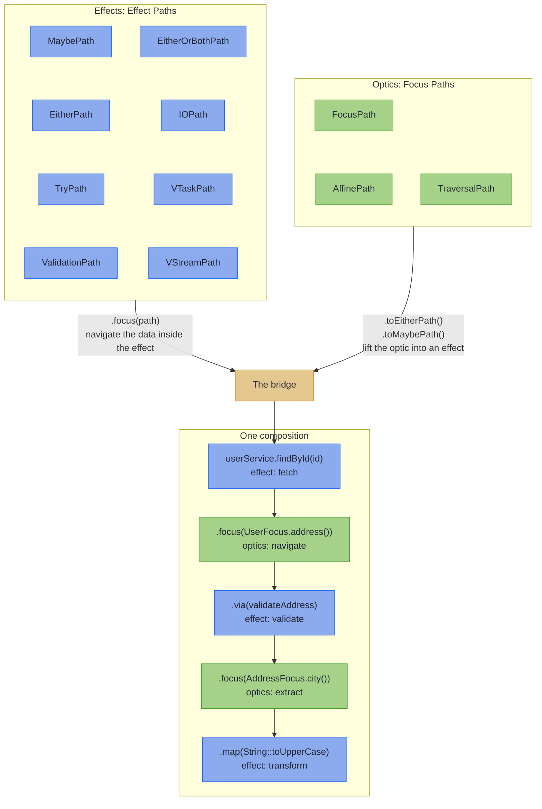

<!-- description: Functional programming for Java: typed errors with the Effect Path API, optics for immutable records, and compile-time DTO mapping that reports every bad field. -->

<div class="hkj-logo" style="text-align: center; margin: 1rem 0;">
  
  
</div>

<h2 class="hkj-strapline"><a href="https://github.com/higher-kinded-j/higher-kinded-j">Unifying Composable Effects and Advanced Optics for Java</a></h2>

<div style="text-align: center;">
  <a href="https://github.com/higher-kinded-j/higher-kinded-j"></a>
  <a href="https://codecov.io/gh/higher-kinded-j/higher-kinded-j"></a>
  <a href="https://central.sonatype.com/artifact/io.github.higher-kinded-j/hkj-core"></a>
  <a href="https://central.sonatype.com/repository/maven-snapshots/io/github/higher-kinded-j/hkj-core/"></a>
  <a href="https://github.com/higher-kinded-j/higher-kinded-j/discussions"></a>
  <a href="https://techhub.social/@ultramagnetic"></a>
</div>

---

Higher-Kinded-J brings two capabilities that Java has long needed: composable error handling through the **[Effect Path API](effect/ch_intro.md)**, and type-safe immutable data navigation through the **[Focus DSL](optics/focus_dsl.md)**. Each is powerful alone. Together they form one approach to building robust applications, where effects and structure compose in the same vocabulary. At the edge of a service, **[Mapping at the Boundary](mapping/ch_intro.md)** turns the DTO-to-domain mapper into compile-time codegen that never loses an error, and for services that need several execution modes, **[Effect Handlers](effect/effect_handlers_intro.md)** let you define domain operations as data and interpret them differently for production, testing, or audit.

No more pyramids of nested checks. No more scattered validation logic. Just clean, flat pipelines that read like the business logic they represent.

---

## What You Get

Two artefacts, before any theory. The first is the shape of the code you write: a railway where success travels one track and failure the other, and every step reads top-to-bottom.

```java
// Traditional Java: pyramid of nested checks
if (user != null) {
    if (validator.validate(request).isValid()) {
        try {
            return paymentService.charge(user, amount);
        } catch (PaymentException e) { ... }
    }
}
```

<!-- verify -->
```java
// Effect Path API: flat, composable railway
EitherPath<AppError, OrderResult> result =
    Path.maybe(findUser(userId))
        .<AppError>toEitherPath(new UserNotFound(userId))
        .via(user -> Path.either(validator.validate(request, user)))
        .via(valid -> Path.tryOf(() -> paymentService.charge(valid))
            .toEitherPath(PaymentFailed::new))
        .map(OrderResult::success);
```

The nesting is gone. Each step follows the same pattern. Failures propagate automatically.

The second is what a client sees when the data is bad. A request with five defects (one inside a nested record, one on the second element of a list), answered by one response, with nobody writing a line of error-handling code to produce it:

```json
{
  "valid": false,
  "errors": [
    { "path": "id",             "message": "not a UUID (expected e.g. 123e4567-e89b-12d3-a456-426614174000)" },
    { "path": "customer.email", "message": "not an email address" },
    { "path": "lines.1.price",  "message": "not a number in plain notation (expected e.g. 123.45)" },
    { "path": "placedAt",       "message": "not an ISO-8601 instant (expected e.g. 2026-07-28T12:34:56Z)" },
    { "path": "status",         "message": "unknown OrderStatus (expected one of NEW, PAID, SHIPPED)" }
  ],
  "errorCount": 5
}
```

It falls out of one spec interface and one annotation, and the [mapping capstone](mapping/capstone.md) builds it end to end, proven by a test the build runs. The client fixes all five and resubmits once.

---

## Getting Started

One line configures the dependencies, the annotation processors, `-parameters`, the preview flags and compile-time Path checking:

```gradle
// build.gradle.kts
plugins {
    id("io.github.higher-kinded-j.hkj") version "LATEST_VERSION"
}
```

* **[Quickstart](quickstart.md)**: Gradle and Maven setup, including the Maven plugin and the required Java 25 preview flags, and your first Effect Paths in five minutes
* **[Where to Start](where_to_start.md)**: one question, five answers, and the tool each one points at
* **[Cheat Sheet](cheatsheet.md)**: a one-page operator reference

---

## The Bridge: Effects Meet Optics

What makes Higher-Kinded-J unique is that **Effect Paths** and the **Focus DSL** speak the same language. Effect Paths are the *effects*, what the computation does: fetch, fail, wait, accumulate. Focus Paths are the *optics*, where the data lives: a field, an optional field, every element of a list. Both compose with `via`, and when you need to cross between them, the bridge connects the two worlds:



<!-- verify -->
```java
// Fetch user (effect) → navigate to address (optics) →
// extract postcode (optics) → validate (effect)
EitherPath<AppError, String> result =
    userService.findById(userId)           // EitherPath<AppError, User>
        .focus(UserFocus.address())        // EitherPath<AppError, Address>
        .focus(AddressFocus.postcode())    // EitherPath<AppError, String>
        .via(code -> validatePostcode(code));
```

This is the unification Java has been missing: effects and structure, composition and navigation, one vocabulary.

**[Discover Optics Integration →](effect/focus_integration.md)**

---

## Why Higher-Kinded-J?

Modern Java handed you records, sealed interfaces, and pattern matching. What it didn't hand you is a way to make them *compose*: errors that chain instead of nest, validation that collects every failure instead of stopping at the first, deep immutable updates in one line instead of nested `with…` calls, and typed errors that survive a network hop. Higher-Kinded-J is the missing layer.

You don't need to learn an esoteric functional library to feel the benefit. Each capability replaces something you already reach for today:

| Instead of… | Today you reach for | Higher-Kinded-J gives you |
|-------------|---------------------|---------------------------|
| Nested `Optional`, thrown exceptions, and validation that stops at the first error | the standard library | one railway vocabulary (`map` / `via` / `recover`) across absence, typed errors, async, and **accumulating** validation |
| `Option` / `Either` / `Try` from **Vavr** | the FP library most Java developers know | the same core types **plus** higher-kinded abstraction, a full optics suite, monad transformers, and an effect system, built natively on modern Java (records, sealed types, virtual threads), where Vavr keeps a Java 8 foundation |
| A mapper in one place and validation in another | **MapStruct** with Bean Validation, or converter classes per pair | `@GenerateMapping`: one declaration gives both directions, and each field's conversion is its check, so `parse` locates every bad field, a `null` included. Records, beans, protobuf messages and generic wires, a stock codec vocabulary and generated PATCH write-backs, all law-checked ([Coming from MapStruct and Bean Validation](mapping/from_mapstruct.md)) |
| **Resilience4j** annotations for retry / circuit-breaker / bulkhead | AOP-style resilience | the same policies as composable path combinators (`withRetry` / `withCircuitBreaker` / `withBulkhead`) that treat a business `Left` as a value, never as a failure to retry |
| Hand-written `wither` / copy-constructor updates on records | manual boilerplate | generated lenses, prisms, and traversals: the most comprehensive optics available for Java |

And unlike any of those tools, effects and data navigation speak **the same language**: the [Effect-Optics bridge](#the-bridge-effects-meet-optics) above is something no other Java library offers.

~~~admonish tip title="Why this matters"
Every row in that table is a guarantee, not a convenience. An `Either` in a return type is checked by the compiler where an exception is not; an accumulating `parse` answers a client once where a mapper that throws on the first bad value costs one round trip per defect; a generated lens is law-checked where a hand-written wither is trusted. The library holds itself to the same bar: every emission tier is pinned by golden files, the optic and mapping laws ship in `hkj-test` for your own types, and every HKJ module compiles under the HKJ checker at zero findings.
~~~

~~~admonish note title="How the optics compare to other Java optics libraries" collapsible=true
Higher-Kinded-J also offers the most advanced optics implementation in the Java ecosystem. Measured against the dedicated Java optics libraries:

| Feature | Higher-Kinded-J | Functional Java | Fugue Optics | Derive4J |
|---------|:--------------:|:---------------:|:------------:|:--------:|
| **Lens** | ✓ | ✓ | ✓ | ✓^1^ |
| **Prism** | ✓ | ✓ | ✓ | ✓^1^ |
| **Iso** | ✓ | ✓ | ✓ | ✗ |
| **Affine/Optional** | ✓ | ✓ | ✓ | ✓^1^ |
| **Traversal** | ✓ | ✓ | ✓ | ✗ |
| **Filtered Traversals** | ✓ | ✗ | ✗ | ✗ |
| **Indexed Optics** | ✓ | ✗ | ✗ | ✗ |
| **Code Generation** | ✓ | ✗ | ✗ | ✓^1^ |
| **External Type Spec Interfaces** | ✓ | ✗ | ✗ | ✗ |
| **Java Records Support** | ✓ | ✗ | ✗ | ✗ |
| **Sealed Interface Support** | ✓ | ✗ | ✗ | ✗ |
| **Effect Integration** | ✓ | ✗ | ✗ | ✗ |
| **Focus DSL** | ✓ | ✗ | ✗ | ✗ |
| **Profunctor Architecture** | ✓ | ✓ | ✓ | ✗ |
| **Fluent API** | ✓ | ✗ | ✗ | ✗ |
| **Modern Java (25)** | ✓ | ✗ | ✗ | ✗ |
| **Virtual Threads** | ✓ | ✗ | ✗ | ✗ |
| **Effect Handlers / Free Monads** | ✓ | ✗ | ✗ | ✗ |

^1^ *Derive4J generates getters/setters but requires Functional Java for actual optic classes*
~~~

---

## What's in the Library

Each capability has a chapter that opens with the problem it solves and closes with a capstone. The short version of each, with a quick example folded underneath:

### [Effect Path API](effect/ch_intro.md)

A railway model for computation: `map`, `via` and `recover` work identically whether you are handling optional values, typed errors, accumulated validations, exceptions or deferred side effects. `ForPath` comprehensions sequence steps by name, `VTaskPath` and `VStreamPath` put structured concurrency on virtual threads behind the same vocabulary, and the lazy carriers chain **[path-native resilience](resilience/ch_intro.md)** that treats a business `Left` as a value, never as a failure to retry.

~~~admonish example title="Quick example" collapsible=true
<!-- verify -->
```java
VResultPath<OrderError, Reservation> guarded =
    reserveInventory(order)
        .withRetry(error -> error instanceof OrderError.SystemError,
            RetryPolicy.exponentialBackoffWithJitter(3, Duration.ofMillis(200)))
        .withTimeout(Duration.ofSeconds(5),
            () -> OrderError.SystemError.timeout("inventory", Duration.ofSeconds(5)));
```

Only a `SystemError` is retried; a business `Left` such as an out-of-stock decision is a value on the failure track and passes straight through. The same `withRetry` / `withTimeout` / `withCircuitBreaker` / `withBulkhead` chain on `IOPath`, `VTaskPath` and `VResultPath` alike. See [Resilience Patterns](resilience/ch_intro.md).
~~~

**[Explore the Effect Path API →](effect/ch_intro.md)**

### [Optics](optics/ch_intro.md)

The most comprehensive optics implementation available for Java: lenses, prisms, isos, affines, traversals, folds and setters, all composable, generated from annotations on records, sealed interfaces, collections and [types you don't own](optics/importing_optics.md) (Jackson, JOOQ, Immutables, Lombok, AutoValue, Protocol Buffers). Filtered and indexed traversals, and [31 container types](optics/focus_containers.md) across the JDK and five third-party collection libraries widening to the right path type automatically.

~~~admonish example title="Quick example" collapsible=true
<!-- verify -->
```java
@GenerateLenses @GenerateFocus(generateNavigators = true)
public record Street(String name, int number) {}

@GenerateLenses @GenerateFocus(generateNavigators = true)
public record Address(Street street, String postcode) {}

@GenerateLenses @GenerateFocus(generateNavigators = true)
public record User(String name, Address address) {}

User updated = UserFocus.address().street().name().set("New Street", user);
```

Write the records, add the annotations, and the processor writes `StreetLenses`, `AddressFocus`, `UserFocus` and the rest: a typed path builder for every field, three layers down in one line, with no reflection and no copy-and-rebuild code. Start at the [Quickstart](optics/quickstart.md) or the [Annotations at a Glance](optics/annotations_at_a_glance.md) table.
~~~

**[Explore Optics →](optics/ch_intro.md)**

### [Mapping at the Boundary](mapping/ch_intro.md)

One spec interface and one annotation replace the hand-written mapper. `@GenerateMapping` derives both directions at compile time: a total `build` out, an accumulating `parse` back that locates every bad field, and both PATCH styles as write-backs. It maps records, beans and generic wires of any width, including the classes code generators write: [protobuf-java messages](mapping/beans.md#protobuf-java-messages), and the openapi-generator models and Lombok builders in the [generated-client checklist](mapping/beans.md#generated-client-checklist). Specs nest [across modules](mapping/structure.md#across-modules), and share a [vocabulary of leaves](mapping/codecs.md#shared-vocabulary-mix-in-interfaces) there too. A [stock codec vocabulary](mapping/codecs.md#standard-codecs) covers the standard conversions, so a typical boundary needs no hand-written leaves, and every tier is law-checked and pinned by golden files. To weigh the mapper against MapStruct and Bean Validation, [Mapper at a Glance](mapping/at_a_glance.md) shows the code it generates and what a call costs.

~~~admonish example title="Quick example" collapsible=true
<!-- verify -->
```java
@GenerateMapping
interface OrderMapping extends MappingSpec<Order, OrderDto> {
  default ValidatedPrism<String, UUID> id()            { return uuid(); }
  default ValidatedPrism<String, LocalDate> placedOn() { return localDate(); }
  default ValidatedPrism<String, OrderStatus> status() { return enumByName(OrderStatus.class); }
  default ValidatedPrism<String, BigDecimal> total()   { return bigDecimal(); }
}

OrderMappingImpl.INSTANCE.parse(new OrderDto("NOPE", "28/07/2026", "SHIPPED", "1E+3"));
// Invalid(NonEmptyList[
//   id: not a UUID (expected e.g. 123e4567-e89b-12d3-a456-426614174000),
//   placedOn: not an ISO-8601 date (expected e.g. 2026-07-28),
//   status: unknown OrderStatus (expected one of NEW, PAID, CANCELLED),
//   total: not a number in plain notation (expected e.g. 123.45)])
```

Four leaves from `StandardCodecs`, no other code, and every failure located and worded for the client. The 422 payload shown at the top of this page is what this `Invalid` becomes at a Spring controller. `@GenerateMerge` assembles one record from several and `@GenerateErrorEnvelope` gives a sealed error hierarchy a typed context; see [Merge and Error Envelopes](mapping/merge_envelopes.md).
~~~

**[Explore Mapping at the Boundary →](mapping/ch_intro.md)**

### [Effect Handlers](effect/effect_handlers_intro.md)

Algebraic-effect-style programming via Free monads and interpreters. Define domain operations as a sealed interface with record variants, compose several algebras with `@ComposeEffects`, then write one interpreter per mode (production, test, dry-run, audit) and run the same program unchanged through each. Testing is mock-free through `Id` interpreters, and `ProgramAnalyser` inspects a program before any side effect executes.

~~~admonish example title="Quick example" collapsible=true
<!-- verify -->
```java
@EffectAlgebra
public sealed interface PaymentGatewayOp<A>
    permits PaymentGatewayOp.Authorise, PaymentGatewayOp.Charge, PaymentGatewayOp.Refund {

  record Authorise<A>(Money amount, PaymentMethod method,
      Function<AuthorisationToken, A> k) implements PaymentGatewayOp<A> { /* ... */ }

  record Charge<A>(Money amount, PaymentMethod method,
      Function<ChargeResult, A> k) implements PaymentGatewayOp<A> { /* ... */ }

  record Refund<A>(TransactionId txId, Money amount,
      Function<RefundResult, A> k) implements PaymentGatewayOp<A> { /* ... */ }
}
```

`@EffectAlgebra` generates the functor, the smart constructors and an interpreter skeleton, so a program is written once against `PaymentGatewayOps` and a production interpreter, a fake, a dry-run and an audit log are four small classes. The [Payment Processing](examples/payment_processing.md) example runs one program through all four.
~~~

**[Explore Effect Handlers →](effect/effect_handlers_intro.md)**

### [Spring Boot Integration](spring/spring_boot_integration.md)

The `hkj-spring-boot-starter` lets controllers return `Either`, `Validated`, `EitherPath`, `VTaskPath` and the rest directly, and an `Invalid` of located field errors renders as **one 422 listing every bad field by path**, with no exception handler and no hand-rolled error DTO. `@HkjHttpClient` keeps the error channel intact when one service calls another.

~~~admonish example title="Quick example" collapsible=true
```java
@RestController
@RequestMapping("/api/users")
public class UserController {

    @GetMapping("/{id}")
    public Either<DomainError, User> getUser(@PathVariable String id) {
        return userService.findById(id);
        // Right(user) → HTTP 200 with JSON
        // Left(UserNotFoundError) → HTTP 404 with error details
    }

    @PostMapping
    public Validated<NonEmptyList<FieldError>, User> createUser(@RequestBody UserDto dto) {
        return userCodec.parse(dto);
        // Valid(user) → HTTP 200
        // Invalid(errors) → one HTTP 422 listing EVERY bad field by path
    }
}
```

```java
@HttpExchange("/users")
@HkjHttpClient
public interface UserClientApi {

    @GetExchange("/{id}")
    EitherPath<DomainError, User> getUser(@PathVariable String id);
    // HTTP 200 → Right(user); HTTP 404 → Left(UserNotFoundError), decoded from the response
}
```

Auto-configuration handles the conversions; `Right` is a 200 and a typed `Left` maps to its status. Actuator metrics for success rates and error distributions, Spring Security integration with `Either`-based authentication, and an `EffectBoundary` that selects interpreters by profile come with it. The client is generated by `hkj-spring-boot-client-processor`, which a dependency cannot bring: add it to the processor path, or enable `spring` on the HKJ build plugin. See [Declarative HTTP Clients](spring/declarative_http_clients.md) and [Migrating to Functional Errors](spring/migrating_to_functional_errors.md).
~~~

**[Get Started with Spring Boot Integration →](spring/spring_boot_integration.md)**

### [Testing With hkj-test](tooling/test_assertions.md)

Fluent AssertJ assertions for every type in the library, the optic laws (`LensLaws`, `PrismLaws`, `TraversalLaws`, `ValidatedPrismLaws`) and the `MappingLaws` every generated mapping is checked against, and a `SteppableClock` for deterministic time. Tests read in the same vocabulary as the code under test.

~~~admonish example title="Quick example" collapsible=true
<!-- verify -->
```java
import static org.higherkindedj.hkt.assertions.EitherAssert.assertThatEither;
import static org.higherkindedj.hkt.assertions.MaybeAssert.assertThatMaybe;
import static org.higherkindedj.hkt.assertions.TryAssert.assertThatTry;

assertThatEither(result).isRight().hasRight(42);
assertThatMaybe(value).isJust().hasValue("hello");
assertThatTry(computation).isFailure().hasExceptionOfType(IOException.class);
```

Coverage spans the discriminated unions, the effect types (`IO`, `VTask`, `VStream`), the Reader / Writer / State trio, every monad transformer, the `Free` / `EitherF` algebras and the `VTaskPath` / `VStreamPath` / `VTaskContext` Path-and-context assertions. On Java 25, `import module org.higherkindedj.test;` brings every helper into scope in one line.
~~~

**[Explore hkj-test →](tooling/test_assertions.md)**

### [Foundations](hkts/foundations_intro.md)

Underneath it all: a simulation of higher-kinded types by defunctionalisation, so `Functor`, `Applicative`, `Monad`, `Traverse` and friends can be written once and applied across `Optional`, `List`, `CompletableFuture`, `VTask` and your own types; the core types (`Either`, `Maybe`, `Try`, `Validated`, `IO`, `Reader`, `Writer`, `State`, `Free`); and the [monad transformers and MTL capabilities](transformers/ch_intro.md) for the cases the Path API does not fit: a different outer monad, or polymorphic library code. Most applications start with Effect Paths and never need to look down here; the [triage page](transformers/when_to_drop_to_transformers.md) says when you do.

---

## Path Types at a Glance

Twenty-one Path types share one vocabulary. Most applications start with `EitherPath` (typed errors), `MaybePath` (absence), `ValidationPath` (every error at once) and `IOPath` (deferred effects), and reach for the rest as a need appears. The lazy carriers (`IOPath`, `VTaskPath`, `VResultPath`) additionally chain **[path-native resilience](resilience/ch_intro.md)** (`withRetry` / `withTimeout` / `withCircuitBreaker` / `withBulkhead`) that treats a business `Left` as a value, never as a failure to retry.

~~~admonish note title="All twenty-one Path types" collapsible=true
| Path Type | When to Reach for It |
|-----------|---------------------|
| `MaybePath<A>` | Absence is normal, not an error |
| `EitherPath<E, A>` | Errors carry typed, structured information |
| `EitherOrBothPath<L, A>` | Success that also carries non-fatal warnings (inclusive-or) |
| `TryPath<A>` | Wrapping code that throws exceptions |
| `ValidationPath<E, A>` | Collecting *all* errors, not just the first |
| `IOPath<A>` | Side effects you want to defer and sequence |
| `VResultPath<E, A>` | Async work that fails with a *typed* domain error (`VTask<Either<E, A>>`) |
| `TrampolinePath<A>` | Stack-safe recursion |
| `CompletableFuturePath<A>` | Async operations |
| `ReaderPath<R, A>` | Dependency injection, configuration access |
| `WriterPath<W, A>` | Logging, audit trails, collecting metrics |
| `WithStatePath<S, A>` | Stateful computations (parsers, counters) |
| `ListPath<A>` | Batch processing with positional zipping |
| `StreamPath<A>` | Lazy sequences, large data processing |
| `NonDetPath<A>` | Non-deterministic search, combinations |
| `LazyPath<A>` | Deferred evaluation, memoisation |
| `IdPath<A>` | Pure computations (testing, generic code) |
| `OptionalPath<A>` | Bridge for Java's standard `Optional` |
| `FreePath<F, A>` / `FreeApPath<F, A>` | DSL building and interpretation |
| `VTaskPath<A>` | Virtual thread-based concurrency with Par combinators |
| `VStreamPath<A>` | Lazy pull-based streaming on virtual threads |

Each Path wraps its underlying effect and provides `map`, `via`, `run`, `recover`, and integration with the Focus DSL. See [Core Paths](effect/effect_path_overview.md) for the railway model behind them.
~~~

---

## Learn by Doing

The fastest way to master Higher-Kinded-J is through our **interactive tutorial series**: nineteen journeys of hands-on exercises with immediate test feedback. Start with **[Effect API](tutorials/effect/effect_journey.md)** for the railway, **[Optics: Lens & Prism](tutorials/optics/lens_prism_journey.md)** for immutable updates, or **[Optics: Boundary Mapping](tutorials/optics/boundary_mapping_journey.md)** for the 422 leg.

~~~admonish note title="All nineteen journeys" collapsible=true
| Journey | Focus | Exercises |
|---------|-------|-----------|
| **[Core: Foundations](tutorials/coretypes/foundations_journey.md)** | HKT simulation, Functor, Applicative, Monad | 37 |
| **[Core: Error Handling](tutorials/coretypes/error_handling_journey.md)** | MonadError, concrete types, real-world patterns | 26 |
| **[Core: Advanced](tutorials/coretypes/advanced_journey.md)** | Natural Transformations, Coyoneda, Free Applicative | 26 |
| **[Effect API](tutorials/effect/effect_journey.md)** | Effect paths, ForPath, Effect Contexts | 17 |
| **[Monad Transformers](tutorials/transformers/transformers_journey.md)** | When Path isn't enough, async + absence, stacking, MTL | 29 |
| **[Expression: ForState](tutorials/expression/forstate_journey.md)** | Named fields, guards, pattern matching, zoom | 13 |
| **[Expression: ForPath Parallel](tutorials/expression/forpath_parallel_journey.md)** | Applicative parallel composition for Path types | 9 |
| **[Concurrency: VTask](tutorials/concurrency/vtask_journey.md)** | Virtual threads, VTaskPath, Par combinators | 28 |
| **[Concurrency: Scope & Resource](tutorials/concurrency/scope_resource_journey.md)** | Structured concurrency, resource management | 20 |
| **[Context](tutorials/context/ch_intro.md)** | `ScopedValue` contexts for requests, security and tracing | 59 |
| **[Effect Handlers](tutorials/effecthandlers/ch_intro.md)** | Effect algebras, programs as values, several interpreters | 19 |
| **[Resilience Patterns](tutorials/resilience/resilience_journey.md)** | Circuit breaker, saga, retry, bulkhead | 24 |
| **[Optics: Lens & Prism](tutorials/optics/lens_prism_journey.md)** | Lens basics, Prism, Affine | 30 |
| **[Optics: Traversals](tutorials/optics/traversals_journey.md)** | Traversals, composition, practical applications | 28 |
| **[Optics: Fluent & Free](tutorials/optics/fluent_free_journey.md)** | Fluent API, Free Monad DSL | 22 |
| **[Optics: Focus DSL](tutorials/optics/focus_dsl_journey.md)** | Type-safe path navigation, container widening | 90 |
| **[Optics: Batching & Coupled Updates](tutorials/optics/batching_journey.md)** | Request batching, plan guardrails, coupled lenses | 13 |
| **[Optics: Boundary Mapping](tutorials/optics/boundary_mapping_journey.md)** | Multi-edit and sparse updates, `@GenerateMapping`, the 422 leg, edge cases | 19 |
| **[Capstone: One Line, Six Layers Grows Up](tutorials/capstone/capstone_journey.md)** | One pipeline across effects, optics, resilience and concurrency | 7 |
~~~

Perfect for developers who prefer learning by building. [Get started →](tutorials/tutorials_intro.md)

---

## Documentation Guide

~~~admonish tip title="Recommended Starting Point"
If you want working code immediately, start with the **[Quickstart](quickstart.md)**. For a deeper understanding, continue with the **Effect Path API** chapter. Every chapter below unfolds to its reading order; the sidebar carries the same structure.
~~~

~~~admonish note title="Effect Path API (start here)" collapsible=true
1. **[Quickstart](effect/quickstart.md):** Three runnable examples showing MaybePath, EitherPath, and ForPath in about 150 lines
2. **[Core Paths](effect/effect_path_overview.md):** The railway model, the six core path types, composition, and basic ForPath comprehensions
3. **[Optics Integration](effect/focus_integration.md):** Bridging Effect Paths with the Focus DSL
4. **[Advanced Paths](effect/advanced_topics.md):** Free monads, effect handlers, contexts, ForPath parallelism, and resilience
5. **[Reference](effect/capabilities.md):** Capability type classes, type conversions, compiler errors, and production readiness
~~~

~~~admonish note title="Optics" collapsible=true
1. **[Quickstart](optics/quickstart.md):** Three runnable examples covering generated lenses, prisms and traversals, plus `@ImportOptics` for Jackson
2. **[Annotations at a Glance](optics/annotations_at_a_glance.md):** Every annotation, what it generates, and when to reach for each one
3. **[Fundamentals](optics/ch1_intro.md):** Lens, Prism, Affine, Iso, composition rules, and coupled fields
4. **[Java-Friendly APIs](optics/ch4_intro.md):** Focus DSL, optics for external types, Kind field support, and the Fluent API
5. **[Integration and Recipes](optics/ch5_intro.md):** Validation pipelines, core-type integration, and the cookbook
6. **[Advanced Optics](optics/ch6_intro.md):** Free Monad DSL and interpreters for programs-as-data
7. **[Reference](optics/ch7_intro.md):** Capabilities, conversions, compiler errors, production readiness, and consolidated decision trees
~~~

~~~admonish note title="Mapping at the Boundary" collapsible=true
**Ship**, read in order:

1. **[Introduction](mapping/ch_intro.md):** The mapper every service carries, and the one response that replaces it
2. **[Quickstart](mapping/quickstart.md):** Five steps from a blank build to a located 422
3. **[Basics](mapping/basics.md):** One spec interface, both directions, every bad field located
4. **[Standard Codecs and Shared Vocabulary](mapping/codecs.md):** The stock `ValidatedPrism` leaves, custom codecs, and mix-in interfaces
5. **[Absent Fields and Record Invariants](mapping/absence.md):** A field whose `null` means absent, and a record's own checks
6. **[Nesting, Containers, and Sealed Hierarchies](mapping/structure.md):** Nested specs, lifted containers, and dotted error paths
7. **[Capstone: One 422, Every Bad Field](mapping/capstone.md):** One boundary built end to end, compiled and law-checked
8. **[Check Your Understanding](mapping/self_check.md):** Ten questions on the Quickstart through the Capstone, with answers the build proves

**On demand**, when a task calls for it:

9. **[What Your Spec Generates](mapping/tiers.md):** Which methods each spec shape gets, and why
10. **[Bean-Shaped Wires](mapping/beans.md):** Getter/setter, builder, one-directional and protobuf-java wires
11. **[Sparse PATCH](mapping/beans_patch.md):** The `UpdateSpec` write-back, where an omitted field keeps its value
12. **[Generic Specs](mapping/generics.md):** A `Page<T>` at the boundary
13. **[Merge and Error Envelopes](mapping/merge_envelopes.md):** One record from several sources, and a typed error context
14. **[Injecting, Testing, and Diagnostics](mapping/testing.md):** Spring beans, test fakes, and how wide a record may be
15. **[Capstone: An Estate in Three Modules](mapping/estate.md):** A shared vocabulary, a client jar, a Lombok bean and a PATCH across modules

**Look it up**, when you hold a question:

16. **[Mapper at a Glance](mapping/at_a_glance.md):** The generated code, what it costs, and the decisions to know before adopting
17. **[Coming from MapStruct and Bean Validation](mapping/from_mapstruct.md):** Both vocabularies, translated
18. **[Rules and Limits](mapping/rules.md):** Every enforced rule and limit, in one place
19. **[Compiler Messages](mapping/compiler_errors.md):** The common refusals, what each means, and the fix
~~~

~~~admonish note title="Monad Transformers" collapsible=true
For the cases where the Path API does not fit (a different outer monad, polymorphic library code, or integrating with raw `Kind` shapes).

1. **[Path or Transformer?](transformers/when_to_drop_to_transformers.md):** The triage page; read this first to know whether the rest of the chapter applies to you
2. **[Quickstart](transformers/quickstart.md):** Three runnable transformer examples in about 150 lines
3. **[Stack Archetypes](transformers/archetypes.md):** Seven named patterns covering the most common composition problems
4. **[MTL Capabilities](transformers/mtl_capabilities.md):** Stack-independent capability abstractions for polymorphic library code
5. **[Capstone](transformers/transformer_capstone.md):** End-to-end multi-capability workflow combining typed errors, configuration, audit, and async
6. **[Common Compiler Errors](transformers/common_errors.md):** Six common errors and the fix for each
~~~

~~~admonish note title="Effect Handlers" collapsible=true
1. **[Effect Handlers Introduction](effect/effect_handlers_intro.md):** Motivation, terminology, and when to use
2. **[Effect Handler Reference](effect/effect_handlers.md):** Defining, composing, and interpreting effects
3. **[Payment Processing Example](examples/payment_processing.md):** Complete worked example with four interpreters
~~~

~~~admonish note title="Foundations (reference)" collapsible=true
These sections document the underlying machinery. Most users can start with Effect Paths directly.

1. **[Higher-Kinded Types](hkts/hkt_introduction.md):** The simulation and why it matters
2. **[Type Classes](functional/ch_intro.md):** Functor, Monad, and other type classes
3. **[Core Types](monads/ch_intro.md):** Either, Maybe, Try, and other effect types
4. **[Order Example Walkthrough](hkts/order-walkthrough.md):** A complete workflow with monad transformers
~~~

~~~admonish info title="Key Takeaways"
* **One vocabulary**: `map`, `via` and `recover` work the same across absence, typed errors, exceptions, accumulating validation, deferred I/O and virtual-thread concurrency
* **Effects and structure compose**: `.focus(path)` takes an Effect Path through a Focus Path and back, which no other Java library offers
* **Optics are generated, not written**: `@GenerateLenses`, `@GenerateFocus`, `@GeneratePrisms`, `@GenerateTraversals` and `@ImportOptics` cover records, sealed types, collections and types you don't own
* **The boundary never loses an error**: `@GenerateMapping` derives both directions, locates every bad field, and renders as one 422 at a Spring controller
* **Everything is law-checked**: the optic and mapping laws ship in `hkj-test`, and the library compiles under its own checker
* **Start with the [Quickstart](quickstart.md)**, and reach for the foundations only when the [triage page](transformers/when_to_drop_to_transformers.md) says so
~~~

### History

**Higher-Kinded-J evolved from a simulation** originally created for the blog post [Higher Kinded Types with Java and Scala](https://blog.scottlogic.com/2025/04/11/higher-kinded-types-with-java-and-scala.html). Since then it has grown into a comprehensive functional programming toolkit, with the Effect Path API providing the unifying layer that connects HKTs, type classes, and optics into a coherent whole.
