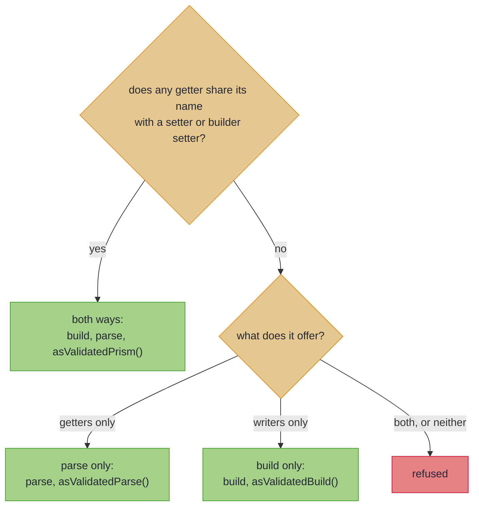

# Bean-Shaped Wires

_Map getter/setter and builder classes as you map records, including ones only read or written._

Generated client models, JAXB payloads and many legacy DTOs are beans: classes with getters and setters, or a builder, rather than records. If your wire is a bean, almost nothing changes: [leaves](basics.md#validated-leaves), [renames](basics.md#renames-mapfield), container lifting, nesting and located errors work exactly as on a record. Three things differ, and all three come from one fact: a bean can exist with some properties never set. This page walks those three first. Mapping a generated client? Read [the checklist for generated clients](#generated-client-checklist) as well, and for a gRPC boundary, [protobuf-java messages](#protobuf-java-messages). A bean used as a PATCH request, where `null` means *not sent*, has a page of its own, [Sparse PATCH](beans_patch.md).

~~~admonish info title="What You'll Learn"
- Map a getter/setter or builder bean like a record, and predict what an unset property does
- Predict which methods a bean's Impl carries, from the bean's shape
- Map a protobuf-java message, and predict what an unset field reads
- Map a protobuf oneof to a sealed type, and apply an update through its `FieldMask`
~~~

~~~admonish example title="See Example Code"
**The code on this page is [BeansBook.java](https://github.com/higher-kinded-j/higher-kinded-j/blob/main/hkj-examples/src/main/java/org/higherkindedj/example/book/mapping/BeansBook.java) and its [BeansBookTest.java](https://github.com/higher-kinded-j/higher-kinded-j/blob/main/hkj-examples/src/test/java/org/higherkindedj/example/book/mapping/BeansBookTest.java)** - the page includes them directly, so they are compiled and run by the build.
~~~

## Bean-shaped wire targets {#bean-shaped-wire-targets}

The spec is the same interface as for a record. Only how the wire is read and written changes. `build` fills the bean through its setters or a builder, never a constructor that takes arguments, and `parse` reads it through its getters:

``` java
// A generated, mutable getter/setter DTO - generated, so not yours to annotate. The spec still sits
// on your interface, never on the bean, so a third-party bean maps without being touched.
class ContactBean {
  private String name;
  private String email;

  public String getName() {
    return name;
  }

  public void setName(String name) {
    this.name = name;
  }

  public String getEmail() {
    return email;
  }

  public void setEmail(String email) {
    this.email = email;
  }
}

@GenerateMapping
interface ContactMapping extends MappingSpec<Customer, ContactBean> {
  // build() writes through setters; parse() reads through getters, null-guarded and located.
  default ValidatedPrism<String, EmailAddress> email() {
    return EmailCodecs.EMAIL;
  }
}


    Customer ada = new Customer("Ada", new EmailAddress("ada@corp.example"));
    ContactMappingImpl contactMapping = ContactMappingImpl.INSTANCE;

    ContactBean bean = contactMapping.build(ada); // new ContactBean(); setName; setEmail
    Validated<NonEmptyList<FieldError>, Customer> fromBean = contactMapping.parse(bean);
    // Valid(Customer[name=Ada, email=EmailAddress[value=ada@corp.example]])

    ContactBean noEmail = new ContactBean(); // a bean can exist with a property never set
    noEmail.setName("Bob");
    Validated<NonEmptyList<FieldError>, Customer> fromUnset = contactMapping.parse(noEmail);
    // Invalid(NonEmptyList[email: must not be null])
```

An unset property is an ordinary state of a bean, and `parse` reports it as any other `null`: a located `must not be null`, under the [null rule](basics.md#null-doctrine). The processor recognises these shapes:

| The bean offers | `build` writes it with | It maps |
|---|---|---|
| a no-args constructor the Impl can call, and `setX` setters (Lombok `@Data` included) | `new`, then each setter | both ways |
| a static `builder()` or `newBuilder()` whose `build()` returns it (a hand-written builder, or Lombok's `@Builder` or `@SuperBuilder`) | the builder's setters, then `build()` | both ways, reading the built type's getters |
| a getter-only `List` beside its setters, the JAXB way | `getItems().addAll(...)` for that list (when the getter is declared nullable, only if it answers a list) | both ways |
| getters, and nothing that writes it, such as a view built through a constructor with arguments | nothing | [`parse` only](#one-directional-beans) |
| setters or a builder, and no getters | the setters or the builder | [`build` only](#one-directional-beans) |

As on a record, every property the bean both reads and writes needs a domain component or a [derived field](basics.md#derived-wire-fields). The processor refuses the properties your domain lacks, naming each one, with [`has more components than`](compiler_errors.md#wire-has-more-components). [How a bean is read and written](rules.md#how-a-bean-is-read-and-written) says how the processor pairs getters with writers.

Because a property can be unset, three things differ from a record wire:

1. **A reference property costs the pair `asIso()`.** A record pair whose components all copy unchanged also gets [`asIso()`](tiers.md), a two-way conversion that cannot fail. A bean's read of a reference property can meet an unset value, so a bean pair with one keeps `build`, `parse` and `asValidatedPrism()`, and not that. A bean whose properties are all primitive keeps `asIso()`.
2. **An `Optional` bridges with no annotation.** A domain `Optional<T>` maps to a nullable property `T`, where a record wire needs [`@OptionalBridge`](absence.md#optional-bridge). `build` writes `null` for empty, and `parse` reads a `null` as empty: [The automatic `Optional` bridge on a bean](rules.md#bean-optional-bridge).
3. **A bean with fewer properties than your domain has no `parse`.** With a reference property, the Impl offers a validated `patch` instead, which copies the bean onto a domain value you already hold: [Bean projections](#bean-projections).

~~~admonish warning title="Not checked for you: what the bean does with the null an empty Optional writes"
`build` writes `null` for an empty `Optional`, replacing any field initialiser. No compiler sees what the bean then does with it:

- **A default applied to it reads back as present**, whether a setter, a builder's `build()` or a getter applies it. A setter that swaps in `"Untitled"` turns every empty value into `Optional[Untitled]`.
- **A writer that rejects it throws from `build`**, as a setter that copies with `List.copyOf(v)` does, or a builder that calls `requireNonNull`. Guard the copy with `v == null ? null : List.copyOf(v)`, or declare the component without the `Optional`.
- **A model that tells a sent `null` from an unset one sends it.** An openapi-generator `java` client model keeps `setX(null)` in its [`JsonNullable` companion](rules.md#jsonnullable-companions) as a sent `null`, and reads both back as `null`:

``` java
    // build writes the empty subtitle through setSubtitle(null), which the model sends as null,
    ListingModel built = ListingModelMappingImpl.INSTANCE.build(lamp);
    assertThat(json.writeValueAsString(built)).isEqualTo("{\"title\":\"Lamp\",\"subtitle\":null}");
    // where a fresh model leaves the property out.
    ListingModel fresh = new ListingModel();
    fresh.setTitle("Lamp");
    assertThat(json.writeValueAsString(fresh)).isEqualTo("{\"title\":\"Lamp\"}");

    // getSubtitle() answers null for an omitted property and for an explicit null alike.
    ListingModel omitted = json.readValue("{\"title\":\"Lamp\"}", ListingModel.class);
    ListingModel sentNull =
        json.readValue("{\"title\":\"Lamp\",\"subtitle\":null}", ListingModel.class);
    assertThatValidated(ListingModelMappingImpl.INSTANCE.parse(omitted)).hasValue(lamp);
    assertThatValidated(ListingModelMappingImpl.INSTANCE.parse(sentNull)).hasValue(lamp);
```

A law check from a domain sample with an empty `Optional` fails on the first two, whatever the bean's `equals`: `MappingLaws.assertMappingLaws(mapping.asValidatedPrism(), sample)`. The check from two wire samples compares beans with `equals`, so a hand-written bean without one fails it on identity alone. A companion model fails it on a sample that leaves a nullable property unset, which comes back sent.
~~~

~~~admonish tip title="You can ship now"
You can now map a getter/setter or builder bean like a record, and know what an unset property does to `parse`, to an `Optional` and to the methods the Impl offers. The rest of this page, [beans crossed one way](#one-directional-beans), [projections](#bean-projections), [accessors kept out on purpose](#accessors-meant-to-stay-out), [protobuf-java messages](#protobuf-java-messages) and [the checklist for generated clients](#generated-client-checklist), is for when you need it.
~~~

~~~admonish question title="Checkpoint: which subtitle comes back?" id="check-beans-default"
Two generated beans for `Listing` both start the subtitle as `""`, in different places:

``` java
// A product listing whose subtitle is optional, and two generated beans for it.
record Listing(String title, Optional<String> subtitle) {}

class DraftListingBean {
  private String title;
  private @Nullable String subtitle = ""; // starts as "" in the field

  public String getTitle() {
    return title;
  }

  public void setTitle(String title) {
    this.title = title;
  }

  public @Nullable String getSubtitle() {
    return subtitle;
  }

  public void setSubtitle(@Nullable String subtitle) {
    this.subtitle = subtitle;
  }
}

class ListingBean {
  private String title;
  private @Nullable String subtitle;

  public String getTitle() {
    return title;
  }

  public void setTitle(String title) {
    this.title = title;
  }

  public String getSubtitle() {
    return subtitle == null ? "" : subtitle; // answers "" in the getter
  }

  public void setSubtitle(@Nullable String subtitle) { // the bridge writes null for empty
    this.subtitle = subtitle;
  }
}

@GenerateMapping
interface DraftListingMapping extends MappingSpec<Listing, DraftListingBean> {}

@GenerateMapping
interface ListingMapping extends MappingSpec<Listing, ListingBean> {} // subtitle bridges itself

```

Your code builds each bean from `new Listing("Lamp", Optional.empty())`, then parses it. What subtitle comes back from each?

1. `Optional.empty` from both, since `build` wrote `null` into both
2. `Optional[]`, that is `Optional.of("")`, from both, since both start with `""`
3. `Optional.empty` from `DraftListingBean`, and `Optional[]` from `ListingBean`
4. `Optional[]` from `DraftListingBean`, and `Optional.empty` from `ListingBean`
~~~

~~~admonish success title="Answer and why" collapsible=true id="check-beans-default-answer"
**3.** `build` writes `setSubtitle(null)` into both beans. That replaces `DraftListingBean`'s field initialiser, so its subtitle reads back empty. `parse` reads through the getter, and `ListingBean`'s getter answers `""` for that `null`, so its subtitle comes back as `Optional[]`. A law check from a domain sample with an empty `Optional` fails on the second:

``` java
    Listing lamp = new Listing("Lamp", Optional.empty());

    // build writes setSubtitle(null) into both beans, replacing the field's "".
    DraftListingBean draft = DraftListingMappingImpl.INSTANCE.build(lamp);
    assertThatValidated(DraftListingMappingImpl.INSTANCE.parse(draft)).hasValue(lamp);

    // parse reads through the getter, which answers "" for that null.
    ListingBean listing = ListingMappingImpl.INSTANCE.build(lamp);
    assertThatValidated(ListingMappingImpl.INSTANCE.parse(listing))
        .hasValue(new Listing("Lamp", Optional.of("")));

    // A law check from a domain sample with an empty Optional fails on it:
    assertThatThrownBy(
            () ->
                MappingLaws.assertMappingLaws(ListingMappingImpl.INSTANCE.asValidatedPrism(), lamp))
        .isInstanceOf(AssertionError.class);
```

Where this lives: [Bean-shaped wire targets](#bean-shaped-wire-targets).
~~~

~~~admonish question title="Checkpoint: which methods does the Impl carry?" id="check-beans-direction"
A payments SDK builds this `CreditNoteView` through its public constructor:

<!-- verify:reports "maps parse-only" -->
```java
import org.higherkindedj.optics.annotations.GenerateMapping;
import org.higherkindedj.optics.annotations.MappingSpec;

record CreditNote(String number, String currency) {}

final class CreditNoteView {
  private final String number;
  private final String currency;

  public CreditNoteView(String number, String currency) {
    this.number = number;
    this.currency = currency;
  }

  public String getNumber() { return number; }

  public String getCurrency() { return currency; }
}

@GenerateMapping
interface CreditNoteViewMapping extends MappingSpec<CreditNote, CreditNoteView> {}
```

What does `CreditNoteViewMappingImpl` carry?

1. `build` and `parse`: `build` can call the public constructor
2. `parse` only
3. `build` only
4. Nothing: the processor refuses the spec
~~~

~~~admonish success title="Answer and why" collapsible=true id="check-beans-direction-answer"
**2.** `build` writes a bean through setters or a builder, never a constructor that takes arguments, and `CreditNoteView` has neither. It has getters, so it maps parse-only, and the processor says so in a compiler note:

```
@GenerateMapping: 'CreditNoteView' maps parse-only: the generated Impl carries parse and
asValidatedParse(), and no build. 'CreditNoteView' has getters but no setX setters and no builder
that fills it, so nothing can write it. If 'CreditNoteView' should be built too, give it a no-args
constructor with setX setters matching its getters, or a builder.
```

Where this lives: [Bean-shaped wire targets](#bean-shaped-wire-targets).
~~~

---

## One-directional beans {#one-directional-beans}

Some beans offer only one direction. An immutable view built through its constructor, or a third-party result, has getters and nothing that writes it. An outbound request has setters or a builder, and no getters. What decides is the bean's shape, not how you use it: a generated client's model usually has getters and setters, so it maps both ways even when you only ever read it. The Impl carries the direction the bean allows, and nothing for the other: the missing direction is absent, never a method that throws.



In words: one name that is both read and written makes a bean two-way. A bean maps one way only when it offers nothing at all in the other direction. A getter-only `List` counts as written, the JAXB way, on a bean that also has a setter, or whose every getter is such a list.

``` java
// A vendor's read model: built once by its own client, then only ever read. It has getters and
// nothing that writes it, so the mapping is parse-only.
class CustomerView {
  private final String name;
  private final String email;

  CustomerView(String name, String email) {
    this.name = name;
    this.email = email;
  }

  public String getName() {
    return name;
  }

  public String getEmail() {
    return email;
  }
}

@GenerateMapping
interface CustomerViewMapping extends MappingSpec<Customer, CustomerView> {
  default ValidatedPrism<String, EmailAddress> email() {
    return EmailCodecs.EMAIL;
  }
}

// An outbound request: filled and sent, never read back. It has setters and no getters, so the
// mapping is build-only.
class CustomerRequest {
  private String name;
  private String email;

  public void setName(String name) {
    this.name = name;
  }

  public void setEmail(String email) {
    this.email = email;
  }

  String describe() {
    return name + " <" + email + ">";
  }
}

@GenerateMapping
interface CustomerRequestMapping extends MappingSpec<Customer, CustomerRequest> {
  default ValidatedPrism<String, EmailAddress> email() {
    return EmailCodecs.EMAIL;
  }
}


    // Parse-only: the Impl has parse and asValidatedParse(), and no build.
    Validated<NonEmptyList<FieldError>, Customer> read =
        CustomerViewMappingImpl.INSTANCE.parse(new CustomerView("Ada", "ada@corp.example"));
    // Valid(Customer[name=Ada, email=EmailAddress[value=ada@corp.example]])

    // Build-only: the Impl has build and asValidatedBuild(), and no parse.
    CustomerRequest request =
        CustomerRequestMappingImpl.INSTANCE.build(
            new Customer("Ada", new EmailAddress("ada@corp.example")));
    // new CustomerRequest(); setName("Ada"); setEmail("ada@corp.example")
```

A compiler note says which way a one-directional bean was read, and why. Renames, leaves, container lifting and the automatic `Optional` bridge work in whichever direction exists. [How a bean's direction is read](rules.md#how-a-beans-direction-is-read) covers coverage, nesting and the mixed cases. Law-check the surface the Impl has, `asValidatedParse()` with a parsing and a non-parsing wire, or `asValidatedBuild()` with a domain value:

``` java
    MappingLaws.assertMappingLaws(
        CustomerViewMappingImpl.INSTANCE.asValidatedParse(),
        new CustomerView("Ada", "ada@example.org"), // parses
        new CustomerView("Bob", "not-an-email")); // located failure

    MappingLaws.assertMappingLaws(
        CustomerRequestMappingImpl.INSTANCE.asValidatedBuild(),
        new Customer("Ada", new EmailAddress("ada@example.org"))); // renders without failing
```

---

## Bean projections {#bean-projections}

A bean with fewer properties than the domain has no `parse`, since it cannot produce a whole domain value. With a reference property, the Impl offers a validated `patch(current, bean)` instead, which copies the bean's properties onto a domain value you already hold, checking each one. A record projection that copies by identity gets a [lens](tiers.md) instead, since a record is constructed whole. A bean is constructed empty and filled by setters, so a property can be unset, and a lens has no way to refuse one. Here `Employee` is `record Employee(String name, String department, int age)`, from [What Your Spec Generates](tiers.md):

``` java
// A bean carrying one of Employee's three components: a projection. A record wire of that shape
// copies by identity and keeps asLens(); a bean's reference property can be unset, which a lens's
// set could not refuse, so the Impl emits the validated patch instead.
class TransferBean {
  private String department;

  public String getDepartment() {
    return department;
  }

  public void setDepartment(String department) {
    this.department = department;
  }
}

@GenerateMapping
interface TransferMapping extends MappingSpec<Employee, TransferBean> {}


    Employee researcher = new Employee("Ada", "Research", 36);
    TransferBean transfer = new TransferBean();
    transfer.setDepartment("Platform");
    TransferMappingImpl transferMapping = TransferMappingImpl.INSTANCE;

    // The bean's property can be unset, so the projection validates: patch, never a lens.
    Validated<NonEmptyList<FieldError>, Employee> transferred =
        transferMapping.patch(researcher, transfer);
    // Valid(Employee[name=Ada, department=Platform, age=36])

    // Dense, as on a record wire: an unset property is a located error, never "keep the current
    // value".
    Validated<NonEmptyList<FieldError>, Employee> unset =
        transferMapping.patch(researcher, new TransferBean());
    // Invalid(NonEmptyList[department: must not be null])
```

Every projected property is validated, and the unprojected components are read from the domain argument, so they survive. Leaves, nested specs, container lifting and the automatic bridge all apply: an unset bridged property reads as empty, so `patch` writes `Optional.empty()` rather than keeping the current value. The `MappingLaws` patch overload law-checks it, comparing domain values only, so the bean needs no `equals`. An all-primitive bean projection keeps its lens.

This is not the REST PATCH contract, even when the bean is a PATCH request: an unset property never means *keep the current value*. For that, extend `UpdateSpec` ([Sparse PATCH](beans_patch.md#sparse-patch-write-back-updatespec)). And `patch` only reads the bean, but the Impl also carries `build`, so a projection bean needs a way to be written. A getter-only bean is no projection: it maps parse-only, which needs a getter for every domain component, so a getter-only bean narrower than the domain is refused.

---

## Accessors meant to stay out {#accessors-meant-to-stay-out}

Some beans leave an accessor unpaired on purpose: a getter with no setter, or a setter with no getter. You need to say so only when the processor refuses the accessor, which it does when the accessor is named after a domain component, as the likely misspelling. A response DTO reused as a PATCH body, from [Sparse PATCH](beans_patch.md), carries a server-assigned `getId()` the client must not change. Declare the omission deliberate with an abstract `@Unmapped` marker named after the *accessor's* property. It is MapStruct's `ignore = true`, except that it names the wire's accessor, and only withholds the refusal:

``` java
// A marketplace merchant whose id the server assigns, and a PATCH body shared with the GET
// response: it reads the id and has no setter for it, so the client cannot change it.
record Merchant(String id, String name) {}

class MerchantPatchBean {
  private String name;

  public String getId() {
    return "m-9"; // whatever the body carries, the update never applies it
  }

  public String getName() {
    return name;
  }

  public void setName(String name) {
    this.name = name;
  }
}

@GenerateMapping
interface MerchantPatchMapping extends UpdateSpec<Merchant, MerchantPatchBean> {
  // getId() has no setter, so it is no property of the mapping, and 'id' names a component of
  // Merchant: without the marker the mapping is refused, in case the accessor is a misspelt pair.
  // The marker says the omission is deliberate. It withholds the refusal and nothing else: the
  // update folds 'name' and never reads getId().
  @Unmapped
  String id();
}


    MerchantPatchBean merchantPatch = new MerchantPatchBean();
    merchantPatch.setName("Brightside Homeware");

    Validated<NonEmptyList<FieldError>, Merchant> merchantPatched =
        MerchantPatchMappingImpl.INSTANCE
            .updateFrom(merchantPatch)
            .apply(new Merchant("m-1", "Brightside"));
    // Valid(Merchant[id=m-1, name=Brightside Homeware]) - the m-9 the bean reads is never applied
```

The marker withholds the refusal, and nothing else: the component stays out of the mapping. On a `MappingSpec` that leaves the bean narrower than the domain, so the Impl becomes a [projection](#bean-projections), with `build` and `patch` and no `parse`. To keep `parse`, mark a getter [read-only](#read-only-properties) instead. [What `@Unmapped` withholds](rules.md#what-unmapped-withholds) has the precise rule.

---

## Properties you only read {#read-only-properties}

An OpenAPI `readOnly` property is sent in responses and never in requests. openapi-generator gives it a getter and no setter, and sets it through the constructor Jackson calls. You want `parse` to read it, and `build` must not send it. Declare an abstract `@ReadOnly` marker named after the property, as you would `@Unmapped`:

``` java
// The client model openapi-generator writes for the same merchant, whose schema marks the id
// readOnly: a response carries it, and a request never sends it, so it has a getter and no setter.
class MerchantModel {
  private final String id;
  private String name;

  public MerchantModel() {
    this(null);
  }

  MerchantModel(String id) { // stands in for the generated @JsonCreator constructor
    this.id = id;
  }

  public String getId() {
    return id;
  }

  public String getName() {
    return name;
  }

  public void setName(String name) {
    this.name = name;
  }
}

@GenerateMapping
interface MerchantModelMapping extends MappingSpec<Merchant, MerchantModel> {
  // parse reads getId() into Merchant.id, and build leaves it unwritten. The Impl then carries
  // parse and build as two halves, asValidatedParse() and asValidatedBuild(), and no
  // asValidatedPrism(): parse cannot read back an id build never wrote.
  @ReadOnly
  String id();
}


    MerchantModel fetched = new MerchantModel("m-1"); // as Jackson reads a GET response
    fetched.setName("Brightside");
    MerchantModelMappingImpl merchantMapping = MerchantModelMappingImpl.INSTANCE;

    Validated<NonEmptyList<FieldError>, Merchant> merchant = merchantMapping.parse(fetched);
    // Valid(Merchant[id=m-1, name=Brightside])

    MerchantModel sent = merchantMapping.build(new Merchant("m-1", "Brightside Homeware"));
    boolean idSent = sent.getId() != null; // build never writes a read-only property
    // false
```

`parse` cannot read back a bean that `build` wrote, because the id is missing, so the mapping is no `ValidatedPrism`. The Impl carries `parse` and `build` as two halves, `asValidatedParse()` and `asValidatedBuild()`, and no `asValidatedPrism()` or `asIso()`. Each half nests where a mapping uses that direction alone, as a [one-directional bean](#one-directional-beans) does. Law-check each half on its own:

``` java
    MappingLaws.assertMappingLaws(
        MerchantModelMappingImpl.INSTANCE.asValidatedParse(),
        merchantModel("m-1", "Brightside"), // parses
        merchantModel(null, "Brightside")); // located failure: no id to read

    MappingLaws.assertMappingLaws(
        MerchantModelMappingImpl.INSTANCE.asValidatedBuild(),
        new Merchant("m-1", "Brightside")); // renders without failing
```

A generated model that holds the merchant needs no declaration for it. Its mapping builds and parses, so it nests each half in its own direction and takes two halves itself, and a note says so:

``` java
// openapi-generator's model for a storefront: an ordinary two-way bean, holding the merchant model.
class StorefrontModel {
  private String url;
  private MerchantModel merchant;

  public String getUrl() {
    return url;
  }

  public void setUrl(String url) {
    this.url = url;
  }

  public MerchantModel getMerchant() {
    return merchant;
  }

  public void setMerchant(MerchantModel merchant) {
    this.merchant = merchant;
  }
}

// It nests MerchantModelMapping where it builds and parses, so it takes two halves too: parse
// nests through asValidatedParse(), build through asValidatedBuild(), and a note says so.
@GenerateMapping
interface StorefrontModelMapping extends MappingSpec<Storefront, StorefrontModel> {}


    MappingLaws.assertMappingLaws(
        StorefrontModelMappingImpl.INSTANCE.asValidatedParse(),
        storefrontModel(merchantModel("m-1", "Brightside")), // parses
        storefrontModel(merchantModel(null, "Brightside"))); // located failure: merchant.id

    MappingLaws.assertMappingLaws(
        StorefrontModelMappingImpl.INSTANCE.asValidatedBuild(),
        new Storefront("https://brightside.example", new Merchant("m-1", "Brightside")));
```

A projection cannot nest either, since its write-back needs a whole prism: [Nesting a mapping with two halves](rules.md#nesting-two-halves).

A component that converts takes the marker on its leaf. [What `@ReadOnly` reads](rules.md#what-readonly-reads) has the precise rule.

---

## protobuf-java messages {#protobuf-java-messages}

A protobuf-java message is a builder bean, so a gRPC boundary maps as any bean does, with nothing to configure. protoc generates more accessors than a message has fields, such as `getNameBytes()` beside a string field, so the processor reads a message by its fields. It takes no protobuf dependency of its own, and maps the classes protoc generates wherever they come from: this build, as here, or a jar. Here is the order service's dispatch request, which protoc compiles in the same build:

``` proto
// A dispatch request as the order service's gRPC API sends one.
syntax = "proto3";

package book.mapping.v1;

import "google/protobuf/field_mask.proto";

option java_package = "org.higherkindedj.example.book.mapping.proto";
option java_multiple_files = true;
option java_outer_classname = "DispatchProto";

message CustomerMessage {
  string name = 1;
  string email = 2;
}

enum Priority {
  PRIORITY_UNSPECIFIED = 0;
  PRIORITY_STANDARD = 1;
  PRIORITY_EXPRESS = 2;
}

message DispatchRequest {
  CustomerMessage customer = 1;
  repeated string skus = 2;
  optional string note = 3;
  Priority priority = 4;
  oneof destination {
    string locker = 5;
    string pickup_point = 6;
  }
}

// An update names the fields it changes in its mask.
message UpdateDispatchRequest {
  DispatchRequest dispatch = 1;
  google.protobuf.FieldMask update_mask = 2;
}
```

The spec needs nothing new. The customer nests through its own spec, a leaf converts the generated enum, and the oneof maps to a sealed type. The leaf sits in a mix-in, `DispatchVocabulary`, which [the update](#a-patch-through-its-fieldmask) shares:

``` java
// A dispatch as the order service keeps it. DispatchRequest and CustomerMessage are the messages
// protoc generates from dispatch.proto.
enum DispatchPriority {
  STANDARD,
  EXPRESS
}

// The oneof 'destination': a record named after each member.
sealed interface Destination {
  record Locker(String id) implements Destination {}

  record PickupPoint(String code) implements Destination {}
}

record Dispatch(
    Customer customer,
    List<String> skus,
    Optional<String> note,
    DispatchPriority priority,
    Optional<Destination> destination) {}

@GenerateMapping
interface CustomerMessageMapping extends MappingSpec<Customer, CustomerMessage> {
  default ValidatedPrism<String, EmailAddress> email() {
    return EmailCodecs.EMAIL;
  }
}

// The customer nests through CustomerMessageMapping, the skus copy as a List, the note reads as
// empty when unset, and so does the oneof, whose set member becomes its record.
@GenerateMapping
interface DispatchMapping extends MappingSpec<Dispatch, DispatchRequest>, DispatchVocabulary {}

// The leaves DispatchMapping shares with DispatchPatch, an update over the same pair.
interface DispatchVocabulary {
  // The priority converts through this leaf, which refuses the unset PRIORITY_UNSPECIFIED and
  // the UNRECOGNIZED an unknown number reads as.
  default ValidatedPrism<Priority, DispatchPriority> priority() {
    return ValidatedPrism.of(
        wire ->
            switch (wire) {
              case PRIORITY_STANDARD -> Validated.validNel(DispatchPriority.STANDARD);
              case PRIORITY_EXPRESS -> Validated.validNel(DispatchPriority.EXPRESS);
              case PRIORITY_UNSPECIFIED, UNRECOGNIZED ->
                  Validated.invalidNel(FieldError.of("not a priority: " + wire));
            },
        domain ->
            switch (domain) {
              case STANDARD -> Priority.PRIORITY_STANDARD;
              case EXPRESS -> Priority.PRIORITY_EXPRESS;
            });
  }
}


    DispatchRequest dispatchRequest =
        DispatchRequest.newBuilder()
            .setCustomer(CustomerMessage.newBuilder().setName("Ada").setEmail("ada@corp.example"))
            .addSkus("SKU-1")
            .setPriority(Priority.PRIORITY_EXPRESS)
            .setLocker("LK-4")
            .build(); // no note: hasNote() is false
    DispatchMappingImpl dispatchMapping = DispatchMappingImpl.INSTANCE;

    Validated<NonEmptyList<FieldError>, Dispatch> dispatch = dispatchMapping.parse(dispatchRequest);
    // Valid(Dispatch[customer=Customer[name=Ada, email=EmailAddress[value=ada@corp.example]],
    // skus=[SKU-1], note=Optional.empty, priority=EXPRESS,
    // destination=Optional[Locker[id=LK-4]]])

    // The customer is a message field, which tracks whether it is set: unset, it reads as null.
    Validated<NonEmptyList<FieldError>, Dispatch> noCustomer =
        dispatchMapping.parse(dispatchRequest.toBuilder().clearCustomer().build());
    // Invalid(NonEmptyList[customer: must not be null])

    // An empty Optional leaves the field unset, so the message built has no note either.
    Customer grace = new Customer("Grace", new EmailAddress("grace@corp.example"));
    DispatchRequest built =
        dispatchMapping.build(
            new Dispatch(
                grace,
                List.of("SKU-2"),
                Optional.empty(),
                DispatchPriority.STANDARD,
                Optional.of(new Destination.PickupPoint("PP-9"))));
    boolean noteSent = built.hasNote();
    // false
```

A repeated field maps to a `List` and a map field to a `Map`, and `build` writes each whole. What an unset field reads depends on whether protobuf tracks it, which it shows by generating `hasX()`:

| The field | Unset, `parse` reads it as | A domain `Optional` over it |
|---|---|---|
| a message field, a field declared `optional`, a oneof member, or a singular proto2 field | `null`, so a plain component reports `must not be null` | empty, and `build` leaves the field unset |
| a proto3 scalar declared without `optional` | its default: `""`, `0`, `false` or the first enum constant | refused, since its default would read back as present |
| a repeated or map field | an empty `List` or `Map` | refused, as for a scalar |

A oneof holds one member at a time, which a sealed type says too. A domain component named after the oneof maps it whole, and each variant is a record named after one member: `Destination.Locker` pairs with `locker`, and `Destination.PickupPoint` with `pickup_point`. A member holding a message becomes its variant through a spec for the pair, and a scalar member fills the variant's one component. As an `Optional`, the component reads a oneof with no member set as empty. You can instead map each member to an `Optional` of its own, as `DispatchRecord` does in the warning that follows. [How a protobuf-java message is read](rules.md#how-a-message-is-read) and [how a oneof maps](rules.md#protobuf-oneof-members) have the precise rules.

~~~admonish warning title="Not checked for you: what a message cannot hold"
The processor cannot see these three, and each shows only at run time:

- **An enum number the build does not know.** A newer client can send a number your generated enum lacks, which its getter reads as `UNRECOGNIZED`. A component keeping the generated enum parses it, and `build` then throws. Convert the enum through a leaf that refuses `UNRECOGNIZED`, as `priority()` does.
- **Two members of one oneof.** A domain value holding both a `locker` and a `pickupPoint`, as two `Optional` components, builds a message holding only the last one written. Map the oneof to a sealed type, as `Dispatch` does, so the domain holds one.
- **An unset proto2 `required` field.** An empty `Optional` leaves it unset, and the builder's `build()` then throws `UninitializedMessageException`. Map a required field to a component without the `Optional`.

``` java
// The same request, its priority kept as the generated enum itself: no leaf converts it.
record DispatchRecord(
    Customer customer,
    List<String> skus,
    Optional<String> note,
    Priority priority,
    Optional<String> locker,
    Optional<String> pickupPoint) {}

@GenerateMapping
interface DispatchRecordMapping extends MappingSpec<DispatchRecord, DispatchRequest> {}


    DispatchRequest fromNewerClient =
        DispatchRequest.newBuilder()
            .setCustomer(CustomerMessage.newBuilder().setName("Ada").setEmail("ada@corp.example"))
            .setPriorityValue(3) // a priority added to the .proto after this build
            .build();

    // Kept as the generated enum, it parses as UNRECOGNIZED, which no builder can write back.
    DispatchRecord kept = DispatchRecordMappingImpl.INSTANCE.parse(fromNewerClient).get();
    assertThat(kept.priority()).isEqualTo(Priority.UNRECOGNIZED);
    assertThatThrownBy(() -> DispatchRecordMappingImpl.INSTANCE.build(kept))
        .isInstanceOf(IllegalArgumentException.class)
        .hasMessage("Can't get the number of an unknown enum value.");

    // Converted through a leaf, it is refused where it is read.
    assertThatValidated(DispatchMappingImpl.INSTANCE.parse(fromNewerClient))
        .isInvalid()
        .hasFieldErrors("priority: not a priority: UNRECOGNIZED");

    DispatchRecord both =
        new DispatchRecord(
            ada,
            List.of("SKU-1"),
            Optional.empty(),
            Priority.PRIORITY_STANDARD,
            Optional.of("LK-4"), // a locker
            Optional.of("PP-9")); // and a pickup point: this record allows both

    DispatchRequest built = DispatchRecordMappingImpl.INSTANCE.build(both);
    assertThat(built.getDestinationCase()).isEqualTo(DispatchRequest.DestinationCase.PICKUP_POINT);
    assertThat(DispatchRecordMappingImpl.INSTANCE.parse(built).get().locker()).isEmpty();
```
~~~

### A PATCH through its `FieldMask` {#a-patch-through-its-fieldmask}

A message reads a value for most fields it has not set, so an unset field cannot mean *leave unchanged*. A gRPC update request names the fields it changes in a `FieldMask` instead. Extend `UpdateSpec` over the message, and the Impl's `updateFrom(message, mask)` returns the edits the mask asks for. `DispatchPatch` shares its leaves with `DispatchMapping` through the `DispatchVocabulary` mix-in:

``` java
@GenerateMapping
interface DispatchPatch extends UpdateSpec<Dispatch, DispatchRequest>, DispatchVocabulary {}


    Dispatch stored =
        new Dispatch(
            new Customer("Lin", new EmailAddress("lin@corp.example")),
            List.of("SKU-3"),
            Optional.empty(),
            DispatchPriority.STANDARD,
            Optional.of(new Destination.Locker("LK-7")));
    UpdateDispatchRequest update =
        UpdateDispatchRequest.newBuilder()
            .setDispatch(
                DispatchRequest.newBuilder().setNote("leave at the door").setPickupPoint("PP-2"))
            .setUpdateMask(FieldMask.newBuilder().addPaths("note").addPaths("pickup_point"))
            .build();

    Validated<NonEmptyList<FieldError>, Dispatch> updated =
        DispatchPatchImpl.INSTANCE.updateFrom(update.getDispatch(), maskOf(update)).apply(stored);
    // Valid(Dispatch[customer=Customer[name=Lin, email=EmailAddress[value=lin@corp.example]],
    // skus=[SKU-3], note=Optional[leave at the door], priority=STANDARD,
    // destination=Optional[PickupPoint[code=PP-2]]])
```

Each field the mask names parses as `parse` would read it, and replaces the stored value whole, so the stored locker gave way to the pickup point. A field the mask names and the message leaves unset reads as `parse` reads it: the note would clear, and the customer would fail. A path is the field's name in the `.proto` file, or `*` for every field. A path into a nested message, such as `customer.name`, is not supported yet, and fails located at the path.

An empty mask names no field, so the update changes nothing. A request that omits its mask asks for every field its message sets, as [AIP-134](https://google.aip.dev/134) has it, and `maskOf` builds that mask on the full runtime:

``` java
  // A request that omits its mask asks for every field its message sets. An empty mask names none.
  static FieldMask maskOf(UpdateDispatchRequest update) {
    return update.hasUpdateMask()
        ? update.getUpdateMask()
        : FieldMask.newBuilder()
            .addAllPaths(
                update.getDispatch().getAllFields().keySet().stream()
                    .map(Descriptors.FieldDescriptor::getName)
                    .toList())
            .build();
  }
```

[A protobuf-java message updates through its `FieldMask`](rules.md#protobuf-fieldmask-update) has the precise rules.

---

## Generated clients: a checklist {#generated-client-checklist}

Beans are often generated from a schema, and generators have habits. Check these where a generated bean meets the mapper:

| The generated shape | What happens | Instead |
|---|---|---|
| an openapi-generator model, with getters, setters and a no-args constructor | it maps both ways, even as a response you only read, so the processor refuses a property your domain lacks | declare a [derived field](basics.md#derived-wire-fields) for it, which `build` fills and `parse` ignores |
| a `readOnly` property, with a getter and no setter | it is refused as a likely misspelling, since `build` could never write it | declare it [`@ReadOnly`](#read-only-properties): `parse` reads it and `build` leaves it out, so the Impl has two halves and no `asValidatedPrism()`, as does a model that holds it |
| strictly typed properties: enums, `OffsetDateTime`, `UUID` | Jackson has already converted them before `parse` runs | map each to your own type with a leaf over the generated type |
| an openapi-generator `java` client model with its default `openApiNullable=true` | the processor leaves out the `getX_JsonNullable()` and `setX_JsonNullable(...)` pair beside each nullable property, and maps it through `getX()` and `setX(...)` | nothing: [An openapi-generator `JsonNullable` companion](rules.md#jsonnullable-companions) says what an unset property reads. Clearing one through a PATCH is [not supported yet](rules.md#jsonnullable-companions) |
| an openapi-generator `spring` model with its default `openApiNullable=true` | each nullable property is a `JsonNullable<T>` itself | map it through a leaf; a PATCH bean reads its three states, as [A `JsonNullable` property keeps, clears or sets](rules.md#no-jsonnullable-patch-property) says |
| a PATCH request bean with `default:` values or container defaults | the generator renders them as initialisers, which read as sent | give the PATCH request its own schema: [A PATCH getter must answer `null` until set](beans_patch.md#patch-getters-answer-null) |
| a Lombok class | the processor sees its accessors only once Lombok has run | list Lombok's `annotationProcessor` before `hkj-processor`; the HKJ Gradle plugin adds its own after your `dependencies` block ([Lombok](../tooling/manual_setup.md#lombok)) |
| Lombok's `@Singular` on a collection | it maps: `build` writes the collection whole and leaves the singular adder alone. The collection is never `null`, so it cannot carry an absent `Optional` or a PATCH's absence | for an `Optional` component, declare it a `List` or drop `@Singular`; on a PATCH request, drop `@Singular`: [A Lombok `@Singular` collection](rules.md#singular-collections) |
| a protobuf-java message | it maps both ways by its fields, and protoc's other accessors, such as `getXBytes()`, stay out. An unset field with `hasX()` reads as `null`, and an update follows its `FieldMask` | nothing, unless an `Optional` faces a proto3 scalar: declare that field `optional` in the `.proto` ([protobuf-java messages](#protobuf-java-messages)) |
| a bean another annotation processor generates | the mapping waits for the type to exist, with nothing to configure | nothing: [Mapping over types other processors generate](../tooling/manual_setup.md#mapping-over-types-other-processors-generate) |

---

~~~admonish info title="Key Takeaways"
* **A bean maps like a record**: leaves, renames, nesting and located errors are unchanged, and every property it reads and writes needs a source
* **Three things follow from an unset property**: a reference property costs `asIso()`, an `Optional` bridges with no annotation, and a smaller bean has no `parse`
* **What the bean does with a `null` is not checked for you**: a default reads back as present, and a writer that rejects it throws, so law-check from a domain sample with an empty `Optional`
* **A bean's shape decides its direction**: a read model gets `parse` alone, a write model `build` alone, and a generated model with getters and setters maps both ways
* **A protobuf-java message maps by its fields**: a field with `hasX()` reads as `null` when unset, a oneof maps to a sealed type, and an update follows its `FieldMask`
~~~

~~~admonish tip title="See Also"
- [Sparse PATCH](beans_patch.md): A bean as a PATCH request, where `null` means *leave unchanged*
- [Bean wires](rules.md#bean-wires): The precise rules, from how a bean is written to a getter-only `List`
- [What Your Spec Generates](tiers.md): Which methods each spec shape gets, and why a reference property withholds `asIso()`
~~~

---

**Previous:** [What Your Spec Generates](tiers.md)
**Next:** [Sparse PATCH](beans_patch.md)
