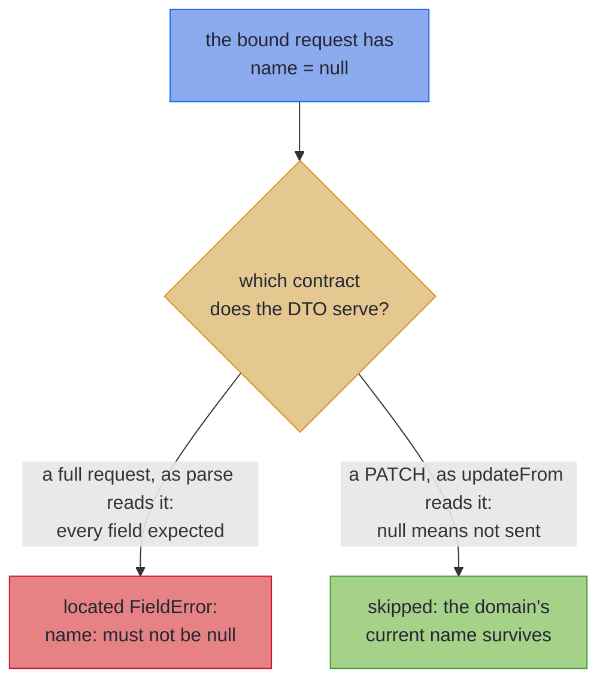

# Sparse PATCH

_Map a PATCH request so an omitted field keeps its current value and a bad one still fails._

A PATCH request carries only the fields the client wants to change, so a `null` in it means *not sent*, not *broken*. This page maps such a request onto your domain record, a Java `record`, with `UpdateSpec`: sent fields are validated and applied, and omitted ones keep their current value. The request must be a class with getters and setters, which [Bean-Shaped Wires](beans.md) covers. A protobuf-java message names the fields it changes in a `FieldMask` instead, as [A PATCH through its `FieldMask`](beans.md#a-patch-through-its-fieldmask) shows. The mapper needs Java 25 and the hkj Gradle plugin, and the [Quickstart](quickstart.md) sets both up.

~~~admonish info title="What You'll Learn"
- Tell what a `null` in a PATCH body means, and why no mapper can infer it
- Map a PATCH request with `UpdateSpec`, and read what `updateFrom` hands back
- Predict what `{}`, `null` and a value each do to a property, by its type
- Keep defaults off a PATCH bean, and prove it in your build with the sparse laws
~~~

~~~admonish example title="See Example Code"
**The code on this page is [SparsePatchBook.java](https://github.com/higher-kinded-j/higher-kinded-j/blob/main/hkj-examples/src/main/java/org/higherkindedj/example/book/mapping/SparsePatchBook.java) and its [SparsePatchBookTest.java](https://github.com/higher-kinded-j/higher-kinded-j/blob/main/hkj-examples/src/test/java/org/higherkindedj/example/book/mapping/SparsePatchBookTest.java)** - the page includes them directly, so they are compiled and run by the build.
~~~

## What PATCH actually means {#what-patch-means}

`PUT` replaces a resource; `PATCH` edits one. A **sparse** PATCH body such as `{"email": "new@example.com"}` means *change the email, touch nothing else*. That makes `null` ambiguous. When the bound request reports `getName() == null`, the client either left `name` out or sent `"name": null`, and the bound bean comes out the same either way.

So the same `null` means opposite things on a full request and on a PATCH:



Which reading applies is a fact about the endpoint's contract, not about the data, so no mapper can infer it from the types. That is why sparse semantics are an **explicit opt-in**. They are close to JSON Merge Patch (RFC 7396), with two differences. A `null` leaves a field alone unless the property is an `Optional` or a `JsonNullable`, and a nested object or list is replaced whole, never merged.

---

## Sparse PATCH write-back: `UpdateSpec` {#sparse-patch-write-back-updatespec}

To opt in, declare an interface extending `UpdateSpec<Domain, Wire>`, where the wire is your request class, and annotate it `@GenerateMapping`. The annotation processor writes its implementation at compile time:

``` java
// A PATCH request bean. Here null means "not provided, leave unchanged" - the opposite of a full
// bean parse (Bean-Shaped Wires), where null is broken data. That contract is opted into by
// extending UpdateSpec.
class ContactPatchBean {
  private String name;
  private String email;

  public String getName() {
    return name;
  }

  public void setName(String name) {
    this.name = name;
  }

  public String getEmail() {
    return email;
  }

  public void setEmail(String email) {
    this.email = email;
  }
}

@GenerateMapping
interface ContactPatchMapping extends UpdateSpec<Customer, ContactPatchBean> {
  // Generates only updateFrom(ContactPatchBean) : Edits.Accumulated<Customer> - no build/parse/as*.
  // A present field is set (email parsed through its leaf, located on failure); an absent (null)
  // one is skipped, so the domain's current value survives.
  default ValidatedPrism<String, EmailAddress> email() {
    return EmailCodecs.EMAIL;
  }
}

```

The processor writes `ContactPatchMappingImpl`, with one method, `updateFrom(wire)`: it turns the sent properties into one update and ignores the rest. The `email()` method is a [leaf](basics.md#validated-leaves): named after a component, it parses the sent `String` into an `EmailAddress`, or fails. There is no `build` or `parse`, since a PATCH that sends nothing is valid where a full parse would reject it.

``` java
    Customer current = new Customer("Ada", new EmailAddress("ada@corp.example"));

    ContactPatchBean patch = new ContactPatchBean();
    patch.setName("Ada Lovelace"); // email left null: not provided, keep the current one

    Edits.Accumulated<Customer> update = ContactPatchMappingImpl.INSTANCE.updateFrom(patch);
    Validated<NonEmptyList<FieldError>, Customer> patched = update.apply(current);
    // Valid(Customer[name=Ada Lovelace, email=EmailAddress[value=ada@corp.example]])
    //   <- only the name changed

    ContactPatchBean badEmail = new ContactPatchBean();
    badEmail.setEmail("not-an-email"); // sent, so it is parsed, and it fails located
    Validated<NonEmptyList<FieldError>, Customer> failed =
        ContactPatchMappingImpl.INSTANCE.updateFrom(badEmail).apply(current);
    // Invalid(NonEmptyList[email: not an email address])
```

Each property lands one of three ways:

- **Sent and valid**: the value is written, parsed through its leaf if it has one.
- **Sent and invalid**: a located `FieldError`, accumulated with the rest. Sparseness never weakens validation of what *was* sent. The one error with no path is a refusal from the record's own [constructor](#fields-a-constructor-checks-together).
- **Omitted**: skipped, so the domain's current value survives.

`updateFrom` returns an `Edits.Accumulated<Domain>`. Its `apply(current)` returns a `Validated`: the patched record, or every `FieldError`, with nothing half written. `applyPath(current)` returns the same result as a [`ValidationPath`](../effect/path_validation.md).

~~~admonish tip title="At the Spring boundary"
The hkj-spring example app serves `PATCH /api/users/{id}` through this tier. [Sparse PATCH at the Spring boundary](../spring/spring_boot_integration.md#sparse-patch) walks the controller, whose one error channel answers an unknown id with 404 and a bad field with 400, and its slice test. A boundary with the current value in hand can return `applyPath(current)` and take [the 422 leg](../spring/spring_boot_integration.md#the-422-leg) instead.
~~~

## What each JSON state does {#what-each-json-state-does}

A binder turns each JSON state into what the getter answers, and `updateFrom` reads only the getter. So a property's type decides which states a client can tell apart:

| The property | Field omitted, `{}` | `"field": null` | `"field": value` |
|---|---|---|---|
| A plain property, `String nickname` | keeps the current value | keeps it: the bound bean is the same as for `{}` | sets it, through its leaf if it has one |
| An `Optional`, `Optional<String> nickname` | keeps the current value | clears it: Jackson binds `Optional.empty()` | sets it |
| A `JsonNullable`, `JsonNullable<String> nickname` | keeps the current value | clears an `Optional` component, and fails any other | sets it, through its leaf if it has one |
| A container, `List<String> phones` | keeps the current value | keeps it | replaces it whole, each element through its leaf if it has one; `[]` empties it |
| A nested record, `Address address` | keeps the current value | keeps it | replaces it whole: fields left out are not merged in |

A primitive property can only ever read as sent, so the processor refuses it and offers the wrapper type.

openapi-generator's `spring` models declare each nullable property as a `JsonNullable`, and a spec maps one with a leaf over the type it holds, as it would a plain property of that type. [A `JsonNullable` property keeps, clears or sets](rules.md#no-jsonnullable-patch-property) has the rules:

``` java
@GenerateMapping
interface CustomerProfilePatchModelMapping
    extends UpdateSpec<CustomerProfile, CustomerProfilePatchModel> {
  // A leaf over the String the JsonNullable holds, which a sent altEmail parses through
  default ValidatedPrism<String, EmailAddress> altEmail() {
    return EmailCodecs.EMAIL;
  }
}

```

~~~admonish warning title="Not checked for you: a sent null clears an Optional"
An `Optional`-typed property and a `JsonNullable` one are the shapes where an explicit `null` differs from leaving the field out, so they are how a client says *clear this*. Make the component `Optional` in the domain. In a bean you write, declare the property `Optional` too, and leave its field `null` until set. A client that sends `"nickname": null` to mean *leave it* clears it instead: omit the field to keep the value.
~~~

~~~admonish warning title="Not checked for you: a JsonNullable needs Jackson's module"
Jackson binds the three states into a `JsonNullable` only with `JsonNullableJackson3Module` registered, or `JsonNullableModule` on Jackson 2. A mapper built with `findAndAddModules()` finds it on the classpath. Without it, Jackson hands the setter `null` for a sent `null`, which reads as an omitted field, so the client's clear is lost and nothing fails:

``` java
    JsonMapper plain = JsonMapper.builder().build();
    JsonMapper found = JsonMapper.builder().findAndAddModules().build();

    // Without the module, Jackson hands setNickname a null holder, which reads as omitted:
    assertThatValidated(applyModel(plain, ada, "{\"nickname\": null}")).hasValue(ada);
    // with it, found on the classpath, the sent null clears the nickname.
    assertThatValidated(applyModel(found, ada, "{\"nickname\": null}"))
        .hasValue(new CustomerProfile("Ada", Optional.empty(), Optional.empty()));
```
~~~

### A PATCH getter must answer `null` until set {#patch-getters-answer-null}

Sooner or later a ticket like this arrives: *marketing opt-ins keep disappearing, and nobody can say why*. Nobody has touched the preference code in a year. The trail ends at the mobile app's new "change phone number" screen, which sends the smallest PATCH it can: `{"phone": "+44 7700 900123"}`. The body is right. The bean it is bound into is not. The bean is generated from the OpenAPI schema, and the generator has turned the schema's `default: false` into a field initialiser, `private Boolean marketingOptIn = false;`. So every request that leaves the field out arrives carrying `false`, and the update writes that `false` over whatever the customer chose. The tests stay green, because their sample customer never opted in, and writing `false` over `false` changes nothing.

Two promises make PATCH work. Absent must mean *leave it alone*, and the mapping must be able to *see* absence. `UpdateSpec` keeps the first promise for you. That bean broke the second, and no compiler can check it. The fix is in the schema: drop `default: false`, and the generator renders the field unset:

``` java
class PreferencesPatchBean {
  private Boolean marketingOptIn; // no initialiser: an omitted field must read as null

  public Boolean getMarketingOptIn() {
    return marketingOptIn;
  }

  public void setMarketingOptIn(Boolean marketingOptIn) {
    this.marketingOptIn = marketingOptIn;
  }
}

```

~~~admonish warning title="Not checked for you: leave PATCH bean fields unset"
`updateFrom` counts a property as sent whenever its getter answers anything but `null`, or, for a `JsonNullable`, anything but `null` or `undefined()`. A binder given `{}` calls no setter, so every mapped getter on that bean must answer `null`. Any default the bean gives itself breaks that: a field initialiser (`= new ArrayList<>()`, `= "ACTIVE"`, `= Optional.empty()`), Lombok's `@Builder.Default`, a value its constructor or builder assigns, or a getter that creates one on first call. Every request that omits the field then writes the default over the domain value, and nothing fails. No signature shows a default, so the processor cannot refuse one.

- **Leave each field uninitialised.** Let each getter return what was set.
- **A `JsonNullable` field may start `undefined()`.** openapi-generator's `spring` models do, and it reads as omitted. A field starting `JsonNullable.of(...)` is a default like any other.
- **Give a generated PATCH request its own schema.** Leave out `default:` values, which a generator renders as initialisers, and have it leave containers `null` (openapi-generator's `containerDefaultToNull`, for one).
- **Let the sparse identity law catch a default.** [Check a PATCH bean in your build](#check-a-patch-in-your-build) shows how.
~~~

### Check a PATCH bean in your build {#check-a-patch-in-your-build}

`MappingLaws` comes from [`hkj-test`](../tooling/test_assertions.md#optic-laws), a test-scope dependency. A law is a property your mapping must satisfy, checked at the samples you pass. One call checks a PATCH mapping, given the current value and three beans: one empty, one valid and one invalid (`patch(name, email)` is a small helper that fills a bean):

``` java
    MappingLaws.assertMappingLaws(
        ContactPatchMappingImpl.INSTANCE::updateFrom,
        new Customer("Ada", new EmailAddress("ada@example.org")), // the current value
        new ContactPatchBean(), // all-absent, as bound from {} -> identity
        patch("Grace", "grace@example.org"), // present valid -> changes the domain
        patch(null, "not-an-email")); // present invalid -> located failure
```

- **Identity**: an all-absent wire is the identity update, so a client sending an empty PATCH cannot corrupt anything.
- **Idempotence**: applying a patch twice equals applying it once, so a retried request lands as if sent once. It holds because the generated edits *set* and *parse*, never *modify*.
- **Validation**: a sent invalid field fails, located, so what the client did send is checked as strictly as a full submission.

Pass a freshly constructed bean as the all-absent wire, as the test does. That is what a binder makes of `{}`, so it keeps any default the bean sets. Calling each setter with `null` would wipe the default and hide it. The law sees a default only where it differs from the current value, so give the current value non-empty containers, and values no default matches. The marketing ticket's tests hid in exactly that gap.

~~~admonish tip title="Why this matters"
Hand-written PATCH handlers get these three properties by luck. One `MappingLaws` call checks them in your build.
~~~

~~~admonish tip title="You can ship now"
You can now map a PATCH body so omitted fields keep their value and every bad sent field comes back located, checked by the sparse laws in your build. The rest of this page is for when you need it.
~~~

~~~admonish question title="Checkpoint: is this PATCH bean safe?" id="check-patch-defaults"
The processor accepts this spec without a warning:

``` java
// A help-centre article, which a PATCH may retitle.
record HelpArticle(String title, List<String> tags) {}

class HelpArticlePatchBean {
  private String title;
  private List<String> tags = new ArrayList<>();

  public String getTitle() {
    return title;
  }

  public void setTitle(String title) {
    this.title = title;
  }

  public List<String> getTags() {
    return tags;
  }

  public void setTags(List<String> tags) {
    this.tags = tags;
  }
}

@GenerateMapping
interface HelpArticlePatchMapping extends UpdateSpec<HelpArticle, HelpArticlePatchBean> {}

```

A help-centre article is tagged `refunds` and `returns`. A client sends `{"title": "Refunds and returns"}`. What are its tags afterwards? And would an identity-law test whose sample article has no tags catch it?
~~~

~~~admonish success title="Answer and why" collapsible=true id="check-patch-defaults-answer"
**An empty list, and no.** The field initialiser makes `getTags()` answer an empty list on every request that omits `tags`. An empty list is not `null`, so `updateFrom` reads it as sent and writes it over the article's tags. A tagless sample hides it, since `[]` written over `[]` changes nothing, just as the marketing tests did. With the tagged article, the identity law fails:

``` java
    HelpArticle tagged = new HelpArticle("Refund policy", List.of("refunds", "returns"));
    HelpArticlePatchBean rename = new HelpArticlePatchBean();
    rename.setTitle("Refunds and returns");

    assertThatValidated(HelpArticlePatchMappingImpl.INSTANCE.updateFrom(rename).apply(tagged))
        .hasValue(new HelpArticle("Refunds and returns", List.of())); // the tags are gone

    // On an article with no tags the identity law passes: [] written over [] changes nothing...
    MappingLaws.assertSparseIdentity(
        HelpArticlePatchMappingImpl.INSTANCE::updateFrom,
        new HelpArticle("Refund policy", List.of()),
        new HelpArticlePatchBean());

    // ...and on one with tags it fails, with the message your build would report:
    assertThatThrownBy(
            () ->
                MappingLaws.assertSparseIdentity(
                    HelpArticlePatchMappingImpl.INSTANCE::updateFrom,
                    tagged,
                    new HelpArticlePatchBean()))
        .hasMessageContaining(
            "Sparse identity law: updateFrom(allAbsentWire).apply(HelpArticle[title=Refund policy,"
                + " tags=[refunds, returns]]) == Valid(it); got Valid(HelpArticle[title=Refund"
                + " policy, tags=[]])");
```

Your build reports it as:

```
Sparse identity law: updateFrom(allAbsentWire).apply(HelpArticle[title=Refund policy, tags=[refunds, returns]]) == Valid(it); got Valid(HelpArticle[title=Refund policy, tags=[]])
```

Where this lives: [A PATCH getter must answer `null` until set](#patch-getters-answer-null) and [Check a PATCH bean in your build](#check-a-patch-in-your-build).
~~~

~~~admonish question title="Checkpoint: clear a nickname" id="check-patch-json-states"
A customer profile's nickname is `Countess`, and the PATCH bean declares `Optional<String> nickname`. What does each body leave it as: `{}`, `{"nickname": null}`, and `{"nickname": "Lady Lovelace"}`? And what would `{"name": null}` do to the profile's plain `String name`?
~~~

~~~admonish success title="Answer and why" collapsible=true id="check-patch-json-states-answer"
**`Countess`, empty, `Lady Lovelace`, and nothing.** An omitted field reads `null`, so it keeps. Jackson binds an explicit `null` on an `Optional` property to `Optional.empty()`, which clears. A value sets. A plain property has no third state, so its `null` keeps the name, and a client cannot clear it. Bound by Jackson, as a Spring controller would:

``` java
    CustomerProfile ada = new CustomerProfile("Ada", Optional.of("Countess"), Optional.empty());

    assertThatValidated(applyJson(ada, "{}")).hasValue(ada); // omitted: kept
    assertThatValidated(applyJson(ada, "{\"nickname\": null}"))
        .hasValue(new CustomerProfile("Ada", Optional.empty(), Optional.empty())); // cleared
    assertThatValidated(applyJson(ada, "{\"nickname\": \"Lady Lovelace\"}"))
        .hasValue(
            new CustomerProfile("Ada", Optional.of("Lady Lovelace"), Optional.empty())); // set
    assertThatValidated(applyJson(ada, "{\"name\": null}")).hasValue(ada); // a plain null: kept
```

Where this lives: [What each JSON state does](#what-each-json-state-does).
~~~

---

## Fields a constructor checks together {#fields-a-constructor-checks-together}

`updateFrom` calls the record's constructor once, with the sent values and the current value of every other component. A constructor that checks its fields against each other therefore never sees a PATCH half applied:

``` java
// A price band whose constructor checks its two fields against each other.
record PriceBand(int floor, int ceiling) {
  PriceBand {
    if (floor > ceiling) {
      throw new IllegalArgumentException("floor above ceiling");
    }
  }
}

class PriceBandPatch {
  private Integer floor;
  private Integer ceiling;

  public Integer getFloor() {
    return floor;
  }

  public void setFloor(Integer floor) {
    this.floor = floor;
  }

  public Integer getCeiling() {
    return ceiling;
  }

  public void setCeiling(Integer ceiling) {
    this.ceiling = ceiling;
  }
}

@GenerateMapping
interface PriceBandPatchMapping extends UpdateSpec<PriceBand, PriceBandPatch> {}

```

``` java
    PriceBand band = new PriceBand(10, 20);

    PriceBandPatch raise = new PriceBandPatch();
    raise.setFloor(30); // on its own, a floor of 30 is above the ceiling of 20...
    raise.setCeiling(40); // ...but the PATCH ends on 30 to 40
    Validated<NonEmptyList<FieldError>, PriceBand> raised =
        PriceBandPatchMappingImpl.INSTANCE.updateFrom(raise).apply(band);
    // Valid(PriceBand[floor=30, ceiling=40]): the constructor sees only the final values

    PriceBandPatch floorOnly = new PriceBandPatch();
    floorOnly.setFloor(30);
    Validated<NonEmptyList<FieldError>, PriceBand> refused =
        PriceBandPatchMappingImpl.INSTANCE.updateFrom(floorOnly).apply(band);
    // Invalid(NonEmptyList[floor above ceiling]): the constructor's own message, at the root
```

The refusal comes back as a `FieldError` with no field path, carrying the constructor's message, which the client reads, as on the other tiers ([A record's own invariants](absence.md#constructor-invariants)). With no path it cannot satisfy the validation law, which expects a located error. So the test for a record with no leaf that can fail, like `PriceBand`, checks the other two laws and asserts the refusal itself:

``` java
    var priceBandMapping = PriceBandPatchMappingImpl.INSTANCE;
    MappingLaws.assertSparseIdentity(priceBandMapping::updateFrom, band, new PriceBandPatch());
    MappingLaws.assertSparseIdempotent(priceBandMapping::updateFrom, band, raise);
    assertThatValidated(priceBandMapping.updateFrom(floorOnly).apply(band))
        .hasFieldErrors("floor above ceiling"); // the constructor's refusal, unlabelled
```

[A sparse update constructs the record once](rules.md#sparse-construct-once) has the precise rules.

---

## Lists, sets and maps: replaced whole, parsed per element {#patch-containers}

A sent list replaces the stored one whole. If the property has a leaf, each element is parsed through it, and a bad element is reported by its index, key or value. Put the leaf on a [shared interface](codecs.md#shared-vocabulary-mix-in-interfaces), and your full mapping and your PATCH mapping both use it:

``` java
record PhoneNumber(String value) {}

// A high-street store's phone lines: a PATCH that sends the list replaces it whole.
record Store(String name, List<PhoneNumber> phones) {}

record StoreDto(String name, List<String> phones) {} // the full tier's wire

// A PATCH bean whose phones property is a whole-list replacement, absent when null.
class StorePatchBean {
  private String name;
  private List<String> phones;

  public String getName() {
    return name;
  }

  public void setName(String name) {
    this.name = name;
  }

  public List<String> getPhones() {
    return phones;
  }

  public void setPhones(List<String> phones) {
    this.phones = phones;
  }
}

// ONE element vocabulary: the leaf names the component and parses ELEMENTS.
interface PhoneVocabulary {
  default ValidatedPrism<String, PhoneNumber> phones() {
    return ValidatedPrism.of(
        raw ->
            raw.startsWith("+")
                ? Validated.validNel(new PhoneNumber(raw))
                : Validated.invalidNel(FieldError.of("not a phone number")),
        PhoneNumber::value);
  }
}

@GenerateMapping
interface StoreMapping extends PhoneVocabulary, MappingSpec<Store, StoreDto> {}

// The full tier lifts the leaf elementwise: a bad element parses as phones.1.

@GenerateMapping
interface StorePatchMapping extends PhoneVocabulary, UpdateSpec<Store, StorePatchBean> {}

// The sparse tier lifts the SAME leaf: a present list replaces wholesale, each element parsed,
// failures located phones.1 - one vocabulary, both tiers.

```

``` java
    Store store = new Store("Leeds", List.of(new PhoneNumber("+44")));

    StorePatchBean storePatch = new StorePatchBean();
    storePatch.setPhones(List.of("+1", "nope")); // a present list replaces wholesale...

    Validated<NonEmptyList<FieldError>, Store> storePatched =
        StorePatchMappingImpl.INSTANCE.updateFrom(storePatch).apply(store);
    // ...but each element parses through the phones() leaf, located:
    // Invalid(NonEmptyList[phones.1: not a phone number])
```

The same laws hold over container elements:

``` java
    MappingLaws.assertMappingLaws(
        StorePatchMappingImpl.INSTANCE::updateFrom,
        new Store("Leeds", List.of(new PhoneNumber("+44"))), // the current value
        new StorePatchBean(), // all-absent, as bound from {} -> identity
        storePatch(null, List.of("+1", "+353")), // present valid -> wholesale replacement
        storePatch(null, List.of("+1", "nope"))); // bad element   -> located phones.1
```

[Containers patch through the element leaf](rules.md#patch-containers) covers a whole-container leaf and a nested spec.

---

## The rules in brief {#patch-rules-in-brief}

The processor refuses a PATCH spec it cannot honour, and names the fix. The last four rows are behaviours rather than refusals. Each row links to its rule:

| On a PATCH spec or bean | What happens | Instead |
|---|---|---|
| [It extends both `MappingSpec` and `UpdateSpec`](rules.md#one-tier-per-spec) | refused | a spec per tier, sharing a mix-in |
| [A primitive property, `int age`](rules.md#no-primitive-patch-property) | refused | the wrapper type, `Integer age` |
| [A plain property bridged to a domain `Optional`](rules.md#no-optional-bridge-on-a-patch), with no leaf of its own, or `@OptionalBridge` on the spec | refused | an `Optional`-typed or `JsonNullable` property |
| [A getter-only `List`](rules.md#no-getter-only-list-on-a-patch) | refused | a setter, and a getter that answers `null` until set |
| [A Lombok `@Singular` collection its builder writes](rules.md#singular-collections) | refused | drop `@Singular`, or a hand-written PATCH bean |
| [A record wire](rules.md#no-record-patch-wire) | refused | a bean |
| [A bean with only getters, or only setters](rules.md#patch-bean-read-and-written) | refused | a bean both read and written |
| [A setter with no getter](rules.md#every-patch-setter-has-a-getter) | refused | a getter, or [`@Unmapped`](beans.md#accessors-meant-to-stay-out) on the spec |
| [A wire property that names no domain component](rules.md#patch-wire-property-names-a-component) | refused | a `@MapField` rename, on the component's leaf where it has one, or drop the property |
| [A sealed hierarchy](rules.md#no-sealed-patch), on either side | refused | one `UpdateSpec` per concrete record pair |
| [An inherited derived field or `@OptionalBridge` marker](rules.md#inherited-vocabulary-on-a-patch) | inert | nothing: one mix-in serves both tiers |
| [A `JsonNullable` property](rules.md#no-jsonnullable-patch-property) | kept when omitted; a sent `null` clears an `Optional` component and fails any other | nothing |
| [A nested record, `Optional`, `List` or `Map` of the same type on both sides](rules.md#patch-replaces-wholesale) | replaced whole | a leaf where its parts need checking; deep merge is out of scope |
| [A domain component with no wire property](rules.md#patch-wire-property-names-a-component) | never changed | nothing: a PATCH DTO covers a subset on purpose |

---

~~~admonish info title="Key Takeaways"
* **Sparse semantics are an explicit opt-in**: `UpdateSpec` gives a PATCH bean null-as-absent, and nothing is inferred from the shape alone
* **Sparseness never weakens validation**: present fields still parse through their leaves, and every bad one is a located, accumulated `FieldError`, while a constructor's refusal comes back with no path
* **A PATCH bean carries no defaults**: each getter answers `null`, or `undefined()` for a `JsonNullable`, until set, and the sparse identity law, given a freshly constructed bean, catches one that does not
* **An `Optional` or `JsonNullable` property can clear**: an explicit `null` clears an `Optional` component, and on a plain property a `null` keeps the value
~~~

~~~admonish info title="Hands-On Learning"
Practise the sparse identity law in [Tutorial 27: Boundary Edge Cases](https://github.com/higher-kinded-j/higher-kinded-j/blob/main/hkj-examples/src/test/java/org/higherkindedj/tutorial/optics/Tutorial27_BoundaryEdgeCases.java) (6 exercises). Its last exercise runs the law on a bean whose schema said `default: false`, and only a well-chosen sample makes it fail.
~~~

~~~admonish tip title="See Also"
- [Bean-Shaped Wires](beans.md): What counts as a bean, and how its getters and setters are read and written
- [Many Edits at Once](../optics/multi_edit.md): The hand-written `Edits.accumulate` this tier generates
- [Sparse PATCH at the Spring boundary](../spring/spring_boot_integration.md#sparse-patch): The controller story
- [What Your Spec Generates](tiers.md): Where `updateFrom` sits among the surfaces
~~~

---

**Previous:** [Bean-Shaped Wires](beans.md)
**Next:** [Generic Specs](generics.md)
