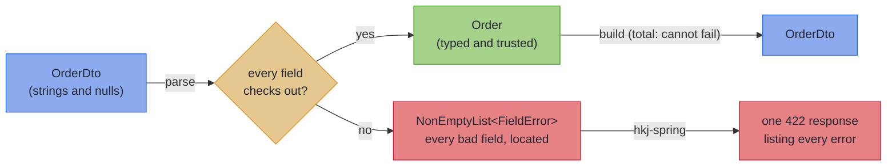
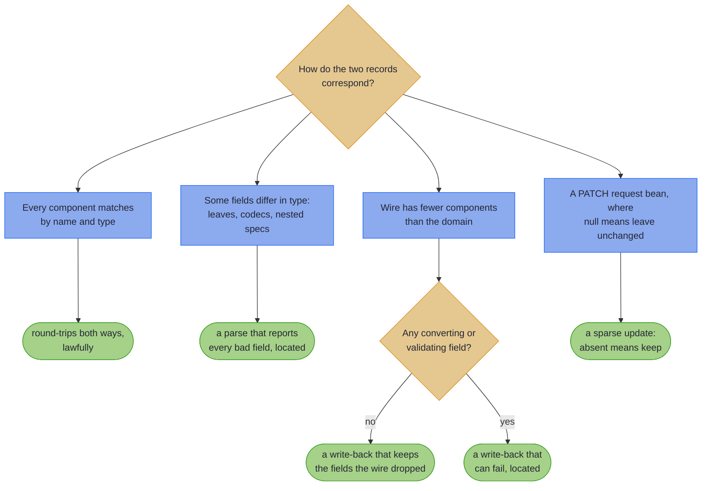

<!-- description: Replace a hand-written or MapStruct DTO mapper with code generated at compile time that reports every bad request field at once, each by its path. -->

# Mapping at the Boundary

> _"I, too, am a translated man. I have been borne across. It is generally believed that something is always lost in translation; I cling to the notion ... that something can also be gained."_
> — Salman Rushdie, *Shame*

---

Every value that crosses a service boundary is translated in Rushdie's sense. It is born in the wire's language of strings and nulls, then borne across into the domain's language of typed identifiers, real dates, and emails that have already been checked. Rushdie insists something can be gained in translation, and this chapter takes him at his word: what lands on the far side is a value the domain can finally trust. The chapter is also about what an honest translator owes you when the original turns out to be gibberish: not the first complaint, but all of them, each with an address.

Every service has the same three files. A DTO the framework binds. A domain record the business logic trusts. And, between them, a mapper: hand-written, reflection-driven, or generated, but always *there*, because the shape the wire speaks is never quite the shape the domain thinks in.

Here is the version most codebases carry, in one form or another:

<!-- verify -->
```java
static Order toDomainByHand(OrderDto dto) {
    Objects.requireNonNull(dto.customer(), "customer required"); // first null wins
    if (!dto.customer().email().contains("@")) {
        throw new IllegalArgumentException("bad email");         // no field name, no path
    }
    return new Order(
        UUID.fromString(dto.id()),                               // throws its own exception
        new Customer(dto.customer().fullName(),
                     new EmailAddress(dto.customer().email())),
        Instant.parse(dto.placedAt()));                          // and so does this one
}
```

It works, until it doesn't, and it fails three ways at once:

1. **It drifts.** Add a component to `Order` and nothing tells you the mapper no longer covers it. The compiler is not watching this file.
2. **It stops at the first error.** The client fixes the email, resubmits, and only then learns the date was bad too. One round trip per defect.
3. **Its errors have no address.** `IllegalArgumentException: bad email` says nothing a client can map onto a form field, so a handler somewhere turns it into a vague 400.

---

## What you get instead {#what-you-get-instead}

This chapter replaces that mapper with one interface you own and one annotation. The processor derives both directions at compile time wherever the wire supports them, and the fallible one reports **every** bad field at once, each located by a dotted path. Here is the destination, before any theory: a request with five defects, answered by one response.

```json
{
  "valid": false,
  "errors": [
    { "path": "id",             "message": "not a UUID (expected e.g. 123e4567-e89b-12d3-a456-426614174000)" },
    { "path": "customer.email", "message": "not an email address" },
    { "path": "lines.1.price",  "message": "not a number in plain notation (expected e.g. 123.45)" },
    { "path": "placedAt",       "message": "not an ISO-8601 instant (expected e.g. 2026-07-28T12:34:56Z)" },
    { "path": "status",         "message": "unknown OrderStatus (expected one of NEW, PAID, SHIPPED)" }
  ],
  "errorCount": 5
}
```

The bad email is *inside a nested record*; the bad price is on the *second element of a list*. The client fixes all five and resubmits once. Nobody wrote a line of error-handling code to produce this: it falls out of the declarations. The [Capstone](capstone.md) builds it end to end, and a test the build runs proves its five errors. This copy leaves out the `segments` array the full response carries beside each `path`.

~~~admonish note title="The running example"
From Record Mapping Basics on, the examples come from the order service behind that request, wherever its shapes fit. A `Customer` carries a checked `EmailAddress`, there is an `Address` to deliver to, an `Order` has its `LineItem`s and its `OrderStatus`, and a sealed `Payment` pays for it. A page whose feature needs another shape adds a piece from the same service, such as a courier or a delivery window. Your attention stays on the feature rather than on a new pair of records. The [Capstone](capstone.md) puts the pieces together at full size.
~~~

The shape of the machinery is a railway with two directions:



And the "one interface you own"? Here it is, whole, for a pair whose components already match:

``` java
record Address(String street, String city, String postcode) {}

record AddressDto(String street, String city, String postcode) {}

@GenerateMapping
interface AddressMapping extends MappingSpec<Address, AddressDto> {}

```

Where a field needs converting or checking, the spec (that interface) declares a **leaf**: the conversion at that one field, written as a [`ValidatedPrism`](../optics/validated_prism.md):

``` java
record Customer(String name, EmailAddress email) {}

record CustomerDto(String name, String email) {}

@GenerateMapping
interface CustomerMapping extends MappingSpec<Customer, CustomerDto> {
  default ValidatedPrism<String, EmailAddress> email() { // wire first, domain second
    return EmailCodecs.EMAIL;
  }
}


    Validated<NonEmptyList<FieldError>, Customer> parsed =
        CustomerMappingImpl.INSTANCE.parse(new CustomerDto("Bob", "not-an-email"));
    // Invalid(NonEmptyList[email: not an email address])
```

Outbound, `build` is a *total* function: it cannot fail. Inbound, `parse` returns a [`Validated`](../monads/validated_monad.md), typed `Validated<NonEmptyList<FieldError>, Domain>`. It is either `Valid`, holding your typed domain value, or `Invalid`, holding every defect at once in a [`NonEmptyList`](../monads/nonemptylist_monad.md) of [`FieldError`](../glossary/optics.md#fielderror) values. Nothing drifts, because the processor re-derives the mapping from the records on every compile and rejects what it cannot honour.

~~~admonish warning title="Before you start"
Higher-Kinded-J is built on **Java 25** today, with preview features enabled, and preview ties
that build to one JDK release. The [Quickstart](quickstart.md) has the one build line that
sets that up, and ends at a working endpoint. Evaluating rather than building? [Mapper at a
Glance](at_a_glance.md) has the generated code, the costs and the decisions to know.
~~~

~~~admonish tip title="At the Spring boundary"
If you arrived here because you want that 422, the wiring is two steps: this chapter's `parse`, and the `hkj-spring-boot-starter`. The starter renders an `Invalid` parse result as one **422 Unprocessable Content** response, with no code in between. Return the result from the controller as-is. [The 422 leg](../spring/spring_boot_integration.md#the-422-leg) is the full story, and [Sparse PATCH at the Spring boundary](../spring/spring_boot_integration.md#sparse-patch) covers PATCH endpoints. (A *leg* is the route a returned value travels to become an HTTP response, in the railway sense.)
~~~

---

## Part of the library, not a bolt-on

The mapper is not a separate tool that happens to ship in the same jar; it is Higher-Kinded-J's own parts, composed and generated. That is why it fits the rest of the book:

- **Parse, don't validate.** In Alexis King's words, *"a parser is just a function that consumes less-structured input and produces more-structured output."* `parse` is that function, returning a trusted value or a typed refusal, and the type system knows which.
- **Typed errors over exceptions.** The refusal is a value (`Validated`, `NonEmptyList`, `FieldError`), so it accumulates, composes, and travels the same [railway](../effect/effect_path_overview.md) as every other error in the library.
- **Truthful types.** The generated surface only ever offers operations whose laws the record pair can honour; what cannot be lawful is simply not generated.
- **Laws, verified.** Each generated surface obeys stated laws, checked in the library's own build and repeatable in yours with [one test call](tiers.md#law-checked-in-the-repo-and-in-your-tests).
- **Built from parts you already know.** A leaf is a [`ValidatedPrism`](../optics/validated_prism.md), accumulation is [`Validated.fields()`](../monads/validated_assembly.md), a sparse PATCH folds into [`Edits.Accumulated`](../optics/multi_edit.md). Learn the mapper and you have learned more of the library; learn the library and the mapper works the way you would expect.

---

## What the mapper will (and will not) generate

The generated surface follows the shape of the pair:



[What Your Spec Generates](tiers.md) names each of these surfaces and the laws it obeys. Some of them are optics the book teaches elsewhere. When every component is a plain copy, the spec also gets an [`Iso`](../glossary/optics.md#iso-isomorphism), a lossless two-way conversion. When the wire has fewer components and each is a plain copy, it gets a [`Lens`](../glossary/optics.md#lens), which writes the wire onto a domain value you already hold. [Which methods your spec gets](tiers.md#which-methods-your-spec-gets) says what counts as a plain copy.

~~~admonish note title="If you know MapStruct"
This is not a MapStruct competitor on breadth, and does not try to be. MapStruct keeps its ground for mutable JPA entities, for deep path flattening (`address.geo.lat` onto a wholly flat wire, where this generator spreads one level), and for Bean-Validation-centric shops. What this generator does differently is **boundary correctness for record domains**. The inbound direction is a validating parser with located, accumulated errors, where MapStruct throws on the first bad conversion or silently maps an invalid value. The outbound direction is provably total, and the processor generates no operation whose laws the pair cannot satisfy. Adopt it where the boundary is the product; keep MapStruct where its breadth pays. One MapStruct habit does not carry over: declaring the mapper's instance on its own interface. Here that constant can read `null`, so [bind the generated Impl in the caller](basics.md#bind-in-the-caller) instead.
~~~

~~~admonish note title="If you know Bean Validation"
The usual pipeline is: bind with Jackson, annotate the DTO with `@Valid` constraints, translate with a mapper, and catch what leaks in a `@ControllerAdvice`. To be fair to that stack, `@Valid` *does* accumulate errors, and they *do* carry field names. What it cannot do is produce `Order`. The annotations guard the DTO, while the domain constructor still runs on data that was checked somewhere else. The format rule lives in a third place neither record enforces, and the mapper in the middle can still throw. Here, parsing and validating are one step, and the type system knows it happened.
~~~

---

## How to read this chapter

Start from what you came for.

| You want | Start at |
|---|---|
| A working endpoint that answers with a located 422 | [Quickstart](quickstart.md), five steps |
| To understand the model before writing any of it | [Record Mapping Basics](basics.md), then each page through to [the Capstone](capstone.md) and [Check Your Understanding](self_check.md) |
| To judge whether it fits your services | [Mapper at a Glance](at_a_glance.md) |
| To bring a MapStruct or Bean Validation habit across | [Coming from MapStruct and Bean Validation](from_mapstruct.md) |
| To see it working on one boundary | [the Capstone](capstone.md) |
| To see it across modules, with a client jar, a Lombok bean and a PATCH | [the estate capstone](estate.md) |

Those pages teach the model and put it behind an endpoint. For a particular task, go straight to its page:

- A field the client may leave out, read as an empty `Optional`, or a record whose constructor refuses bad values: [Absent Fields and Record Invariants](absence.md)
- DTOs that nest, hold lists, or dispatch over sealed types: [Nesting, Containers, and Sealed Hierarchies](structure.md)
- What exactly got generated for your spec, and why: [What Your Spec Generates](tiers.md)
- A getter/setter, builder or protobuf DTO: [Bean-Shaped Wires](beans.md)
- A PATCH endpoint, where an omitted field keeps its current value: [Sparse PATCH](beans_patch.md)
- A `Page<T>` at the boundary: [Generic Specs](generics.md)
- Combining several sources, or typing your error context: [Merge and Error Envelopes](merge_envelopes.md)
- A rule, a limit, or a runtime surprise to look up: [Rules and Limits](rules.md)
- A compiler message to decode: [Compiler Messages](compiler_errors.md)
- Spring beans, test fakes, and how wide a record may be: [Injecting, Testing, and Diagnostics](testing.md)

~~~admonish info title="Hands-On Learning"
Practise the whole lane in the [Boundary Mapping Journey](../tutorials/optics/boundary_mapping_journey.md) (4 tutorials, 19 exercises): hand-written multi-edits, the `ValidatedPrism` leaf, the generated boundary of Tutorial 26, and the edge cases of Tutorial 27.
~~~

---

## Chapter Contents

**Ship**, read in order:

1. [Quickstart: Your First 422](quickstart.md): Five steps from a blank build to a located 422
2. [Record Mapping Basics](basics.md): Your first mapping, leaves, renames, derived fields
3. [Standard Codecs and Shared Vocabulary](codecs.md): Stock lawful codecs and mix-in sharing
4. [Absent Fields and Record Invariants](absence.md): Optional fields and a record's own checks
5. [Nesting, Containers, and Sealed Hierarchies](structure.md): Composition and dotted error paths
6. [Capstone: One 422, Every Bad Field](capstone.md): One boundary built end to end, proven
7. [Check Your Understanding](self_check.md): Ten questions, answers proved by the build

**On demand**, when a task calls for it:

8. [What Your Spec Generates](tiers.md): Truthful types, projections, the validated patch, laws
9. [Bean-Shaped Wires](beans.md): Setter, builder, and one-directional bean wires
10. [Sparse PATCH](beans_patch.md): `UpdateSpec`: an omitted field keeps its value
11. [Generic Specs](generics.md): Concrete, threaded, and element-mapped generics
12. [Merge and Error Envelopes](merge_envelopes.md): Multi-source assembly and typed error context
13. [Injecting, Testing, and Diagnostics](testing.md): Spring beans, test fakes, and record width
14. [Capstone: An Estate in Three Modules](estate.md): A vocabulary, a client jar, Lombok, and PATCH across modules

**Look it up**, when you hold a question:

15. [Mapper at a Glance](at_a_glance.md): Generated code, costs, and adoption decisions
16. [Coming from MapStruct and Bean Validation](from_mapstruct.md): Your vocabulary, translated
17. [Rules and Limits](rules.md): Every enforced rule and limit, in one place
18. [Compiler Messages](compiler_errors.md): The common refusals, what each means, and the fix

---

**Next:** [Quickstart: Your First 422](quickstart.md)
