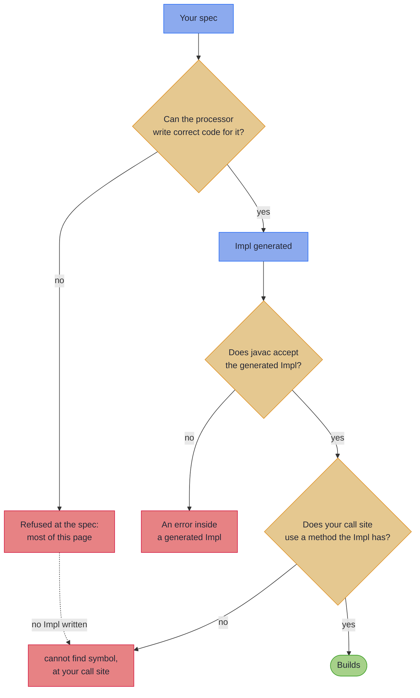

# Mapping Compiler Messages

_The refusals you are most likely to meet from the mapping processor, what each means, and the fix._

<!-- Generated by hkj-book/tools/compiler-messages/build_messages.py. Edit the entries in
     messages.py, or the page text, SHORT and MOST_OFTEN in build_messages.py, and rerun the script
     rather than editing this page; see README.md there. -->

When the processor cannot write correct code for a spec, it refuses at compile time, pointing at your declaration, with a message that says what is wrong, why, and what to write. Look the message up in [Find your message](#find-your-message): each entry gives the fix and the full message in the open, with a declaration that produces it folded away. Every declaration here is compiled on each build, and the build fails if its message stops carrying the words the entry quotes. A message not listed still carries its own what, why and fix, and its rule is on [Rules and Limits](rules.md).

~~~admonish info title="Reading an entry"
- **Headings** quote the message with its names replaced: `X`, `Y` and `Z` for types, `x`, `y` and `z` for components, fields or methods, `T` for a type argument, `p` for a package. The `@GenerateMapping:` prefix is left off.
- **The words:** the *domain* is your record, the *wire* the DTO, the *spec* the `@GenerateMapping` interface, and a *leaf* a `default ValidatedPrism` method that converts one field.
- **Errors, warnings and notes:** an error stops the build, a warning stops only a `-Werror` build, and a note stops nothing. One entry is a warning and one a note, and each says so. The processor prints a few other notes, each saying how it read a declaration, such as a bean it maps one way only.
- **The full messages** are printed for declarations compiled in a package `com.example`.
~~~

---

## Find your message {#find-your-message}

**Seen most often**

| The message says | What it means |
|---|---|
| [`cannot find symbol … class XMappingImpl`](#no-impl-class) | The generated Impl does not exist |
| [`has no wire counterpart named`](#no-wire-counterpart) | A domain component has no same-named wire component |
| [`has no usable source`](#no-usable-source) | Types differ and nothing converts them |
| [`Add '@OptionalBridge`](#add-optional-bridge) | A domain `Optional` faces a plain wire component |
| [`leaf '…' names no component of`](#leaf-names-no-component) | A leaf's name matches no component, usually a typo |
| [`redeclares the mapping itself`](#redeclares-the-mapping) | The spec declares a mapping method, MapStruct-style |

**[Spec members](#spec-members)**

| The message says | What it means |
|---|---|
| [`has no wire counterpart named`](#no-wire-counterpart) | A domain component has no same-named wire component |
| [`has no usable source`](#no-usable-source) | Types differ and nothing converts them |
| [`leaf '…' names no component of`](#leaf-names-no-component) | A leaf's name matches no component, usually a typo |
| [`redeclares the mapping itself`](#redeclares-the-mapping) | The spec declares a mapping method, MapStruct-style |
| [`collides with the`](#collides-with-a-generated-member) | A spec method clashes with a generated one |
| [`has more components than`](#wire-has-more-components) | The wire has components nothing fills |
| [`has no domain source`](#projection-field-has-no-domain-source) | A smaller wire names a missing component |
| [`@MapField(to = …) on '…' names no component of`](#rename-names-no-component) | A rename's `to` names nothing on the wire |
| [`derived field method '…' names no component of`](#derived-field-names-no-component) | A derived field names nothing on the wire |
| [`both map to wire component`](#both-map-to-one-wire-component) | A rename targets a component already filled |
| [`targets a wire component another rename already claims`](#rename-already-claimed) | Two renames point at one wire component |
| [`is neither a rename, a leaf, nor a bridge`](#neither-rename-leaf-bridge) | An abstract method says nothing about what it is |
| [`@MapField method '…' is neither a marker nor a leaf`](#mapfield-neither-marker-nor-leaf) | A @MapField method has a body that is no leaf |
| [`returns a Getter but is named after a domain component`](#getter-named-after-domain) | A derived field carries a domain component's name |
| [`combines a projection with derived fields`](#projection-with-derived-fields) | A smaller wire also declares a derived field |
| [`declares type parameters of its own`](#own-type-parameters) | A leaf, rename or marker declares its own `<R>` |
| [`method '…' names '…', which cannot be reached from`](#cannot-be-reached) | A member names a type its package cannot see |
| [`record component '…' of '…' names '…', which cannot be reached from`](#component-cannot-be-reached) | A mapped type is hidden from the spec's package |
| [`holds the generated`](#impl-constant-on-a-spec) | **Warning.** A spec or mix-in holds its Impl in a constant |

**[Optional fields](#optional-fields)**

| The message says | What it means |
|---|---|
| [`Add '@OptionalBridge`](#add-optional-bridge) | A domain `Optional` faces a plain wire component |
| [`bridges to the primitive`](#bridges-to-a-primitive) | The bridged wire component is a primitive |
| [`which is declared non-null`](#declared-non-null) | The bridged wire component is declared non-null |
| [`is declared over the whole Optional`](#bridged-leaf-over-whole-optional) | A bridged leaf is declared over the `Optional` |
| [`is redundant on a bean wire`](#redundant-on-a-bean-wire) | **Note.** A bean wire bridges without the marker |

**[Shared vocabulary](#shared-vocabulary)**

| The message says | What it means |
|---|---|
| [`is itself a mapping spec`](#mix-in-is-a-spec) | A spec extends another spec |
| [`is extended raw by`](#extended-raw) | A generic mix-in is extended without type arguments |
| [`which the spec extends raw`](#reached-through-raw) | A raw clause further up erases a generic mix-in |
| [`has conflicting renames`](#conflicting-renames) | Two mix-ins rename one component two ways |

**[Containers](#containers)**

| The message says | What it means |
|---|---|
| [`cannot name an array constructor`](#array-constructor) | A lifted array's element type is generic |
| [`never runs`](#key-leaf-never-runs) | A key leaf sits beside a whole-map leaf |
| [`names a raw Map component`](#raw-map) | A key leaf faces a raw `Map` |
| [`matches more than one mapping spec`](#more-than-one-spec) | Two specs map the same pair |
| [`has no mapping spec`](#subtype-has-no-spec) | A sealed subtype has no spec |
| [`is never produced`](#subtype-never-produced) | A sealed wire subtype has no spec producing it |
| [`is targeted by more than one domain subtype`](#subtype-targeted-twice) | Two domain subtypes map to one wire subtype |
| [`has no meaning on a sealed mapping`](#no-meaning-on-a-sealed-mapping) | A sealed spec declares a leaf or marker |

**[Flattening](#flattening)**

| The message says | What it means |
|---|---|
| [`spreads a component`](#spreads-a-shared-name) | A flattened name collides with a domain name |
| [`spreads across a bean-shaped wire`](#spreads-across-a-bean) | `@Flatten` on a bean wire |
| [`names a component of the flattened group`](#flattens-a-group-member) | `@Flatten` inside a flattened group |

**[Bean wires](#bean-wires)**

| The message says | What it means |
|---|---|
| [`does not support on the domain side`](#bean-domain) | The domain is a bean, not a record |
| [`so the mapping leaves it out`](#setter-with-no-getter) | An accessor has no partner |
| [`is read and written at different types`](#read-and-written-at-different-types) | A getter and its writer disagree on type |
| [`names no accessor`](#unmapped-names-no-accessor) | An `@Unmapped` marker names nothing left out |
| [`names a property`](#unmapped-names-a-mapped-property) | An `@Unmapped` marker names a paired property |
| [`has nothing to leave out`](#unmapped-marker-on-a-one-way-bean) | An `@Unmapped` marker sits on a bean crossed one way |
| [`names no getter`](#read-only-names-no-getter) | A `@ReadOnly` marker names no unpaired getter |
| [`@ReadOnly method '…' names a property`](#read-only-names-a-mapped-property) | A `@ReadOnly` marker names a paired property |
| [`has nothing to mark read-only`](#read-only-on-a-record) | A `@ReadOnly` marker sits on a record, or a one-way bean |
| [`has a read-only property`](#read-only-nested-both-ways) | A spec with two halves is nested where a whole prism is needed |
| [`maps as two halves`](#maps-as-two-halves) | **Note.** A mapping takes two halves from a spec it nests |
| [`which has no parse to read`](#read-only-on-a-projection) | A `@ReadOnly` property sits on a projection |
| [`has no meaning on a sparse update`](#read-only-on-a-sparse-update) | A `@ReadOnly` marker sits on an `UpdateSpec` |
| [`which a build cannot fill`](#getter-only-list-build) | A getter-only `List` is raw or a wildcard |
| [`bridged to the getter-only bean property`](#bridged-to-a-getter-only-list) | A domain `Optional` faces a getter-only `List` |
| [`bridged to the @Singular bean property`](#bridged-to-a-singular-collection) | A domain `Optional` faces a Lombok `@Singular` collection |
| [`which does not track whether it is set`](#protobuf-field-without-presence) | A domain `Optional` faces a message field with no `hasX()` |
| [`a member of the oneof`](#protobuf-oneof-member) | A oneof member is filled by something other than an `Optional` |
| [`which maps to a sealed interface or an Optional of one`](#protobuf-oneof-unsealed) | A component named after a oneof is not sealed |
| [`maps a oneof to, is not a record`](#protobuf-oneof-variant-not-record) | A oneof's sealed variant is not a record |
| [`do not pair with the members of the oneof`](#protobuf-oneof-unpaired) | A oneof's members and variants do not pair by name |
| [`and nothing fills it from one`](#protobuf-oneof-variant-unfilled) | Nothing fills a oneof's variant from its member |
| [`a member of the oneof that domain field`](#protobuf-oneof-held-twice) | A component fills a member a sealed component holds |
| [`through its variants, so nothing calls it`](#protobuf-oneof-method) | A method is named after a component that maps a oneof |
| [`cannot be told apart`](#singular-adder-not-told-apart) | A build-only builder's `@Singular` adder is ambiguous |
| [`no property it reads is one it can write`](#reads-some-writes-others) | A bean reads some names and writes others |

**[Sparse PATCH](#sparse-patch)**

| The message says | What it means |
|---|---|
| [`extends both 'MappingSpec`](#extends-both-tiers) | One spec extends `MappingSpec` and `UpdateSpec` |
| [`is primitive and can never be absent`](#primitive-patch-property) | A PATCH property is a primitive |
| [`which a sparse UpdateSpec cannot map`](#record-patch-wire) | A PATCH wire is a record |
| [`cannot carry a sparse update's absence`](#getter-only-list-patch) | A PATCH bean has a getter-only `List` |
| [`fields […] of the protobuf-java message '…' name no component of`](#protobuf-field-names-no-component) | A message field names no component of a `FieldMask` update |
| [`is a @Singular collection`](#singular-collection-patch) | A PATCH bean has a Lombok `@Singular` collection |
| [`which a sparse update cannot express`](#optional-on-a-patch) | A plain PATCH property faces a domain `Optional` |
| [`which cannot be written into`](#jsonnullable-value-no-source) | Nothing converts a `JsonNullable`'s value to the component |

**[Generic specs](#generic-specs)**

| The message says | What it means |
|---|---|
| [`is generic, which a … does not support yet`](#generic-bean-or-patch) | A bean, PATCH or sealed mapping is generic |
| [`needs a generic spec`](#abstract-leaf-needs-a-generic-spec) | A concrete spec declares a leaf with no body |

**[Merge and error envelopes](#merge-and-error-envelopes)**

| The message says | What it means |
|---|---|
| [`both carry it`](#merge-component-ambiguous) | Several merge sources carry one component |
| [`uses fallible fills but declares a plain`](#merge-plain-return) | A fallible merge declares a plain return |
| [`declares a Validated return but every fill is an identity copy`](#merge-validated-identity) | A merge of copies declares a Validated return |
| [`is not filled by any source`](#merge-unfilled) | No merge source names a target component |
| [`is a primitive`](#envelope-primitive-context) | An envelope context component is a primitive |
| [`is a class, not a record`](#envelope-variant-not-a-record) | An envelope variant is a class |
| [`which this companion does not support`](#envelope-generic) | An envelope hierarchy is generic |
| [`@GenerateErrorEnvelope: … cannot be reached from`](#envelope-cannot-be-reached) | An envelope's type is hidden from its companion's package |

**[At your call site](#at-your-call-site)**

| The message says | What it means |
|---|---|
| [`cannot find symbol … class XMappingImpl`](#no-impl-class) | The generated Impl does not exist |
| [`cannot find symbol … method asIso()`](#no-such-surface) | The tier does not offer that method |

---

## Where the message came from {#where-the-message-came-from}



Most messages come from the first branch: the processor reads your spec, finds a shape it cannot map correctly, and says so where you declared it. A refused spec writes no Impl, so every call to it also reports `cannot find symbol`; fix the refusal and those go with it. An error inside a generated file, an `*Impl` or a companion such as `*Errors`, means the processor accepted a declaration it should have refused. Please [report it](https://github.com/higher-kinded-j/higher-kinded-j/issues) with the declaration, since the cause is usually still there.

---

## Spec members {#spec-members}

### `domain field 'X.y' has no wire counterpart named 'y'` {#no-wire-counterpart}

A domain component has no wire component of the same name, and no rename points it at one.

**Fix.** Rename one side so the names match, or add a rename to the spec, such as `@MapField(to = "fullName") String name();`. Where the component already has a leaf, put the `@MapField` on the leaf instead, as [Renamed and converted](basics.md#renamed-and-converted) shows.

```
@GenerateMapping: domain field 'Customer.name' has no wire counterpart named 'name'. Found on
CustomerDto: [fullName]. Align the component names, or add a '@MapField(to = ...)' rename on the
spec.
```

The rule: [Renames](basics.md#renames-mapfield).

~~~admonish example title="A declaration that produces it" collapsible=true
<!-- verify:rejects "has no wire counterpart named" -->
```java
record Customer(String name) {}

record CustomerDto(String fullName) {}

@GenerateMapping
interface CustomerMapping extends MappingSpec<Customer, CustomerDto> {}
```
~~~

### `target field 'XDto.y' has no usable source` {#no-usable-source}

A wire component's type differs from its domain counterpart's, and nothing converts between them.

**Fix.** Add the method the message spells out, or put it in place of the one the message names, a `default ValidatedPrism` that parses the field: a [standard codec](codecs.md#standard-codecs) such as `StandardCodecs.uuid()`, or your own. Where one side is a primitive, the message asks for its wrapper type first. A `List` against a `Set` lands here too, because elements map only when both sides declare the same container.

```
@GenerateMapping: target field 'CustomerDto.email' has no usable source. The types differ
(java.lang.String vs com.example.EmailAddress) and no matching leaf method was found. Found on
Customer: [email]. Add 'default ValidatedPrism<java.lang.String, com.example.EmailAddress>
email()' to the spec.
```

The rule: [Validated leaves](basics.md#validated-leaves).

~~~admonish example title="A declaration that produces it" collapsible=true
<!-- verify:rejects "has no usable source" -->
```java
record Customer(EmailAddress email) {}

record CustomerDto(String email) {}

@GenerateMapping
interface CustomerMapping extends MappingSpec<Customer, CustomerDto> {}
```
~~~

### `leaf 'x' names no component of Y` {#leaf-names-no-component}

A leaf declared on the spec is named after nothing the domain has, which is usually a typo.

**Fix.** Rename it after the component it parses; the message names the nearest one when it is close. Make it `private` or `static` if it is a helper.

```
@GenerateMapping: leaf 'emial' names no component of Customer. A leaf is a zero-parameter
'default' named after the DOMAIN component it parses (or an inner component of a flattened one);
an unmatched leaf would silently validate nothing. Did you mean 'email()'? Found on Customer:
[email]. Rename the method to the component it parses, or make it 'private' or 'static' if it is
a helper.
```

The rule: [How the two `default` families are told apart](rules.md#how-the-two-default-families-are-told-apart).

~~~admonish example title="A declaration that produces it" collapsible=true
<!-- verify:rejects "A leaf is a zero-parameter" -->
```java
record Customer(EmailAddress email) {}

record CustomerDto(String email) {}

@GenerateMapping
interface CustomerMapping extends MappingSpec<Customer, CustomerDto> {
  default ValidatedPrism<String, EmailAddress> emial() {
    return EmailCodecs.EMAIL;
  }
}
```
~~~

### `abstract method 'x' redeclares the mapping itself` {#redeclares-the-mapping}

The spec declares a mapping method, as a MapStruct mapper would; here the spec declares only vocabulary, and the Impl generates the methods.

**Fix.** Delete the method, and call the generated Impl's `build` or `parse`.

```
@GenerateMapping: abstract method 'toDto' redeclares the mapping itself. The spec declares
vocabulary (renames, leaves, derived fields); the mapping methods are generated. This signature
is what the generated Impl already exposes. Delete the method and call the generated Impl:
'build(Domain) : Wire' for the outbound direction, 'parse(Wire)' for the accumulating inbound
one.
```

The rule: [Your first mapping](basics.md#your-first-mapping).

~~~admonish example title="A declaration that produces it" collapsible=true
<!-- verify:rejects "redeclares the mapping itself" -->
```java
record Customer(String name) {}

record CustomerDto(String name) {}

@GenerateMapping
interface CustomerMapping extends MappingSpec<Customer, CustomerDto> {
  CustomerDto toDto(Customer customer);
}
```
~~~

### `'build(X)' collides with the 'build' member the generated XImpl emits` {#collides-with-a-generated-member}

The spec declares a method the generated Impl also declares, so it would be overridden or break the generated file.

**Fix.** Rename the method, or remove it and rely on the generated one. To change how one component maps, declare a leaf named after it.

```
@GenerateMapping: 'build(Customer)' collides with the 'build' member the generated
CustomerMappingImpl emits for this tier (a full mapping). The generated Impl declares an
override-equivalent 'build', so this method is either silently overridden (its logic never runs
on INSTANCE) or fails the generated file's compile with a raw javac error. Rename the method, or
remove it and rely on the generated 'build'; to customise how a component maps, declare a
ValidatedPrism leaf default named after it.
```

The rule: [Validated leaves](basics.md#validated-leaves).

~~~admonish example title="A declaration that produces it" collapsible=true
<!-- verify:rejects "collides with the" -->
```java
record Customer(String name) {}

record CustomerDto(String name) {}

@GenerateMapping
interface CustomerMapping extends MappingSpec<Customer, CustomerDto> {
  default CustomerDto build(Customer customer) {
    return new CustomerDto(customer.name());
  }
}
```
~~~

### `'XDto' has more components than 'X'` {#wire-has-more-components}

The wire has components nothing on the domain fills, so `build` cannot write them. The message names each one.

**Fix.** Remove the extra wire components, add domain components to match, derive them with `default Getter` methods, or spread a nested domain record across them with `@Flatten`.

```
@GenerateMapping: 'CustomerDto' has more components than 'Customer', leaving [email] unfilled.
build must fill every wire component from a domain source or a derived field, and the extras
have neither. A wire with fewer components maps as a projection (Lens tier). Remove the extra
wire components, add matching domain components (or a @MapField rename where a name differs),
declare derived fields ('default Getter<Customer, ComponentType>' methods named after the
extras), or spread a nested domain component across the extras with an '@Flatten' marker named
after it.
```

The rule: [Derived wire fields](basics.md#derived-wire-fields).

~~~admonish example title="A declaration that produces it" collapsible=true
<!-- verify:rejects "has more components than" -->
```java
record Customer(String name) {}

record CustomerDto(String name, String email) {}

@GenerateMapping
interface CustomerMapping extends MappingSpec<Customer, CustomerDto> {}
```
~~~

### `projection field 'XDto.y' has no domain source` {#projection-field-has-no-domain-source}

A wire with fewer components than the domain maps as a projection, and one of its components is named after nothing the domain has.

**Fix.** Align the component names, or add a `@MapField` rename, on the component's leaf where it has one.

```
@GenerateMapping: projection field 'CustomerDto.nmae' has no domain source. 'CustomerDto' is
smaller than 'Customer', so it maps as a projection: every wire component must name a domain
component. Found on Customer: [name, email]. Align the component names, or add a @MapField
rename, on the component's leaf where it has one.
```

The rule: [Renames](basics.md#renames-mapfield).

~~~admonish example title="A declaration that produces it" collapsible=true
<!-- verify:rejects "has no domain source" -->
```java
record Customer(String name, String email) {}

record CustomerDto(String nmae) {}

@GenerateMapping
interface CustomerMapping extends MappingSpec<Customer, CustomerDto> {}
```
~~~

### `@MapField(to = "y") on 'x' names no component of XDto` {#rename-names-no-component}

A rename's `to` names nothing the wire has, which is usually a typo.

**Fix.** Point `to` at an existing wire component; the message lists them.

```
@GenerateMapping: @MapField(to = "fulName") on 'name' names no component of CustomerDto. Found
on CustomerDto: [fullName]. Point 'to' at an existing wire component.
```

The rule: [Renames](basics.md#renames-mapfield).

~~~admonish example title="A declaration that produces it" collapsible=true
<!-- verify:rejects "Point 'to' at an existing wire component" -->
```java
record Customer(String name) {}

record CustomerDto(String fullName) {}

@GenerateMapping
interface CustomerMapping extends MappingSpec<Customer, CustomerDto> {
  @MapField(to = "fulName")
  String name();
}
```
~~~

### `derived field method 'x' names no component of XDto` {#derived-field-names-no-component}

A derived field is named after nothing the wire has, which is usually a typo.

**Fix.** Rename the method after the wire component it derives, or remove it.

```
@GenerateMapping: derived field method 'dispalyName' names no component of CustomerDto. A
default method returning Getter declares a derived wire field, so its name must be the wire
component build fills. Found on CustomerDto: [name, displayName]. Rename the method after the
wire component it derives, or remove it.
```

The rule: [Derived wire fields](basics.md#derived-wire-fields).

~~~admonish example title="A declaration that produces it" collapsible=true
<!-- verify:rejects "its name must be the wire component build fills" -->
```java
record Customer(String name) {}

record CustomerDto(String name, String displayName) {}

@GenerateMapping
interface CustomerMapping extends MappingSpec<Customer, CustomerDto> {
  default Getter<Customer, String> dispalyName() {
    return Getter.of(Customer::name);
  }
}
```
~~~

### `domain components 'x' and 'y' both map to wire component 'y'` {#both-map-to-one-wire-component}

A rename points at a wire component another domain component already fills by name.

**Fix.** Point the rename at a different wire component.

```
@GenerateMapping: domain components 'first' and 'name' both map to wire component 'name'. Each
wire component takes exactly one domain source; a @MapField rename may not collide with another
component's mapping. Point the rename at a distinct wire component.
```

The rule: [Renames](basics.md#renames-mapfield).

~~~admonish example title="A declaration that produces it" collapsible=true
<!-- verify:rejects "both map to wire component" -->
```java
record Person(String first, String name) {}

record PersonDto(String name, String other) {}

@GenerateMapping
interface PersonMapping extends MappingSpec<Person, PersonDto> {
  @MapField(to = "name")
  String first();
}
```
~~~

### `@MapField(to = "y") on 'x' targets a wire component another rename already claims` {#rename-already-claimed}

Two renames point at one wire component, and each wire component takes exactly one source.

**Fix.** Point each rename at a different wire component.

```
@GenerateMapping: @MapField(to = "name") on 'last' targets a wire component another rename
already claims. Each wire component takes exactly one domain source. Point each rename at a
distinct wire component.
```

The rule: [Renames](basics.md#renames-mapfield).

~~~admonish example title="A declaration that produces it" collapsible=true
<!-- verify:rejects "targets a wire component another rename already claims" -->
```java
record Person(String first, String last) {}

record PersonDto(String name) {}

@GenerateMapping
interface PersonMapping extends MappingSpec<Person, PersonDto> {
  @MapField(to = "name")
  String first();

  @MapField(to = "name")
  String last();
}
```
~~~

### `abstract method 'x' is neither a rename, a leaf, nor a bridge` {#neither-rename-leaf-bridge}

An abstract method on the spec carries nothing that says what it declares, so the generated Impl cannot implement it.

**Fix.** Give it a `default` body, make it a `@MapField` rename, or mark it `@OptionalBridge`.

```
@GenerateMapping: abstract method 'displayName' is neither a rename, a leaf, nor a bridge. A
spec declares zero-parameter @MapField renames, @OptionalBridge markers and 'default' leaf
methods; the generated Impl cannot implement anything else. Make it a 'default' method, turn it
into a '@MapField(to = ...)' rename, or annotate it '@OptionalBridge' if it names an Optional
component that bridges to a nullable wire one.
```

The rule: [Renames](basics.md#renames-mapfield).

~~~admonish example title="A declaration that produces it" collapsible=true
<!-- verify:rejects "is neither a rename, a leaf, nor a bridge" -->
```java
record Customer(String name) {}

record CustomerDto(String name) {}

@GenerateMapping
interface CustomerMapping extends MappingSpec<Customer, CustomerDto> {
  String displayName();
}
```
~~~

### `@MapField method 'x' is neither a marker nor a leaf` {#mapfield-neither-marker-nor-leaf}

A `@MapField` method has a body, and is not the component's leaf, so it is neither shape a rename takes.

**Fix.** Make it the component's leaf, a zero-parameter `default` method returning `ValidatedPrism<Wire, Domain>`, or remove the body to leave a rename marker. The message names the change the method's shape needs.

```
@GenerateMapping: @MapField method 'email' is neither a marker nor a leaf. A rename is declared
on an abstract marker named after the domain component, or, where the component also converts,
on its zero-parameter 'default' leaf returning ValidatedPrism<WireComponent, DomainComponent>; a
body of any other shape is neither. Remove the parameters and return
ValidatedPrism<WireComponent, DomainComponent> to make it the component's leaf, or remove the
body to leave a rename marker.
```

The rule: [Renamed and converted](basics.md#renamed-and-converted).

~~~admonish example title="A declaration that produces it" collapsible=true
<!-- verify:rejects "where the component also converts" -->
```java
record Customer(EmailAddress email) {}

record CustomerDto(String emailAddress) {}

@GenerateMapping
interface CustomerMapping extends MappingSpec<Customer, CustomerDto> {
  @MapField(to = "emailAddress")
  default EmailAddress email(String raw) {
    return new EmailAddress(raw);
  }
}
```
~~~

### `default method 'x' returns a Getter but is named after a domain component` {#getter-named-after-domain}

A derived field carries the name of a domain component, where the processor expects a leaf.

**Fix.** Name it after the wire-only component it derives, or return a `ValidatedPrism` to make it a leaf.

```
@GenerateMapping: default method 'name' returns a Getter but is named after a domain component.
The name decides what a default method declares: a leaf is named after a DOMAIN component and
returns ValidatedPrism<WireComponent, DomainComponent>; a derived wire field is named after a
wire component with NO domain counterpart and returns Getter<Customer, WireComponentType>. Named
'name', this method reads as a leaf, but a leaf never returns Getter. Return a ValidatedPrism to
make it a leaf, or rename the method after the wire-only component it derives.
```

The rule: [How the two `default` families are told apart](rules.md#how-the-two-default-families-are-told-apart).

~~~admonish example title="A declaration that produces it" collapsible=true
<!-- verify:rejects "returns a Getter but is named after a domain component" -->
```java
record Customer(String name) {}

record CustomerDto(String name) {}

@GenerateMapping
interface CustomerMapping extends MappingSpec<Customer, CustomerDto> {
  default Getter<Customer, String> name() {
    return Getter.of(customer -> customer.name().toUpperCase(Locale.ROOT));
  }
}
```
~~~

### `'XDto' combines a projection with derived fields` {#projection-with-derived-fields}

A wire with fewer components than the domain (a projection) also declares a derived field, and the write-back could never keep a value `build` recomputes.

**Fix.** Drop the derived field and map the smaller wire as a plain projection, or give the wire every domain component.

```
@GenerateMapping: 'BadgeDto' combines a projection with derived fields. Setting the derived
fields [label] aside, 'BadgeDto' has fewer components than 'Employee', which is the projection
shape. The projection write-back (asLens or patch) writes wire values back into the domain, but
build recomputes a derived component, so the write-back could never honour the value being set.
Remove the derived methods and map the smaller wire as a plain projection, or add wire
components until every domain component keeps a counterpart.
```

The rule: [Derived fields and the emission tiers](rules.md#derived-fields-and-the-emission-tiers).

~~~admonish example title="A declaration that produces it" collapsible=true
<!-- verify:rejects "combines a projection with derived fields" -->
```java
record Employee(String name, String dept, int age) {}

record BadgeDto(String name, String label) {}

@GenerateMapping
interface BadgeMapping extends MappingSpec<Employee, BadgeDto> {
  default Getter<Employee, String> label() {
    return Getter.of(employee -> employee.name() + " (" + employee.dept() + ")");
  }
}
```
~~~

### `abstract method 'x' declares type parameters of its own` {#own-type-parameters}

An abstract leaf, rename or marker declares its own `<R>`, which the generated Impl has nowhere to declare.

**Fix.** Give the method a concrete type. Element types belong on the spec's own type parameters.

```
@GenerateMapping: abstract method 'items' declares type parameters of its own. The generated
Impl carries a leaf as a constructor-supplied field and a rename as a stub, and neither has
anywhere to declare the method's own type parameters, so the generated file would name a
variable nothing brings into scope. Give 'items' a concrete return type; a marker method
declares a correspondence and the generated stub only has to name one.
```

The rule: [The boundaries of a generic spec](rules.md#generic-boundaries).

~~~admonish example title="A declaration that produces it" collapsible=true
<!-- verify:rejects "declares type parameters of its own" -->
```java
record Page(List<String> items) {}

record PageDto(List<String> entries) {}

@GenerateMapping
interface PageMapping extends MappingSpec<Page, PageDto> {
  @MapField(to = "entries")
  <R> List<R> items();
}
```
~~~

### `@MapField method 'x' names 'Y', which cannot be reached from 'p'` {#cannot-be-reached}

A rename, leaf or marker names a type the spec's package cannot see, and the Impl is generated in that package.

**Fix.** In the spec's package, remove `private` from the type and any class enclosing it. From another package, make the type and the classes enclosing it `public`, or, when none is `private`, declare the spec in the type's package.

```
@GenerateMapping: @MapField method 'sku' names 'Sku', which cannot be reached from
'com.example'. The generated Impl is a top-level class in the spec's package, where it names
every type the mapping crosses, so each has to be visible from there. Remove 'private' from
'Sku'.
```

The rule: [Every type a mapping crosses is visible from the spec's package](rules.md#visible-from-the-spec-package).

~~~admonish example title="A declaration that produces it" collapsible=true
<!-- verify:rejects "method 'sku' names 'Sku', which cannot be reached from" -->
```java
class Shop {
  private record Sku(String value) {}

  record Item(Sku sku) {}

  record ItemDto(Sku code) {}

  @GenerateMapping
  interface ItemMapping extends MappingSpec<Item, ItemDto> {
    @MapField(to = "code")
    Sku sku();
  }
}
```
~~~

### `record component 'x' of 'X' names 'Y', which cannot be reached from 'p'` {#component-cannot-be-reached}

A type the mapping crosses is hidden from the spec's package, where the Impl is generated. The subject names where: a record component or bean property, a type parameter, a builder, or a merge's target or source component. Where the hidden type is the spec itself, its domain or wire, a permitted subtype or a merge target, the message reads `domain type 'Item' cannot be reached from 'p'`.

**Fix.** In the spec's package, remove `private` from the type and any class enclosing it. From another package, make the type and the classes enclosing it `public`, or, when none is `private`, declare the spec in the type's package.

```
@GenerateMapping: record component 'sku' of 'Item' names 'Sku', which cannot be reached from
'com.example'. The generated Impl is a top-level class in the spec's package, where it names
every type the mapping crosses, so each has to be visible from there. Remove 'private' from
'Sku'.
```

The rule: [Every type a mapping crosses is visible from the spec's package](rules.md#visible-from-the-spec-package).

~~~admonish example title="A declaration that produces it" collapsible=true
<!-- verify:rejects "record component 'sku' of 'Item' names 'Sku', which cannot be reached from" -->
```java
class Shop {
  private record Sku(String value) {}

  record Item(Sku sku) {}

  record ItemDto(Sku sku) {}

  @GenerateMapping
  interface ItemMapping extends MappingSpec<Item, ItemDto> {}
}
```
~~~

### `'X.y' holds the generated XImpl in a constant, which can read null` (a warning) {#impl-constant-on-a-spec}

A spec, or a mix-in it extends, keeps its generated Impl in a constant, MapStruct-style. The constant can read `null`, depending on which class a program uses first.

**Fix.** Keep the Impl in the calling code: a local, or a `private static final` field on the class that calls it. Annotate a constant you keep on purpose `@SuppressWarnings("impl-constant")`.

```
@GenerateMapping: 'CustomerMapping.MAPPER' holds the generated CustomerMappingImpl in a
constant, which can read null. CustomerMappingImpl implements 'CustomerMapping', so once
'CustomerMapping' declares a default method, such as a leaf, or a private instance method, a
program that uses CustomerMappingImpl.INSTANCE before reading the constant leaves it null for
good. Keep the Impl in the calling code: a local, or a private static final field on the class
that calls it. To keep this constant anyway, annotate it @SuppressWarnings("impl-constant").
```

The rule: [A spec never holds its Impl in a constant](rules.md#impl-constant-on-a-spec).

~~~admonish example title="A declaration that produces it" collapsible=true
<!-- verify:reports "holds the generated" -->
```java
record Customer(String name) {}

record CustomerDto(String name) {}

@GenerateMapping
interface CustomerMapping extends MappingSpec<Customer, CustomerDto> {
  CustomerMappingImpl MAPPER = CustomerMappingImpl.INSTANCE;
}
```
~~~

---

## Optional fields {#optional-fields}

### `... has no usable source ... Add '@OptionalBridge ...' to the spec` {#add-optional-bridge}

A domain `Optional` faces a plain wire component, and the spec has not said that `null` means *absent*.

**Fix.** Add the `@OptionalBridge` marker the message spells out. The whole-`Optional` leaf it offers second also compiles, but reports a `null` as a field error instead of reading it as empty.

```
@GenerateMapping: target field 'ReaderDto.nickname' has no usable source. The types differ
(java.lang.String vs java.util.Optional<java.lang.String>) and no matching leaf method was
found. Found on Reader: [name, nickname]. Add '@OptionalBridge
java.util.Optional<java.lang.String> nickname();' to the spec, so an absent value reads as a
null wire component and back. Or add 'default ValidatedPrism<java.lang.String,
java.util.Optional<java.lang.String>> nickname()' to the spec.
```

The rule: [Optional fields: `@OptionalBridge`](absence.md#optional-bridge).

~~~admonish example title="A declaration that produces it" collapsible=true
<!-- verify:rejects "Add '@OptionalBridge" -->
```java
record Reader(String name, Optional<String> nickname) {}

record ReaderDto(String name, String nickname) {}

@GenerateMapping
interface ReaderMapping extends MappingSpec<Reader, ReaderDto> {}
```
~~~

### `@OptionalBridge on 'x' bridges to the primitive record component 'x'` {#bridges-to-a-primitive}

The bridged wire component is a primitive, which cannot hold the `null` an empty `Optional` becomes.

**Fix.** Declare the wire component as the wrapper type, `Integer` for an `int`.

```
@GenerateMapping: @OptionalBridge on 'age' bridges to the primitive record component 'age'. The
bridge encodes an empty Optional as null, and the record component is declared int, which can
never be null. Declare 'age' on 'ReaderDto' as java.lang.Integer.
```

The rule: [A bridged component must take `null`](rules.md#bridged-component-nullable).

~~~admonish example title="A declaration that produces it" collapsible=true
<!-- verify:rejects "bridges to the primitive" -->
```java
record Reader(String name, Optional<Integer> age) {}

record ReaderDto(String name, int age) {}

@GenerateMapping
interface ReaderMapping extends MappingSpec<Reader, ReaderDto> {
  @OptionalBridge
  Optional<Integer> age();
}
```
~~~

### `domain field 'X.y' is Optional<T>, bridged to the record component 'XDto.y', which is declared non-null` {#declared-non-null}

The bridged wire component is declared non-null, by an annotation or by a JSpecify `@NullMarked` scope.

**Fix.** Mark it `@Nullable`, since it carries absence. Otherwise drop the `Optional`, or encode absence in a leaf over the whole `Optional`.

```
@GenerateMapping: domain field 'Reader.nickname' is Optional<String>, bridged to the record
component 'ReaderDto.nickname', which is declared non-null. The bridge writes an empty Optional
as null, and 'ReaderDto.nickname' is annotated @NonNull, so build would write the null its
declaration rules out, and either throw or leave a null its type says it cannot hold. Replace
@NonNull on 'ReaderDto.nickname' with @Nullable, since it carries absence; or declare
'Reader.nickname' as String, dropping the Optional and its @OptionalBridge marker; or add
'default ValidatedPrism<java.lang.String, java.util.Optional<java.lang.String>> nickname()' to
the spec in place of the marker, a leaf over the whole Optional that encodes absence the way the
wire does.
```

The rule: [A bridged component must take `null`](rules.md#bridged-component-nullable).

~~~admonish example title="A declaration that produces it" collapsible=true
<!-- verify:rejects "which is declared non-null" -->
```java
record Reader(String name, Optional<String> nickname) {}

record ReaderDto(String name, @NonNull String nickname) {}

@GenerateMapping
interface ReaderMapping extends MappingSpec<Reader, ReaderDto> {
  @OptionalBridge
  Optional<String> nickname();
}
```
~~~

### `@OptionalBridge leaf 'x' is declared over the whole Optional` {#bridged-leaf-over-whole-optional}

A bridged leaf converts the element the bridge found, but this one is declared over the `Optional` itself.

**Fix.** Declare the leaf over the element types, or drop `@OptionalBridge` to keep a leaf over the whole `Optional`.

```
@GenerateMapping: @OptionalBridge leaf 'email' is declared over the whole Optional. A bridged
leaf converts the element the bridge found, so it is declared over the element types; declared
over java.util.Optional<com.example.EmailAddress> it is an ordinary whole-component leaf, which
parses a null wire value to a located 'must not be null' rather than to an empty Optional.
Declare the leaf as 'ValidatedPrism<java.lang.String, com.example.EmailAddress>', or drop the
annotation to keep the whole-Optional leaf.
```

The rule: [Optional fields: `@OptionalBridge`](absence.md#optional-bridge).

~~~admonish example title="A declaration that produces it" collapsible=true
<!-- verify:rejects "is declared over the whole Optional" -->
```java
record Reader(String name, Optional<EmailAddress> email) {}

record ReaderDto(String name, String email) {}

@GenerateMapping
interface ReaderMapping extends MappingSpec<Reader, ReaderDto> {
  @OptionalBridge
  default ValidatedPrism<String, Optional<EmailAddress>> email() {
    return EmailCodecs.OPTIONAL_EMAIL;
  }
}
```
~~~

### `@OptionalBridge on 'x' is redundant on a bean wire` (a note) {#redundant-on-a-bean-wire}

A bean wire bridges a domain `Optional` without the marker, so the annotation changes nothing.

**Fix.** Remove it. A marker that a record-wire sibling also needs belongs on a shared mix-in, where it draws no note.

```
@GenerateMapping: @OptionalBridge on 'nickname' is redundant on a bean wire. A bean wire bridges
a domain Optional to its nullable property automatically, because bean conventions leave
Optional off property types; the annotation opts a RECORD wire into the same correspondence.
Remove the annotation. If a record-wire spec needs it too, declare the annotated method on a
mix-in both specs extend; an inherited one draws no note.
```

The rule: [Optional fields: `@OptionalBridge`](absence.md#optional-bridge).

~~~admonish example title="A declaration that produces it" collapsible=true
<!-- verify:reports "is redundant on a bean wire" -->
```java
record Guest(String name, Optional<String> nickname) {}

class GuestBean {
  private String name;
  private String nickname;

  public String getName() { return name; }
  public void setName(String name) { this.name = name; }
  public String getNickname() { return nickname; }
  public void setNickname(String nickname) { this.nickname = nickname; }
}

@GenerateMapping
interface GuestMapping extends MappingSpec<Guest, GuestBean> {
  @OptionalBridge
  Optional<String> nickname();
}
```
~~~

---

## Shared vocabulary {#shared-vocabulary}

### `mix-in 'X' is itself a mapping spec` {#mix-in-is-a-spec}

A spec extends another spec as if it were a vocabulary; a spec generates an Impl, a mix-in only shares members.

**Fix.** Move the shared renames and leaves onto a plain interface, and extend that instead.

```
@GenerateMapping: mix-in 'SupplierMapping' is itself a mapping spec. A mix-in shares vocabulary
(renames, leaves, derived fields); a mapping spec generates an Impl of its own, and inheriting
one spec from another would conflate the two. Move the shared renames and leaves onto a plain
interface and extend that instead.
```

The rule: [Mix-in shapes the processor refuses](rules.md#refused-mix-in-shapes).

~~~admonish example title="A declaration that produces it" collapsible=true
<!-- verify:rejects "is itself a mapping spec" -->
```java
record Customer(String name) {}

record CustomerDto(String name) {}

record Supplier(String name) {}

record SupplierDto(String name) {}

@GenerateMapping
interface SupplierMapping extends MappingSpec<Supplier, SupplierDto> {}

@GenerateMapping
interface CustomerMapping extends MappingSpec<Customer, CustomerDto>, SupplierMapping {}
```
~~~

### `mix-in 'X' is extended raw by the spec` {#extended-raw}

A generic mix-in is extended without its type arguments, so every member it contributes arrives erased.

**Fix.** Name the type arguments where the mix-in is extended, as `extends Renames<String>`.

```
@GenerateMapping: mix-in 'Renames' is extended raw by the spec. Its members are read under the
spec's instantiation, and a raw supertype erases every one of them whatever they declare: a
'ValidatedPrism<String, Email>' arrives bare, and a 'T' arrives as Object. Name the type
arguments where the spec extends 'Renames', as 'extends Renames<...>'.
```

The rule: [A generic mix-in reached raw](rules.md#a-generic-mix-in-reached-raw).

~~~admonish example title="A declaration that produces it" collapsible=true
<!-- verify:rejects "is extended raw by" -->
```java
interface Renames<T> {
  @MapField(to = "fullName")
  T name();
}

record Customer(String name) {}

record CustomerDto(String fullName) {}

@SuppressWarnings("rawtypes")
@GenerateMapping
interface CustomerMapping extends MappingSpec<Customer, CustomerDto>, Renames {}
```
~~~

### `mix-in 'X' is reached through 'Y', which the spec extends raw` {#reached-through-raw}

A generic mix-in sits behind an interface the spec extends raw, and the erasure reaches every member below it.

**Fix.** Name the type arguments on the clause the message names, as `extends Middle<String>`: that is the line to edit, not the mix-in whose members went missing.

```
@GenerateMapping: mix-in 'Renames' is reached through 'Middle', which the spec extends raw. Its
members are read under the spec's instantiation, and a raw supertype erases every one of them
whatever they declare: a 'ValidatedPrism<String, Email>' arrives bare, and a 'T' arrives as
Object. Name the type arguments where the spec extends 'Middle', as 'extends Middle<...>'.
```

The rule: [A generic mix-in reached raw](rules.md#a-generic-mix-in-reached-raw).

~~~admonish example title="A declaration that produces it" collapsible=true
<!-- verify:rejects "extends raw" -->
```java
interface Renames<T> {
  @MapField(to = "fullName")
  T name();
}

interface Middle<T> extends Renames<T> {}

record Customer(String name) {}

record CustomerDto(String fullName) {}

@SuppressWarnings("rawtypes")
@GenerateMapping
interface CustomerMapping extends MappingSpec<Customer, CustomerDto>, Middle {}
```
~~~

### `component 'x' has conflicting renames` {#conflicting-renames}

Two mix-ins rename the same component to different wire components, and neither overrides the other.

**Fix.** Declare the rename on the spec itself, which overrides both, or align the mix-ins on one target.

```
@GenerateMapping: component 'name' has conflicting renames. 'name' is renamed to 'fullName'
(inherited from 'BillingNames') and to 'displayName' (inherited from 'DisplayNames'); neither
declaration overrides the other, so there is no winner. Override the rename on the spec itself,
or align the mix-ins on one target.
```

The rule: [Inheriting one member twice](rules.md#inheriting-one-member-twice).

~~~admonish example title="A declaration that produces it" collapsible=true
<!-- verify:rejects "has conflicting renames" -->
```java
interface BillingNames {
  @MapField(to = "fullName")
  String name();
}

interface DisplayNames {
  @MapField(to = "displayName")
  String name();
}

record Customer(String name, String nickname) {}

record CustomerDto(String fullName, String displayName) {}

@GenerateMapping
interface CustomerMapping
    extends MappingSpec<Customer, CustomerDto>, BillingNames, DisplayNames {}
```
~~~

---

## Containers {#containers}

### `field 'x' is an array whose element type T cannot name an array constructor` {#array-constructor}

Lifting an array builds a new one, and Java cannot create an array of a type variable or a parameterised type.

**Fix.** Declare the component as a `List` on both sides, or map the arrays whole with the leaf the message spells out.

```
@GenerateMapping: field 'rows' is an array whose element type java.util.List<com.example.Tag>
cannot name an array constructor. Lifting an array builds a new array of the element type, and
Java forbids creating an array of a type variable or of a parameterised type, so the generated
'java.util.List<com.example.Tag>[]::new' would not compile. Declare the component as a List on
both sides, which lifts the same way and needs no array creation, or map the arrays whole with
the leaf 'default ValidatedPrism<java.util.List<com.example.TagDto>[],
java.util.List<com.example.Tag>[]> rows()' over the array types.
```

The rule: [What lifts, and what does not](rules.md#what-lifts).

~~~admonish example title="A declaration that produces it" collapsible=true
<!-- verify:rejects "cannot name an array constructor" -->
```java
record Tag(String value) {}

record TagDto(String value) {}

@GenerateMapping
interface TagMapping extends MappingSpec<Tag, TagDto> {}

record Board(List<Tag>[] rows) {}

record BoardDto(List<TagDto>[] rows) {}

@GenerateMapping
interface BoardMapping extends MappingSpec<Board, BoardDto> {}
```
~~~

### `@MapKey("x") leaf 'xKey()' never runs` {#key-leaf-never-runs}

A key leaf sits beside a leaf over the whole `Map`, which is tried first, so the key leaf would never convert anything.

**Fix.** Follow the message: drop the whole-map leaf (the values then copy, where their types match, or take the value leaf it offers), or drop the key leaf to keep converting the map whole.

```
@GenerateMapping: @MapKey("labels") leaf 'labelKeys()' never runs: 'labels()' is a leaf over the
whole component 'labels'. A whole-component leaf is tried before a Map's key and value leaves.
Remove 'labels()', so the keys convert through 'labelKeys()' and the values copy, or remove
'labelKeys()' to keep converting 'labels' whole.
```

The rule: [A key leaf beside a whole-map leaf](rules.md#key-leaf-beside-a-whole-map-leaf).

~~~admonish example title="A declaration that produces it" collapsible=true
<!-- verify:rejects "never runs" -->
```java
record Catalogue(Map<Locale, String> labels) {}

record CatalogueDto(Map<String, String> labels) {}

@GenerateMapping
interface CatalogueMapping extends MappingSpec<Catalogue, CatalogueDto> {
  default ValidatedPrism<Map<String, String>, Map<Locale, String>> labels() {
    return LabelCodecs.LABELS;
  }

  @MapKey("labels")
  default ValidatedPrism<String, Locale> labelKeys() {
    return StandardCodecs.locale();
  }
}
```
~~~

### `@MapKey("x") names a raw Map component` {#raw-map}

A key leaf converts the key type, and a raw `Map` declares none.

**Fix.** Declare both type arguments on the component, such as `Map<Locale, String>`.

```
@GenerateMapping: @MapKey("labels") names a raw Map component. A key leaf converts the key type,
and a raw Map declares none. Declare both type arguments, for example Map<Locale, String>.
```

The rule: [What lifts, and what does not](rules.md#what-lifts).

~~~admonish example title="A declaration that produces it" collapsible=true
<!-- verify:rejects "names a raw Map component" -->
```java
@SuppressWarnings("rawtypes")
record Catalogue(Map labels) {}

@SuppressWarnings("rawtypes")
record CatalogueDto(Map labels) {}

@GenerateMapping
interface CatalogueMapping extends MappingSpec<Catalogue, CatalogueDto> {
  @MapKey("labels")
  default ValidatedPrism<String, Locale> labelKeys() {
    return StandardCodecs.locale();
  }
}
```
~~~

### `field 'x' matches more than one mapping spec` {#more-than-one-spec}

Two specs map the same pair, so a component of that pair has no single spec to nest through.

**Fix.** Remove the duplicate spec, or add the leaf the message spells out, delegating to the spec you mean.

```
@GenerateMapping: field 'customer' matches more than one mapping spec: [CustomerMapping,
LegacyCustomerMapping]. A nested component resolves to the single spec mapping
(com.example.Customer, com.example.CustomerDto); with several, the choice would be arbitrary.
Add the leaf 'default ValidatedPrism<com.example.CustomerDto, com.example.Customer> customer()'
delegating to the spec you want, or remove the duplicate spec.
```

The rule: [How a dependency's specs are found](rules.md#how-a-dependencys-specs-are-found).

~~~admonish example title="A declaration that produces it" collapsible=true
<!-- verify:rejects "matches more than one mapping spec" -->
```java
record Customer(String name) {}

record CustomerDto(String name) {}

@GenerateMapping
interface CustomerMapping extends MappingSpec<Customer, CustomerDto> {}

@GenerateMapping
interface LegacyCustomerMapping extends MappingSpec<Customer, CustomerDto> {}

record Invoice(Customer customer) {}

record InvoiceDto(CustomerDto customer) {}

@GenerateMapping
interface InvoiceMapping extends MappingSpec<Invoice, InvoiceDto> {}
```
~~~

### `permitted subtype 'X' of 'Y' has no mapping spec` {#subtype-has-no-spec}

A sealed pair has a domain subtype that no spec maps, so the generated switch would miss a case.

**Fix.** Declare a spec for the subtype pair, in this module or in a dependency compiled with `hkj-processor`. Where the message names a spec that maps the pair but cannot take part, change that spec instead, since a second one would make the pair ambiguous.

```
@GenerateMapping: permitted subtype 'com.example.Bank' of 'Payment' has no mapping spec. Sealed
dispatch delegates each domain subtype to the one spec mapping it to a permitted subtype of
PaymentDto. Declare a @GenerateMapping spec for 'com.example.Bank', here or in a dependency
compiled with hkj-processor on its processor path.
```

The rule: [Sealed hierarchies](structure.md#sealed-hierarchies).

~~~admonish example title="A declaration that produces it" collapsible=true
<!-- verify:rejects "has no mapping spec" -->
```java
sealed interface Payment permits Card, Bank {}

record Card(String number) implements Payment {}

record Bank(String iban) implements Payment {}

sealed interface PaymentDto permits CardDto, BankDto {}

record CardDto(String number) implements PaymentDto {}

record BankDto(String iban) implements PaymentDto {}

@GenerateMapping
interface CardMapping extends MappingSpec<Card, CardDto> {}

@GenerateMapping
interface PaymentMapping extends MappingSpec<Payment, PaymentDto> {}
```
~~~

### `permitted subtype 'X' of 'Y' is never produced` {#subtype-never-produced}

A sealed wire has a subtype that no spec maps a domain subtype to, so `parse` would have nowhere to send it.

**Fix.** Add a domain subtype and a spec mapping it to the wire subtype, or remove the wire subtype from the sealed interface.

```
@GenerateMapping: permitted subtype 'com.example.CashDto' of 'PaymentDto' is never produced.
parse must dispatch every wire subtype back to a domain subtype; this one has no mapping spec
from any. Add a domain subtype and spec for it, or remove it from the sealed wire interface.
```

The rule: [Sealed hierarchies](structure.md#sealed-hierarchies).

~~~admonish example title="A declaration that produces it" collapsible=true
<!-- verify:rejects "is never produced" -->
```java
sealed interface Payment permits Card, Bank {}

record Card(String number) implements Payment {}

record Bank(String iban) implements Payment {}

sealed interface PaymentDto permits CardDto, BankDto, CashDto {}

record CardDto(String number) implements PaymentDto {}

record BankDto(String iban) implements PaymentDto {}

record CashDto(String currency) implements PaymentDto {}

@GenerateMapping
interface CardMapping extends MappingSpec<Card, CardDto> {}

@GenerateMapping
interface BankMapping extends MappingSpec<Bank, BankDto> {}

@GenerateMapping
interface PaymentMapping extends MappingSpec<Payment, PaymentDto> {}
```
~~~

### `permitted subtype 'X' of 'Y' is targeted by more than one domain subtype` {#subtype-targeted-twice}

Two domain subtypes map to one wire subtype, so `parse` could not tell which to build.

**Fix.** Give each domain subtype its own wire subtype.

```
@GenerateMapping: permitted subtype 'com.example.CardDto' of 'PaymentDto' is targeted by more
than one domain subtype. parse dispatches on the wire subtype; two sources would make the
reverse direction ambiguous. Give each domain subtype its own wire subtype.
```

The rule: [Sealed hierarchies](structure.md#sealed-hierarchies).

~~~admonish example title="A declaration that produces it" collapsible=true
<!-- verify:rejects "is targeted by more than one domain subtype" -->
```java
sealed interface Payment permits Card, GiftCard {}

record Card(String number) implements Payment {}

record GiftCard(String number) implements Payment {}

sealed interface PaymentDto permits CardDto {}

record CardDto(String number) implements PaymentDto {}

@GenerateMapping
interface CardMapping extends MappingSpec<Card, CardDto> {}

@GenerateMapping
interface GiftCardMapping extends MappingSpec<GiftCard, CardDto> {}

@GenerateMapping
interface PaymentMapping extends MappingSpec<Payment, PaymentDto> {}
```
~~~

### `leaf 'x' has no meaning on a sealed mapping` {#no-meaning-on-a-sealed-mapping}

A sealed spec declares a leaf, derived field, rename or marker, but a dispatch has no components to bind it to.

**Fix.** Move the method onto the spec of the subtype pair it belongs to.

```
@GenerateMapping: leaf 'address' has no meaning on a sealed mapping. Leaves, derived fields,
bridges, key leaves, unmapped accessors and read-only properties bind to the components and
accessors of one pair; a sealed mapping dispatches over its permitted subtypes and has neither.
Move the method onto the subtype pair's own spec.
```

The rule: [Spec members on a sealed mapping](rules.md#how-the-two-default-families-are-told-apart).

~~~admonish example title="A declaration that produces it" collapsible=true
<!-- verify:rejects "has no meaning on a sealed mapping" -->
```java
sealed interface Contact permits Email {}

record Email(EmailAddress address) implements Contact {}

sealed interface ContactDto permits EmailDto {}

record EmailDto(String address) implements ContactDto {}

@GenerateMapping
interface EmailMapping extends MappingSpec<Email, EmailDto> {
  default ValidatedPrism<String, EmailAddress> address() {
    return EmailCodecs.EMAIL;
  }
}

@GenerateMapping
interface ContactMapping extends MappingSpec<Contact, ContactDto> {
  default ValidatedPrism<String, EmailAddress> address() {
    return EmailCodecs.EMAIL;
  }
}
```
~~~

---

## Flattening {#flattening}

### `@Flatten on 'x' spreads a component 'y' that 'Z' also has` {#spreads-a-shared-name}

A flattened record has a component named like one of the domain's own, so both would claim the same wire component.

**Fix.** Rename one of the two record components, or, where two groups spread one record type, flatten only one of them and nest the other.

```
@GenerateMapping: @Flatten on 'address' spreads a component 'city' that 'Customer' also has.
Every wire component takes exactly one source, and a flattened group's components are sourced by
name, so a name shared with the domain or with another group would claim one wire component
twice. Rename one of the two record components.
```

The rule: [Names in a flattened group](rules.md#names-in-a-flattened-group).

~~~admonish example title="A declaration that produces it" collapsible=true
<!-- verify:rejects "spreads a component" -->
```java
record Address(String street, String city) {}

record Customer(String name, String city, Address address) {}

record CustomerDto(String name, String city, String street) {}

@GenerateMapping
interface CustomerMapping extends MappingSpec<Customer, CustomerDto> {
  @Flatten
  Address address();
}
```
~~~

### `@Flatten on 'x' spreads across a bean-shaped wire (not supported yet)` {#spreads-across-a-bean}

A flattened group is read from and written to record components, and this wire is a bean.

**Fix.** Map the pair with a record wire.

```
@GenerateMapping: @Flatten on 'address' spreads across a bean-shaped wire (not supported yet). A
flattened group is read from and written to record components; a bean's getters and setters are
not wired through it. Map the pair with a record wire.
```

The rule: [Where a flattened component can appear](rules.md#where-flattening-applies).

~~~admonish example title="A declaration that produces it" collapsible=true
<!-- verify:rejects "spreads across a bean-shaped wire" -->
```java
record Address(String street, String city) {}

record Customer(String name, Address address) {}

class CustomerBean {
  private String name;
  private String street;
  private String city;

  public String getName() { return name; }
  public void setName(String name) { this.name = name; }
  public String getStreet() { return street; }
  public void setStreet(String street) { this.street = street; }
  public String getCity() { return city; }
  public void setCity(String city) { this.city = city; }
}

@GenerateMapping
interface CustomerMapping extends MappingSpec<Customer, CustomerBean> {
  @Flatten
  Address address();
}
```
~~~

### `@Flatten on 'x' names a component of the flattened group 'y' (not supported yet)` {#flattens-a-group-member}

A second marker tries to spread a record that sits inside a group already spread, and spreading is one level deep.

**Fix.** Give the inner pair a spec of its own, against a nested wire component, or move the inner record's components into `Address` itself.

```
@GenerateMapping: @Flatten on 'geo' names a component of the flattened group 'address' (not
supported yet). Spreading is one level deep: a record inside a flattened group maps through its
own @GenerateMapping spec against a nested wire component. Give the inner pair its own spec, or
flatten 'geo' into Address itself.
```

The rule: [Where a flattened component can appear](rules.md#where-flattening-applies).

~~~admonish example title="A declaration that produces it" collapsible=true
<!-- verify:rejects "names a component of the flattened group" -->
```java
record Geo(String lat) {}

record Address(String street, Geo geo) {}

record Customer(String name, Address address) {}

record CustomerDto(String name, String street, String lat) {}

@GenerateMapping
interface CustomerMapping extends MappingSpec<Customer, CustomerDto> {
  @Flatten
  Address address();

  @Flatten
  Geo geo();
}
```
~~~

---

## Bean wires {#bean-wires}

### `the domain type argument 'X' is a bean-shaped class, which this mapper does not support on the domain side` {#bean-domain}

The domain is a bean, but `parse` builds the domain through a record's canonical constructor.

**Fix.** Make the domain a record, or a sealed interface of records, and map the bean as the wire.

```
@GenerateMapping: the domain type argument 'com.example.Customer' is a bean-shaped class, which
this mapper does not support on the domain side. parse assembles the domain through its
canonical constructor, so the domain must be a record (or a sealed interface of records); only
the wire may be bean-shaped. Use a record or sealed interface for the domain, mapping the bean
as the wire instead.
```

The rule: [How a bean is read and written](rules.md#how-a-bean-is-read-and-written).

~~~admonish example title="A declaration that produces it" collapsible=true
<!-- verify:rejects "does not support on the domain side" -->
```java
class Customer {
  private String name;

  public String getName() { return name; }
  public void setName(String name) { this.name = name; }
}

record CustomerDto(String name) {}

@GenerateMapping
interface CustomerMapping extends MappingSpec<Customer, CustomerDto> {}
```
~~~

### `bean property 'x' on 'Y' has a setter but no getter, or a getter but no setter, so the mapping leaves it out` {#setter-with-no-getter}

An accessor has no partner, and leaving it out would drop a domain component, or on a PATCH bean ignore a value the client sends.

**Fix.** Add the missing accessor, or correct the misspelt one the message names. A getter `parse` should read and `build` leave out takes a `@ReadOnly` marker, and an accessor meant to stay out an `@Unmapped` one.

```
@GenerateMapping: bean property 'email' on 'CustomerBean' has a setter, setEmail(String), but no
getter, so the mapping leaves it out. A mapping carries only the properties a bean both reads
and writes, so 'Customer.email' would go unmapped without a word: build would never write it.
Add String getEmail() to 'CustomerBean'. Or, if getEmial() is meant to read 'email', rename it
getEmail().
```

The rule: [When an unpaired accessor is refused](rules.md#unpaired-accessors).

~~~admonish example title="A declaration that produces it" collapsible=true
<!-- verify:rejects "so the mapping leaves it out" -->
```java
record Customer(String name, String email) {}

class CustomerBean {
  private String name;
  private String email;

  public String getName() { return name; }
  public void setName(String name) { this.name = name; }
  public String getEmial() { return email; }
  public void setEmail(String email) { this.email = email; }
}

@GenerateMapping
interface CustomerMapping extends MappingSpec<Customer, CustomerBean> {}
```
~~~

### `bean property 'x' on 'Y' is read and written at different types` {#read-and-written-at-different-types}

A getter and the setter or builder setter that shares its name take the property at different types, and no overload of the writer takes the getter's type.

**Fix.** Give the writer, or one of its overloads, the getter's type where they are declared.

```
@GenerateMapping: bean property 'age' on 'CustomerBean' is read and written at different types
(int vs String). A mappable property has one type; the mapper cannot guess which of the two the
component should carry. Align the getter and its setter (or builder setter) where they are
declared, or drop one of them.
```

The rule: [How a bean is read and written](rules.md#how-a-bean-is-read-and-written).

~~~admonish example title="A declaration that produces it" collapsible=true
<!-- verify:rejects "is read and written at different types" -->
```java
record Customer(int age) {}

class CustomerBean {
  private int age;

  public int getAge() { return age; }
  public void setAge(String age) { this.age = Integer.parseInt(age); }
}

@GenerateMapping
interface CustomerMapping extends MappingSpec<Customer, CustomerBean> {}
```
~~~

### `@Unmapped method 'x' names no accessor 'Y' leaves out` {#unmapped-names-no-accessor}

An `@Unmapped` marker names something the bean does not leave unpaired, which is usually a misspelling.

**Fix.** Name the marker after the property of the accessor meant to stay out, which the message lists, or remove it.

```
@GenerateMapping: @Unmapped method 'ident' names no accessor 'CustomerBean' leaves out. The
marker reads an accessor with no partner as deliberate. Left unpaired on 'CustomerBean': [id].
Name the marker after the accessor's property, or remove it.
```

The rule: [Accessors meant to stay out](beans.md#accessors-meant-to-stay-out).

~~~admonish example title="A declaration that produces it" collapsible=true
<!-- verify:rejects "names no accessor" -->
```java
record Customer(String name) {}

class CustomerBean {
  private String name;
  private String id;

  public String getName() { return name; }
  public void setName(String name) { this.name = name; }
  public String getId() { return id; }
}

@GenerateMapping
interface CustomerMapping extends MappingSpec<Customer, CustomerBean> {
  @Unmapped
  String ident();
}
```
~~~

### `@Unmapped method 'x' names a property 'Y' maps` {#unmapped-names-a-mapped-property}

An `@Unmapped` marker names a property the bean both reads and writes, so the mapping carries it anyway.

**Fix.** Remove the marker. To leave the property out, remove one of its accessors.

```
@GenerateMapping: @Unmapped method 'id' names a property 'CustomerBean' maps. The marker reads
an accessor with no partner as deliberate, and 'id' is read and written, so the mapping carries
it like any other property. Remove the marker; to leave the property out of the mapping, remove
one of its accessors from 'CustomerBean'.
```

The rule: [Accessors meant to stay out](beans.md#accessors-meant-to-stay-out).

~~~admonish example title="A declaration that produces it" collapsible=true
<!-- verify:rejects "names a property" -->
```java
record Customer(String name) {}

class CustomerBean {
  private String name;
  private String id;

  public String getName() { return name; }
  public void setName(String name) { this.name = name; }
  public String getId() { return id; }
  public void setId(String id) { this.id = id; }
}

@GenerateMapping
interface CustomerMapping extends MappingSpec<Customer, CustomerBean> {
  @Unmapped
  String id();
}
```
~~~

### `@Unmapped method 'x' has nothing to leave out: 'Y' is only read` {#unmapped-marker-on-a-one-way-bean}

An `@Unmapped` marker sits on a bean that is only read, or only written, whose accessors are each a property of their own, so none is left unpaired.

**Fix.** Remove the marker. On a bean that is only written, fill a writer no domain component names with a derived field, or remove that writer.

```
@GenerateMapping: @Unmapped method 'nickname' has nothing to leave out: 'CustomerView' is only
read. The marker reads an accessor with no partner as deliberate, and each getter of a bean that
is only read is a property of its own, so none is left unpaired: parse reads those the domain
needs and never calls the rest. Remove the marker.
```

The rule: [What `@Unmapped` withholds](rules.md#what-unmapped-withholds).

~~~admonish example title="A declaration that produces it" collapsible=true
<!-- verify:rejects "has nothing to leave out" -->
```java
record Customer(String name) {}

class CustomerView {
  public String getName() { return "Ada"; }
  public String getNickname() { return "A"; }
}

@GenerateMapping
interface CustomerViewMapping extends MappingSpec<Customer, CustomerView> {
  @Unmapped
  String nickname();
}
```
~~~

### `@ReadOnly method 'x' names no getter 'Y' leaves unpaired` {#read-only-names-no-getter}

A `@ReadOnly` marker names no getter the bean declares without a setter, which is usually a misspelling.

**Fix.** Name the marker after the getter's property, which the message lists, or remove it.

```
@GenerateMapping: @ReadOnly method 'idd' names no getter 'CustomerModel' leaves unpaired. The
marker reads a getter with no setter as a read-only property. Getters 'CustomerModel' leaves
unpaired that a domain component maps to: [id]. Name the marker after the getter's property, or
remove it. Did you mean 'id()'?
```

The rule: [What `@ReadOnly` reads](rules.md#what-readonly-reads).

~~~admonish example title="A declaration that produces it" collapsible=true
<!-- verify:rejects "names no getter" -->
```java
record Customer(String id, String name) {}

class CustomerModel {
  private String id;
  private String name;

  public String getId() { return id; }
  public String getName() { return name; }
  public void setName(String name) { this.name = name; }
}

@GenerateMapping
interface CustomerMapping extends MappingSpec<Customer, CustomerModel> {
  @ReadOnly
  String idd();
}
```
~~~

### `@ReadOnly method 'x' names a property 'Y' maps` {#read-only-names-a-mapped-property}

A `@ReadOnly` marker names a property the bean both reads and writes, so the mapping writes it anyway.

**Fix.** Remove the marker. To leave the property unwritten, remove its setter from the bean.

```
@GenerateMapping: @ReadOnly method 'id' names a property 'CustomerModel' maps. The marker reads
a getter with no setter as a read-only property, and 'id' is read and written, so the mapping
carries it both ways. Remove the marker; to leave the property unwritten, remove its writer from
'CustomerModel'.
```

The rule: [What `@ReadOnly` reads](rules.md#what-readonly-reads).

~~~admonish example title="A declaration that produces it" collapsible=true
<!-- verify:rejects "names a property" -->
```java
record Customer(String id, String name) {}

class CustomerModel {
  private String id;
  private String name;

  public String getId() { return id; }
  public void setId(String id) { this.id = id; }
  public String getName() { return name; }
  public void setName(String name) { this.name = name; }
}

@GenerateMapping
interface CustomerMapping extends MappingSpec<Customer, CustomerModel> {
  @ReadOnly
  String id();
}
```
~~~

### `@ReadOnly method 'x' has nothing to mark read-only: 'Y' is a record` {#read-only-on-a-record}

A `@ReadOnly` marker sits on a record wire, or a bean crossed one way, which has no getter without a setter for it to read.

**Fix.** Remove the marker. On a record, `build` writes every component, and `parse` reads it.

```
@GenerateMapping: @ReadOnly method 'id' has nothing to mark read-only: 'CustomerDto' is a
record. The marker reads a getter with no setter as a read-only property, and a record's
components are all read and written. Remove the marker.
```

The rule: [What `@ReadOnly` reads](rules.md#what-readonly-reads).

~~~admonish example title="A declaration that produces it" collapsible=true
<!-- verify:rejects "has nothing to mark read-only" -->
```java
record Customer(String id, String name) {}

record CustomerDto(String id, String name) {}

@GenerateMapping
interface CustomerMapping extends MappingSpec<Customer, CustomerDto> {
  @ReadOnly
  String id();
}
```
~~~

### `... has no usable source. 'X' maps this pair but has a read-only property 'y' (no asValidatedPrism) ...` {#read-only-nested-both-ways}

A projection nests a spec with two halves, which has no whole prism for its write-back, since its `parse` cannot read back what its `build` leaves out. A generic mapping, or an element-mapped spec's `of(...)`, refuses one the same way. The spec may have taken its halves from a spec it nests, which the message names.

**Fix.** Nest it in a mapping that builds and parses its whole domain, which takes two halves too, or where a mapping only parses or only builds. The message spells out a leaf joining its halves for a mapping that must nest it anyway, at the cost of its own round trip.

```
@GenerateMapping: target field 'TicketDto.customer' has no usable source. The types differ
(com.example.CustomerModel vs com.example.Customer) and no matching leaf method was found.
'CustomerMapping' maps this pair but has a read-only property 'id' (no asValidatedPrism), so it
cannot be nested in a projection, which needs a whole prism for its write-back: its build leaves
that property out, so its parse cannot read back what its build wrote. Found on Ticket: [ref,
customer, note]. Nest 'CustomerMapping' in a mapping that builds and parses its whole domain, or
in one that only parses or only builds. To nest it here anyway, add 'default
ValidatedPrism<com.example.CustomerModel, com.example.Customer> customer() { return
ValidatedPrism.of(CustomerMappingImpl.INSTANCE::parse, CustomerMappingImpl.INSTANCE::build); }'
to the spec: this mapping's patch then cannot restore what the nested build leaves out. On a
projection, a leaf's write-back can fail, so the projection maps through the validated
patch(domain, wire), never asLens().
```

The rule: [Nesting a mapping with two halves](rules.md#nesting-two-halves).

~~~admonish example title="A declaration that produces it" collapsible=true
<!-- verify:rejects "has a read-only property" -->
```java
record Customer(String id, String name) {}

class CustomerModel {
  private String id;
  private String name;

  public String getId() { return id; }
  public String getName() { return name; }
  public void setName(String name) { this.name = name; }
}

@GenerateMapping
interface CustomerMapping extends MappingSpec<Customer, CustomerModel> {
  @ReadOnly
  String id();
}

record Ticket(String ref, Customer customer, String note) {}

record TicketDto(String ref, CustomerModel customer) {}

@GenerateMapping
interface TicketMapping extends MappingSpec<Ticket, TicketDto> {}
```
~~~

### `'X' maps as two halves: the generated Impl carries parse, build, asValidatedParse() and asValidatedBuild(), and no asValidatedPrism()` (a note) {#maps-as-two-halves}

A mapping that builds and parses nests, or dispatches to, a spec with a read-only property, so its own `parse` cannot read back what its `build` wrote. It takes the two halves, each nesting through that spec's half, and the note names the spec.

**Fix.** Nothing, unless you need `asValidatedPrism()`: law-check each half with its `MappingLaws` overload. A leaf joining the nested spec's halves keeps the whole prism, at the cost of a round trip that loses the read-only property.

```
@GenerateMapping: 'TicketMapping' maps as two halves: the generated Impl carries parse, build,
asValidatedParse() and asValidatedBuild(), and no asValidatedPrism(). It nests 'CustomerMapping'
at 'customer', which has a read-only property 'id': build leaves that property out, so parse
cannot read back what build wrote. Law-check each direction with the MappingLaws overloads for
one direction. To keep asValidatedPrism() anyway, declare a leaf joining the nested halves for
'customer', at the cost of a round trip that loses what the nested build leaves out.
```

The rule: [Nesting a mapping with two halves](rules.md#nesting-two-halves).

~~~admonish example title="A declaration that produces it" collapsible=true
<!-- verify:reports "maps as two halves" -->
```java
record Customer(String id, String name) {}

class CustomerModel {
  private String id;
  private String name;

  public String getId() { return id; }
  public String getName() { return name; }
  public void setName(String name) { this.name = name; }
}

@GenerateMapping
interface CustomerMapping extends MappingSpec<Customer, CustomerModel> {
  @ReadOnly
  String id();
}

record Ticket(String ref, Customer customer) {}

record TicketDto(String ref, CustomerModel customer) {}

@GenerateMapping
interface TicketMapping extends MappingSpec<Ticket, TicketDto> {}
```
~~~

### `'Y' maps as a projection, which has no parse to read the read-only property 'x'` {#read-only-on-a-projection}

A bean with a `@ReadOnly` property still lacks a property for some domain component, so it maps as a projection, which has no `parse`.

**Fix.** Give the bean a property for each missing component, or replace `@ReadOnly` with `@Unmapped` to map the projection.

```
@GenerateMapping: 'CustomerModel' maps as a projection, which has no parse to read the read-only
property 'id'. 'CustomerModel' has no property for [email] of 'Customer'. A read-only property
is one parse reads and build leaves out, and a projection has no parse: it builds, and writes a
wire back onto a domain value it is given. Give 'CustomerModel' a property for [email], so that
parse can read the whole domain; or, to map the projection, replace @ReadOnly with @Unmapped on
'id()'.
```

The rule: [What `@ReadOnly` reads](rules.md#what-readonly-reads).

~~~admonish example title="A declaration that produces it" collapsible=true
<!-- verify:rejects "which has no parse to read" -->
```java
record Customer(String id, String name, String email) {}

class CustomerModel {
  private String id;
  private String name;

  public String getId() { return id; }
  public String getName() { return name; }
  public void setName(String name) { this.name = name; }
}

@GenerateMapping
interface CustomerMapping extends MappingSpec<Customer, CustomerModel> {
  @ReadOnly
  String id();
}
```
~~~

### `@ReadOnly method 'x' has no meaning on a sparse update` {#read-only-on-a-sparse-update}

A `@ReadOnly` marker sits on an `UpdateSpec`, which builds nothing to leave the property out of.

**Fix.** Replace `@ReadOnly` with `@Unmapped` to leave the accessor out of the update, or remove the marker.

```
@GenerateMapping: @ReadOnly method 'id' has no meaning on a sparse update. The marker reads a
getter with no setter as a read-only property, which parse reads and build leaves unwritten, and
an UpdateSpec has neither: it folds what a client sends into an update. Replace @ReadOnly with
@Unmapped to leave the accessor out of the update, or remove the marker. A @ReadOnly marker a
mix-in declares for a MappingSpec stays inert here.
```

The rule: [What `@ReadOnly` reads](rules.md#what-readonly-reads).

~~~admonish example title="A declaration that produces it" collapsible=true
<!-- verify:rejects "has no meaning on a sparse update" -->
```java
record Customer(String id, String name) {}

class CustomerPatch {
  private String id;
  private String name;

  public String getId() { return id; }
  public String getName() { return name; }
  public void setName(String name) { this.name = name; }
}

@GenerateMapping
interface CustomerPatchMapping extends UpdateSpec<Customer, CustomerPatch> {
  @ReadOnly
  String id();
}
```
~~~

### `bean property 'x' on 'Y' is a getter-only List, which a build cannot fill (not supported yet)` {#getter-only-list-build}

A getter-only `List` is raw or has a wildcard, so the generated `addAll` that fills it cannot be written.

**Fix.** Declare the list's element type on the getter, or give the property a setter.

```
@GenerateMapping: bean property 'items' on 'OrderBean' is a getter-only List, which a build
cannot fill (not supported yet). A getter-only List is filled by the JAXB convention,
getItems().addAll(...), and addAll needs an element type it can name: a raw List names none, so
the call is unchecked. Declare the type arguments on 'getItems()', for example List<T>, or give
'items' a setItems setter, which takes the property as declared.
```

The rule: [A getter-only `List` must name its element type](rules.md#getter-only-list-element-type).

~~~admonish example title="A declaration that produces it" collapsible=true
<!-- verify:rejects "which a build cannot fill" -->
```java
record Order(List<String> items) {}

@SuppressWarnings("rawtypes")
class OrderBean {
  private List items;

  public List getItems() {
    if (items == null) {
      items = new ArrayList();
    }
    return items;
  }
}

@GenerateMapping
interface OrderMapping extends MappingSpec<Order, OrderBean> {}
```
~~~

### `domain field 'X.y' is Optional<List<T>>, bridged to the getter-only bean property 'y' (not supported yet)` {#bridged-to-a-getter-only-list}

A domain `Optional` faces a getter-only `List`, which creates its list on first call and so can never read as absent.

**Fix.** Drop the `Optional` so the empty list carries the meaning, or give the property a setter and a getter that returns what was set.

```
@GenerateMapping: domain field 'Order.items' is Optional<List<String>>, bridged to the
getter-only bean property 'items' (not supported yet). The bridge writes an empty Optional as
null, and 'items' is written through its own getter (the JAXB convention,
getItems().addAll(...)), whose list is created on first call, so the property cannot hold a null
and absence would read back as a present empty list. Declare 'items' as List<String>, dropping
the Optional, so the property's own empty list encodes nothing, or give 'items' a setter and a
getter that returns what the setter stored, so absence can be written as null and read back.
```

The rule: [A getter-only `List` refuses the bridge](rules.md#getter-only-list-refuses-the-bridge).

~~~admonish example title="A declaration that produces it" collapsible=true
<!-- verify:rejects "bridged to the getter-only bean property" -->
```java
record Order(Optional<List<String>> items) {}

class OrderBean {
  private List<String> items;

  public List<String> getItems() {
    if (items == null) {
      items = new ArrayList<>();
    }
    return items;
  }
}

@GenerateMapping
interface OrderMapping extends MappingSpec<Order, OrderBean> {}
```
~~~

### `domain field 'X.y' is Optional<List<T>>, bridged to the @Singular bean property 'y' (not supported yet)` {#bridged-to-a-singular-collection}

A domain `Optional` faces a Lombok `@Singular` collection, which is never `null`, so absence can be neither written nor read back.

**Fix.** Drop the `Optional` so the empty collection carries the meaning, or drop `@Singular` so the builder stores the collection it is given.

```
@GenerateMapping: domain field 'Order.tags' is Optional<List<String>>, bridged to the @Singular
bean property 'tags' (not supported yet). The bridge writes an empty Optional as null, and
'tags' is written through tags(Collection<? extends String>), which throws on a null (or skips
it, under @Singular(ignoreNullCollections = true)), and the builder builds an empty collection
when nothing is added, so an empty Optional can be neither written nor read back. Declare 'tags'
as List<String>, dropping the Optional, so the empty collection encodes nothing, or drop
@Singular from 'tags', so the builder stores the collection it is given, null included.
```

The rule: [A Lombok `@Singular` collection](rules.md#singular-collections).

~~~admonish example title="A declaration that produces it" collapsible=true
<!-- verify:rejects "bridged to the @Singular bean property" -->
```java
record Order(Optional<List<String>> tags) {}

// A builder shaped like the one Lombok's @Value @Builder writes for a @Singular List<String> tags.
final class OrderDto {
  private final List<String> tags;

  private OrderDto(List<String> tags) { this.tags = tags; }

  public List<String> getTags() { return tags; }

  public static Builder builder() { return new Builder(); }

  public static final class Builder {
    private final List<String> tags = new ArrayList<>();

    public Builder tag(String tag) { tags.add(tag); return this; }
    public Builder tags(Collection<? extends String> tags) { this.tags.addAll(tags); return this; }
    public Builder clearTags() { tags.clear(); return this; }
    public OrderDto build() { return new OrderDto(List.copyOf(tags)); }
  }
}

@GenerateMapping
interface OrderMapping extends MappingSpec<Order, OrderDto> {}
```
~~~

### `domain field 'X.y' is Optional<T>, bridged to the field 'y' of the protobuf-java message 'Z', which does not track whether it is set` {#protobuf-field-without-presence}

A domain `Optional` faces a message field with no `hasX()`: a proto3 scalar declared without `optional`, a repeated field or a map field. Unset, it reads its default, so an empty `Optional` would read back as present.

**Fix.** Drop the `Optional`, so the field's default stands for nothing, or declare the field `optional` in its `.proto` file, so protoc generates `hasX()`. Where the `.proto` file is not yours, as for `Timestamp`, give the component a leaf over the whole `Optional`, a `ValidatedPrism<Long, Optional<Long>>` that reads `0` as empty.

```
@GenerateMapping: domain field 'Stamp.seconds' is Optional<Long>, bridged to the field 'seconds'
of the protobuf-java message 'Timestamp', which does not track whether it is set. The bridge
needs hasSeconds() to tell an unset field from a set one, and protobuf generates none for a
proto3 scalar declared without optional, which reads its default when unset, so an empty
Optional would read back as present. Declare 'seconds' as long, dropping the Optional, so the
field's default encodes nothing; declare the field optional in its .proto file, so protoc
generates hasSeconds(); or give 'seconds' a leaf over the whole Optional, a ValidatedPrism<Long,
Optional<Long>> that reads the default as empty.
```

The rule: [A field with no `hasX()` refuses the bridge](rules.md#protobuf-field-without-presence).

~~~admonish example title="A declaration that produces it" collapsible=true
<!-- verify:rejects "which does not track whether it is set" -->
```java
record Stamp(Optional<Long> seconds, int nanos) {}

@GenerateMapping
interface StampMapping extends MappingSpec<Stamp, com.google.protobuf.Timestamp> {}
```
~~~

### `domain field 'X.y' is T, and fills 'y', a member of the oneof 'z' of the protobuf-java message 'Z'` {#protobuf-oneof-member}

A plain component or a derived field fills a oneof member. Setting one member clears the others, so `build` would keep only the last it wrote.

**Fix.** Declare every component that fills a member of the oneof as an `Optional`, and remove a derived field that fills one. Or map the whole oneof to one component named after it, of a sealed type.

```
@GenerateMapping: domain field 'Json.stringValue' is String, and fills 'stringValue', a member
of the oneof 'kind' of the protobuf-java message 'Value'. Setting one member of a oneof clears
the others, so build, which writes every field it fills, would keep only the last member of
'kind' it wrote. A domain Optional reads a member that is not set as empty, and leaves an empty
one unwritten. Declare 'stringValue' as Optional<String>, as every domain component filling a
member of 'kind' must be; or map the whole oneof to one component named 'kind', a sealed
interface with a record named after each member.
```

The rule: [A oneof maps to a sealed type, or member by member](rules.md#protobuf-oneof-members).

~~~admonish example title="A declaration that produces it" collapsible=true
<!-- verify:rejects "a member of the oneof" -->
```java
// Value's oneof 'kind' has six members; the domain fills 'stringValue' with a plain String.
record Json(
    Optional<com.google.protobuf.NullValue> nullValue,
    Optional<Double> numberValue,
    String stringValue,
    Optional<Boolean> boolValue,
    Optional<com.google.protobuf.Struct> structValue,
    Optional<com.google.protobuf.ListValue> listValue) {}

@GenerateMapping
interface JsonMapping extends MappingSpec<Json, com.google.protobuf.Value> {}
```
~~~

### `domain field 'X.y' is T, and names the oneof 'y' of the protobuf-java message 'Z', which maps to a sealed interface or an Optional of one` {#protobuf-oneof-unsealed}

A domain component named after a oneof maps the whole oneof, and only a sealed type holds one of its members at a time.

**Fix.** Declare the component as a sealed interface with a record named after each member, or an `Optional` of one. To map each member to an `Optional` of its own instead, rename the component.

```
@GenerateMapping: domain field 'Json.kind' is String, and names the oneof 'kind' of the
protobuf-java message 'Value', which maps to a sealed interface or an Optional of one. The oneof
holds at most one of its members, [nullValue, numberValue, stringValue, boolValue, structValue,
listValue], and a sealed interface with a record for each is the domain type that holds the same
choice. Declare 'kind' as a sealed interface permitting records named after the members,
[NullValue, NumberValue, StringValue, BoolValue, StructValue, ListValue], or as an Optional of
one; or rename 'kind', and map each member to an Optional component named after it.
```

The rule: [A oneof maps to a sealed type, or member by member](rules.md#protobuf-oneof-members).

~~~admonish example title="A declaration that produces it" collapsible=true
<!-- verify:rejects "which maps to a sealed interface or an Optional of one" -->
```java
// Value's oneof is named 'kind', as this String component is.
record Json(String kind) {}

@GenerateMapping
interface JsonMapping extends MappingSpec<Json, com.google.protobuf.Value> {}
```
~~~

### `the variant 'X' of 'Y', which domain field 'Z.z' maps a oneof to, is not a record` {#protobuf-oneof-variant-not-record}

`parse` builds the variant a member's value becomes through a record's canonical constructor, so every variant of the sealed type must be a record.

**Fix.** Make the variant a record.

```
@GenerateMapping: the variant 'ListValue' of 'Json', which domain field 'JsonValue.kind' maps a
oneof to, is not a record. parse builds the variant a member's value becomes through a record's
canonical constructor. Make 'ListValue' a record.
```

The rule: [A oneof maps to a sealed type, or member by member](rules.md#protobuf-oneof-members).

~~~admonish example title="A declaration that produces it" collapsible=true
<!-- verify:rejects "maps a oneof to, is not a record" -->
```java
sealed interface Json {
  record NullValue(com.google.protobuf.NullValue value) implements Json {}
  record NumberValue(double value) implements Json {}
  record StringValue(String value) implements Json {}
  record BoolValue(boolean value) implements Json {}
  record StructValue(com.google.protobuf.Struct value) implements Json {}
  final class ListValue implements Json {}
}

record JsonValue(Json kind) {}

@GenerateMapping
interface JsonValueMapping extends MappingSpec<JsonValue, com.google.protobuf.Value> {}
```
~~~

### `the variants of 'Y' do not pair with the members of the oneof 'z' of 'Z', which domain field 'X.z' maps` {#protobuf-oneof-unpaired}

Each member of the oneof pairs with the variant named after it, `Locker` with `locker`, and a member or a variant is left without its partner.

**Fix.** Name a record of the sealed type after each member, and rename or remove a variant that names none.

```
@GenerateMapping: the variants of 'Json' do not pair with the members of the oneof 'kind' of
'Value', which domain field 'JsonValue.kind' maps: members [listValue] have no variant, and
variants [Items] name no member. Each member pairs with the variant named after it, capitalised,
NullValue with nullValue, since build writes every variant and parse reads every member. Name a
record of 'Json' after each member, adding [ListValue], and rename or remove [Items].
```

The rule: [A oneof maps to a sealed type, or member by member](rules.md#protobuf-oneof-members).

~~~admonish example title="A declaration that produces it" collapsible=true
<!-- verify:rejects "do not pair with the members of the oneof" -->
```java
// Value's oneof 'kind' has a member 'listValue', and no member named 'items'.
sealed interface Json {
  record NullValue(com.google.protobuf.NullValue value) implements Json {}
  record NumberValue(double value) implements Json {}
  record StringValue(String value) implements Json {}
  record BoolValue(boolean value) implements Json {}
  record StructValue(com.google.protobuf.Struct value) implements Json {}
  record Items(com.google.protobuf.ListValue value) implements Json {}
}

record JsonValue(Json kind) {}

@GenerateMapping
interface JsonValueMapping extends MappingSpec<JsonValue, com.google.protobuf.Value> {}
```
~~~

### `the variant 'X' of 'Y' pairs with the oneof member 'x', of type T, and nothing fills it from one` {#protobuf-oneof-variant-unfilled}

A member's value becomes its variant through a spec for the pair, or fills the variant's one component when that component has the member's type. The variant has neither.

**Fix.** Give the variant one component of the member's type. For a member holding a message, you can instead declare a spec mapping the variant to it.

```
@GenerateMapping: the variant 'NumberValue' of 'Json' pairs with the oneof member 'numberValue',
of type double, and nothing fills it from one. A member's value becomes its variant through a
spec for the pair, or fills the variant's one component when that component has the member's
type. Give 'NumberValue' one component of type double.
```

The rule: [A oneof maps to a sealed type, or member by member](rules.md#protobuf-oneof-members).

~~~admonish example title="A declaration that produces it" collapsible=true
<!-- verify:rejects "and nothing fills it from one" -->
```java
// The member 'numberValue' is a double.
sealed interface Json {
  record NullValue(com.google.protobuf.NullValue value) implements Json {}
  record NumberValue(String value) implements Json {}
  record StringValue(String value) implements Json {}
  record BoolValue(boolean value) implements Json {}
  record StructValue(com.google.protobuf.Struct value) implements Json {}
  record ListValue(com.google.protobuf.ListValue value) implements Json {}
}

record JsonValue(Json kind) {}

@GenerateMapping
interface JsonValueMapping extends MappingSpec<JsonValue, com.google.protobuf.Value> {}
```
~~~

### `domain field 'X.x' fills 'x', a member of the oneof that domain field 'X.y' maps whole` {#protobuf-oneof-held-twice}

A component fills a member that another component, named after the oneof, already holds as its variant. A oneof maps whole or member by member, never both.

**Fix.** Remove the component, or map each member to an `Optional` of its own in place of the sealed component.

```
@GenerateMapping: domain field 'JsonValue.stringValue' fills 'stringValue', a member of the
oneof that domain field 'JsonValue.kind' maps whole. A oneof maps whole, through the component
named after it, or member by member, never both: 'kind' holds 'stringValue' as its variant
StringValue. Remove 'stringValue', or map each member to an Optional component of its own in
place of 'kind'.
```

The rule: [A oneof maps to a sealed type, or member by member](rules.md#protobuf-oneof-members).

~~~admonish example title="A declaration that produces it" collapsible=true
<!-- verify:rejects "a member of the oneof that domain field" -->
```java
// Json.kind holds the member 'stringValue' as its variant StringValue.
sealed interface Json {
  record NullValue(com.google.protobuf.NullValue value) implements Json {}
  record NumberValue(double value) implements Json {}
  record StringValue(String value) implements Json {}
  record BoolValue(boolean value) implements Json {}
  record StructValue(com.google.protobuf.Struct value) implements Json {}
  record ListValue(com.google.protobuf.ListValue value) implements Json {}
}

record JsonValue(Json kind, Optional<String> stringValue) {}

@GenerateMapping
interface JsonValueMapping extends MappingSpec<JsonValue, com.google.protobuf.Value> {}
```
~~~

### `'y()' is named after domain field 'X.y', which maps the oneof 'y' through its variants, so nothing calls it` {#protobuf-oneof-method}

A leaf, or another method, is named after a component that maps a oneof. The component is read and written through its variants, so the method would validate nothing.

**Fix.** Remove the method. To refuse a member's value, check it in its variant's constructor.

```
@GenerateMapping: 'kind()' is named after domain field 'JsonValue.kind', which maps the oneof
'kind' through its variants, so nothing calls it. A member's value becomes its variant through a
spec for the pair, or fills the variant's one component, and no leaf stands in for either.
Remove 'kind()'.
```

The rule: [A oneof maps to a sealed type, or member by member](rules.md#protobuf-oneof-members).

~~~admonish example title="A declaration that produces it" collapsible=true
<!-- verify:rejects "through its variants, so nothing calls it" -->
```java
sealed interface Json {
  record NullValue(com.google.protobuf.NullValue value) implements Json {}
  record NumberValue(double value) implements Json {}
  record StringValue(String value) implements Json {}
  record BoolValue(boolean value) implements Json {}
  record StructValue(com.google.protobuf.Struct value) implements Json {}
  record ListValue(com.google.protobuf.ListValue value) implements Json {}
}

record JsonValue(Json kind) {}

@GenerateMapping
interface JsonValueMapping extends MappingSpec<JsonValue, com.google.protobuf.Value> {
  default ValidatedPrism<String, Json> kind() {
    return ValidatedPrism.of(
        text -> Validated.invalidNel(FieldError.of("unused")), json -> json.toString());
  }
}
```
~~~

### `the singular adder of the @Singular collection 'x' on 'Y' cannot be told apart` {#singular-adder-not-told-apart}

A builder with no getters has several writers that might be a `@Singular` collection's adder. The processor knows an adder by a regular English singular, `tag` for `tags`, so it cannot pick out `person` for `people`.

**Fix.** Drop `@Singular` from the collection, so the builder takes it whole; a class that cannot change needs a hand-written request bean.

```
@GenerateMapping: the singular adder of the @Singular collection 'people' on 'CrewRequest'
cannot be told apart: person(String) and medium(String) each take one String. build writes
'people' whole through people(Collection<? extends String>) and leaves its adder alone, so it
has to know which writer the adder is: the one named by a regular English singular of the
collection's name (tag for tags, entry for entries), or the only one taking its element. An
irregular singular, such as person for people, is not recognised. Drop @Singular from 'people',
so the builder takes the collection whole; a class that cannot change needs a hand-written
request bean instead.
```

The rule: [A Lombok `@Singular` collection](rules.md#singular-collections).

~~~admonish example title="A declaration that produces it" collapsible=true
<!-- verify:rejects "cannot be told apart" -->
```java
record Crew(List<String> people, List<String> media) {}

// A builder shaped like the one Lombok's @Builder writes for two @Singular lists, each given an
// adder name of its own.
final class CrewRequest {
  private final List<String> people;
  private final List<String> media;

  private CrewRequest(List<String> people, List<String> media) {
    this.people = people;
    this.media = media;
  }

  public static Builder builder() { return new Builder(); }

  public static final class Builder {
    private final List<String> people = new ArrayList<>();
    private final List<String> media = new ArrayList<>();

    public Builder person(String person) { people.add(person); return this; }
    public Builder people(Collection<? extends String> people) { this.people.addAll(people); return this; }
    public Builder clearPeople() { people.clear(); return this; }
    public Builder medium(String medium) { media.add(medium); return this; }
    public Builder media(Collection<? extends String> media) { this.media.addAll(media); return this; }
    public Builder clearMedia() { media.clear(); return this; }
    public CrewRequest build() { return new CrewRequest(List.copyOf(people), List.copyOf(media)); }
  }
}

@GenerateMapping
interface CrewMapping extends MappingSpec<Crew, CrewRequest> {}
```
~~~

### `'X' is not a usable bean-shaped wire: no property it reads is one it can write` {#reads-some-writes-others}

The bean reads some names and writes others, which fits neither a two-way nor a one-way mapping.

**Fix.** Pair each getter with its setter, which a misspelling usually explains, or remove the accessors of the direction the wire never crosses.

```
@GenerateMapping: 'CustomerBean' is not a usable bean-shaped wire: no property it reads is one
it can write. It reads [name] and writes [email]. A bean maps both ways over the properties it
can read and write, and one way only when it offers nothing at all in the other direction, so
reading some names and writing others fits neither. Align each getter with its setter (or
builder setter), which a misspelt accessor usually explains, or remove the accessors of the
direction the wire is not crossed in.
```

The rule: [How a bean's direction is read](rules.md#how-a-beans-direction-is-read).

~~~admonish example title="A declaration that produces it" collapsible=true
<!-- verify:rejects "no property it reads is one it can write" -->
```java
record Customer(String name, String email) {}

class CustomerBean {
  private String name;
  private String email;

  public String getName() { return name; }
  public void setEmail(String email) { this.email = email; }
}

@GenerateMapping
interface CustomerMapping extends MappingSpec<Customer, CustomerBean> {}
```
~~~

---

## Sparse PATCH {#sparse-patch}

### `'X' extends both 'MappingSpec<...>' and 'UpdateSpec<...>'` {#extends-both-tiers}

One spec asks for both tiers, and the two emit disjoint members, so no Impl can answer both.

**Fix.** Declare a spec per tier, and let a plain mix-in carry the renames and leaves they share.

```
@GenerateMapping: 'CustomerMapping' extends both 'MappingSpec<Customer, CustomerPatch>' and
'UpdateSpec<Customer, CustomerPatch>'. A spec generates one Impl on one tier, and the tiers emit
disjoint members: a full MappingSpec emits build/parse/as*, a sparse UpdateSpec emits updateFrom
alone, so no Impl can answer both clauses. Keep 'interface CustomerMapping extends
MappingSpec<Customer, CustomerPatch>' and declare a second spec extending 'UpdateSpec<Customer,
CustomerPatch>'; shared renames and leaves can live on a plain mix-in interface both extend.
```

The rule: [One tier per spec](rules.md#one-tier-per-spec).

~~~admonish example title="A declaration that produces it" collapsible=true
<!-- verify:rejects "extends both 'MappingSpec" -->
```java
record Customer(String name) {}

class CustomerPatch {
  private String name;

  public String getName() { return name; }
  public void setName(String name) { this.name = name; }
}

@GenerateMapping
interface CustomerMapping
    extends MappingSpec<Customer, CustomerPatch>, UpdateSpec<Customer, CustomerPatch> {}
```
~~~

### `the wire property 'x' is primitive and can never be absent` {#primitive-patch-property}

A PATCH property is a primitive, which always carries a value, so an omitted field could not be told apart from one sent as `0`.

**Fix.** Declare the property as the wrapper type, `Integer` for an `int`.

```
@GenerateMapping: the wire property 'age' is primitive and can never be absent. An all-absent
PATCH body must fold to the identity update, but a primitive property always carries a value
(its default), so its 'absent' state cannot be distinguished. Declare 'age' on the PATCH DTO as
java.lang.Integer.
```

The rule: [No primitive wire property](rules.md#no-primitive-patch-property).

~~~admonish example title="A declaration that produces it" collapsible=true
<!-- verify:rejects "is primitive and can never be absent" -->
```java
record Customer(String name, int age) {}

class CustomerPatch {
  private String name;
  private int age;

  public String getName() { return name; }
  public void setName(String name) { this.name = name; }
  public int getAge() { return age; }
  public void setAge(int age) { this.age = age; }
}

@GenerateMapping
interface CustomerPatchMapping extends UpdateSpec<Customer, CustomerPatch> {}
```
~~~

### `the wire 'X' is a record, which a sparse UpdateSpec cannot map` {#record-patch-wire}

A PATCH wire is a record, whose components are always present, so absence cannot be expressed.

**Fix.** Use a bean-shaped PATCH DTO with wrapper-typed properties, or a full `MappingSpec` if you meant a total mapping.

```
@GenerateMapping: the wire 'CustomerPatch' is a record, which a sparse UpdateSpec cannot map.
Sparse PATCH reads null as 'not provided, leave unchanged', but a record component is always
present, so absence is inexpressible. Use a bean-shaped PATCH DTO (wrapper-typed
getters/setters), or a full MappingSpec<Customer, CustomerPatch> if you meant a total mapping.
```

The rule: [No record wire](rules.md#no-record-patch-wire).

~~~admonish example title="A declaration that produces it" collapsible=true
<!-- verify:rejects "which a sparse UpdateSpec cannot map" -->
```java
record Customer(String name) {}

record CustomerPatch(String name) {}

@GenerateMapping
interface CustomerPatchMapping extends UpdateSpec<Customer, CustomerPatch> {}
```
~~~

### `bean property 'x' on 'Y' is a getter-only List<T>, which cannot carry a sparse update's absence (not supported yet)` {#getter-only-list-patch}

A getter-only `List` never reads `null`, so a request that omits it would clear the domain value.

**Fix.** Give the property a setter, and a getter that answers `null` until it is set.

```
@GenerateMapping: bean property 'items' on 'OrderPatch' is a getter-only List<String>, which
cannot carry a sparse update's absence (not supported yet). A sparse update reads null as 'not
provided, leave unchanged', and getItems() creates its list on first call, so it never answers
null: a request that omits 'items' would read as a present empty list and clear the domain
value. Give 'items' a setItems setter, and let getItems() answer null until it is set, with no
initialiser on the field and no list created on first call, so an omitted field reads as absent;
a generated class whose getter cannot change needs a hand-written PATCH bean instead.
```

The rule: [No getter-only `List` property](rules.md#no-getter-only-list-on-a-patch).

~~~admonish example title="A declaration that produces it" collapsible=true
<!-- verify:rejects "cannot carry a sparse update's absence" -->
```java
record Order(List<String> items) {}

class OrderPatch {
  private List<String> items;

  public List<String> getItems() {
    if (items == null) {
      items = new ArrayList<>();
    }
    return items;
  }
}

@GenerateMapping
interface OrderPatchMapping extends UpdateSpec<Order, OrderPatch> {}
```
~~~

### `the fields [x] of the protobuf-java message 'Z' name no component of X` {#protobuf-field-names-no-component}

An `UpdateSpec` over a message applies the fields a `FieldMask` names, and a mask may name any field, so each one needs a domain component to write into. Every such field is listed at once.

**Fix.** Add a component named after each field, or a `@MapField` rename to it from one. A oneof's members take one component named after the oneof, of a sealed type. A field a derived field fills, from a mix-in the spec shares with a `MappingSpec`, needs none.

```
@GenerateMapping: the fields [nanos] of the protobuf-java message 'Timestamp' name no component
of Stamp. updateFrom writes each field its FieldMask names into the domain component named after
it, and a mask may name any field of the message. Found on Stamp: [seconds]. Add to Stamp a
component named after each, or a @MapField rename to it from one, on its leaf where it has one.
```

The rule: [A protobuf-java message updates through its `FieldMask`](rules.md#protobuf-fieldmask-update).

~~~admonish example title="A declaration that produces it" collapsible=true
<!-- verify:rejects "of the protobuf-java message 'Timestamp' name no component of" -->
```java
// Timestamp has the fields 'seconds' and 'nanos'.
record Stamp(long seconds) {}

@GenerateMapping
interface StampPatch extends UpdateSpec<Stamp, com.google.protobuf.Timestamp> {}
```
~~~

### `bean property 'x' on 'Y' is a @Singular collection, which cannot carry a sparse update's absence (not supported yet)` {#singular-collection-patch}

A Lombok `@Singular` collection is built empty when nothing is added, so a request that omits it would clear the domain value.

**Fix.** Drop `@Singular`, so the builder stores the collection it is given and leaves it `null` until set.

```
@GenerateMapping: bean property 'tags' on 'OrderPatch' is a @Singular collection, which cannot
carry a sparse update's absence (not supported yet). A sparse update reads null as 'not
provided, leave unchanged', and a @Singular builder builds an empty collection when nothing is
added, so 'tags' never reads null: a request that omits it would read as a present empty
collection and clear the domain value. Drop @Singular from 'tags', so the builder stores the
collection it is given and leaves it null until set; a generated class that cannot change needs
a hand-written PATCH bean instead.
```

The rule: [A Lombok `@Singular` collection](rules.md#singular-collections).

~~~admonish example title="A declaration that produces it" collapsible=true
<!-- verify:rejects "is a @Singular collection" -->
```java
record Order(List<String> tags) {}

// A builder shaped like the one Lombok's @Value @Builder writes for a @Singular List<String> tags.
final class OrderPatch {
  private final List<String> tags;

  private OrderPatch(List<String> tags) { this.tags = tags; }

  public List<String> getTags() { return tags; }

  public static Builder builder() { return new Builder(); }

  public static final class Builder {
    private final List<String> tags = new ArrayList<>();

    public Builder tag(String tag) { tags.add(tag); return this; }
    public Builder tags(Collection<? extends String> tags) { this.tags.addAll(tags); return this; }
    public Builder clearTags() { tags.clear(); return this; }
    public OrderPatch build() { return new OrderPatch(List.copyOf(tags)); }
  }
}

@GenerateMapping
interface OrderPatchMapping extends UpdateSpec<Order, OrderPatch> {}
```
~~~

### `the wire property 'x' bridges the domain Optional component X.x, which a sparse update cannot express` {#optional-on-a-patch}

A plain PATCH property faces a domain `Optional`, and `null` already means *leave unchanged*, so nothing is left to mean *set to empty*.

**Fix.** Declare the property as an `Optional`, with the field starting `null` rather than `Optional.empty()`.

```
@GenerateMapping: the wire property 'nickname' bridges the domain Optional component
Customer.nickname (java.util.Optional<java.lang.String>), which a sparse update cannot express.
Under null-as-absent a null property means 'leave unchanged', so a plain property has no state
left to set the component to an empty Optional. Declare 'nickname' as Optional<java.lang.String>
with the field defaulting to null, not Optional.empty(), which would read every omitted property
as a clear: null then leaves the component unchanged, and a present empty Optional sets it
empty.
```

The rule: [No plain property bridged to a domain `Optional`](rules.md#no-optional-bridge-on-a-patch).

~~~admonish example title="A declaration that produces it" collapsible=true
<!-- verify:rejects "which a sparse update cannot express" -->
```java
record Customer(String name, Optional<String> nickname) {}

class CustomerPatch {
  private String name;
  private String nickname;

  public String getName() { return name; }
  public void setName(String name) { this.name = name; }
  public String getNickname() { return nickname; }
  public void setNickname(String nickname) { this.nickname = nickname; }
}

@GenerateMapping
interface CustomerPatchMapping extends UpdateSpec<Customer, CustomerPatch> {}
```
~~~

### `the wire property 'x' (JsonNullable<T>) holds a T, which cannot be written into X.x (Y)` {#jsonnullable-value-no-source}

A `JsonNullable` PATCH property's sent value parses as a plain property of the type it holds, and nothing converts that type into the component.

**Fix.** Declare the leaf the message names, over the type the `JsonNullable` holds, such as `default ValidatedPrism<String, EmailAddress> email()`.

```
@GenerateMapping: the wire property 'email'
(org.openapitools.jackson.nullable.JsonNullable<java.lang.String>) holds a java.lang.String,
which cannot be written into Customer.email (com.example.EmailAddress). A sparse update parses a
sent JsonNullable's value as a plain java.lang.String property: by identity, through a leaf
named after the domain component, through an element leaf lifted over a List, Set, array,
Optional or Map, or through a nested spec. A sent null is reported as 'must not be null'.
Declare a leaf 'default ValidatedPrism<java.lang.String, com.example.EmailAddress> email()', or
align the types.
```

The rule: [A `JsonNullable` property keeps, clears or sets](rules.md#no-jsonnullable-patch-property).

~~~admonish example title="A declaration that produces it" collapsible=true
<!-- verify:rejects "which cannot be written into" -->
```java
record Customer(EmailAddress email) {}

// A nullable property as openapi-generator's spring generator writes it.
class CustomerPatch {
  private JsonNullable<String> email = JsonNullable.undefined();

  public JsonNullable<String> getEmail() { return email; }
  public void setEmail(JsonNullable<String> email) { this.email = email; }
}

@GenerateMapping
interface CustomerPatchMapping extends UpdateSpec<Customer, CustomerPatch> {}
```
~~~

---

## Generic specs {#generic-specs}

### `'X' is generic, which a bean-wire mapping does not support yet` {#generic-bean-or-patch}

The spec, its domain or its wire declares type parameters on a bean-wire mapping, a sparse UpdateSpec or a sealed mapping (the message names which), which is not supported yet, even at a concrete instantiation.

**Fix.** Declare the spec and the types it maps without type parameters. Outside a sparse `UpdateSpec`, a generic type can instead be a record, mapped record to record.

```
@GenerateMapping: 'PageMapping' is generic, which a bean-wire mapping does not support yet. The
generated Impl names the spec and reads the mapped types' members as declared, so a type
parameter would reach it as an undeclared type variable, even under a concrete instantiation.
Declare the spec and the types it maps without type parameters; a record-to-record mapping may
use generic types, either concretely instantiated or threaded through the spec's type
parameters.
```

The rule: [The boundaries of a generic spec](rules.md#generic-boundaries).

~~~admonish example title="A declaration that produces it" collapsible=true
<!-- verify:rejects "is generic, which a bean-wire mapping does not support yet" -->
```java
record Page<T>(List<T> items) {}

class PageBean<T> {
  private List<T> items;

  public List<T> getItems() { return items; }
  public void setItems(List<T> items) { this.items = items; }
}

@GenerateMapping
interface PageMapping<T> extends MappingSpec<Page<T>, PageBean<T>> {}
```
~~~

### `abstract leaf 'x' needs a generic spec` {#abstract-leaf-needs-a-generic-spec}

A concrete spec declares a leaf with no body, and only an element-mapped generic spec defers a leaf to `of(...)`.

**Fix.** Give the leaf a `default` body, or make the spec generic in the element types.

```
@GenerateMapping: abstract leaf 'email' needs a generic spec. A concrete pair's leaf carries its
own parser as a 'default' body; only a generic spec defers the element mapping to the generated
'of(...)' factory. Give the method a body ('default'), or make the spec generic in the element
types.
```

The rule: [The boundaries of a generic spec](rules.md#generic-boundaries).

~~~admonish example title="A declaration that produces it" collapsible=true
<!-- verify:rejects "needs a generic spec" -->
```java
record Customer(EmailAddress email) {}

record CustomerDto(String email) {}

@GenerateMapping
interface CustomerMapping extends MappingSpec<Customer, CustomerDto> {
  ValidatedPrism<String, EmailAddress> email();
}
```
~~~

---

## Merge and error envelopes {#merge-and-error-envelopes}

### `@GenerateMerge: target component 'x' is ambiguous: [...] both carry it` {#merge-component-ambiguous}

Two or more sources carry a component the target needs (the message says `all carry it` for three or more), and every target component takes exactly one source.

**Fix.** Rename the component on all but one source.

```
@GenerateMerge: target component 'name' is ambiguous: ['customer', 'account'] both carry it.
Every target component needs exactly one source; with several, the choice would be arbitrary.
Rename the component on all but one source (choosing a source is not supported yet).
```

The rule: [How a merge fills](rules.md#how-a-merge-fills).

~~~admonish example title="A declaration that produces it" collapsible=true
<!-- verify:rejects "both carry it" -->
```java
record Customer(String name) {}

record Account(String name, String iban) {}

record Summary(String name, String iban) {}

@GenerateMerge
interface SummaryMerge {
  Summary merge(Customer customer, Account account);
}
```
~~~

### `@GenerateMerge: 'x' uses fallible fills but declares a plain 'T' return` {#merge-plain-return}

A merge converts through a leaf, which can fail, but its signature promises a plain value.

**Fix.** Declare the `Validated<NonEmptyList<FieldError>, T>` return the message spells out.

```
@GenerateMerge: 'merge' uses fallible fills but declares a plain 'Summary' return. A fill
through a leaf or a nested spec can fail, and a plain return type has no way to report the
failure. Declare 'Validated<NonEmptyList<FieldError>, Summary> merge(...)'.
```

The rule: [How a merge fills](rules.md#how-a-merge-fills).

~~~admonish example title="A declaration that produces it" collapsible=true
<!-- verify:rejects "uses fallible fills but declares a plain" -->
```java
record Contact(String email) {}

record Account(String iban) {}

record Summary(EmailAddress email, String iban) {}

@GenerateMerge
interface SummaryMerge {
  Summary merge(Contact contact, Account account);

  default ValidatedPrism<String, EmailAddress> email() {
    return EmailCodecs.EMAIL;
  }
}
```
~~~

### `@GenerateMerge: 'x' declares a Validated return but every fill is an identity copy` {#merge-validated-identity}

Every fill copies its source, so the merge cannot fail, but its signature says it can.

**Fix.** Declare the plain target return, or give a component a leaf that can fail, which makes the `Validated` return true.

```
@GenerateMerge: 'assemble' declares a Validated return but every fill is an identity copy. A
merge that cannot fail returns the plain target type, so its callers never handle an error that
cannot happen. Declare the plain 'Header' return type.
```

The rule: [How a merge fills](rules.md#how-a-merge-fills).

~~~admonish example title="A declaration that produces it" collapsible=true
<!-- verify:rejects "declares a Validated return but every fill is an identity copy" -->
```java
record User(String name, String email) {}

record Settings(boolean darkMode) {}

record Header(String name, boolean darkMode) {}

@GenerateMerge
interface HeaderAssembly {
  Validated<NonEmptyList<FieldError>, Header> assemble(User user, Settings settings);
}
```
~~~

### `@GenerateMerge: target component 'x' is not filled by any source` {#merge-unfilled}

No source has a component of that name, and a merge matches by name only: it has no rename.

**Fix.** Rename a source component to match, or add a source that carries it.

```
@GenerateMerge: target component 'OrderView.customerName' is not filled by any source. Every
target component needs exactly one same-named source component. Add 'customerName' to one of the
sources, or drop it from the target.
```

The rule: [How a merge fills](rules.md#how-a-merge-fills).

~~~admonish example title="A declaration that produces it" collapsible=true
<!-- verify:rejects "is not filled by any source" -->
```java
record Order(String orderId) {}

record Customer(String name) {}

record OrderView(String orderId, String customerName) {}

@GenerateMerge
interface OrderViewAssembly {
  OrderView assemble(Order order, Customer customer);
}
```
~~~

### `@GenerateErrorEnvelope: context component 'x' of 'C' is a primitive` {#envelope-primitive-context}

The all-absent context holds `null` in every component, which a primitive cannot.

**Fix.** Declare the component as a reference type, `Integer` for an `int`.

```
@GenerateErrorEnvelope: context component 'attempt' of 'OrderContext' is a primitive int. The
all-absent context instance holds null for every component not yet set, which a primitive
component cannot represent. Declare the component as 'Integer' or another reference type.
```

The rule: [Error envelope rules](rules.md#error-envelope-rules).

~~~admonish example title="A declaration that produces it" collapsible=true
<!-- verify:rejects "is a primitive" -->
```java
record OrderContext(String orderId, int attempt) {}

@GenerateErrorEnvelope
sealed interface OrderError {
  record NotFound(String id, ErrorEnvelope<OrderContext> envelope) implements OrderError {}
}
```
~~~

### `@GenerateErrorEnvelope: permitted variant 'X' of 'Y' is a class, not a record` {#envelope-variant-not-a-record}

The companion builds each variant from its record components, and this variant is a class.

**Fix.** Make the variant a record carrying its own components and one `ErrorEnvelope<...>`.

```
@GenerateErrorEnvelope: permitted variant 'NotFound' of 'OrderError' is a class, not a record.
The companion derives each variant's factory and editContext arm from its record components.
Make 'NotFound' a record carrying its domain components plus one ErrorEnvelope<...> component.
```

The rule: [Error envelope rules](rules.md#error-envelope-rules).

~~~admonish example title="A declaration that produces it" collapsible=true
<!-- verify:rejects "is a class, not a record" -->
```java
record OrderContext(String orderId) {}

@GenerateErrorEnvelope
sealed interface OrderError permits NotFound {}

final class NotFound implements OrderError {}
```
~~~

### `@GenerateErrorEnvelope: 'X' is generic, which this companion does not support` {#envelope-generic}

The error hierarchy declares type parameters, which the generated factories would have no way to name.

**Fix.** Declare the hierarchy, its variants and the context without type parameters.

```
@GenerateErrorEnvelope: 'OrderError' is generic, which this companion does not support. The
generated factories and the editContext switch name the hierarchy and its variants directly;
type parameters would leave them referencing undeclared type variables. Declare the hierarchy
without type parameters.
```

The rule: [Error envelope rules](rules.md#error-envelope-rules).

~~~admonish example title="A declaration that produces it" collapsible=true
<!-- verify:rejects "which this companion does not support" -->
```java
record OrderContext(String orderId) {}

@GenerateErrorEnvelope
sealed interface OrderError<T> {
  record NotFound<T>(T id, ErrorEnvelope<OrderContext> envelope) implements OrderError<T> {}
}
```
~~~

### `@GenerateErrorEnvelope: context record 'X' cannot be reached from 'p'` {#envelope-cannot-be-reached}

A type the envelope companion names is hidden from the hierarchy's package, where the companion is generated: the context record here, or the hierarchy, a variant, or a component of either.

**Fix.** Remove `private` from the class the message names.

```
@GenerateErrorEnvelope: context record 'Orders.OrderContext' cannot be reached from
'com.example'. The generated companion is a top-level class in that package, where it names
every type it reads or writes, so each has to be visible from there. Remove 'private' from
'OrderContext'.
```

The rule: [Error envelope rules](rules.md#error-envelope-rules).

~~~admonish example title="A declaration that produces it" collapsible=true
<!-- verify:rejects "context record 'Orders.OrderContext' cannot be reached from" -->
```java
class Orders {
  private record OrderContext(String orderId) {}

  @GenerateErrorEnvelope
  sealed interface OrderError {
    record NotFound(String id, ErrorEnvelope<OrderContext> envelope) implements OrderError {}
  }
}
```
~~~

---

## At your call site {#at-your-call-site}

### `cannot find symbol: class XMappingImpl` {#no-impl-class}

The generated Impl does not exist. Most often the spec was refused, which writes no Impl, so every use of it reports this too.

**Fix.** If the build also printed a `@GenerateMapping:` error, fix that first. Otherwise annotate the spec, and check that `hkj-processor` is on the annotation processor path, not only the compile classpath. Called as `CustomerMappingImpl.INSTANCE.build(...)`, the same cause reads `package CustomerMappingImpl does not exist`.

```
cannot find symbol
symbol:   class CustomerMappingImpl
location: class Probe
```

The rule: [Your first mapping](basics.md#your-first-mapping).

~~~admonish example title="A declaration that produces it" collapsible=true
<!-- verify:rejects "class CustomerMappingImpl" -->
```java
record Customer(String name) {}

record CustomerDto(String name) {}

interface CustomerMapping extends MappingSpec<Customer, CustomerDto> {}

CustomerMappingImpl mapper = CustomerMappingImpl.INSTANCE;
```
~~~

### `cannot find symbol: method asIso()` {#no-such-surface}

The Impl has no such method, because your spec's shape does not support it: a leaf withholds `asIso()`, a projection has no `parse`, a one-directional bean has only `build` or only `parse`, and an `UpdateSpec` has only `updateFrom`. A mapping with a read-only property, or nesting or dispatching to one, has `asValidatedParse()` and `asValidatedBuild()` in place of `asValidatedPrism()`.

**Fix.** Call a method your spec's shape gets; [the method table](tiers.md#which-methods-your-spec-gets) says when each appears.

```
cannot find symbol
symbol:   method asIso()
location: variable INSTANCE of type CustomerMappingImpl
```

The rule: [Which methods your spec gets](tiers.md#which-methods-your-spec-gets).

~~~admonish example title="A declaration that produces it" collapsible=true
<!-- verify:rejects "method asIso()" -->
```java
record Customer(EmailAddress email) {}

record CustomerDto(String email) {}

@GenerateMapping
interface CustomerMapping extends MappingSpec<Customer, CustomerDto> {
  default ValidatedPrism<String, EmailAddress> email() {
    return EmailCodecs.EMAIL;
  }
}

var iso = CustomerMappingImpl.INSTANCE.asIso();
```
~~~

---

**Previous:** [Rules and Limits](rules.md)
