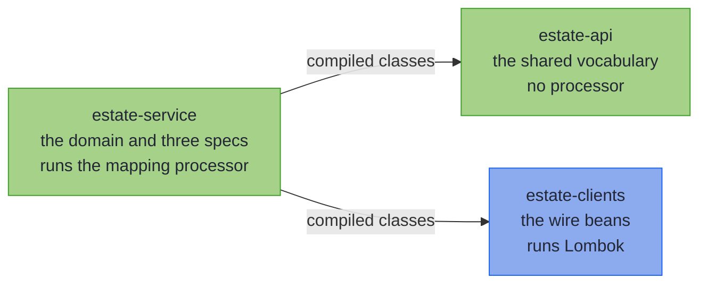

# Capstone: An Estate in Three Modules

_One boundary split across three modules: a shared vocabulary, a partner's client jar, and a service with a PATCH._

~~~admonish info title="What You'll Learn"
- Split one boundary across three modules: a vocabulary with no processor, the client beans, and a service that holds the specs
- Map a Lombok `@Data` bean and a generator-shaped bean from another module's compiled classes
- Clear a field over PATCH with an `Optional` property, and see a nested object replaced whole
- Prove each customer mapping with its laws, in one call
~~~

~~~admonish example title="See Example Code"
**The code on this page is three Gradle modules, [estate-api](https://github.com/higher-kinded-j/higher-kinded-j/tree/main/hkj-examples/estate-api), [estate-clients](https://github.com/higher-kinded-j/higher-kinded-j/tree/main/hkj-examples/estate-clients) and [estate-service](https://github.com/higher-kinded-j/higher-kinded-j/tree/main/hkj-examples/estate-service), and their [EstateBoundaryTest.java](https://github.com/higher-kinded-j/higher-kinded-j/blob/main/hkj-examples/estate-service/src/test/java/org/higherkindedj/example/estate/service/EstateBoundaryTest.java)** - the page includes them directly, so the build compiles and tests all of it.
~~~

---

## The estate {#the-estate}

The [first capstone](capstone.md) built one boundary in one module. An estate of services spreads the same boundary across several. One team publishes an API module that the others depend on. Partner teams ship client jars, whose beans an OpenAPI generator or Lombok wrote. Each service maps between those beans and its own domain, and serves PATCH endpoints as well as reads.

This page builds that shape at the smallest size that shows it: three modules and one customer. Each spec is an interface annotated `@GenerateMapping`, which the processor implements, much as MapStruct implements a `@Mapper`.



In words: the service module depends on the other two, and it is the only one that runs the mapping processor.

---

## The API module: a vocabulary, and no processor {#the-api-module}

The API module, which many estates call `common`, owns what every service shares: the `EmailAddress` value type, and the vocabulary that maps it. A [vocabulary](codecs.md#shared-vocabulary-mix-in-interfaces) is a plain interface, not a spec, so nothing in this module is generated. Its build needs the library and no annotation processor:

```kotlin
plugins {
    `java-library` // for api(...)
}

dependencies {
    api(project(":hkj-core")) // the library, and no annotation processor
}
```

These builds use this repository's project paths, and [In your own build](#in-your-own-build) gives yours.

```java
public interface ContactVocabulary {
  @MapField(to = "fullName")
  String name();

  default ValidatedPrism<String, EmailAddress> email() {
    return EmailCodecs.EMAIL;
  }
}


public final class EmailCodecs {
  public static final ValidatedPrism<String, EmailAddress> EMAIL =
      ValidatedPrism.of(
          raw ->
              raw.contains("@")
                  ? Validated.validNel(new EmailAddress(raw))
                  : Validated.invalidNel(FieldError.of("not an email address")),
          EmailAddress::value);

  private EmailCodecs() {}
}

```

Every client in the estate calls a customer's name `fullName`, and every email parses through one [leaf](basics.md#validated-leaves), so both live here once. The `@MapField` rename is kept in the compiled class, which is what lets a spec in another module read it.

---

## The clients module: beans as a partner ships them {#the-clients-module}

The clients module stands in for a partner's client jar, so its beans are written the way the tools write them. The customer resource has the shape a generator writes, with an `id` that arrives as a `String`:

```java
public class CustomerResource {
  private @Nullable String id;
  private @Nullable String fullName;
  private @Nullable String email;
  private @Nullable String nickname;
  private @Nullable AddressBean address;

  // ...a getter and a setter for each, value equality, as a generator writes them
```

The address is a Lombok `@Data` bean:

```java
@Data
public class AddressBean {
  private String street;
  private String city;
  private String postcode;
}

```

The PATCH request is a generator-shaped bean too, with every property `null` until a request sets it. Its nickname is the one hand-shaped property: an `Optional`, so that a client can clear it. openapi-generator's `java` client model maps too, but reads a sent `null` as an omitted property, so clearing through it is [not supported yet](rules.md#jsonnullable-companions).

```java
public class CustomerPatch {
  private @Nullable String fullName;
  private @Nullable String email;
  private @Nullable Optional<String> nickname; // null: omitted; empty: "nickname": null
  private @Nullable AddressBean address;

  // ...a getter and a setter for each, as a generator writes them
```

Lombok runs in this module, and the mapping processor does not:

```kotlin
plugins {
    `java-library` // for api(...)
}

dependencies {
    compileOnly(libs.lombok) // org.projectlombok:lombok
    annotationProcessor(libs.lombok) // Lombok, and no mapping processor
    api(libs.jspecify) // org.jspecify:jspecify, for @Nullable
}
```

By the time the service module compiles, the address bean's getters and setters are ordinary compiled methods, as they would be in a partner's jar. The mapping processor reads them there as it reads any bean's, so the service module needs no Lombok. A Lombok bean in the same module as its spec maps too, as long as Lombok runs first: the [generated-client checklist](beans.md#generated-client-checklist) says how to order the two.

---

## The service module: the specs {#the-service-module}

The service module holds the domain and the specs. It is the one module that runs the mapping processor:

```kotlin
dependencies {
    implementation(project(":hkj-examples:estate-api"))
    implementation(project(":hkj-examples:estate-clients"))
    implementation(project(":hkj-core"))
    annotationProcessor(project(":hkj-processor")) // the mapping processor runs here, and only here
}
```

The domain is the order service's customer at the size a service keeps: an id, a nickname and an address beside the name and the checked email. Like the first capstone's larger `Order`, it lives in modules of its own.

```java
public record Customer(
    UUID id, String name, EmailAddress email, Optional<String> nickname, Address address) {}

public record Address(String street, String city, String postcode) {}
```

Three specs map it. `AddressMapping` maps the address to the Lombok bean component by component, with nothing to declare. The customer resource and its PATCH each extend the API module's vocabulary, and the resource adds a leaf for its UUID:

```java
@GenerateMapping
public interface AddressMapping extends MappingSpec<Address, AddressBean> {}

@GenerateMapping
public interface CustomerResourceMapping
    extends ContactVocabulary, MappingSpec<Customer, CustomerResource> {
  default ValidatedPrism<String, UUID> id() {
    return StandardCodecs.uuid();
  }
}

@GenerateMapping
public interface CustomerPatchMapping
    extends ContactVocabulary, UpdateSpec<Customer, CustomerPatch> {}
```

No spec names a module. Both customer specs nest the address through `AddressMapping`, the only spec for that pair, as [Nesting a spec](structure.md#nesting-containers-and-recursion) describes. The domain's `Optional` nickname maps to the resource's nullable `String` with nothing declared: `build` writes `null` for an empty nickname, and `parse` reads a `null` as empty.

---

## What the build proves {#what-the-build-proves}

The processor writes an `Impl` for each spec. The test binds them once, keeps one stored customer, Ada, and binds a PATCH body with Jackson as a controller would:

```java
  // The generated Impls, bound once for the class.
  private static final CustomerResourceMappingImpl RESOURCE = CustomerResourceMappingImpl.INSTANCE;
  private static final CustomerPatchMappingImpl PATCH = CustomerPatchMappingImpl.INSTANCE;

  private static final JsonMapper JSON = JsonMapper.builder().build();

  private static final Customer ADA =
      new Customer(
          UUID.fromString("123e4567-e89b-12d3-a456-426614174000"),
          "Ada Lovelace",
          new EmailAddress("ada@example.org"),
          Optional.of("Countess"),
          new Address("1 High Street", "Leeds", "LS1 4AP"));

  /** Binds a PATCH body as a controller would, then applies it to Ada as she is stored. */
  private static Validated<NonEmptyList<FieldError>, Customer> patch(String body) {
    return PATCH.updateFrom(JSON.readValue(body, CustomerPatch.class)).apply(ADA);
  }

```

The resource round-trips through all three modules:

```java
    CustomerResource wire = RESOURCE.build(ADA);

    assertThat(wire.getFullName()).isEqualTo("Ada Lovelace"); // the api module's rename
    assertThat(wire.getNickname()).isEqualTo("Countess"); // an empty Optional would be null
    assertThat(wire.getAddress().getCity()).isEqualTo("Leeds"); // Lombok's compiled accessors
    assertThatValidated(RESOURCE.parse(wire)).hasValue(ADA);
```

A resource with three bad fields reports all three, and the one inside the Lombok bean is located by its path:

```java
    CustomerResource wire = RESOURCE.build(ADA);
    wire.setId("NOPE");
    wire.setEmail("not-an-email");
    wire.getAddress().setCity(null);

    assertThatValidated(RESOURCE.parse(wire))
        .isInvalid()
        .hasFieldErrors(
            "id: not a UUID (expected e.g. 123e4567-e89b-12d3-a456-426614174000)",
            "email: not an email address", // the api module's leaf
            "address.city: must not be null"); // inside the Lombok bean
```

In a Spring service, these errors become the field list of [the 422 response](../spring/spring_boot_integration.md#the-422-leg).

Bound from real JSON, the PATCH keeps what a request leaves out, clears the nickname on an explicit `null`, and replaces the address whole:

```java
    assertThatValidated(patch("{}")).hasValue(ADA); // omitted: kept

    assertThatValidated(patch("{\"nickname\": null}")) // a JSON null: cleared
        .hasValue(new Customer(ADA.id(), ADA.name(), ADA.email(), Optional.empty(), ADA.address()));

    assertThatValidated(
            patch(
                "{\"address\": {\"street\": \"2 Park Row\", \"city\": \"York\","
                    + " \"postcode\": \"YO1 7HH\"}}")) // an address: replaced whole
        .hasValue(
            new Customer(
                ADA.id(),
                ADA.name(),
                ADA.email(),
                ADA.nickname(),
                new Address("2 Park Row", "York", "YO1 7HH")));
```

~~~admonish question title="Checkpoint: half an address" id="check-estate-partial"
A client wants to change only the street, and sends `{"address": {"street": "2 Park Row"}}`. What does the PATCH return?

1. Ada, with the new street, and her city and postcode kept
2. Ada, with an address of `2 Park Row` and no city or postcode
3. Invalid, with `address.city: must not be null` and `address.postcode: must not be null`
4. Ada, unchanged: the incomplete address is ignored
~~~

~~~admonish success title="Answer and why" collapsible=true id="check-estate-partial-answer"
**3.** A PATCH replaces a nested object whole rather than merging it, so the address parses through `AddressMapping` like any full address. Inside a sent object, a `null` no longer means *leave unchanged*: the city and postcode the client left out are `null`, and each is a located error.

```java
    assertThatValidated(patch("{\"address\": {\"street\": \"2 Park Row\"}}"))
        .isInvalid()
        .hasFieldErrors("address.city: must not be null", "address.postcode: must not be null");
```

A client that means to change the street sends the whole address.

Where this lives: [What each JSON state does](beans_patch.md#what-each-json-state-does).
~~~

Each customer mapping obeys its [laws](tiers.md#law-checked-in-the-repo-and-in-your-tests), in one call. A built resource parses back to the same customer, and a bad one is refused. An empty PATCH changes nothing, and applying one twice is the same as applying it once. The address mapping runs inside the resource's round trip:

```java
    CustomerResource good = RESOURCE.build(ADA);
    CustomerResource bad = RESOURCE.build(ADA);
    bad.setEmail("nope");
    MappingLaws.assertMappingLaws(RESOURCE.asValidatedPrism(), good, bad);

    CustomerPatch rename = new CustomerPatch();
    rename.setFullName("Augusta Ada King");
    CustomerPatch badEmail = new CustomerPatch();
    badEmail.setEmail("nope");
    MappingLaws.assertMappingLaws(PATCH::updateFrom, ADA, new CustomerPatch(), rename, badEmail);
```

---

## In your own build {#in-your-own-build}

This page wires the processor directly, as the repository's own build does. In your estate, apply the hkj Gradle plugin to each service module that declares specs, as [the plugin page](../tooling/gradle_plugin.md#with-the-plugin) says. The API module and the client jars take the library as an ordinary dependency, or nothing at all. [Multi-module builds](../tooling/manual_setup.md#multi-module-builds) covers the rest.

---

~~~admonish info title="Key Takeaways"
* **A vocabulary module needs no processor**: a vocabulary is a plain interface, and its rename and leaves reach a spec in another module through its compiled classes
* **A client jar's beans map like any bean**: the processor reads a Lombok or generated bean's accessors from the compiled class
* **An `Optional` property clears over PATCH**: an explicit JSON `null` binds an empty `Optional`, and omitting the field keeps the value
* **A PATCH replaces a nested object whole**: a sent address must be complete
* **The laws cover the estate too**: one call for each customer mapping
~~~

~~~admonish tip title="See Also"
- [Capstone: One 422, Every Bad Field](capstone.md): The same machinery in one module
- [Shared vocabulary: mix-in interfaces](codecs.md#shared-vocabulary-mix-in-interfaces): Vocabularies, and how they cross a module boundary
- [Bean-Shaped Wires](beans.md): Setter, builder and Lombok beans
- [Sparse PATCH](beans_patch.md): What an omitted field, an explicit `null` and a value each do
- [Sparse PATCH at the Spring boundary](../spring/spring_boot_integration.md#sparse-patch): The PATCH endpoint in a Spring service
- [Multi-module builds](../tooling/manual_setup.md#multi-module-builds): Which module needs the processor
- [Mapper at a Glance](at_a_glance.md): Twelve questions about your own estate
~~~

---

**Previous:** [Injecting, Testing, and Diagnostics](testing.md)
**Next:** [Mapper at a Glance](at_a_glance.md)
