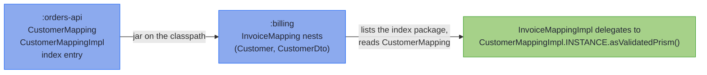

# Mapping Rules and Limits

_The precise contracts behind the mapping chapter, and every limit the processor enforces._

Each rule the processor enforces is stated on this page once, bar a few short enough to stay on the page that teaches them, and Find your limit indexes both. A rule the processor cannot check stays on its teaching page as a warning, where your attention is the only safeguard: [Find your symptom](#find-your-symptom) indexes those. Holding a compiler message instead? [Compiler Messages](compiler_errors.md) covers the common ones.

## Find your limit {#find-your-limit}

Each question links to its rule. *By design* means the behaviour or the refusal is deliberate, and the rule says why. *Not supported yet* means a shape that would make sense, which the processor does not map.

| Question | Answer | Status |
|---|---|---|
| **Spec members** | | |
| [What if a leaf's name matches no component?](#how-the-two-default-families-are-told-apart) | A declared leaf is a compile error, naming the components; an inherited one stays inert. | by design |
| [Can a getter-shaped helper live on a spec?](#how-the-two-default-families-are-told-apart) | Yes, if `private`, `static` or given a parameter; a `default` one is a derived field. | by design |
| [Can a sealed spec declare its own leaves, renames or markers?](#how-the-two-default-families-are-told-apart) | No: a dispatch has no components to bind them to. | by design |
| [Can a field be renamed and converted at once?](basics.md#renamed-and-converted) | Yes: `@MapField` goes on its leaf, the one method named after it. | by design |
| [Can a projection carry a derived field?](#derived-fields-and-the-emission-tiers) | No: `build` recomputes what the write-back would set. | by design |
| [Can a mapped type be one the spec's package cannot see?](#visible-from-the-spec-package) | No: the Impl is generated in that package and names it. | by design |
| [Can a spec or a mix-in hold its Impl in a constant?](#impl-constant-on-a-spec) | Not safely: it can read `null`, so the processor warns; `@SuppressWarnings("impl-constant")` quiets a deliberate one. | by design |
| **Optional fields** | | |
| [Can a bridged component be declared non-null, or primitive?](#bridged-component-nullable) | No: `build` writes `null` for empty, so declare it `@Nullable`. | by design |
| [Can a sparse or sealed spec declare `@OptionalBridge`?](#bridged-component-nullable) | No; one inherited from a mix-in stays inert. | by design |
| [Can a bean spec declare `@OptionalBridge`?](#optional-bridge-on-a-bean-wire) | Yes, but it changes nothing: the processor answers with a note. | by design |
| [Can a bridged value go through a leaf or a spec?](#what-converts-a-bridged-value) | Yes: whatever converts it unbridged, over the inner types. | by design |
| **Shared vocabulary** | | |
| [Does a mix-in need the annotation processor?](codecs.md#shared-vocabulary-mix-in-interfaces) | No: a mix-in is a plain interface, not a spec. | by design |
| [Can a mix-in extend `MappingSpec`?](#refused-mix-in-shapes) | No: a mix-in shares vocabulary; a spec generates an Impl. | by design |
| [Can a generic mix-in be extended raw?](#a-generic-mix-in-reached-raw) | Not if it contributes a member: raw erases what it declares. | by design |
| [Can two mix-ins declare the same rename?](#inheriting-one-member-twice) | Yes, when the targets agree; conflicting targets are refused. | by design |
| [Can an `@Unmapped` marker name an accessor that pairs?](#what-unmapped-withholds) | Not one the spec declares; an inherited one stays inert. | by design |
| [Can an `@Unmapped` marker go on a bean crossed one way?](#what-unmapped-withholds) | Not one the spec declares: such a bean leaves no accessor unpaired. | by design |
| [Can a `@ReadOnly` marker name a getter the bean writes, or no getter?](#what-readonly-reads) | Not one the spec declares; an inherited one stays inert. | by design |
| **Containers** | | |
| [Is a same-typed container shared with the wire?](#same-typed-containers-cross-as-copies) | Not when declared exactly `List`, `Set`, `Collection`, `Map`, `Optional` or array. | by design |
| [Does a `List` lift against a `Set`, or an `ArrayList`?](#what-lifts) | No: the same exact container on both sides, one level deep. | by design |
| [Can a lifted array hold `T` or `List<Tag>`?](#what-lifts) | No: the generated array creation would be generic. | by design |
| [Can a raw or wildcard `Map` have its keys or values converted?](#what-lifts) | No: name its type arguments. | by design |
| [Can a `Map`'s keys be converted?](structure.md#converting-map-keys) | Yes, with a `@MapKey` leaf; otherwise the key types must match. | by design |
| [Can a key leaf sit beside a whole-map leaf?](#key-leaf-beside-a-whole-map-leaf) | A declared one is refused; an inherited one stays inert. | by design |
| [Can a key leaf carry a `@MapField` rename?](structure.md#converting-map-keys) | Only one named after the component it keys. | by design |
| [Is a `null` inside a `Stream`, `Iterable`, `Maybe` or `NonEmptyList` located?](#the-null-contract-precisely) | No: the component is guarded, its contents are not scanned. | not supported yet |
| [Can a sealed pair's subtype be an enum, or generic?](structure.md#sealed-hierarchies) | No: records and sealed interfaces, or beans on the wire side. | not supported yet |
| **Flattening** | | |
| [Can two components of one record type both be spread?](#names-in-a-flattened-group) | No: every wire component takes exactly one source. | by design |
| [Can a flattened group spread a record inside it?](#where-flattening-applies) | No: spreading is one level deep, and the inner record nests. | not supported yet |
| [Can a flattened component sit on a bean, generic, projection or PATCH spec?](#where-flattening-applies) | No: record-to-record only; an inherited marker stays inert where unused. | not supported yet |
| [Can a flattened record have more than 16 components?](#where-flattening-applies) | No: one `fields()` ladder assembles the group. | not supported yet |
| **Across modules** | | |
| [Does a spec compiled in another module nest?](structure.md#across-modules) | Yes, when that module ran `hkj-processor`. | by design |
| [What if two dependencies map the same pair?](#how-a-dependencys-specs-are-found) | Ambiguous: your own spec, or a leaf, picks one. | by design |
| [Can a spec-carrying module sit on the module path?](#how-a-dependencys-specs-are-found) | Not with the index: keep those jars on the classpath, or delegate with a leaf. | not supported yet |
| **Emission tiers** | | |
| [Why does a bean mapping, or an `@OptionalBridge` component, lose `asIso()`?](#where-a-bean-or-bridged-component-lands) | A reference property can be unset, and a bridged value can be absent. An all-primitive bean keeps it. | by design |
| [Why does a validating projection get no `asLens()`?](tiers.md#leaf-carrying-projections-the-validated-patch) | A lens cannot fail, so it takes the validated `patch`. | by design |
| [How wide can a record be?](testing.md#diagnostics-and-limits) | No ceiling but the JVM's: about 254 components. | by design |
| **Bean wires** | | |
| [Can the domain be a bean?](#how-a-bean-is-read-and-written) | No: `parse` builds the domain through a record constructor. | by design |
| [What happens to an accessor with no partner?](#unpaired-accessors) | Left out; refused when named after a component the bean carries under no name. | by design |
| [Is a getter-only `List` declared nullable filled through its getter?](#how-a-bean-is-read-and-written) | Only when the getter answers a list: otherwise `build` leaves it unwritten. | by design |
| [Can a getter-only `List` be raw, or a wildcard?](#getter-only-list-element-type) | Not where `build` is emitted: `addAll` needs its element type. | not supported yet |
| [Can a getter-only `List` carry an absent `Optional`?](#getter-only-list-refuses-the-bridge) | No: its getter creates the list, so absence reads as empty. | not supported yet |
| [Can a two-way bean map a property that has only a getter?](#what-readonly-reads) | Yes, marked `@ReadOnly`: `parse` reads it and `build` leaves it out, so the Impl has no `asValidatedPrism()`. | by design |
| [Where does a mapping with a read-only property nest?](#nesting-two-halves) | Anywhere but a site needing a whole prism: a mapping that builds and parses takes two halves too, and a one-way site uses its half. Not in a projection, a generic mapping or an `of(...)`. | by design |
| [Can sealed dispatch reach a subtype whose spec has two halves?](#nesting-two-halves) | Yes: the dispatch takes two halves too. | by design |
| [Can a generic mapping nest a spec with two halves?](#nesting-two-halves) | No: it refuses one where it builds and parses. | not supported yet |
| [Can a projection, or an `UpdateSpec`, read a property read-only?](#what-readonly-reads) | No: a projection has no `parse`, and an `UpdateSpec` builds nothing. | by design |
| [Can a Lombok builder use `@Singular` on a collection?](#singular-collections) | Yes: `build` writes the collection whole and leaves its adder alone; a build-only adder it cannot tell apart is refused. | by design |
| [Can a `@Singular` collection carry an absent `Optional`?](#singular-collections) | No: its builder builds an empty collection, so it is never absent. | not supported yet |
| [Does an openapi-generator model with `JsonNullable` companions map?](#jsonnullable-companions) | Yes: each `getX_JsonNullable()` pair is left out, and `getX()` and `setX(...)` carry the property. | by design |
| [Can a PATCH through such a client model clear a field?](#jsonnullable-companions) | No: its plain getter reads a sent `null` as an omitted field. | not supported yet |
| [Does a protobuf-java message map?](#how-a-message-is-read) | Yes, both ways, by its fields: protoc's other accessors, such as `getXBytes()`, stay out. | by design |
| [Can an `Optional` map a message field with no `hasX()`?](#protobuf-field-without-presence) | No: unset, the field reads its default, so an empty `Optional` would read back as present. | by design |
| [Can a oneof member map to a plain component?](#protobuf-oneof-members) | No: `build` would keep only the last member it wrote, so map the oneof to a sealed type, or each member to an `Optional`. | by design |
| [Can a oneof map to a sealed domain type?](#protobuf-oneof-members) | Yes: a record named after each member, filled through a spec or its one component. | by design |
| [Can a oneof's variant convert its member through a leaf?](#protobuf-oneof-members) | No: a scalar member fills the variant's one component as it is, so check it in the variant's constructor. | not supported yet |
| [Can a oneof's sealed type, or a variant, be generic?](#protobuf-oneof-members) | No: declare them without type parameters. | not supported yet |
| [Can a `@MapField` rename point a component at a oneof?](#protobuf-oneof-members) | No: name the component after the oneof. | not supported yet |
| [Where does a one-directional bean nest?](#how-a-beans-direction-is-read) | Only where nothing needs its missing direction. | by design |
| **Sparse PATCH** | | |
| [Can one spec extend `MappingSpec` and `UpdateSpec`?](#one-tier-per-spec) | No: declare a spec per tier and share a mix-in. | by design |
| [Can a PATCH property be primitive?](#no-primitive-patch-property) | No: a primitive is never absent, so use the wrapper. | by design |
| [Can a PATCH wire be a record?](#no-record-patch-wire) | No: a record component is always present. | by design |
| [Can a PATCH bean be only read, or only written?](#patch-bean-read-and-written) | No: a PATCH bean is both read and written. | by design |
| [Can a PATCH bean have a setter with no getter?](#every-patch-setter-has-a-getter) | No, unless marked `@Unmapped`: the update would ignore it. | by design |
| [Can a PATCH set a field to empty?](#no-optional-bridge-on-a-patch) | Through an `Optional`-typed or `JsonNullable` property; a plain one bridged to `Optional` cannot. | by design |
| [Can a PATCH bean have a getter-only `List`?](#no-getter-only-list-on-a-patch) | No: it never reads `null`, so it cannot be absent. | not supported yet |
| [Can a PATCH bean's builder write a Lombok `@Singular` collection?](#singular-collections) | No: it never reads `null`, so it cannot be absent. | not supported yet |
| [Can a PATCH bean carry a `JsonNullable` property?](#no-jsonnullable-patch-property) | Yes: an omitted field keeps its value, and a sent `null` clears an `Optional`. | by design |
| [Can a `JsonNullable` PATCH property be raw, or a wildcard?](#no-jsonnullable-patch-property) | A `? extends` wildcard reads as its bound. A raw holder, `?` or `? super` is refused: declare the type it holds. | by design |
| [Can a PATCH body be a protobuf-java message?](#protobuf-fieldmask-update) | Yes: `updateFrom` takes the message and its `FieldMask`, and edits the fields the mask names. | by design |
| [Can a `FieldMask` path reach into a nested message?](#protobuf-fieldmask-update) | No: the path fails, so name the whole field, which replaces the nested value. | not supported yet |
| [Can a message's `UpdateSpec` leave a field without a domain component?](#protobuf-fieldmask-update) | No, since a mask may name any field, unless a derived field it shares with a `MappingSpec` fills it. | by design |
| [Does a nested spec lift through a PATCH bean's container?](#patch-containers) | No: give the component an element leaf that delegates to it. A `JsonNullable` property's value and a `FieldMask` update lift it, as `parse` does. | not supported yet |
| [Can a PATCH spec dispatch over a sealed hierarchy?](#no-sealed-patch) | No: an absent property cannot choose a subtype. | by design |
| [Does a PATCH merge a nested object field by field?](#patch-replaces-wholesale) | No: a nested record, list or map is replaced whole. | by design |
| **Generic specs** | | |
| [Can a bean or PATCH mapping use a generic type?](#generic-boundaries) | No, not even at a concrete instantiation: generic mappings are record-to-record. | not supported yet |
| [Can a leaf, rename or marker declare its own type parameters?](#generic-boundaries) | No: the element types go on the spec's parameters. | by design |
| [Can a generic sealed hierarchy be mapped?](#generic-boundaries) | No, not even at a concrete instantiation: model it as a record. | not supported yet |
| [What supplies an element-mapped spec's prisms where it nests?](#element-mapped-nesting) | A leaf on the using spec, or another registered mapping. | by design |
| **Merge and error envelopes** | | |
| [Can a merge rename a component, or choose its source?](#how-a-merge-fills) | No: a target name must match exactly one source component. | not supported yet |
| [Can a merge fill a component through a spec's `build`?](#how-a-merge-fills) | No: a merge runs a spec's `parse` only. | not supported yet |
| [Can an error envelope hierarchy be generic?](#error-envelope-rules) | No: the hierarchy, its variants and the context are non-generic. | by design |

## Find your symptom {#find-your-symptom}

Nothing refuses these at compile time, and only the first draws a warning. Each is a runtime surprise, linked to the section that explains it.

| What you see | Why, and the fix |
|---|---|
| [`MAPPER.parse` throws a `NullPointerException`, sometimes](#impl-constant-on-a-spec) | A constant on the spec can read `null`, as the processor's warning at it says: bind the Impl in the caller. |
| [An Impl's first use throws `ExceptionInInitializerError`, and every use after it `NoClassDefFoundError`](basics.md#bind-in-the-caller) | A constant on the spec holds a surface of the Impl, which draws no warning: bind the Impl in the caller. |
| [The first `parse` or `build` throws a `StackOverflowError`](codecs.md#standard-codecs) | A leaf named like its factory calls itself: write `StandardCodecs.currency()`, qualified. |
| [A browser's timestamps are rejected some of the time, or Python's every time](codecs.md#canonical-forms-only) | The stock date-time codecs accept only their own render: declare the producer's canon. |
| [A bad date or enum got Jackson's 400, with no field path](basics.md#validated-leaves) | Jackson rejected a typed wire field before `parse` ran: keep a converted wire field a `String`. |
| [A sealed request body got a 500, with no field path](structure.md#sealed-hierarchies) | Jackson cannot pick a subtype without type information: annotate the wire interface with `@JsonTypeInfo`. |
| [A request missing a field parsed as the empty subtype](structure.md#sealed-hierarchies) | `DEDUCTION` binds `{}` as the subtype with no properties: name subtypes with `Id.NAME` where that must fail. |
| [A field the client left out reports `must not be null`](absence.md#optional-bridge) | Only `@OptionalBridge` lets a field be left out; a whole-`Optional` leaf still rejects `null`. |
| [A PATCH that omits a field overwrote the stored value](beans_patch.md#patch-getters-answer-null) | A default the bean gives itself reads as sent: leave PATCH bean fields uninitialised, or `undefined()` in a `JsonNullable`. |
| [A leaf's codec never changes after the first call, or misreads under load](codecs.md#your-own-canon) | The Impl reads each leaf once and shares its answer: choose inside the codec's parse, and build over thread-safe parts. |
| [An explicit JSON `null` cleared an `Optional` or `JsonNullable` PATCH property](beans_patch.md#what-each-json-state-does) | Both tell a sent `null` from an omitted field, and a sent `null` means *clear* there: omit the field to leave it unchanged. |
| [An explicit JSON `null` left a `JsonNullable` PATCH property unchanged](beans_patch.md#what-each-json-state-does) | Jackson ran without its `JsonNullable` module and handed the setter `null`: register `JsonNullableJackson3Module`. |
| [A built openapi-generator model sends `"x": null`, or fails a law check from wire samples](beans.md#bean-shaped-wire-targets) | Its `setX(null)` stores a sent `null`, where a fresh model leaves `x` out: set each nullable property in a parsing sample. |
| [`build` throws on an empty `Optional`](beans.md#bean-shaped-wire-targets) | A setter, builder or record constructor rejects `null` without declaring it: drop the `Optional`, or encode absence in a leaf. |
| [`build` throws `Can't get the number of an unknown enum value.`](beans.md#protobuf-java-messages) | A generated enum kept in the domain parsed a number the build does not know as `UNRECOGNIZED`: convert it through a leaf that refuses it. |
| [A message built from a domain value lost one of its oneof members](beans.md#protobuf-java-messages) | The domain value held two members of one oneof as `Optional`s, and setting one clears the other: map the oneof to a sealed type. |
| [A `FieldMask` update changed nothing](beans.md#a-patch-through-its-fieldmask) | Its mask was empty: a request that omits its mask asks for every field its message sets, a mask you build before the call. |
| [Adding to a built wire's list throws `UnsupportedOperationException`](structure.md#nesting-containers-and-recursion) | A same-typed container crosses as an unmodifiable copy: set a new list, or copy it first. |
| [A record with an array is not equal to its own round trip](structure.md#other-containers) | The array crosses as a clone and compares by reference: give the record an `equals` that uses `Arrays.equals`. |
| [Two swapped prisms passed to `of(...)` compiled](generics.md#element-mapped-specs) | Two abstract leaves of one type swap silently: pass them in declaration order. |
| [A `Set` lost an element, or a `Map` entry was refused as a duplicate](structure.md#converting-map-keys) | A leaf maps two wire values to one: `ValidatedPrismLaws` catches it. |
| [An error path reads as deeper nesting than it is](structure.md#other-containers) | A key or set element contains a dot: `FieldError.path()` keeps it as one segment. |
| [`asIso().reverseGet` or `asLens().set` let a `null` into the domain, or threw, on a request body](tiers.md#a-bound-request-goes-to-parse) | Neither has a guard: send a freshly bound wire to `parse` or `patch`, and check it yourself before a lens's `set`. |
| [A constructor bug reached the client as a message](absence.md#constructor-invariants) | Any `RuntimeException` counts: keep the constructor to checks on its arguments. |
| [A timestamp came back with fewer fractional digits](codecs.md#canonical-forms-only) | The formatter pattern fixes the precision, so `build` truncates finer values. |
| [A generated error companion throws `ExceptionInInitializerError`, then `NoClassDefFoundError`](merge_envelopes.md#generating-error-envelopes-generateerrorenvelope) | Its all-absent context is built on first use, and the context record's constructor rejects `null`: let every component accept `null`. |
| [A merged record holds a `null`, or its constructor threw](merge_envelopes.md#merging-several-sources-generatemerge) | A merge with a plain return checks nothing: give a component a leaf that can fail, so the merge returns `Validated` and checks what it reads. |

---

## Nulls {#nulls}

### The null contract, precisely {#the-null-contract-precisely}

The null guard covers every reference-typed `parse` read that is not [bridged](absence.md#optional-bridge), on record and bean wires alike, and reaches inside containers, identity-copied ones included, at every depth:

- A `null` element or map value locates the way its container locates anything ([lifting grammar](structure.md#other-containers)): by index in a `List` or array (`emails.1: must not be null`), by key in a `Map`, whether the container lifts through a leaf ([the bulk forms](../optics/validated_prism.md#the-bulk-forms-parseall-and-parsevalues)) or copies by identity. The index is a plain positional segment, matching the map-key grammar.
- A `null` element of a `Set` has no rendering to locate by, and a set holds at most one, so it reports unlocated under the component: `emails: must not contain a null element`, which is distinct from `must not be null`, the message that says the set itself is absent.
- An array of primitives (`int[]`) carries no element scan: a primitive element cannot be null. The component is still a reference, so a `null` *array* is guarded like any other read.
- An identity container is scanned at every level its type names, so a `null` deep inside carries its full path: `grid.0.1` in a `List<List<String>>`, `byKey.k.1` in a `Map<String, List<String>>`, `matrix.0.1` in a `String[][]`. An `Optional` cannot hold a `null`, but one holding a container is scanned through, and locates at the component itself, since it holds only the one value (`nicknames.1`).
- How the container is declared does not matter. Any `Collection` counts, and any `Map`: a subtype (`ArrayList`, `LinkedHashMap`, `EnumMap`), a supertype (`Collection`), a raw type, one with a wildcard argument, or a type variable bounded by one. A collection that is a `Set` when it is parsed follows the set rule above; any other locates by position, in iteration order.
- A failure inside a set's element locates under that element's rendering, as a set element that fails its leaf does: `tagged.[b, null].1` for a `Set<List<String>>`. The rendering is the element's `toString()`, so an element containing a dot reads as deeper nesting in `pathString()`, while `FieldError.path()` keeps it as one segment.
- A container class that fixes its own element type, such as a tree node declared `class Node extends ArrayList<Node>`, can hold itself at any depth. It is scanned one level into itself: where the class recurs, its elements are checked for `null` but not scanned inside.
- Only these containers are looked inside. An `Iterable` or `Stream` component, and the library's own `Maybe` and `NonEmptyList`, are guarded against `null` themselves, but nothing inside them is scanned yet.
- The values a [`@MapKey`](structure.md#converting-map-keys) map copies are scanned the same way, located under their source key.
- The scan only locates nulls. What `parse` hands the domain is a [copy](#same-typed-containers-cross-as-copies), made before the scan runs, so the scan reads exactly what the wire held.
- A `null` container *component* is guarded like any reference read (`emails: must not be null`).
- A [bridged](absence.md#optional-bridge) container excuses only the absent case: `null` reads as empty, and a *present* container is scanned exactly as an unbridged one is.

What stays the caller's error (`NullPointerException`), by contract: a `null` *wire* itself, a `null` map *key* (a structurally broken map, not a wrong value), and calling the bulk forms directly with a `null` list or map. A key is never scanned inside, even when it is a container.

Absence-as-a-meaning is deliberate everywhere it appears. A record component cannot express it by itself (it can only be wrong), so it takes either the [sparse `UpdateSpec` tier](beans_patch.md#sparse-patch-write-back-updatespec), where every `null` means *leave unchanged*, or an [`@OptionalBridge`](absence.md#optional-bridge) component, where one named field's `null` means *absent*. Neither is inferred; both are declarations.

---

## Spec members {#spec-members}

### How the two `default` families are told apart {#how-the-two-default-families-are-told-apart}

Leaves are named after *domain* components and return `ValidatedPrism`; derived fields are named after *wire-only* components and return `Getter`. The processor matches the two differently:

- A zero-parameter `default` returning `Getter` is *always* claimed as a derived field, and validated as one. So give getter-shaped utility helpers a parameter or a different return type, or they will be mistaken for derived fields.
- A `default` returning `ValidatedPrism` is matched by name against the domain's components (and against the members of any [flattened](structure.md#flattening-a-nested-component-onto-a-flat-wire) group), and a *locally declared* leaf **must** match: an unmatched local leaf is a compile error with a nearest-name hint (`leaf 'emial' names no component of Customer. Did you mean 'email()'?`), because a silently inert leaf would silently stop validating that field. Prism-returning helpers belong in `private` or `static` methods, which are never leaf-shaped.
- *Inherited* [mix-in](codecs.md#shared-vocabulary-mix-in-interfaces) members that match nothing stay inert by design: a shared vocabulary may carry leaves for components only some extending specs have, and likewise derived fields and renames for wire components only some of their wires carry.
- On a **sealed** mapping, locally declared leaves, derived fields and renames are rejected outright, since a dispatch has no components. So are an `@OptionalBridge` marker, a `@MapKey` key leaf, and an `@Unmapped` or `@ReadOnly` marker. Inherited vocabulary stays inert there too, bar a `@Flatten` marker, which is refused either way.

Four shapes are rejected, each with a what/why/fix diagnostic: a *locally declared* `Getter` named after a *domain* component (ambiguous with a leaf); a *locally declared* `Getter` naming nothing on the wire; a `Getter` with the wrong type arguments; and a `@MapField` rename targeting a component a derived field already fills. The first two are the typo guard, so an inherited `Getter` in either position stays inert instead; the last two catch a member that does bind, and fire wherever it was declared.

### Derived fields and the emission tiers {#derived-fields-and-the-emission-tiers}

A spec with any derived field never emits `asIso()`: the wire round trip recomputes the derived component, so it is an identity only for wire values that were already consistent. A mapping whose *only* extra is a derived field is *total-parse*: no **well-formed** wire value can fail it (the null guards above still apply, a domain constructor's [invariant](absence.md#constructor-invariants) can still refuse a value, and a fallible leaf elsewhere in the spec still makes the whole parse fallible). Combining a derived field with a projection (a wire otherwise smaller than the domain) is rejected, because the projection's `asLens()` write-back could never honour a component that `build` recomputes. [What Your Spec Generates](tiers.md) is the full story.

### Every type a mapping crosses is visible from the spec's package {#visible-from-the-spec-package}

**The processor refuses a type the spec's package cannot see wherever the mapping crosses it.** It generates the Impl as a top-level class in the spec's package, and the Impl names every type the mapping crosses, so each one has to be visible from there. That covers the spec and the bounds of its type parameters, its domain and wire types with their type arguments, a sealed pair's subtypes, and each component the wire carries, on both sides. It covers a bean wire's builder, a rename's, leaf's or marker's type, and a merge's target, sources and the components it fills. Where the reads are null-checked, it also covers the element types a container component's own class declares, as `Sku` in `class Grid extends ArrayList<List<Sku>>`. A type fails when it, or a class enclosing it, is `private`, or when it comes from another package and it, or a class enclosing it, is not `public`. The refusal names where the mapping meets the type, `record component 'sku' of 'Item' names 'Sku', which cannot be reached from 'com.example'`, and its fix names the class to change. Every such type is reported in the one compilation.

A domain component the wire does not carry needs no visibility. A projection or a PATCH carries it over from the domain untouched, and the Impl never names its type.

### A spec never holds its Impl in a constant {#impl-constant-on-a-spec}

**The processor warns at a constant, on a spec or on a mix-in compiled with it, whose type is that spec's generated Impl.** That is MapStruct's habit, `CustomerMappingImpl MAPPER = CustomerMappingImpl.INSTANCE;`, and such a constant can read `null`. A `@GenerateMerge` spec's Impl is looked for the same way. The Impl implements the spec. Initialising a class first initialises every interface it implements that declares an instance method with a body: every `default` leaf and derived field, and any `private` instance helper. Using `CustomerMappingImpl.INSTANCE` first starts the Impl's initialisation, which initialises `CustomerMapping` before `INSTANCE` is assigned. `MAPPER` is evaluated then, and keeps the `null` it read for good. Two threads making those first uses at the same moment can deadlock instead. A constant on a [mix-in](codecs.md#shared-vocabulary-mix-in-interfaces) fails the same way. Keep the Impl in the calling code, as [Bind in the caller](basics.md#bind-in-the-caller) shows.

- **It warns whether or not the interface declares such a method**, since the first leaf added arms the trap.
- **It is a warning, not a refusal.** The Impl is still generated, and only a `-Werror` build fails on it.
- **`@SuppressWarnings("impl-constant")` keeps a deliberate constant quiet**, on the constant or on a declaration enclosing it. The chapter's checkpoints use it to show the trap. `@SuppressWarnings("all")` does not, since it is the compiler's own switch.
- **Only the constant's type is read, never its initialiser**, so a constant typed as the spec, or as a surface of the Impl, draws no warning. [Bind in the caller](basics.md#bind-in-the-caller) warns of the surface.
- **Another spec's Impl draws nothing.** It is initialised on its own, so the constant reads it set, unless specs hold each other's Impls in a cycle, of two specs or more, which the processor does not trace.

---

## Optional fields and invariants {#optional-fields-and-invariants}

### A bridged component must take `null` {#bridged-component-nullable}

The bridged wire component is nullable by construction: `build` writes `null` into it for an absent value, so it must be declared to take one. A component declared non-null is refused: one carrying a non-null annotation such as `@NonNull`, `@Nonnull` or `@NotNull`, or one that carries no `@Nullable` inside a JSpecify `@NullMarked` package, class or module. Declare it `@Nullable String nickname`, so the wire record says what the mapping does with it. On an array the annotation goes before the brackets, `String @Nullable [] tags`, since `@Nullable String[]` makes the elements nullable and leaves the array non-null.

The same holds for every site `build` writes an empty `Optional` into: a record component, setter or builder setter declared non-null, by a non-null annotation or inside a JSpecify `@NullMarked` scope without `@Nullable`, is refused; one that refuses `null` without declaring it is not checked, and throws from `build`. A primitive wire component can never hold the `null`, so `@OptionalBridge` onto one is refused too.

Any annotation named `Nullable` or `CheckForNull` counts here, whichever library it comes from, and so does JSR-305's `@Nonnull(when = MAYBE)`: this rule refuses a build, so it reads more widely than the fixed list of names that decides which Focus paths are null-safe. A component typed by a type variable follows the variable's bounds: a plain `<T>` declared in a `@NullMarked` scope is non-null, as its bound `Object` is, and `<T extends @Nullable Object>` leaves the nullness to the type argument, so it bridges.

### What converts a bridged value {#what-converts-a-bridged-value}

**The value inside a bridged `Optional`, or each element of a bridged container, converts exactly as an unbridged one would.** It is copied when the types match, nested through a spec for the pair, or converted by a leaf over the inner types, and such an element leaf wins over the spec. A bridged `List`, `Set`, array or `Map` lifts element by element, a `null` element inside a present one reports as it would [unbridged](#the-null-contract-precisely), and a [`@MapKey`](structure.md#converting-map-keys) leaf converts a bridged `Map`'s keys. When nothing converts the inner pair, the processor refuses the component naming that pair, and offers a leaf over the inner types, or for a record pair a spec. It never offers a leaf over the whole `Optional` or container, though one declared anyway still works, as an override.

### `@OptionalBridge` on a bean wire is redundant {#optional-bridge-on-a-bean-wire}

**Declaring `@OptionalBridge` on a bean spec changes nothing, and the processor answers with a note, not an error.** A bean wire already bridges a domain `Optional` to its nullable property, so the mapping is generated exactly as it would be without the annotation. Remove it, or keep it on a [mix-in](codecs.md#shared-vocabulary-mix-in-interfaces) that a record-wire spec shares. A marker inherited from such a mix-in draws nothing. One declared on the bean spec itself draws this note:

<!-- verify:reports "@OptionalBridge on 'nickname' is redundant on a bean wire" -->
```java
import java.util.Optional;
import org.higherkindedj.optics.annotations.GenerateMapping;
import org.higherkindedj.optics.annotations.MappingSpec;
import org.higherkindedj.optics.annotations.OptionalBridge;

record Guest(String name, Optional<String> nickname) {}

class GuestBean {
  private String name;
  private String nickname;

  public String getName() { return name; }
  public void setName(String name) { this.name = name; }
  public String getNickname() { return nickname; }
  public void setNickname(String nickname) { this.nickname = nickname; }
}

@GenerateMapping
interface GuestMapping extends MappingSpec<Guest, GuestBean> {
  @OptionalBridge
  Optional<String> nickname();
}
```

The processor says:

```
@GenerateMapping: @OptionalBridge on 'nickname' is redundant on a bean wire. A bean wire
bridges a domain Optional to its nullable property automatically, because bean conventions
leave Optional off property types; the annotation opts a RECORD wire into the same
correspondence. Remove the annotation. If a record-wire spec needs it too, declare the
annotated method on a mix-in both specs extend; an inherited one draws no note.
```

### Which surfaces a constructor's refusal reaches {#constructor-refusal-surfaces}

**A constructor's refusal becomes an error wherever the surface can return one.** The [constructor guard](absence.md#constructor-invariants) covers every surface that builds the record whole from parsed parts:

| Surface | A refusal becomes | Why |
|---|---|---|
| `parse`, a [projection's `patch`](tiers.md#leaf-carrying-projections-the-validated-patch), a [flattened](structure.md#flattening-a-nested-component-onto-a-flat-wire) group, the fallible [`@GenerateMerge`](merge_envelopes.md), [`@GenerateAssembly`](../monads/validated_assembly.md#generating-the-companion-generateassembly)'s `assemble()` | a `FieldError`, unlabelled at the top level, or under the component holding a nested or flattened record | each returns `Validated` |
| `apply` and `applyPath` on the `Edits.Accumulated` a [sparse `updateFrom`](#sparse-construct-once) returns | an unlabelled `FieldError` | the record is constructed once, from the values the PATCH ends on |
| `asIso().reverseGet`, a projection's `asLens().set` | the exception, propagated | these total optics are meant for values already known to be lawful |
| a plain-return [`@GenerateMerge`](#nulls-and-guards-in-a-merge) | the exception, propagated | its return type has no error channel |
| the `Update` a sparse update's `toValidated()` hands back | the exception, propagated | an `Update` has no error channel |

A nested record the PATCH replaces whole parses through its own spec, guard included.

---

## Shared vocabulary {#shared-vocabulary-precisely}

### How a spec collects its vocabulary {#how-a-spec-collects-its-vocabulary}

**An inherited member binds exactly as if it were declared on the spec, and one that binds to nothing is inert instead of an error.** That holds for renames, leaves, derived fields, [`@OptionalBridge`](absence.md#optional-bridge) markers, [`@MapKey`](structure.md#converting-map-keys) key leaves, [`@Flatten`](structure.md#flattening-a-nested-component-onto-a-flat-wire) markers, [`@Unmapped`](beans.md#accessors-meant-to-stay-out) markers and [`@ReadOnly`](beans.md#read-only-properties) markers, collected across the whole hierarchy: a mix-in may extend further mix-ins, and a diamond counts once. Precedence is Java's own, so a member re-declared on the spec, or on a nearer mix-in, overrides the one it replaces.

- **A mix-in may be generic.** Its members are read under the spec's instantiation, so `Emails<T>` extended as `Emails<EmailAddress>` contributes `ValidatedPrism<String, EmailAddress>` ([Generic mix-ins](generics.md#generic-mix-ins)).
- **A threaded generic spec extends mix-ins** at its own type parameters, generic mix-ins included ([Generic Specs](generics.md)).
- **An `UpdateSpec` inherits vocabulary too**, element leaves included, so the leaf a full spec lifts over a `List` serves its PATCH sibling unchanged. Some members stay inert there even where they would bind: [Inherited vocabulary on a PATCH spec](#inherited-vocabulary-on-a-patch).
- **A [`@GenerateMerge`](merge_envelopes.md) spec declares everything directly**, since it extends no mix-in.

### What an inherited member binds against {#what-an-inherited-member-binds-against}

An inherited member that binds to nothing stays inert, so one vocabulary can serve specs whose domains and wires differ, while the same member declared on the spec is an error. Which side a member binds against decides what "nothing" means:

| Member | Binds against | Inherited, when it binds to nothing |
|---|---|---|
| leaf, `@OptionalBridge` marker | the **domain**, by the method's name | inert |
| `@MapKey` key leaf | the **domain**, by the name in the annotation | inert |
| derived field | the **wire**, by the method's name | inert |
| `@MapField` rename | **both**: its method names a domain component, its `to` a wire one | inert when either end is missing |
| `@Unmapped` marker | the **wire**, by the accessor it names | inert |
| `@ReadOnly` marker | the **wire**, by the getter it names | inert |
| `@Flatten` marker | the **domain**, by the method's name | inert; the one member also judged against the **wire**, so a sealed pair or an [`UpdateSpec`](beans_patch.md#sparse-patch-write-back-updatespec) can refuse it even where it binds |

So a projection or a PATCH bean that deliberately carries a subset extends the same vocabulary as the full spec, and simply maps fewer of its members; a sealed dispatch, which has no components at all, inherits the same vocabulary and binds none of it. Nothing is silently mismapped by an inert member, because every wire component still has to name a source: a wire that does carry a rename's target and has no other source for it is reported against that component. The cost is that a `to` typed wrongly *in the mix-in* is now caught only where some spec's wire happens to carry the intended name, which is the same trade the other inherited kinds already make.

A leaf carrying [`@MapField`](basics.md#renamed-and-converted) is both members at once, and an inherited one binds each half on its own terms. On a wire that calls the component by its own name, the rename is inert and the leaf still converts it.

### Mix-in shapes the processor refuses {#refused-mix-in-shapes}

Two mix-in shapes are rejected, each naming the offender:

- a mix-in that **is itself a mapping spec** (directly or transitively extends `MappingSpec`/`UpdateSpec`): a mix-in shares vocabulary, a spec generates an Impl, and inheriting one spec from another would conflate the two;
- a generic mix-in **reached raw**, which [A generic mix-in reached raw](#a-generic-mix-in-reached-raw) covers.

Diagnostics about an inherited member name its declaring interface, `abstract method 'bogus' (inherited from 'BrokenVocabulary') is neither a rename, a leaf, nor a bridge`, so the fix points at the right file. A package-private type a mix-in hands over from another package is refused the same way, since [every type a mapping crosses is visible from the spec's package](#visible-from-the-spec-package).

### A generic mix-in reached raw {#a-generic-mix-in-reached-raw}

A generic mix-in's members are read under the spec's instantiation, as [Generic mix-ins](generics.md#generic-mix-ins) shows with `Renames<T>`. The one shape this cannot answer for is a **raw** supertype anywhere on the route. Raw erases every member of the type below it, whatever that member declares, so `extends Renames` would contribute `Object name()` rather than the `String` it was written with. A raw ancestor that contributes nothing is left alone, since nothing of its is read. One that contributes a rename, a leaf, a derived field or a bridge marker is refused at the declaration, with [`mix-in 'Renames' is extended raw by the spec`](compiler_errors.md#extended-raw).

Erasure travels downwards, so the raw clause is not always the interface whose members went missing. With `Middle<T> extends Renames<T>` and a spec saying `extends Middle` raw, it is `Middle` that has to be given its argument, and the message says so: [`mix-in 'Renames' is reached through 'Middle', which the spec extends raw`](compiler_errors.md#reached-through-raw). The message names the raw clause in both cases, because that is the line to edit.

### Inheriting one member twice {#inheriting-one-member-twice}

Conflicting inherited `default` methods are already a javac error before the processor runs. The one case javac leaves open, unrelated mix-ins both declaring the same *abstract* rename (override-equivalent abstracts may coexist, JLS 9.4.1), folds into a single rename when the targets agree and is rejected with a diagnostic naming both interfaces when they conflict. Where the agreeing declarations differ covariantly (`String id()` beside `CharSequence id()`), the one generated stub returns the narrowest of them, which is the only one of the declared returns that satisfies the rest; a group with no narrowest (a raw return beside incomparable parameterised ones) is refused naming every declaration. Interface `static` helpers are not inherited (JLS 9.4.1), so factory methods on a mix-in stay inert.

### Inherited members on a sparse spec {#inherited-members-on-a-sparse-spec}

An inherited member the sparse tier cannot use is inert rather than refused, so one vocabulary serves a full spec and its PATCH sibling: [Inherited vocabulary on a PATCH spec](#inherited-vocabulary-on-a-patch) has the rule.

---

## Containers {#containers}

### Same-typed containers cross as copies {#same-typed-containers-cross-as-copies}

A component whose type is the same on both sides, with no leaf of its own, crosses the boundary as a copy when it is a `List`, `Set`, `Collection`, `Map`, `Optional` or array, in both directions. Changing a wire's list after `parse` leaves the domain alone, and changing a built wire's list after `build` does not reach back into the domain. The same holds for `asIso()`, `asLens()`, the validated `patch`, a sparse [`UpdateSpec`](beans_patch.md#sparse-patch-write-back-updatespec), a [bridged](absence.md#optional-bridge) component, the values a [`@MapKey`](structure.md#converting-map-keys) map carries, and a [`@GenerateMerge`](merge_envelopes.md#merging-several-sources-generatemerge) fill. A leaf over the whole container, or a derived field, hands over whatever your own code returns.

- The copy is unmodifiable and keeps the source's order, with a `Set` copied as a set and any other `Collection` as a list: the shape an element-lifted leg's result already has. Code that adds to a built bean's list afterwards throws `UnsupportedOperationException`; set a new list instead, or copy it first (`new ArrayList<>(bean.getTags())`). A getter-only list filled through `getTags().addAll(...)` stays the bean's own.
- It carries what it copies. A `null` element stays where it was (the [null scan](#the-null-contract-precisely) decides what `parse` makes of it, and `build` stays total), and a `null` container copies to `null`.
- Every level inside is copied too: each list inside a `List<List<String>>`, each value of a `Map<String, List<String>>`, each row of a `String[][]`, and the container an `Optional` holds. Each call allocates one copy per container it hands over, at every level.
- A copy compares the way a list, set or map does. A sorted source (`TreeSet`, `TreeMap`) keeps its order but not its comparator; declare the sorted type, which is handed over as it is, or sort again in the record's compact constructor. A source that compares by identity, such as an `IdentityHashMap` declared as `Map`, or a `Collection` holding an `ArrayDeque`, comes back comparing by its elements.
- An array is copied with `clone()`, a primitive array included, and so is each row that is itself an array. A record compares an array component by reference, so a record with an array component and no `equals` of its own is not equal to its own round trip (see [Testing with hkj-test](../tooling/test_assertions.md#optic-laws)).
- A copy keeps the declared type, so only a level declared as exactly `List`, `Set`, `Collection`, `Map` or `Optional`, or as an array, is copied. Everything else is handed over as it is, and so is everything inside it: a subtype (`ArrayList`, `LinkedHashMap`, `TreeSet`), any other interface (`Deque`, `SortedSet`), a same-typed record or other class, a type variable, and an element declared through a wildcard (the rows of a `List<? extends List<String>>`). So are the collections inside an array, whose runtime type may not hold a copy (an `ArrayList[]` behind a `List<String>[]`), and any element of a set that holds a `Collection`, however deeply (a `Set<Optional<Collection<String>>>` as much as a `Set<Collection<String>>`), since copying one into a list could make two elements equal and the set would keep one. Declare the interface type, or copy in the record's compact constructor, where sharing would matter.
- A raw container is copied one level deep; what it holds is handed over as it is.

### What lifts, and what does not {#what-lifts}

Lifting needs the *same* container on both sides. A `List` against a `Set`, or an array against a `List`, is not a pair: it reports as a plain type mismatch rather than silently changing what the collection promises. The container must also be named exactly, one level deep: an `ArrayList`, a `SortedSet` or a `Collection` does not lift, nor does a wildcard element such as `List<? extends Customer>`, and a leaf over the elements of a nested container (the `String` inside `Optional<List<String>>`) is not lifted twice. The refusal says so, and where the component would lift once both sides declare the same exact container, say `List<Customer>` against `List<CustomerDto>`, it offers that declaration. An array of primitives (`int[]`) is copied whole, because a `ValidatedPrism` cannot focus a primitive, and a primitive element cannot be null. An array element type must also be able to name its own constructor, since lifting builds a new array: a type variable or a parameterised element (`T[]`, `List<Tag>[]`) is refused, because the generated `T[]::new` is generic array creation. `Map` keys are identity unless a `@MapKey` leaf converts them, and a raw or wildcard `Map` cannot have its keys or values converted.

### A key leaf beside a whole-map leaf {#key-leaf-beside-a-whole-map-leaf}

A leaf over the whole `Map` is tried before a key leaf or a value leaf, so it would leave a key leaf for the same component with nothing to convert. A key leaf the spec declares itself is refused beside one, wherever the whole-map leaf is declared, and the fix offers the value leaf in its place where that works, or removing the key leaf. A key leaf inherited from a mix-in stays inert beside a whole-map leaf, so one vocabulary can serve specs that map the component by its parts and specs that map it whole.

---

## Flattening {#flattening}

### Names in a flattened group {#names-in-a-flattened-group}

Names must be unambiguous, since every wire component takes exactly one source: a group member may not share its name with a domain component or with another group's member (so two components of the same record type cannot both be spread), a derived field may not be named after one, and a wire component named after the flattened component itself must be fed by a rename from another component. Each collision is a compile error naming both sides.

### Where a flattened component can appear {#where-flattening-applies}

Spreading is one level deep: a record inside the group nests through its own spec against a nested wire component, and a marker naming a group member is refused. Flattening otherwise stays on the full record-record tier: a bean-shaped wire, a generic spec, a projection, a sparse `UpdateSpec` and a group wider than one `fields()` ladder are each refused with a diagnostic, not supported yet. On a sparse `UpdateSpec`, an inherited marker follows [Inherited vocabulary on a PATCH spec](#inherited-vocabulary-on-a-patch).

---

## Across modules {#across-modules-precisely}

### How a dependency's specs are found {#how-a-dependencys-specs-are-found}

Nothing in a jar says which of its interfaces are mapping specs, and the compiler can list a package but not search a classpath. So the processor keeps an **index**: beside every generated `Impl` of a `MappingSpec` it writes one empty class into the package `org.higherkindedj.mapping.index`, carrying `@MappingIndexEntry` with the spec's name. A downstream compilation lists that package, reads each spec it names from its class file (which carries everything registration needs, type arguments included), and registers it exactly as if it were declared alongside. The entries are not for hand use.



Four rules keep the resolution predictable:

- **Your own spec wins.** A spec in the compilation shadows a classpath spec for the same pair, so adding a dependency never changes a resolution that already worked. The shadowed spec is named in a compiler note; if it is the one you meant, a leaf named after the component delegates to it explicitly.
- **Two dependencies for one pair are ambiguous.** The error is the same `matches more than one mapping spec` as for two specs in one compilation, each candidate listed by its qualified name with `(classpath)`. For a nested component the remedy is a leaf naming the one you mean; a sealed subtype pair has no leaf, so declare the spec yourself and it shadows both.
- **A stale entry is passed over.** An entry naming a spec that is no longer on the classpath, or naming anything but an interface, describes nothing. One whose spec is present but whose `Impl` is missing (a partial build output, or a jar that dropped it) is never chosen, and a use site that needed the pair is told which dependency to rebuild.
- **A spec is used whole or not at all.** A dependency's spec is read from its class file against this module's compile classpath, so every interface it extends has to be there too. If a mix-in, or anything a mix-in extends, is missing, the spec cannot be read in full (an element-mapped one would show fewer leaves than its `of(...)` takes) and its `Impl` cannot be called from here at all. Such a spec is never chosen, and a use site that needed the pair names the missing type; [Multi-module builds](../tooling/manual_setup.md#multi-module-builds) says how to put it on the compile classpath.

The index is classpath-only. A module with a `module-info` writes no entry and reads none, not supported yet, because the index is one package and the module system allows a package in one module only; the same rule keeps two spec-carrying jars from serving as automatic modules side by side. Across a boundary of that kind, delegate with a leaf calling the other `Impl`'s `asValidatedPrism()`, and give a library bound for a module path the processor option `-Ahkj.mapping.index=false`, which writes no entries and reads none.

None of these index caveats apply to a vocabulary itself: it is found by ordinary inheritance, not through the index at all. A dependency's spec that extends one is another matter, since it can be used here only with the vocabulary on this module's compile classpath too (the last of the four rules).

---

## Emission tiers {#emission-tiers}

### Where a bean or a bridged component lands {#where-a-bean-or-bridged-component-lands}

The [tier grid](tiers.md#which-methods-your-spec-gets) asks whether every component simply copies. On a bean wire an unset reference property is an ordinary state, so its guarded reads are not a plain copy. A lossless-*looking* bean mapping therefore withholds `asIso()`, as [Bean-Shaped Wires](beans.md#bean-shaped-wire-targets) shows. The same reads decide a bean projection: any reference property makes it land on `patch`, while an all-primitive bean projection, whose reads can never be null, takes `asLens()`. A projection that also declares a [derived field](basics.md#derived-wire-fields) is rejected outright. An [`@OptionalBridge`](absence.md#optional-bridge) component is not a plain copy on either row, on either wire shape: absence is a real correspondence, so a mapping carrying one withholds `asIso()` and a projection carrying one takes `patch`.

---

## Bean wires {#bean-wires}

### How a bean is read and written {#how-a-bean-is-read-and-written}

**The processor reads a bean through getters, and writes it by one of two strategies, tried in order.** First, a no-args constructor the Impl can call, public or package-private beside the spec, with `setX` setters, and for a getter-only `List` the JAXB convention `getItems().addAll(...)`. Then, a static `builder()` or `newBuilder()` whose setters fill it, and whose `build()`, called on what the factory returns, yields the wire. That includes a self-typed builder, such as a Lombok `@SuperBuilder` whose `build()` is declared `C build()`. A bean with getters that fits neither is only ever read, so it maps [parse-only](beans.md#one-directional-beans), and a bean with nothing to read or write gets a what/why/fix diagnostic.

- **A property is a getter and a writer that share a name.** Getters are `getX()`, and `isX()` returning `boolean` or `Boolean`, the shape JAXB declares for an optional boolean. Where a bean declares both for one name, `getX()` reads it.
- **An overloaded writer pairs by the getter's type.** Beside `int getAge()`, `setAge(int)` writes the property and `setAge(String)` is passed over, whatever order the two are declared in. A builder setter pairs the same way. With no getter to match, on a bean that is only written, the first overload met decides.
- **An overload that cannot pair is refused.** When no overload takes the getter's type, the property is read and written at different types. When a second overload would take the value as well, and is no less specific, javac could not choose between the two.
- **A getter-only `List` declared nullable is filled only when its getter answers a list.** openapi-generator declares every getter it does not require `@Nullable`, and a nullable array's answers `null` until Jackson sets it. `build` then leaves the property unwritten, which a law check from a domain sample reports as missing. `List<@Nullable String>` does not count.
- **An unpaired accessor is left out of the mapping.** That suits a computed getter such as `getSummary()`, or a [`@Singular` adder](#singular-collections), which the processor never refuses. It refuses any other unpaired accessor named after a domain component: [When an unpaired accessor is refused](#unpaired-accessors).
- **The domain stays a record.** `parse` assembles the domain through its canonical constructor, so only the wire may be bean-shaped, and a bean domain gets a diagnostic.
- **Nesting is unaffected.** A bean mapping that builds and parses exposes `asValidatedPrism()` like any other, so record specs nest it and containers lift it, and a one-directional one nests [where its direction is used](#how-a-beans-direction-is-read). One with a [read-only property](#what-readonly-reads) has two halves instead, and a mapping that nests it where it builds and parses [takes them too](#nesting-two-halves).
- **A protobuf-java message is read by its fields instead**, as [How a protobuf-java message is read](#how-a-message-is-read) says.

### The automatic `Optional` bridge on a bean {#bean-optional-bridge}

**Whichever way a bean maps, a domain `Optional<T>` maps to a nullable bean property `T` with no declaration.** Bean conventions leave `Optional` off property types, so there is nothing else for it to map to. `build` writes `null` for an empty value, replacing whatever the bean or its builder started with, and `parse` reads `Optional.ofNullable(...)`. A present value still validates through its leaf, or [nests through its own spec](structure.md#optional-nested-objects). A record wire opts into the same correspondence per component with [`@OptionalBridge`](absence.md#optional-bridge), and declaring that on a bean spec draws [a note](#optional-bridge-on-a-bean-wire). A [getter-only `List`](#getter-only-list-refuses-the-bridge) refuses the bridge. The [sparse tier](beans_patch.md#what-each-json-state-does) is the exception the other way: there `null` already means *leave unchanged*, so a PATCH bean encodes *set to empty* with an `Optional`-typed or [`JsonNullable`](#no-jsonnullable-patch-property) property.

- **The processor refuses a writer declared non-null**, by a non-null annotation or by a `@NullMarked` scope with no `@Nullable` on it, as it refuses a bridged record component. Mark it `@Nullable`, and on a Lombok bean mark the field, which Lombok copies to the setter.
- **What the bean does with the `null` is not checked.** A default reads back as present, and a writer that rejects it throws from `build`, as [Bean-shaped wire targets](beans.md#bean-shaped-wire-targets) warns.
- **A leaf over the whole `Optional` wins over the bridge.** It suits a generated builder that refuses `null`: encode absence the builder's way, a `ValidatedPrism<String, Optional<String>>` mapping empty to `""`, say.
- **A protobuf-java message's field is left unset instead of written `null`**, and one with no `hasX()` refuses the bridge, as [A field with no `hasX()` refuses the bridge](#protobuf-field-without-presence) says.

### An openapi-generator `JsonNullable` companion {#jsonnullable-companions}

**A `getX_JsonNullable()` and `setX_JsonNullable(...)` pair beside a property `x` is left out of the mapping.** openapi-generator's `java` client models, on its Jackson libraries such as `native` and `resttemplate`, keep each nullable property that is not required in a `JsonNullable` by default (`openApiNullable=true`), and expose it twice. `getX()` and `setX(T)` read and write its value, and the companion pair reads and writes the `JsonNullable<T>` that Jackson binds. The processor maps `x` through the plain pair, so the model has one property per JSON field.

- **The processor recognises the companion by its shape.** It is a property named `x_JsonNullable` of type `org.openapitools.jackson.nullable.JsonNullable<T>`, beside a property `x` of type `T`. Otherwise it stays a property: when it holds another type, when no `x` is beside it, or when `x` is a getter-only `List`, which the companion alone writes.
- **The `spring` generator's property has no plain pair.** Its `JsonNullable<T> getX()` is the property itself, which a `MappingSpec` maps through a leaf, and a PATCH bean reads as [a `JsonNullable` property](#no-jsonnullable-patch-property).
- **An unset property reads `null`**, as on any bean. `getX()` answers `null` for an omitted property and for an explicit `null` alike, so on a [PATCH bean](beans_patch.md) both leave the component unchanged.
- **A domain `Optional` component is refused on a client model's PATCH bean.** The plain getter has no state left for *clear*, so it meets [No plain property bridged to a domain `Optional`](#no-optional-bridge-on-a-patch). Clearing through the companion is not supported yet.
- **What the model does with the `null` an empty `Optional` writes is not checked for you.** It sends an explicit `null`, as [Bean-shaped wire targets](beans.md#bean-shaped-wire-targets) warns.

### What `@Unmapped` withholds {#what-unmapped-withholds}

**The [`@Unmapped`](beans.md#accessors-meant-to-stay-out) marker withholds a refusal and nothing else.** The accessor it names was never a property, so the component stays unmapped, a wire narrower than the domain is still a projection, and nothing else about the generated Impl changes. It answers both refusals it is named for, [an accessor named after a domain component](#unpaired-accessors) and [a `setX` setter a PATCH bean cannot read](#every-patch-setter-has-a-getter), on a `MappingSpec` and a sparse `UpdateSpec` alike. On a `MappingSpec` the component then stays out, so a bean left narrower than the domain is a projection, with no `parse`. The return type is not read, so it may restate the accessor's own type, and the Impl stubs the marker out like a rename.

- **A marker the spec declares must name an unpaired accessor.** The processor refuses one naming a property the mapping carries, or naming nothing at all, as the misspelling it usually is.
- **A marker the spec declares on a bean crossed [one way](#how-a-beans-direction-is-read) is refused.** Each of its accessors is a property of its own, so none is left unpaired: a parse-only mapping ignores a getter no component names, and a build-only one fills every writer.
- **An inherited marker binds where it can, and is otherwise inert**, like every other member inherited from a [mix-in](codecs.md#shared-vocabulary-mix-in-interfaces), so one mix-in serves specs whose wires differ.

### What `@ReadOnly` reads {#what-readonly-reads}

**A [`@ReadOnly`](beans.md#read-only-properties) marker makes a getter with no setter a read-only property: `parse` reads it, and `build` leaves it out.** It is named after the getter's property, like `@Unmapped`, and takes a two-way bean on a `MappingSpec`. The getter must be one the mapping reads into a domain component: an unpaired getter named after one, under its own name or a `@MapField` rename's, or a getter-only `List`, which `build` then leaves alone rather than filling through `getX().addAll(...)`.

- **The Impl carries two halves and no prism.** `parse` cannot read back a bean `build` wrote, since the property is missing, so the Impl has `parse`, `build`, `asValidatedParse()` and `asValidatedBuild()`, and no `asValidatedPrism()` or `asIso()`. `MappingLaws` checks each half with its one-directional overload.
- **A bean whose every property is read-only maps parse-only.** It has nothing left to build.
- **Each half nests where a mapping uses its direction alone**, as a [one-directional bean](#how-a-beans-direction-is-read) does: a parse-only mapping, a [sparse `UpdateSpec`](beans_patch.md#sparse-patch-write-back-updatespec), a [`@GenerateMerge`](merge_envelopes.md) source and a build-only mapping. So does a read-only component of another mapping, which is only parsed.
- **A mapping that builds and parses the component takes two halves too**, as [Nesting a mapping with two halves](#nesting-two-halves) says.
- **A converting component takes the marker on its leaf.** A marker and a same-named leaf would be one method, so the `default` leaf carries the annotation, and the processor offers that leaf in the marker's place.
- **The rest of the bean must cover the domain.** A bean still narrower than the domain is a projection, which has no `parse` to read the property. The processor refuses a marker the spec declares there, and leaves an inherited one inert.
- **A marker the spec declares must read a getter.** The processor refuses one on an `UpdateSpec`, which builds nothing. It refuses one on a bean crossed [one way](#how-a-beans-direction-is-read), or on a record. And it refuses one naming a property the mapping writes, a setter, a getter no component maps to, or nothing, as well as one marked `@Unmapped` too.
- **An inherited marker binds where it can, and is otherwise inert.** It wins over an inherited `@Unmapped` naming the same getter. So one mix-in whose bare marker carries both serves a `MappingSpec`, which reads the property, and a projection or an `UpdateSpec`, which leave it out.
- **A leaf cannot carry `@Unmapped`**, so a converting property's marker belongs on the `MappingSpec` itself.

### Nesting a mapping with two halves {#nesting-two-halves}

**A mapping that builds and parses takes two halves when it nests or dispatches to a spec that has them.** Its `parse` nests through that spec's `asValidatedParse()`, and its `build` through its `asValidatedBuild()`, lifted through containers and the `Optional` bridge like any nested spec. Its Impl has `parse`, `build`, `asValidatedParse()` and `asValidatedBuild()`, and no `asValidatedPrism()` or `asIso()`. A note names the tier and the spec it came from.

- **The tier carries on outwards.** A mapping that nests this one takes two halves too, at any depth. A dependency's spec keeps the tier it was compiled with.
- **Sealed dispatch takes it from a subtype.** A sealed mapping that dispatches to a spec with two halves routes each direction through that spec, and has two halves itself.
- **A read-only property of its own decides first.** A mapping with one has two halves whatever it nests, and draws no note.
- **A leaf over the component keeps the whole prism.** A leaf joining the halves, `ValidatedPrism.of(XImpl.INSTANCE::parse, XImpl.INSTANCE::build)`, keeps `asValidatedPrism()`. Its round trip then loses what the nested `build` leaves out.
- **A site that needs a whole prism refuses it.** A projection's write-back reads back what its `build` wrote, and an element-mapped spec's `of(...)` takes a `ValidatedPrism` for each leaf. The failed lookup names the read-only property the spec inherits, through each spec on the way.
- **A generic mapping does not take the tier.** It refuses a spec with two halves at a component it builds and parses: not supported yet.
- **`MappingLaws` checks each half** with its one-directional overload.

### When an unpaired accessor is refused {#unpaired-accessors}

When an unpaired accessor is named after a domain component the bean carries under no name, the one the component maps under (its own, or the one a `@MapField` rename gives it), leaving it out would drop that component without a word, so it is refused. The diagnostic names the accessor that would pair it. When a nearby accessor of the other kind has the same type, it is offered as the likely misspelling, so `setEmail(String)` beside `getEmial()` is told to rename the getter to `getEmail()`; otherwise it offers the [`@Unmapped` marker](beans.md#accessors-meant-to-stay-out), for an accessor that is meant to stay out. A getter on a mapping that builds is offered the [`@ReadOnly` marker](beans.md#read-only-properties) too, for a property `parse` should read and `build` leave out.

### A getter-only `List` must name its element type {#getter-only-list-element-type}

**A getter-only `List` must name its element type**, because `addAll` is what fills it: over a raw `List` that call is unchecked, and over a wildcard one the receiver and the argument capture separately, so neither writes into an Impl that compiles. The diagnostic names the remedy its cause calls for (declare the type arguments, or replace the wildcard with the element type it stands for), and both causes are also answered by a setter, which takes the property as declared. This is a `build` rule only: the [sparse tier](beans_patch.md#sparse-patch-write-back-updatespec) reads such a property and never writes it, so the same bean maps there untouched.

### A getter-only `List` refuses the bridge {#getter-only-list-refuses-the-bridge}

One property shape refuses the bridge: a getter-only `List` filled by the JAXB convention has no unset state to carry absence, because its getter creates the list on first call, so an empty `Optional` would read back as a present empty list; the diagnostic asks for a `List<T>` domain component, where the empty list *is* nothing, or for a property that can hold the `null`, which takes both a setter to write it *and* a getter that returns what the setter stored, since a lazily creating getter loses absence on the read even when a setter exists.

### How a bean's direction is read {#how-a-beans-direction-is-read}

The two-way reading wins whenever any property allows it, so a bean is one-directional only when nothing at all crosses the other way. A getter-only `List` counts as written, through the JAXB `getX().addAll(...)` convention, only on a bean that also has a setter or whose every getter is such a list: a `List` getter among read-only getters belongs to a read model, which maps parse-only. A bean that reads some names and writes others fits neither and is refused with both lists of names. A bean whose names pair only in part maps both ways over those that do, and an unpaired accessor named after a domain component is [refused rather than dropped](#unpaired-accessors), since a misspelt accessor is what that shape usually is.

A one-directional mapping follows these rules:

- **A parse-only mapping needs a getter for every domain component**, since a parse produces the domain, and it ignores a getter no component names.
- **A build-only mapping needs a source for every writer**, a domain component or a [derived field](basics.md#derived-wire-fields), and does not write a domain component the bean lacks.
- **A one-directional mapping is never a projection**, since nothing is written back.
- **The vocabulary works in whichever direction exists.** Renames, leaves, container lifting and the automatic `Optional` bridge apply to a parse-only or build-only bean as to a two-way one.
- **Nesting follows the direction.** A one-directional mapping nests wherever only its direction is used, lifted through containers like any other. A parse-only spec nests in a parse-only mapping, a [sparse `UpdateSpec`](beans_patch.md#sparse-patch-write-back-updatespec) or a [`@GenerateMerge`](merge_envelopes.md) source, and a build-only spec in a build-only mapping.
- **A two-way mapping nests in all of them.** Where the missing direction is needed, the failed lookup names the one-directional spec and what it lacks.
- **Sealed dispatch needs both directions** of every subtype pair.
- **A bean whose no-args constructor the Impl cannot reach maps parse-only.** The note says the constructor is out of reach.
- **Derived fields are build-side.** A build-only mapping takes them as a full one does. Declared on a parse-only spec, one has nothing to fill and is refused; one inherited from a [mix-in](codecs.md#shared-vocabulary-mix-in-interfaces) stays inert, so one vocabulary serves both directions.
- **A build-only builder counts its one-argument methods as writers.** A method taking the bean or the builder itself (`from(Bean)`, `mergeFrom(Builder)`) is left out, and so is a [`@Singular` collection's adder](#singular-collections). Getters on the built type make such a bean two-way, where only the properties it reads count, and an unpaired builder method named after a domain component is [refused](#unpaired-accessors).

### A Lombok `@Singular` collection {#singular-collections}

**The processor writes a `@Singular` collection whole through its collection setter, and leaves its adder alone.** Lombok gives such a collection three builder methods: the adder `tag(String)`, the collection setter `tags(Collection<? extends String>)`, which takes any collection of the element type, and `clearTags()`. Both the adder and the setter add to what the builder holds, so writing the two would write every element twice. `build` calls the setter once, on a fresh builder.

- **The processor recognises the setter by its shape.** It takes an `Iterable` or a `Map` whose type arguments are all `? extends` wildcards, and a `clear` method is named after it.
- **A two-way property keeps its getter's type.** The getter's `List<String>` must be a collection the setter takes; otherwise the property is read and written at different types.
- **A build-only setter takes the domain's own collection.** With no getter, `build` hands it the domain component's `List`, `Set`, `Collection` or `Map`, converting the elements through a leaf or a spec as lifting does. A subtype such as `ArrayList` is refused, since it would be handed over uncopied.
- **The adder takes one element, and no builder field backs it.** Lombok backs every plain property's writer with a field of the property's name and type, so `status(String)` beside the adder `status(Change)` stays a property.
- **Among several candidates, a regular English singular wins.** That is `tag` for `tags`, or `entry` for `entries`, ahead of a writer the name only begins with. An irregular singular, such as `person` for `people`, is not recognised. Failing that, the only candidate no other collection claims is the adder.
- **The processor refuses a build-only adder it cannot tell apart.** A derived field for it would add its value on top of the collection's. Drop `@Singular` there, so the builder takes the collection whole.
- **A `@Singular` collection is never absent.** Its builder builds an empty collection when nothing is added, and refuses a `null`. So the processor refuses an [`Optional` bridge](#bean-optional-bridge) onto one, and a PATCH bean whose builder writes one, as it refuses a [getter-only `List`](#no-getter-only-list-on-a-patch). Neither is supported yet: drop `@Singular`, so the builder stores what it is given.

### How a protobuf-java message is read {#how-a-message-is-read}

**The processor reads a [protobuf-java message](beans.md#protobuf-java-messages) by its fields, which are the names its builder can clear.** It takes any subtype of `com.google.protobuf.MessageLite` for a message, on the full runtime and the lite one, and writes it through `newBuilder()` and `build()`. protoc gives the builder a `clearX()` for every field and every oneof, and for none of the other accessors it generates.

- **A singular field is read by `getX()` and written by `setX(...)`.** The overload taking the type `getX()` returns writes it, so a message field's `setX(X.Builder)` is passed over.
- **A repeated field is a `List`, and a map field a `Map`.** `parse` reads them through `getXList()` and `getXMap()`, and `build` writes each whole, through `addAllX(...)` and `putAllX(...)` on a fresh builder. A map field's deprecated `getX()` is never called.
- **A field is named as protobuf names it in Java.** A field `k_int` is `kInt`, where the JavaBeans rule would read its getter `getKInt()` as `KInt`.
- **The other accessors are not fields.** `getXBytes()`, `getXValue()` beside an open enum, `getUnknownFields()`, counts, element getters and `OrBuilder` views stay out of the mapping. A domain component named after one has no wire counterpart.
- **A field with `hasX()` reads `null` when it is unset.** A message field has one, as has a field declared `optional`, a oneof member and every singular proto2 field. Any component but an `Optional` then reports `must not be null`, so every message `parse` accepts builds back equal, bar the unknown fields and extensions it carries, which no domain component holds.
- **An `Optional` over such a field reads it as empty when it is unset.** `build` leaves the field unset for an empty one, since protobuf's setters refuse `null`.
- **A field with no `hasX()` reads its default when unset**, as protobuf's own getter does: `""`, `0`, `false`, the first enum constant, or an empty collection.
- **A primitive field reads as its wrapper where the domain holds a reference.** So a `ValidatedPrism<Long, Instant>` leaf converts an `int64` field, and an `Integer` component maps an `int32` field as it is.
- **A message maps both ways, and leaves no accessor unpaired.** So an [`@Unmapped`](#what-unmapped-withholds) or [`@ReadOnly`](#what-readonly-reads) marker has nothing on it to name.

### A field with no `hasX()` refuses the bridge {#protobuf-field-without-presence}

**The processor refuses a domain `Optional` over a message field that does not track whether it is set.** That is a proto3 scalar declared without `optional`, a repeated field or a map field. Unset, such a field reads its default or an empty collection, so an empty `Optional` would read back as a present one. Declare the component without the `Optional`, so the default stands for nothing. For a scalar, you can instead declare the field `optional` in its `.proto` file, so protoc generates `hasX()`. Where the `.proto` file is not yours to change, give the component a leaf over the whole `Optional`, such as a `ValidatedPrism<Long, Optional<Long>>` that reads `0` as empty.

### A oneof maps to a sealed type, or member by member {#protobuf-oneof-members}

**The processor maps a oneof whole to a domain component named after it, typed as a sealed interface or an `Optional` of one, or each member to an `Optional` of its own.** Setting one member of a oneof clears the others, so `build`, which writes every field it fills, would keep only the last member it wrote. So a member filled by anything but an `Optional`, a derived field included, is refused. The processor finds a oneof through its case getter, `getKindCase()` for a oneof named `kind`.

- **A variant pairs with the member named after it, capitalised**: `Locker` with `locker`, `PickupPoint` with `pickup_point`, and `XRay` with `x_ray`. A member with no variant, a variant naming no member, two variants of one name and a variant that is no record are each refused. A generic sealed type or variant is not supported yet.
- **A member's value becomes its variant through a spec for the pair**, as a nested message does, or fills the variant's one component when that component has the member's type. A variant filled neither way is refused.
- **No leaf stands in for a variant**, so a method named after the component is refused. A scalar member fills its variant as it is, and an enum member keeps the generated enum, `UNRECOGNIZED` included: refuse it in the variant's constructor. Converting a member through a leaf is not supported yet.
- **The component carries the oneof's name.** A `@MapField` rename onto a oneof is not supported yet, and a component filling a member the sealed component holds is refused.
- **`build` writes the member the variant names**, and leaves the oneof unset for an empty `Optional`. A plain sealed component holding `null` throws, as a protobuf setter does.
- **`parse` reads the member the message has set as its variant.** With no member set, an `Optional` reads as empty, and a sealed component reports `must not be null`. That failure, and a variant's own refusal, are located at the component.
- **An `Optional` for each member reads a member that is not set as empty**, and `build` writes only the members present. The domain can then hold two members, and `build` keeps only the last one it wrote.

---

## Sparse PATCH {#sparse-patch}

### One tier per spec {#one-tier-per-spec}

**A spec extending both `MappingSpec` and `UpdateSpec` is rejected.** One spec generates one Impl on one tier, and the tiers emit disjoint members, so nothing an Impl could carry answers both clauses. Declare a spec per tier and let a [shared vocabulary mix-in](codecs.md#shared-vocabulary-mix-in-interfaces) carry what the pair has in common. A spec in a *dependency* that carries the shape is not refused here (it was compiled elsewhere), but it is never offered for nesting either: a use site needing the pair is told which spec it is and that it has no parse.

### No primitive wire property {#no-primitive-patch-property}

**A primitive wire property is rejected.** A primitive is always present (its default), so it can never carry the null-as-absent signal; use the wrapper type (`Integer`, `Boolean`). This is *forced*, not a style choice: an all-absent body must fold to the identity update, which a primitive would break.

### No plain property bridged to a domain `Optional` {#no-optional-bridge-on-a-patch}

**A domain `Optional<T>` component bridged from a non-Optional property is rejected**, and so is an [`@OptionalBridge`](absence.md#optional-bridge) the sparse spec declares itself, for the same reason. Under null-as-absent, `null` already means "leave unchanged", so "set to empty" has no encoding through a plain property (a plain property has only `null` and a value, one state short of JSON Merge Patch's three). The bridge's `null`-means-absent and the sparse tier's `null`-means-unchanged are two readings of one byte, and a spec extending `UpdateSpec` has already chosen. An `Optional`-typed property expresses *set to empty*, and so does [a `JsonNullable` one](#no-jsonnullable-patch-property): see [What each JSON state does](beans_patch.md#what-each-json-state-does).

### No getter-only `List` property {#no-getter-only-list-on-a-patch}

**A getter-only `List` property is rejected.** The JAXB convention creates the list on first call, so the property never reads `null` and cannot say *not provided*: a request that omits it would arrive as a present empty list and clear the domain value, with nothing failing to say so. Give it a setter, and a getter that answers `null` until it is set: no initialiser on the field, and no list created on first call. The setter alone is not enough, and a setter-backed property is accepted whatever its field or getter does, since neither shows in a signature. The [dense tier](beans.md#bean-shaped-wire-targets) keeps the same property, because it writes every component and absence has nothing to mean there.

### No record wire {#no-record-patch-wire}

**A record wire is rejected.** A record component is always present, so absence is inexpressible; sparse PATCH is a bean-only shape.

### A PATCH bean is both read and written {#patch-bean-read-and-written}

**A bean read one way only is rejected.** A bean only read cannot say *not provided*: its getters may answer from its constructor or create a value on first call, and either reads as present. A write-only bean has nothing to read. The PATCH bean must be both read and written ([One-directional beans](beans.md#one-directional-beans)). Its constructor does not matter here: `updateFrom` only reads the bean, so its setters count even beside a private no-args constructor, which a deserialiser can still call. A bean with a builder keeps the builder as its writer.

### Every setter has a getter {#every-patch-setter-has-a-getter}

**A setter with no getter is rejected.** A setter is how the client's value arrives, and `updateFrom` folds in only what it can read, so a `setX` setter with no getter is a field the client can send and the update would ignore. It is refused whatever it is named, unless the spec marks it [`@Unmapped`](beans.md#accessors-meant-to-stay-out); a method that only starts with `set`, such as `setup(String)`, is not one. A getter with no setter is refused when it is named after a domain component, as on the [dense tier](#unpaired-accessors), and a computed getter such as `isEmpty()` is left out without complaint. A builder's one-argument method is not a setter until a getter pairs it, so an unpaired one is refused only when it is named after a domain component. For a primitive accessor the diagnostic offers the wrapper type, since a PATCH property has to be able to be absent.

### No sealed hierarchy {#no-sealed-patch}

**A sealed hierarchy is rejected**, on either side: dispatch has no sparse meaning (an absent property cannot choose a subtype to patch). Declare one `UpdateSpec` per concrete record pair, and choose between them by the stored value's type.

### Inherited vocabulary on a PATCH spec {#inherited-vocabulary-on-a-patch}

**An inherited derived field, `@OptionalBridge` marker or `@ReadOnly` marker stays inert.** Arriving from a [mix-in](codecs.md#shared-vocabulary-mix-in-interfaces), none is ever consulted here, so one vocabulary serves a full spec and its PATCH sibling. A derived field feeds a `build()` an `UpdateSpec` never emits, a read-only marker exempts a property from that same `build()`, and a bridge marker reads a `null` the sparse tier has already read as *absent*. Declaring any of them on the `UpdateSpec` itself is still an error, reported where it was written. An inherited rename is inert too whenever either end is missing, whether this PATCH bean omits the property its `to` names or this domain omits the component it renames, so a bean covering a subset needs no vocabulary of its own. An inherited [`@Flatten`](structure.md#flattening-a-nested-component-onto-a-flat-wire) marker is judged against this bean rather than waved through. It is inert whenever the bean carries none of the group's inner properties that nothing else fills, which covers both a bean declaring the group's own component (patched whole by identity) and one omitting the group entirely; it is refused, naming the mix-in, when the bean carries one, since a spread has no sparse edit shape yet. A `@Flatten` marker the `UpdateSpec` declares itself is refused either way, like the derived field and the bridge.

### Same-typed components replace wholesale {#patch-replaces-wholesale}

**A same-typed nested record, `Optional`, `List` or `Map` replaces wholesale** through identity, the fallback when no more specific leaf applies. The details:

- A same-typed container carries the dense tiers' [null scan](#the-null-contract-precisely), at every depth and however it is declared: a null inside is a located, accumulating invalid (`tags.1: must not be null`, `grid.0.1` in a nested list; a set's, unlocated as `tags: must not contain a null element`), never written into the domain; a valid container is written as a [copy](#same-typed-containers-cross-as-copies), so the patched domain does not share it with the wire.
- A same-typed `Optional` cannot hold a null, so one holding a plain value is written unconditionally: a present empty sets empty, absent leaves unchanged. One holding a container is scanned through, as above.
- A nested record whose wire differs is patched wholesale through its own full mapping spec. Deep merge is out of scope.

### Every wire property names a component {#patch-wire-property-names-a-component}

**A wire property that names no domain component is rejected.** The client could send it and nothing would read it. Add a `@MapField` rename to the domain component it stands for, on the component's leaf where it has one, or remove the property. Coverage is one-sided: a domain component with no wire property is simply never changed, since a PATCH DTO covers a subset on purpose.

### A `JsonNullable` property keeps, clears or sets {#no-jsonnullable-patch-property}

**A PATCH property declared `JsonNullable<T>` tells an omitted field from a sent `null`.** openapi-generator's `spring` models declare each nullable property this way, so a PATCH request generated from your contract maps as it is. An omitted field keeps its value, a sent `null` clears an `Optional` component and fails any other, and a value sets the component, as [What each JSON state does](beans_patch.md#what-each-json-state-does) shows. The processor recognises `org.openapitools.jackson.nullable.JsonNullable` by its name, so it adds no dependency of its own.

- **A sent value parses as a property of the type it holds.** A `JsonNullable<String>` takes the leaf, element leaf or nested spec that `parse` gives a `String` property on a bean, a nested spec lifted over a container included. A domain `Optional` takes the value inside it, through the [automatic bridge](#bean-optional-bridge).
- **A whole-`Optional` leaf makes a sent `null` an error.** It reports `must not be null`, as it does for a plain property, so declare the leaf over the value inside to let a client clear.
- **A leaf over the whole `JsonNullable` sees only a sent value.** An omitted field leaves the component unchanged before the leaf runs, so the leaf decides what a sent `null` means.
- **A component of the property's own type takes the holder as sent.** A domain `JsonNullable<String>` keeps its value when the field is omitted, and takes `JsonNullable.of(null)` when it is sent as `null`.
- **The property names the type it holds.** A `JsonNullable<? extends Number>` reads as a `Number`. The processor refuses a raw `JsonNullable`, or one holding `?` or `? super`, and names the holder the component takes.
- **Jackson binds the three states only with its module registered.** Without it a sent `null` reads as an omitted field, as [What each JSON state does](beans_patch.md#what-each-json-state-does) warns.
- **openapi-generator's `java` client models keep a plain pair beside it.** Their [companion](#jsonnullable-companions) is left out, so a PATCH bean reads `getX()`, where a sent `null` reads as an omitted field.

### A protobuf-java message updates through its `FieldMask` {#protobuf-fieldmask-update}

**An `UpdateSpec` over a [protobuf-java message](beans.md#a-patch-through-its-fieldmask) generates `updateFrom(message, mask)`, which edits only the fields a `FieldMask` names.** A message reads a value for most fields it has not set, so an unset field cannot mean *leave unchanged*. An update request built with protobuf names the fields it changes in a `FieldMask` instead.

- **A field the mask names parses as `parse` would read it, and replaces the stored value whole.** A list is replaced, never appended to. Named and unset, a field with `hasX()` clears an `Optional` and fails a plain component, a proto3 scalar without `optional` reads its default, and a repeated or map field empties.
- **A field the mask leaves out keeps its current value**, and an empty mask names no field. A request that omits its mask asks for every field its message sets, a mask the caller builds ([A PATCH through its `FieldMask`](beans.md#a-patch-through-its-fieldmask)).
- **A path is a field's name in the `.proto` file**, such as `pickup_point` or `displayName`, or `*` for every field. The update reads each name from the message's descriptor. A lite message keeps no names, so there a capital that comes first, or follows a digit or an underscore, reads as lower case.
- **A oneof's component takes the member the message holds** when the mask names that member, and clears when the message holds none and the mask names any member.
- **A path the update cannot follow fails, located at the path, once however often it is named.** A path into a nested message, such as `customer.name`, is not supported yet: name the whole field. A oneof's own name, which a mask never holds, fails naming its members, and so does a name the message lacks.
- **Every field must name a domain component**, since a mask may name any field, and every missing one is reported at once. A field that a derived field fills, from a mix-in shared with a `MappingSpec`, needs none, and a mask naming it edits nothing. A component no field names is never edited.
- **Each field reads as it does for a `MappingSpec`.** A primitive field, an `Optional` over a field with `hasX()`, a sealed oneof and a nested spec lifted over a container all map, though a PATCH bean refuses the first two and the last. The domain's constructor runs once, as [the next section](#sparse-construct-once) says.

### A sparse update constructs the record once {#sparse-construct-once}

**The domain's constructor runs once, over the values the PATCH ends on.** `updateFrom` writes the present values onto a private record holding just the components the PATCH can set, and reads every other component from the current value. The constructor runs only once every sent field has validated, so its refusal never joins their errors. A PATCH that sends nothing hands back the current value itself, without running the constructor. How a refusal reports, and where it throws instead, is in [Which surfaces a constructor's refusal reaches](#constructor-refusal-surfaces). The generated update is [`Edits.accumulate(focus, ...)`](../optics/multi_edit.md#fields-a-constructor-checks-together), which a hand-written PATCH can use too.

### Containers patch through the element leaf {#patch-containers}

**A present container parses through the element leaf named after its component.** It lifts only when both sides declare the same container: `List`, `Set`, a reference-element array, `Optional` or `Map`. Replacement stays wholesale, and each failing element locates the way its container locates anything: by index (`phones.1`), by key, or, in a `Set`, by the element's own rendering.

- **A whole-container leaf wins.** `ValidatedPrism<List<S>, List<A>>` is the more specific declaration, so it replaces the element interpretation.
- **Lifting a nested spec through a PATCH bean's container is not supported yet.** When the elements need a whole mapping, give the component an element leaf that delegates to the nested Impl's `asValidatedPrism()`. A [`JsonNullable` property's value](#no-jsonnullable-patch-property) and a [`FieldMask` update](#protobuf-fieldmask-update) lift it, as `parse` does.

---

## Generic specs {#generic-specs}

### How an element-mapped spec nests {#element-mapped-nesting}

**An [element-mapped](generics.md#element-mapped-specs) mapping nests as a composition.** Where a record's component matches the spec's pair, the processor resolves each element pair in turn and composes the Impl in place, `CodecPageMappingImpl.of(entries()).asValidatedPrism()` for a single leaf:

| The element-mapped spec has | Each prism comes from |
|---|---|
| one abstract leaf | a leaf on the using spec, named after the component and typed at the **element** pair (for `record MailingList(Page<EmailAddress> entries)`, `default ValidatedPrism<String, EmailAddress> entries()`), and otherwise another registered mapping for the element pair |
| several abstract leaves | another registered mapping for each element pair, in this module or a dependency: one leaf on the using spec cannot say which of them it replaces |

The registered mapping may itself be a composition, resolved the same way. A failure locates through the whole path, `entries.items.1: not an email address`. When nothing supplies an element pair, the processor refuses the use site:

```
@GenerateMapping: field 'x' nests the element-mapped 'Y', but the element pair (A, B) for its leaf
'z' has no mapping.
```

The message goes on to offer the ways to supply it. For several leaves those are another registered mapping, or a leaf over the whole pair that builds the composition itself with `of(...)`.

### Leaf order in `of(...)` {#leaf-order-in-of}

An element-mapped spec's `of(...)` takes one `ValidatedPrism` per abstract leaf, in declaration order, and a leaf can also come from a [generic mix-in](generics.md#generic-mix-ins). Declaration order then puts the spec's own leaves first, in the order it declares them, then each mix-in's, in the order the `extends` clause names them. A mix-in is read the same way, its own leaves before those of the interfaces it extends, and an interface reached twice counts where it is first reached. The generated `of(...)` documents each parameter, naming the interface that declares an inherited leaf, so the order can be read off the Impl.

### The boundaries of a generic spec {#generic-boundaries}

**Generic mappings are record-to-record only**, and the processor diagnoses the shapes a generic spec cannot generate:

| Shape | Verdict |
|---|---|
| a bean-shaped wire or an `UpdateSpec` mapping | refused even at a concrete instantiation, not supported yet |
| a generic sealed hierarchy (`sealed interface Result<E, A>`) | refused even at a concrete instantiation, not supported yet |
| a raw use, a raw *nested* argument, or a wildcard | diagnosed |
| an array argument (`Page<String[]>`) | concrete: it maps, and unifies structurally at nested use sites |
| an abstract leaf on a concrete or sealed spec | diagnosed, since nothing defers its parser |
| a leaf, rename or bridge marker declaring its own type parameters (`<R> ValidatedPrism<R, R> items()`) | diagnosed: the Impl carries a leaf as a constructor-supplied field and a rename as a stub, and neither has anywhere to declare `<R>` |

A leaf's element types go on the spec's own type parameters, and a rename declares a concrete return type, since the stub only names it.

---

## Merge and error envelopes {#merge-and-error-envelopes}

### How a merge fills {#how-a-merge-fills}

**A merge is one abstract method on an `@GenerateMerge` interface: two or more record sources in, one record target out.** The processor refuses fewer than two sources, a second abstract method, and a generic merge.

- **Each target component fills from the one source with a component of the same name.** A merge matches by name only and has no rename, so the processor refuses a target component no source names ([`is not filled by any source`](compiler_errors.md#merge-unfilled)), and one that two or more sources carry ([`both carry it`](compiler_errors.md#merge-component-ambiguous)). A source component the target lacks fills nothing.
- **A fill copies when the types match**, a same-typed container as a [copy](#same-typed-containers-cross-as-copies).
- **A leaf converts a fill.** It is a zero-parameter `default` method on the merge interface, named after the target component, returning `ValidatedPrism<SourceComponent, TargetComponent>`, source first. An explicit leaf wins even when the types match.
- **A `@GenerateMapping` spec fills a component as `parse`.** The source component must be the spec's wire and the target component its domain, in this module or a dependency. A merge never runs a spec's `build`, so an outbound view cannot fill through one yet.
- **The return type follows the fills.** A fill that can fail demands `Validated<NonEmptyList<FieldError>, Target>`, and a merge whose every fill is a copy must declare the plain target ([`every fill is an identity copy`](compiler_errors.md#merge-validated-identity)).

### Nulls and guards in a merge {#nulls-and-guards-in-a-merge}

A fallible merge, one returning `Validated`, carries the [same null doctrine as `parse`](basics.md#null-doctrine): a null source-component read is a located, accumulated `FieldError`, never an exception, while a null source *argument* stays the caller's `NullPointerException`. It carries parse's [constructor guard](absence.md#constructor-invariants) too: an exception the target's constructor throws becomes an unlabelled `FieldError` with its message. A plain-return merge is total *by its declaration*: nulls flow through to the target constructor exactly as `build` copies them, and whatever that constructor throws propagates. (The return type follows the fills, so the guards cannot be bought by declaration alone: an identity-only merge that wants them should add a normalising `ValidatedPrism<X, X>` leaf, which makes the merge fallible and brings the `Validated` return with it.)

### Error envelope rules {#error-envelope-rules}

For [`@GenerateErrorEnvelope`](merge_envelopes.md#generating-error-envelopes-generateerrorenvelope), the processor refuses each of these shapes with a what/why/fix diagnostic:

| Shape | Why |
|---|---|
| an annotated type that is not a sealed interface | the companion is generated from the closed set of permitted variants |
| a generic hierarchy, variant or context record | the builder and the all-absent context are derived from concrete types |
| a permitted variant that is not a record, or a nested sealed sub-hierarchy | each factory and `editContext` arm is derived from a record variant; flatten a sub-hierarchy into its leaf records |
| a variant with no `ErrorEnvelope` component, or more than one | exactly one carries the envelope |
| variants that disagree on the context type | one companion builds one context type |
| a context type that is not a record | the `ContextBuilder` is derived from the record's components |
| a primitive context component | the all-absent context holds `null` in every component |
| a hierarchy, variant, context record or component type the hierarchy's package cannot see, such as a `private` one nested beside it | the companion is a top-level class in that package, and names each of them |

A compact constructor that rejects `null` is the one shape the processor cannot detect: it compiles, and fails the companion's first use. [Generating error envelopes](merge_envelopes.md#generating-error-envelopes-generateerrorenvelope) warns of it.

---

**Previous:** [Coming from MapStruct and Bean Validation](from_mapstruct.md)
**Next:** [Compiler Messages](compiler_errors.md)
