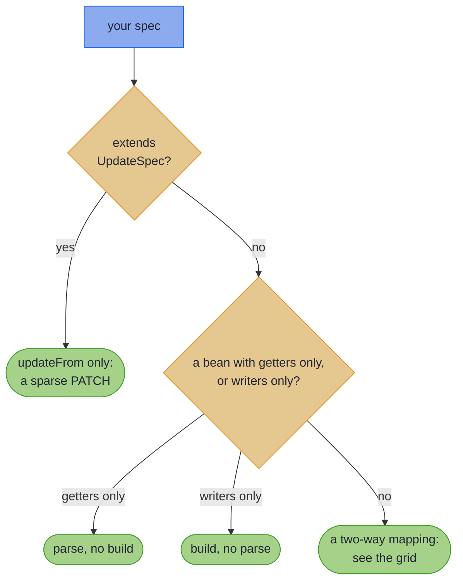

# What Your Spec Generates {#the-emission-tiers-truthful-types}

_Your spec gets only the methods its pair can honour, and each one is law-checked._

So far every mapping in this chapter has offered `build` and `parse`. Not every pair can keep both promises. The processor reads how each component crosses, and generates only the methods the pair can honour. That set of methods is the spec's *tier*.

~~~admonish info title="What You'll Learn"
- Predict which methods a spec's Impl carries, from the shape of its pair
- Send a bound request to `parse` or `patch`, never to an unguarded `reverseGet` or `set`
~~~

~~~admonish example title="See Example Code"
**The code on this page is [TiersBook.java](https://github.com/higher-kinded-j/higher-kinded-j/blob/main/hkj-examples/src/main/java/org/higherkindedj/example/book/mapping/TiersBook.java) and its [TiersBookTest.java](https://github.com/higher-kinded-j/higher-kinded-j/blob/main/hkj-examples/src/test/java/org/higherkindedj/example/book/mapping/TiersBookTest.java)** - the page includes them directly, so they are compiled and run by the build.
~~~

> **You:** `EmployeeCardDto` carries two of `Employee`'s three components. Where is my `parse`?
>
> **The processor:** Parse into what? The card has no `age`. I could invent one, and then `parse` would hand you an employee who never existed.
>
> **You:** So the card is write-only?
>
> **The processor:** Better than that. `asLens()` gives you a lens whose `set` takes the card *and* the employee you already hold, and writes the card's fields onto it. The `age` comes from your employee, so nothing is invented.
>
> **You:** Suppose one of the card's fields went through a leaf, as an email address would.
>
> **The processor:** Then the write could refuse a value, and a lens's `set` has no way to report that. So you get `patch(employee, card)` instead: the same write-back, returning `Validated`, with every bad field located.
>
> **You:** Why not generate everything, and throw when it cannot work?
>
> **The processor:** Because then the types would lie, and you would find out in production. Every method I generate is one whose laws hold for your pair, and one `MappingLaws` call checks it in your build.

`EmployeeCardDto` has no `age`, so its Impl has no `parse`. Its `asLens().set` writes the card onto an employee you already hold, and keeps that employee's `age`. A [`Lens`](../glossary/optics.md#lens) works like a hand-written `withCard(card)` copy method, except that it is a value: it composes, and `MappingLaws` checks it.

``` java
record Employee(String name, String department, int age) {}

record EmployeeCardDto(String name, String department) {}

@GenerateMapping
interface EmployeeCardMapping extends MappingSpec<Employee, EmployeeCardDto> {}


    Employee employee = new Employee("Ada", "Research", 36);
    Lens<Employee, EmployeeCardDto> badge = EmployeeCardMappingImpl.INSTANCE.asLens();
    Employee moved = badge.set(new EmployeeCardDto("Ada", "Platform"), employee);
    // Employee[name=Ada, department=Platform, age=36]
```

## Which methods your spec gets {#which-methods-your-spec-gets}

The first question is what kind of spec it is:



In words: a spec extending `UpdateSpec` gets `updateFrom` alone. A bean wire, a getter and setter class that [the next page](beans.md) covers, gets only `parse` when it has getters alone, and only `build` when it has writers alone. Every other spec maps both ways.

A two-way mapping's methods turn on two independent questions: does the wire carry every domain component, and is each one a plain copy?

| | Every component is a plain copy | Anything else |
|---|---|---|
| **The wire carries every component** | *lossless*: `build`, `parse`, `asIso()`, `asValidatedPrism()` | `build`, `parse`, `asValidatedPrism()` |
| **The wire carries fewer** (a *projection*) | `build`, `asLens()` | `build`, `patch(domain, wire)`: the *validated patch* |

- **A plain copy carries a value across unchanged.** A rename alone, or a flattened group, still copies. A leaf does not, and nor does a nested spec, lifted over a container or not. Neither does an `@OptionalBridge` component, or a reference property on a bean wire, which can be left unset.
- **A derived field is not a plain copy either.** On the bottom row the processor refuses it, since the write-back could never honour a component that `build` recomputes. A flattened group on the bottom row is not supported yet.
- **A [read-only](beans.md#read-only-properties) bean property crosses one way.** `parse` reads it and `build` leaves it out, so `parse` cannot read back what `build` wrote. The Impl has `asValidatedParse()` and `asValidatedBuild()` in place of `asValidatedPrism()`, and no `asIso()`. So does a mapping that [nests such a spec](rules.md#nesting-two-halves) where it builds and parses.
- **A sealed pair dispatches to each subtype's own spec.** It gets `build`, `parse` and `asValidatedPrism()`, or [two halves](rules.md#nesting-two-halves) in its place when a subtype's spec has them, and never `asIso()`: [Sealed hierarchies](structure.md#sealed-hierarchies).

`asValidatedPrism()` is the whole mapping as a leaf, so it nests in another spec and lifts over containers. [Where a bean or a bridged component lands](rules.md#where-a-bean-or-bridged-component-lands) has the precise rules. The same methods, as a table to search:

| Method | You get it when |
|---|---|
| `build` | the spec maps both ways, or its bean wire has writers only |
| `parse` | the spec maps both ways and the wire carries every component, or its bean wire has getters only |
| `asIso()` | the wire carries every component, and each is a plain copy; never on a sealed pair |
| `asValidatedPrism()` | the Impl has both `build` and `parse`, and no property is [read-only](beans.md#read-only-properties), here or in a spec it [nests or dispatches to](rules.md#nesting-two-halves) |
| `asLens()` | the wire carries fewer components, and each is a plain copy |
| `patch(domain, wire)` | the wire carries fewer components, and some are not plain copies: [the validated `patch`](#leaf-carrying-projections-the-validated-patch) |
| `asValidatedParse()` | the bean wire has getters only, [One-directional beans](beans.md#one-directional-beans), or a property is [read-only](beans.md#read-only-properties), here or in a spec it [nests or dispatches to](rules.md#nesting-two-halves) |
| `asValidatedBuild()` | the bean wire has writers only, [One-directional beans](beans.md#one-directional-beans), or a property is [read-only](beans.md#read-only-properties), here or in a spec it [nests or dispatches to](rules.md#nesting-two-halves) |
| `updateFrom(wire)` | the spec extends `UpdateSpec`, over a bean wire: [Sparse PATCH](beans_patch.md#sparse-patch-write-back-updatespec) |
| `updateFrom(message, mask)` | the spec extends `UpdateSpec`, over a protobuf-java message: [A PATCH through its `FieldMask`](beans.md#a-patch-through-its-fieldmask) |

### A bound request goes to `parse` or `patch` {#a-bound-request-goes-to-parse}

~~~admonish warning title="Not checked for you: reverseGet has no guard"
A lossless `parse` is guarded. A `null` becomes a located error, and a value the domain's [constructor refuses](absence.md#constructor-invariants) becomes an error carrying its message. `asIso().reverseGet` runs the same direction with neither guard: it builds the record directly, so whatever the constructor accepts goes in, and whatever it throws propagates. Here a request body left out `street`:

``` java
    AddressDto bound = new AddressDto(null, "Leeds", "LS1 4AP"); // the body left out "street"

    assertThat(AddressMappingImpl.INSTANCE.asIso().reverseGet(bound))
        .isEqualTo(new Address(null, "Leeds", "LS1 4AP")); // no error, and no exception
    assertThatValidated(AddressMappingImpl.INSTANCE.parse(bound))
        .hasFieldErrors("street: must not be null"); // parse locates it
```

`reverseGet` is for round trips of values `build` produced, so give a freshly bound request to `parse`. A projection has no `parse`, and its [validated `patch`](#leaf-carrying-projections-the-validated-patch) carries both guards. A projection whose components are all plain copies gets `asLens()` instead, and its `set` builds through the same constructor with neither guard. Check such a request yourself before `set`, or give a component that needs checking a leaf: the projection then takes `patch`.
~~~

## Law-checked, in the repo and in your tests {#law-checked-in-the-repo-and-in-your-tests}

Every tier is compiled and law-checked in the Higher-Kinded-J build itself, against the published [`hkj-test` law harness](../tooling/test_assertions.md#optic-laws). Your own specs get the same check with one call from a test, since `hkj-test` is a test-scope dependency. It works like an EqualsVerifier test, where one call checks a contract the class promises. Unlike EqualsVerifier, it makes no values of its own, so the laws are checked at the samples you pass:

``` java
import org.higherkindedj.optics.laws.MappingLaws;

    MappingLaws.assertMappingLaws(
        CustomerMappingImpl.INSTANCE.asValidatedPrism(),
        new CustomerDto("Ada", "ada@example.org"), // parses
        new CustomerDto("Bob", "not-an-email")); // must not parse
```

Give it the values your boundary actually meets. A sample that should parse must parse cleanly, with no `null` and nothing the constructor refuses. Through a normalising leaf, it must already be in the form `build` writes back. A `@ParameterizedTest` drives several spellings through the same call:

``` java
  @ParameterizedTest
  @CsvSource({
    "ada@example.org,        not-an-email",
    "grace@corp.example,     grace.corp.example",
    "ada+orders@example.org, ''"
  })
  void customerMappingObeysTheLawsAtEachSpelling(String parses, String fails) {
    MappingLaws.assertMappingLaws(
        CustomerMappingImpl.INSTANCE.asValidatedPrism(),
        new CustomerDto("Ada", parses),
        new CustomerDto("Ada", fails));
  }

```

Each tier has its own overload:

| Your Impl has | Pass to `assertMappingLaws` |
|---|---|
| `asIso()` | `asIso()`, `asValidatedPrism()`, a domain value and a wire value |
| `asValidatedPrism()`, and no `asIso()` | `asValidatedPrism()`, a wire that parses and one that does not |
| `asValidatedPrism()`, and a derived field as its only extra | `asValidatedPrism()` and a domain value |
| `asLens()` | `asLens()`, a domain value and two wire values |
| `patch` | `patch` and `build` as method references, a domain value, a wire that parses and one that does not |
| `asValidatedParse()` | `asValidatedParse()`, a wire that parses and one that does not |
| `asValidatedBuild()` | `asValidatedBuild()` and a domain value |
| both halves, from a [read-only](beans.md#read-only-properties) property, or from a spec it [nests or dispatches to](rules.md#nesting-two-halves) | each half to its own overload, as above |
| `updateFrom` | `updateFrom` as a method reference, a domain value, and an all-absent, a valid and an invalid wire |

[Testing With hkj-test](../tooling/test_assertions.md#optic-laws) says what each overload checks, and how to choose its samples.

~~~admonish tip title="Why this matters"
Most mapping tools generate the same surface for every pair, and let the unlawful corners fail at runtime. Here each cell of the grid names methods whose laws hold as passing tests: in this repository on every build, and in yours with one call. When a record refactor changes what a pair can support, the generated methods change with it, and the law test tells you at build time, not in production.
~~~

~~~admonish tip title="You can ship now"
You can now predict which methods a spec generates, send requests through `parse`, and law-check the spec in your build. The rest of this page, [the validated `patch`](#leaf-carrying-projections-the-validated-patch), is for a projection whose components are not all plain copies.
~~~

~~~admonish question title="Checkpoint: which methods does a tidying leaf leave?" id="check-tiers-leaf-iso"
`CouponMapping` maps a pair whose components match one for one. Its one leaf tidies the code's spelling, and never fails:

``` java
record Coupon(String code, int percent) {}

record CouponDto(String code, int percent) {}

@GenerateMapping
interface CouponMapping extends MappingSpec<Coupon, CouponDto> {
  default ValidatedPrism<String, String> code() { // never fails: it only tidies the spelling
    return ValidatedPrism.of(
        raw -> Validated.validNel(raw.strip().toUpperCase(Locale.ROOT)), code -> code);
  }
}

```

Which methods does `CouponMappingImpl` carry?

1. `build`, `parse`, `asIso()` and `asValidatedPrism()`
2. `build`, `parse` and `asValidatedPrism()`
3. `build`, `parse` and `asIso()`, but no `asValidatedPrism()`, since nothing can fail
~~~

~~~admonish success title="Answer and why" collapsible=true id="check-tiers-leaf-iso-answer"
**2.** The grid's column asks whether a component is a plain copy, not whether it can fail. A leaf is not a plain copy, so the pair sits in the top-right cell. This leaf is no isomorphism anyway: a wire `" save10 "` parses to `SAVE10` and builds back as `SAVE10`, so the round trip changes the wire.

``` java
    assertThat(CouponMappingImpl.class.getMethods())
        .extracting(Method::getName)
        .contains("build", "parse", "asValidatedPrism")
        .doesNotContain("asIso", "asLens");

    var coupons = CouponMappingImpl.INSTANCE;
    assertThatValidated(coupons.parse(new CouponDto(" save10 ", 10)).map(coupons::build))
        .hasValue(new CouponDto("SAVE10", 10)); // the round trip changed the wire
```

Where this lives: [Which methods your spec gets](#which-methods-your-spec-gets).
~~~

~~~admonish question title="Checkpoint: what does a projection's set do with a null?" id="check-tiers-lens-set"
A client sends the employee card with no name, so the controller holds `new EmployeeCardDto(null, "Platform")`. It writes the card onto `new Employee("Ada", "Research", 36)` with `EmployeeCardMappingImpl.INSTANCE.asLens().set`. What comes back?

1. `Invalid(NonEmptyList[name: must not be null])`
2. A `NullPointerException`
3. `Employee[name=null, department=Platform, age=36]`
4. `Employee[name=Ada, department=Platform, age=36]`, since `set` skips a `null`
~~~

~~~admonish success title="Answer and why" collapsible=true id="check-tiers-lens-set-answer"
**3.** `set` builds through `Employee`'s constructor with no guard, as `reverseGet` does, and that constructor accepts a `null`. So the `null` reaches the domain with no error and no exception:

``` java
    Employee ada = new Employee("Ada", "Research", 36);
    EmployeeCardDto card = new EmployeeCardDto(null, "Platform"); // the client sent no name

    assertThat(EmployeeCardMappingImpl.INSTANCE.asLens().set(card, ada))
        .isEqualTo(new Employee(null, "Platform", 36)); // no error, and no exception
```

Where this lives: [A bound request goes to `parse` or `patch`](#a-bound-request-goes-to-parse).
~~~

---

## Leaf-carrying projections: the validated `patch` {#leaf-carrying-projections-the-validated-patch}

A projection whose components are not all plain copies has no lawful lens. A leaf may refuse a value, which a lens's `set` has no way to report, or rewrite it, which breaks the lens laws. So the processor emits the **validated `patch` tier**: `build` stays, and the write-back returns `Validated`. A bean projection with a reference property lands here even without a leaf, because that property can be left unset ([Bean projections](beans.md#bean-projections)):

``` java
record Subscriber(String id, EmailAddress email, int age) {}

record SubscriberDetailsDto(String email, int age) {}

@GenerateMapping
interface SubscriberDetailsMapping extends MappingSpec<Subscriber, SubscriberDetailsDto> {
  default ValidatedPrism<String, EmailAddress> email() {
    return ValidatedPrism.of(
        raw ->
            raw.contains("@")
                ? Validated.validNel(new EmailAddress(raw))
                : Validated.invalidNel(FieldError.of("not an email address")),
        EmailAddress::value);
  }
}

```

`patch(domain, wire)` validates every projected component and writes it onto the domain. Every bad field is reported at once, under its component name. The components the wire does not carry are read from the domain argument, so they survive by construction:

``` java
    Subscriber subscriber = new Subscriber("7", new EmailAddress("ada@corp.example"), 36);
    var subscriberDetailsMapping = SubscriberDetailsMappingImpl.INSTANCE;

    // The projected components validate and write back; the unprojected id survives untouched.
    Validated<NonEmptyList<FieldError>, Subscriber> renewed =
        subscriberDetailsMapping.patch(
            subscriber, new SubscriberDetailsDto("grace@corp.example", 37));
    // Valid(Subscriber[id=7, email=EmailAddress[value=grace@corp.example], age=37])

    // Dense semantics: every projected field applies - a null is a located error, never absence.
    Validated<NonEmptyList<FieldError>, Subscriber> nullEmail =
        subscriberDetailsMapping.patch(subscriber, new SubscriberDetailsDto(null, 37));
    // Invalid(NonEmptyList[email: must not be null])
```

~~~admonish warning title="Dense, not sparse: patch is the opposite of updateFrom"
`patch` applies **every** projected component, and never leaves one unchanged. A `null` reference read becomes a located `FieldError` (`must not be null`). A [bridged](absence.md#optional-bridge) `Optional` component, automatic on a bean wire, reads `null` as empty and writes that. The REST PATCH contract, where a `null` means *keep the current value*, is the [sparse `UpdateSpec` tier](beans_patch.md#sparse-patch-write-back-updatespec). This tier is its dense complement, for writing a validated sub-view onto a bigger record.
~~~

A projected component resolves everything a two-way mapping resolves. An explicit leaf beats a plain copy, so a `ValidatedPrism<X, X>` can normalise. A nested spec's failures compose into dotted paths, and containers lift. A nested wire value parses through its own spec, so a `null` inside it locates too: a `zip` left `null` in a nested address reports `address.zip: must not be null`, instead of throwing.

~~~admonish tip title="At the Spring boundary"
A `patch` result is already [the 422 leg](../spring/spring_boot_integration.md#the-422-leg)'s shape: return it as it is.
~~~

Like every tier, this one is law-checked:

``` java
    var subscriberDetailsMapping = SubscriberDetailsMappingImpl.INSTANCE;
    MappingLaws.assertMappingLaws(
        subscriberDetailsMapping::patch,
        subscriberDetailsMapping::build,
        new Subscriber("7", new EmailAddress("ada@example.org"), 36), // the current value
        new SubscriberDetailsDto("grace@example.org", 41), // parses and changes the domain
        new SubscriberDetailsDto("not-an-email", 36)); // located failure
```

The patch laws are projection identity (`patch(d, build(d)) == Valid(d)`), idempotence, and located validation. `build` after `patch` is deliberately not a law, since a normalising leaf rewrites the wire form. The two-way overload does check `build` after `parse`, at a parsing sample already in the form `build` writes back.

---

~~~admonish info title="Key Takeaways"
* **Two questions pick a two-way mapping's methods**: does the wire carry every component, and is each one a plain copy
* **A bound request goes to `parse` or `patch`**: `reverseGet` and a lens's `set` have no guard, so they are for values you already trust
* **Every tier is law-checked**: one `MappingLaws` call per tier, the same harness the library's own build runs
~~~

~~~admonish tip title="See Also"
- [Testing With hkj-test](../tooling/test_assertions.md#optic-laws): The law harness `MappingLaws` belongs to
- [Sparse PATCH](beans_patch.md): The sparse `updateFrom` tier
- [Injecting, Testing, and Diagnostics](testing.md): Registering a tier's surface as a bean
~~~

---

**Previous:** [Check Your Understanding](self_check.md)
**Next:** [Bean-Shaped Wires](beans.md)
