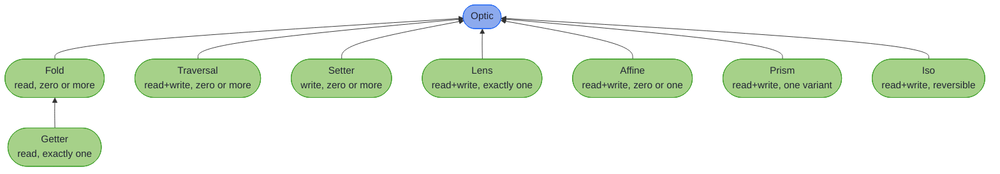

<!-- description: Read and update deeply nested immutable Java records through generated, compile-checked paths: the Focus DSL first, then lenses, prisms and traversals. -->

# Optics


> _"What we see depends mainly on what we look for."_
>
> – John Lubbock, *The Beauties of Nature and the Wonders of the World We Live In*

---

Immutable records in Java are safer, easier to reason about, and, when you need to change something inside them, a bit of an ordeal. Here is a 10% discount on every line of an order, as many Spring teams write it, with a wither on each record, the method Lombok's `@With` generates:

``` java
    // The withers Lombok's @With generates: each rebuilds only its own record, so the list is
    // rebuilt by hand
    Order discounted =
        order.withLines(
            order.lines().stream()
                .map(line -> line.withPrice(line.price().multiply(new BigDecimal("0.9"))))
                .toList());
```

A wither knows only its own record, so the list is streamed, each line rebuilt, and the order rebuilt around the new list by hand, and every other operation on the prices repeats that plumbing. Here is the same change through a generated path:

``` java
    // The Focus DSL: one generated path reaches every price, and rebuilds what it passes through
    Order discounted =
        OrderFocus.lines()
            .via(LineItemFocus.price())
            .modifyAll(price -> price.multiply(new BigDecimal("0.9")), order);
```

For Ada's order of a £40.00 lamp and four £2.50 bulbs, both versions price the lines at 36.000 and 2.250. The difference is what you can do next: name `OrderFocus.lines().via(LineItemFocus.price())` once, and the same path rounds the prices on the [Quickstart](quickstart.md) and checks them on [Updates That Can Fail](fluent_api.md).

The annotation processor writes `OrderFocus` and `LineItemFocus` from `@GenerateFocus` on each record, which can sit beside Lombok's `@With` when Lombok comes first on the processor path. These records are the chapter's running cast, the order service the [Mapping chapter's capstone](../mapping/capstone.md) also uses:

``` java
@GenerateLenses
@GenerateFocus(generateNavigators = true)
@GenerateTraversals
public record Order(
    UUID id,
    Customer customer,
    List<LineItem> lines,
    Instant placedAt,
    Currency currency,
    OrderStatus status) {}
```

Every hop is an ordinary generated method, so the compiler checks the whole path and the IDE completes it for you. The path is also a value: store it in a field, pass it to a method, and reuse it to read, update, change every element of a list, or validate.

That path is an **optic**: a first-class, composable route from a whole structure to one or more of its parts. Lenses, prisms and traversals are the optics underneath, and the generated Focus paths are how you use them day to day. Sealed types (`@GeneratePrisms`), collections, and types you cannot modify (`@ImportOptics`, for Jackson, JOOQ and JDK types) get the same treatment. There is no reflection at runtime, and no hand-written composition unless you want it.

~~~admonish warning title="Before you start"
Your project builds and runs on **Java 25**. Higher-Kinded-J is built on it today, and parts of the library use preview features, which tie the build to that one release. Most optics need no preview flag of their own, and [Prerequisites](../quickstart.md#prerequisites) lists the code that does. The [HKJ Gradle or Maven plugin](../tooling/gradle_plugin.md) sets the flags and wires in the annotation processor. With Lombok in the build as well, its processor goes ahead of `hkj-processor`, as [Build-time impact](production_readiness.md#build-time-impact) explains. The processor writes `OrderFocus` and its siblings when the project compiles, so until the first build an IDE shows them as missing.
~~~

---

## How to read this chapter {#how-to-read-this-chapter}

Start from what you came for.

| You want | Start at |
|---|---|
| A nested record updated, with the least reading | [Quickstart](quickstart.md), then the [Focus DSL](focus_dsl.md) |
| The everyday API, learned properly | The pages under **Ship** in the [Chapter Contents](#chapter-contents), read in order |
| An update that can fail, with every bad value reported | [Updates That Can Fail](fluent_api.md) |
| A PATCH endpoint, or several edits applied as one | [Many Edits at Once](multi_edit.md) |
| A lens, prism, affine or iso explained in depth | [The Optic Types](ch1_intro.md) |
| A traversal, fold, getter or setter explained in depth | [Collections](ch2_intro.md) |
| To judge whether optics fit your codebase | [Production Readiness](production_readiness.md) |
| An answer to a specific question | [Look It Up](ch7_intro.md) |
| A domain record mapped to and from a wire DTO | [Mapping at the Boundary](../mapping/ch_intro.md), which needs none of this chapter first |

---

## How the optic types relate {#how-the-optic-types-relate}

Eight optic types, one shared supertype, and one real specialisation between them:



Each arrow reads *extends*: `Fold extends Optic`, and `Getter extends Fold`. That last is the **only** inheritance between two optic types. Everything else extends `Optic` directly, so they are siblings: a `Lens` is not a `Fold`, and `lens.asFold()` is an explicit conversion, one of those [Conversions](conversions.md) lists. What separates the types is capability: how many values an optic focuses, and whether you may write through it. [Decision Trees](decision_trees.md) turns those two questions into a choice.

---

~~~admonish info title="Hands-On Learning"
The [Optics Tutorial Track](../tutorials/optics/ch_intro.md) (202 exercises) practises the chapter as exercises, from Lens & Prism through the Focus DSL to batching and the generated DTO boundary.
~~~

## Chapter Contents

**Ship**, read in order:

1. [Quickstart](quickstart.md): Three runnable examples in 100 lines
2. [Focus DSL](focus_dsl.md): Generated paths through your own records
3. [Collections, Optionals and Sealed Types](focus_navigation.md): Step into lists, maps, optionals and variants
4. [What a Path Is Made Of](optics_intro.md): The optics a path wraps, and when you need one
5. [Updates That Can Fail](fluent_api.md): Validated updates, every error reported
6. [Many Edits at Once](multi_edit.md): Several edits as one, and REST PATCH

**On demand**, when a task calls for it:

7. [The Optic Types](ch1_intro.md): Lens, Prism, Affine and Iso, a page each
8. [Collections](ch2_intro.md): Traversal, Fold, Getter and Setter
9. [Precision and Filtering](ch3_intro.md): Filtered, indexed and per-key access
10. [The Focus DSL in Depth](ch4_intro.md): Effects, custom containers and `Kind` fields
11. [Optics for External Types](importing_optics.md): Jackson, JOOQ, Lombok and other types you do not own
12. [Validation, Batching and Auditing](ch5_intro.md): Validated prisms, `modifyF` pipelines, batching and audit trails
13. [Programs as Data](ch6_intro.md): The Free Monad DSL and its interpreters

**Look it up**, when you hold a question:

14. [Look It Up](ch7_intro.md): Production readiness, decision trees, the cookbook and reference tables

---

**Next:** [Quickstart](quickstart.md)
