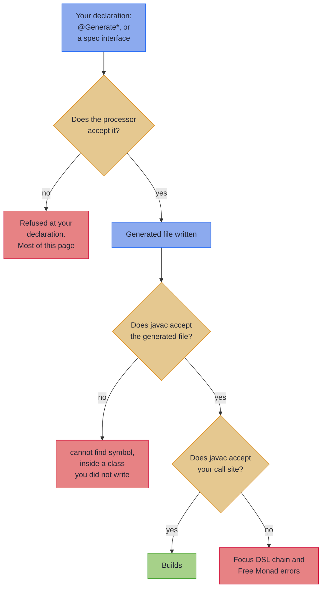

# Common Compiler Errors

_Find the message your compiler printed, then read what it means and how to fix it._

This page is for the moment a build fails and you want to know what the message means. Find the fragment your compiler printed in [Find your message](#find-your-message) and follow it to its entry. Every entry says what the message means, gives the fix, and keeps the reasoning in a **Why** you can open if you want it.

~~~admonish info title="Error, warning, or note?"
- An **error** stops the build. Almost everything here is an error.
- A **warning** stops the build only under `-Werror`. A processor warning cannot be suppressed, so the remedy is the fix rather than an annotation.
- A **note** stops nothing. It shows in the compiler output as `Note: ...`, and tells you that something you asked for was quietly not applied.

Rows below and headings on the page say which, wherever it is not an error.
~~~

---

## Find your message

**From `@GenerateLenses`, `@GenerateFocus`, `@GenerateTraversals` and friends** ([entries](#generatelenses--generatefocus--generatetraversals)):

| The message says | What it means |
|------------------|---------------|
| [`cannot find symbol: class XLenses`](#cannot-find-symbol-class-xlenses) | The processor has not run, or the IDE has not indexed the generated sources |
| [`can only be applied to records`](#generatelenses-can-only-be-applied-to-records-but-foo-is-a-class) | `@GenerateLenses` or a sibling is on a class |
| [`can only be applied to sealed interfaces or enums`](#the-generateprisms-annotation-can-only-be-applied-to-sealed-interfaces-or-enums) | `@GeneratePrisms` is on something else |
| [`names a type variable`](#generateisos-the-iso-returned-by-x-names-a-type-variable) | The `@GenerateIsos` method's `Iso` type is not fully concrete |
| [`'x' is not static`](#generateisos-x-is-not-static) | The `@GenerateIsos` method is an instance method |
| [`'x' takes parameters`](#generateisos-x-takes-parameters) | The `@GenerateIsos` method takes arguments |
| [`does not return an Iso with both type arguments`](#generateisos-x-does-not-return-an-iso-with-both-type-arguments) | The `@GenerateIsos` method returns something else |
| [`cannot be reached from 'p'`](#generateisos-x-cannot-be-reached-from-p) | The `@GenerateIsos` method is not visible from the generated package |
| [`The generated companion is a top-level class`](#companion-cannot-be-reached) | A type the generated companion names is `private`, or hidden in another package |
| [`has a wildcard type argument`, `has a raw Set`](#generatefocus-record-component-xy-has-a-wildcard-type-argument-in-set-extends-t) | A widened container is raw, or has a wildcard type argument |
| [`no traversal was generated for component`](#generatetraversals-no-traversal-was-generated-for-component-xy-of-type-dequet-a-note) | **Note.** `@GenerateTraversals` found no generator for a container |
| [`Multiple TraversableGenerator SPI providers with equal priority`](#multiple-traversablegenerator-spi-providers-with-equal-priority-n-support-type-x-a-warning) | **Warning.** Two generators claim one type and neither outranks the other |
| [`the annotation on record component 'X.y' is not applied`](#traversefield-the-annotation-on-record-component-xy-is-not-applied-a-note) | **Note.** `@TraverseField` is on something that is not a `Kind` with a declared witness |
| [`names a witness the processor does not recognise`](#generatefocus-record-component-xy-names-a-witness-the-processor-does-not-recognise-a-note) | **Note.** A `Kind` field's witness has no registered `Traverse`, so nothing widens it |

**From `@ImportOptics` and spec interfaces** ([entries](#importoptics-and-opticsspec-interfaces)):

| The message says | What it means |
|------------------|---------------|
| [`lists no classes to import`](#importoptics-lists-no-classes) | **Warning.** The annotation names no class, so nothing is generated |
| [`which has no optics to import`](#importoptics-literal-names-no-type) | The class list holds a primitive, an array or `void` |
| [`and also lists classes to import`](#importoptics-spec-lists-classes) | A spec interface carries a class list it does not read |
| [`extends OpticsSpec only through`](#importoptics-indirect-spec) | A spec reaches `OpticsSpec<S>` through another interface |
| [`implements OpticsSpec but is not an interface`](#importoptics-spec-not-an-interface) | A class is written as a spec |
| [`inherits the optic method`](#importoptics-inherited-optic) | A spec's optic method is declared on another interface |
| [`carries no copy strategy annotation`](#importoptics-lens-method-x-carries-no-copy-strategy-annotation) | A spec `Lens` method names none of the four copy strategies |
| [`is a default method`](#xopticsspecfoo-is-a-default-method) | A spec interface method has a body |
| [`which is a type variable`](#xopticsspec-declares-opticsspecs-which-is-a-type-variable) | `OpticsSpec<S>` names a type parameter rather than a type |
| [`which names the raw type 'Box'`](#xopticsspec-declares-opticsspecbox-which-names-the-raw-type-box) | The source type is missing its type arguments |
| [`which hides the 'T' of its enclosing class`](#importoptics-type--names-the-type-parameter-t-of--which-hides-the-t-of-its-enclosing-class-) | An imported inner class reuses a type-parameter name of its enclosing class |
| [`rather than as the List interface`](#throughfield--reaches-field-items-which-is-declared-as-arrayliststring-rather-than-as-the-list-interface) | `@ThroughField`'s lens focuses a concrete container, or another interface |
| [`which the spec does not declare`](#throughfield--composes-through-a-lens-named-items-which-the-spec-does-not-declare) | `@ThroughField` has no lens for the field to compose with |
| [`which the spec declares static` or `private`](#throughfield--composes-through-a-lens-named-items-which-the-spec-does-not-declare) | `@ThroughField` names a lens the generated class does not carry |
| [`hands back as 'String'`](#throughfield--declares-focus-integer-over-field-items-of-type-liststring-whose-elements-the-standard-traversal-hands-back-as-string) | `@ThroughField`'s declared focus is not what the traversal returns |
| [`is not a subtype of source type`](#instanceof-target-comexamplefoo-is-not-a-subtype-of-source-type-comexamplebase) | `@InstanceOf` names a class outside the hierarchy |
| [`which the test cannot narrow to`](#instanceof--declares-its-focus-as-circlet-which-the-test-cannot-narrow-to) | The focus promises a type argument `instanceof` cannot check |
| [`carries type parameters of its own`](#instanceof--names--which-carries-type-parameters-of-its-own-and-is-a-member-of-a-generic-type) | `@InstanceOf` names an `Outer<X>.Inner<Y>`, which `instanceof` cannot write |
| [`narrows to '...', which is not a '...'`](#instanceof--narrows-to--which-is-not-a-) | The `@InstanceOf` class is not assignable to the declared focus |
| [`does not resolve to a type`](#viacopyandset-copyconstructor-names--which-does-not-resolve-to-a-type) | `copyConstructor` is not a fully qualified class name |
| [`which 'S' does not extend or implement`](#viacopyandset-copyconstructor-names--which-s-does-not-extend-or-implement) | `copyConstructor` names a type that is not a supertype |
| [`is not public and so cannot be named from`](#viacopyandset-copyconstructor-names--which-is-not-public-and-so-cannot-be-named-from-) | `copyConstructor` names a type the generated class cannot see |
| [`and no constructor accepts`](#viacopyandset-copyconstructor-names--which--reaches-as--and-no-constructor-accepts) | No copy constructor takes the supertype you named |
| [`is written with a wildcard type argument`](#viacopyandset--is-written-with-a-wildcard-type-argument) | A constructor rebuild cannot be written for a wildcard source type |
| [`not the source type`](#wither--returns--not-the-source-type-) | The method a `@Wither` call binds returns something other than the source type |
| [`for the generated lens to call`](#wither--has-no-method--for-the-generated-lens-to-call) | `@Wither` names a method the source type does not have, or one the generated class cannot reach |
| [`takes the lens's focus type`](#wither-no-method--of--takes-the-lenss-focus-type-) | No method of the name `@Wither` gives takes the lens's focus |
| [`cannot choose between`](#wither-the-generated-call-to--cannot-choose-between--and-) | More than one overload takes the focus, none more closely than the rest |
| [`is static, so the generated lens cannot rebuild`](#wither--is-static-so-the-generated-lens-cannot-rebuild-a--through-it) | The overload the focus binds is a static method |
| [`for the generated lens to read the value it focuses`](#-has-no-method--for-the-generated-lens-to-read-the-value-it-focuses) | A strategy's `getter`, or the lens method that stands in for it, names no accessor |
| [`reads '...', not the lens's focus`](#-reads--not-the-lenss-focus-) | The accessor reads a value the lens cannot hand back as its focus |
| [`for the generated lens to set through`](#-has-no-method--for-the-generated-lens-to-set-through) | A `setter` names no method of the type it is called on |
| [`hands back '...', which is not a builder`](#viabuilder-the-chain-the-lens-rebuilds-through) | A `@ViaBuilder` step leads somewhere the next call cannot be made |
| [`is static, so the generated lens cannot set through`](#-has-no-method--for-the-generated-lens-to-set-through) | The `setter` the focus binds is a static method |
| [`pairs more than one wither with the field`](#importoptics--pairs-more-than-one-wither-with-the-field--a-note) | **Note.** Two withers reach one field name, and one lens is generated |
| [`focuses '...', which is not a '...'`](#importoptics--focuses--which-is-not-a-) | A generated prism's focus is a value rather than a variant of the source |
| [`cannot find symbol`, inside `XPrisms.java`](#cannot-find-symbol-inside-the-generated-xprismsjava-after-using-matchwhen) | A `@MatchWhen` predicate or getter name is misspelt |
| [`requires a prism hint annotation`](#prism-method-x-requires-a-prism-hint-annotation-instanceof-or-matchwhen) | A spec `Prism` method has neither `@InstanceOf` nor `@MatchWhen` |

**From `@GeneratePathBridge` and `@PathVia`** ([entries](#generatepathbridge-and-pathvia)):

| The message says | What it means |
|------------------|---------------|
| [`which no Path wraps`](#pathvia-the-return-type-of-x-is-y-which-no-path-wraps) | The method returns a type outside the bridged set |
| [`names the raw type 'Y'`](#pathvia-the-signature-of-x-names-the-raw-type-y) | The signature is missing type arguments somewhere |
| [`is the wildcard '?'`](#pathvia-the-error-type-of-the-validated-returned-by-x-is-the-wildcard-) | A bridged `Validated` names its error type as a wildcard |
| [`has the same name as 'Y's`](#pathvia-the-type-parameter-t-on-x-has-the-same-name-as-ys) | A method type parameter hides one of the interface's |
| [`the bridge cannot call 'x'`](#pathvia-the-bridge-cannot-call-x) | The method is `static` or `private` |
| [`is already taken`](#pathvia-the-bridge-signature-for-x-is-already-taken) | Two `@PathVia` methods produce the same bridge signature |
| [`is not a method name`](#pathvia-pathvianame---is-not-a-method-name) | `@PathVia(name = ...)` is not a Java identifier |
| [`cannot be reached from 'p'`](#generatepathbridge-on-x-the-signature-names-y-which-cannot-be-reached-from-p) | Under `targetPackage`, part of the signature is not visible there |
| [`no @PathVia method was found`](#generatepathbridge-no-pathvia-method-was-found-among-xs-members-a-warning) | **Warning.** The interface has nothing to bridge |

**From javac, on code you wrote** ([Focus DSL chains](#focus-dsl-chains), [Free Monad](#free-monad-dsl-programs)):

| The message says | What it means |
|------------------|---------------|
| [`List<Object> cannot be converted to`, after `traverseOver`](#traverseover-and-the-higher-kinded-witness-type) | `traverseOver`'s element type is not pinned |
| [`Incompatible types`, after `.each().via()`](#incompatible-types-when-chaining-eachvia) | Usually one `.each()` too many |
| [`Cannot infer type argument(s)`](#cannot-infer-type-arguments-on-an-intermediate-each) | Only the final `each()` in a chain can infer its element type |
| [`::new` rejected as a `BiFunction`](#method-reference-new-doesnt-work-with-single-field-records-as-bifunction) | A single-component record has no two-argument constructor |
| [`Sealed or non-sealed local classes are not allowed`](#sealed-or-non-sealed-local-classes-are-not-allowed) | A sealed interface is declared inside a method body |
| [`Cannot resolve method 'flatMap(...)'`](#cannot-resolve-method-flatmapfunction) | Two `Free` witness types are being mixed |
| [`Free<F, A> cannot be converted to A`](#type-mismatch-freef-a-cannot-be-converted-to-a) | The program was never handed to an interpreter |

---

## Where the message came from

Three different things can reject your code, and knowing which one spoke narrows the search:



Most of this page is the first branch. The processor reads your declaration, finds a shape it cannot write code for, and says so where you wrote it. Those messages name the element they rejected, so reading the processor's own output first is quicker than working backwards from a `cannot find symbol` further down the build.

A `cannot find symbol: class XLenses` sits outside the diagram altogether: it means the processor never ran.

---

## `@GenerateLenses` / `@GenerateFocus` / `@GenerateTraversals`

### "cannot find symbol: class XLenses"

The annotation processor has not run yet, or the IDE has not picked up the generated sources directory. With `@ImportOptics`, the class is also missing when a type it imports never appeared: the import waits for a type another processor writes, and javac reports that type as missing too. An error reported earlier, or a warning under `-Werror`, stops annotation processing before a waiting import is read, so fix those first.

**Fix.** Run a build (`./gradlew build` or `mvn compile`). After the build completes, refresh the project in your IDE so it indexes `build/generated/sources/annotationProcessor/java/main` (Gradle) or `target/generated-sources/annotations` (Maven).
### "@GenerateLenses: can only be applied to records, but 'Foo' is a class"

`@GenerateLenses`, `@GenerateFocus`, `@GenerateFolds`, `@GenerateGetters`, `@GenerateSetters` and `@GenerateTraversals` only apply to records.

**Fix.** Convert the class to a record. If the type is third-party and you cannot change it, use [`@ImportOptics`](importing_optics.md) on a `package-info.java` or a spec interface instead.

~~~admonish note title="Why" collapsible=true
The annotations target `TYPE`, so javac itself is happy; the message comes from the processor. The wording varies: `@GenerateLenses` and `@GenerateFocus` name the offending type, while the others emit the shorter "The @GenerateTraversals annotation can only be applied to records."
~~~

~~~admonish example title="A declaration that produces it" collapsible=true
<!-- verify:rejects "can only be applied to records" -->
```java
@GenerateLenses
class Order {}
```
~~~

### "The @GeneratePrisms annotation can only be applied to sealed interfaces or enums."

`@GeneratePrisms` requires a `sealed interface` or an `enum`. A sealed *abstract class* is rejected too, despite being sealed, because the processor tests the element kind rather than the modifier.

**Fix.** Make the type a sealed interface and declare its `permits` clause, or convert it to an enum.

~~~admonish warning title="A plain interface fails silently instead"
A non-sealed *interface* passes the processor's guard and produces an **empty** `XPrisms` class with no diagnostic at all. If your prisms class exists but has no methods, an unsealed interface is why.
~~~

~~~admonish example title="A declaration that produces it" collapsible=true
<!-- verify:rejects "can only be applied to sealed interfaces or enums" -->
```java
@GeneratePrisms
abstract class Payment {}
```
~~~

### "@GenerateIsos: the iso returned by 'x' names a type variable"

One of the returned `Iso`'s two type arguments is, or contains, a type variable. Both `<T> Iso<Box<T>, T> boxIso()` and an instance method of a `Holder<X>` returning `Iso<Box<X>, X>` do this.

**Fix.** Give the iso concrete type arguments where the method is declared (`Iso<Box<String>, String>`), or drop `@GenerateIsos` and call the method directly.

~~~admonish note title="Why" collapsible=true
What gets generated is a `public static final` field, and a field has nowhere to declare one, so it would name a variable nothing brings into scope.

Note this is about what the *iso* names, not what the method declares: `<T> Iso<Box, String> boxIso()` is fine, because `T` is inferred at the call and never reaches the field's type.
~~~

~~~admonish example title="A declaration that produces it" collapsible=true
<!-- verify:rejects "names a type variable" -->
```java
record Box<T>(T content) {}

final class BoxIsos {

    @GenerateIsos
    static <T> Iso<Box<T>, T> box() {
        return Iso.of(Box::content, Box::new);
    }
}
```
~~~

### "@GenerateIsos: 'x' is not static"

The annotated method is an instance method. The generated field initialises itself with a static call, and there is no instance to make it on.

**Fix.** Make the method `static`.

~~~admonish example title="A declaration that produces it" collapsible=true
<!-- verify:rejects "'point' is not static" -->
```java
record Point(int x) {}

final class PointIsos {

    @GenerateIsos
    Iso<Point, Integer> point() {
        return Iso.of(Point::x, Point::new);
    }
}
```
~~~

### "@GenerateIsos: 'x' takes parameters"

The annotated method takes arguments. The generated field initialises itself by calling the method with none, and there is nothing for it to pass.

**Fix.** Take the arguments away, or drop `@GenerateIsos` and call the method directly.

~~~admonish example title="A declaration that produces it" collapsible=true
<!-- verify:rejects "'point' takes parameters" -->
```java
record Point(int x) {}

final class PointIsos {

    @GenerateIsos
    static Iso<Point, Integer> point(int scale) {
        return Iso.of(Point::x, Point::new);
    }
}
```
~~~

### "@GenerateIsos: 'x' does not return an Iso with both type arguments"

The method returns a `void`, a primitive, an array, a raw `Iso`, or something that is not an `Iso` at all. The generated field is typed from the two arguments of the returned `Iso`, and none of those carries them.

**Fix.** Return `Iso<S, A>` naming both, as `Iso<Point, Tuple2<Integer, Integer>>`.

~~~admonish example title="A declaration that produces it" collapsible=true
<!-- verify:rejects "does not return an Iso with both type arguments" -->
```java
final class PointIsos {

    @GenerateIsos
    static String point() {
        return "not an Iso";
    }
}
```
~~~

### "@GenerateIsos: 'x' cannot be reached from 'p'"

The generated class lives in package `p` and calls the method from there, but the method, or a type enclosing it, is `private`, `protected` or package-private somewhere else. Most often seen with `targetPackage`.

**Fix.** Make the method and its enclosing types public, or generate into the package they are already visible from.

~~~admonish example title="A declaration that produces it" collapsible=true
<!-- verify:rejects "cannot be reached from 'com.example.optics'" -->
```java
final class LengthIsos {

    @GenerateIsos(targetPackage = "com.example.optics")
    static Iso<String, Integer> length() {
        return Iso.of(String::length, "x"::repeat);
    }
}
```
~~~

### "@GenerateLenses: record component 'x' of 'X' names 'Y', which cannot be reached from 'p'" {#companion-cannot-be-reached}

A type the generated companion names is hidden from the package the companion is written into: it, or a class enclosing it, is `private`, or it comes from another package and is not `public`. `@GenerateLenses` and the other optics generators, `@ImportOptics`, `@GenerateAssembly`, `@GenerateErrorEnvelope`, `@EffectAlgebra` and `@PathSource` refuse such a type at the annotation. The message names where the companion meets the type: the annotated type itself (`record 'Shop.Item' cannot be reached from 'p'`), or a component, subtype, bound, field, optic, variant, operation, witness or error type.

**Fix.** Remove `private` from the class the message names. From another package, make it `public`; under `targetPackage`, removing `targetPackage` also works for a type beside the annotated one, and the message offers it where it does.

```
@GenerateLenses: record component 'sku' of 'Item' names 'Sku', which cannot be reached from
'com.example'. The generated companion is a top-level class in that package, where it names
every type it reads or writes, so each has to be visible from there. Remove 'private' from 'Sku'.
```

~~~admonish note title="Why" collapsible=true
The companion, `ItemLenses` here, is a top-level class beside `Shop`, not nested inside it, so it cannot see a type `Shop` keeps `private`. It names every type it reads or writes, some of them only in a lambda it leaves javac to infer, and javac checks those too. A traversal names only the components it traverses, so a `private` type on any other component compiles.
~~~

~~~admonish example title="A declaration that produces it" collapsible=true
<!-- verify:rejects "names 'Sku', which cannot be reached from" -->
```java
class Shop {
    private record Sku(String value) {}

    @GenerateLenses
    record Item(Sku sku, String name) {}
}
```
~~~

### "@GenerateFocus: record component 'X.y' has a wildcard type argument in Set<? extends T>"

A container that the processor widens through an optic **instance** is declared raw, or with a wildcard type argument. The same error covers `Set`, `Collection`, `Map`, `Either`, `Try` and every other such container, and is also reported as *"has a raw Set"*.

**Fix.** Name the type argument, `Set<Leaf>` rather than `Set<? extends Leaf>`, or drop `@GenerateFocus` from the record and keep `@GenerateLenses` and `@GenerateTraversals`, which compose no optic instance and take the component as written. See [Custom Containers](focus_containers.md#supported-container-types).

~~~admonish note title="Why" collapsible=true
That instance, `EachInstances.setEach()` or `Affines.eitherRight()`, has its own type arguments worked out from the component's type. A raw container gives javac nothing to work from, and a wildcard stands for no one type. `Optional`, `Maybe` and `List` are exempt: they widen through the no-argument `.some()` and `.each()`, whose element type is free to be whatever the field says.
~~~

~~~admonish example title="A declaration that produces it" collapsible=true
<!-- verify:rejects "has a wildcard type argument" -->
```java
@GenerateFocus
record Bag<T>(Set<? extends T> items) {}
```
~~~

### "@GenerateTraversals: no traversal was generated for component 'X.y' of type `Deque<T>`" (a note)

`@GenerateTraversals` asks the `TraversableGenerator` SPI for each record component, and no generator on the annotation processor path claimed this one.

**Fix.** Declare the component as a container a generator supports: `List`, `Set`, `Collection`, `Map`, `Optional`, an array, or a type one of the [generator plugins](../tooling/generator_plugins.md) covers. For a raw container, give it its element type. For a third-party type, put a `TraversableGenerator` for it on the annotation processor path. A mixed record, one supported container beside one unsupported, keeps the traversals it can have and carries the note for the one it cannot; the note is the reminder, not a gate. A record that wants no traversal for any of its components should not carry `@GenerateTraversals` at all; `@GenerateLenses` on its own still gives every component a lens.

~~~admonish note title="Why" collapsible=true
The component unmistakably holds elements, being a `java.util.Collection` or a `java.util.Map` by erasure. Not generating for it is a gap rather than the expected outcome, and the generated class would otherwise compile with the method silently missing. The second sentence names the unsupported type (`No TraversableGenerator on the annotation processor path supports Deque`). The same note is raised, with a different second sentence, for a container a generator *did* claim but cannot read: a raw `List` or `Set` "is written without a type argument, so there is no element type to focus", and a generator whose focused type argument the type does not have says which argument it wanted.

A component that is not a container at all is passed over without comment: a `String`, an `int`, or a `java.nio.file.Path`, which implements `Iterable` and is why a bare `Iterable` is not the bar.

It is a note rather than a warning on purpose. `@GenerateTraversals` has no per-component opt-out, and a processor warning cannot be suppressed, so a warning would have failed every `-Werror` build with no remedy short of changing the record. A note shows in the compiler output as `Note: ...` and fails nothing.
~~~

~~~admonish example title="A declaration that draws it" collapsible=true
<!-- verify:reports "no traversal was generated for component" -->
```java
@GenerateTraversals
record Pending(Deque<String> queue) {}
```
~~~

### "Multiple TraversableGenerator SPI providers with equal priority (N) support type X" (a warning)

Two generators on the annotation processor path both claim the type, and neither outranks the other: `supports()` answers true from both at the same `priority()`.

**Fix.** Rank one of the providers: return `PRIORITY_OVERRIDE` from the one that should win, or `PRIORITY_FALLBACK` from the one that should yield, or drop one from the annotation processor path. The message names both provider classes. A consuming build running javac with `-Werror` turns the warning into an error, so the ranking is the remedy, not optional tidiness. See [How Plugin Discovery Works](../tooling/generator_plugins.md#how-plugin-discovery-works).

~~~admonish note title="Why" collapsible=true
Selection is still deterministic, the first registered wins, but which one that is depends on registration order alone, which is what the warning points out. The same warning is raised whichever annotation asks: `@GenerateTraversals`, `@GenerateFocus` widening or `@ImportOptics`.
~~~

### "@TraverseField: the annotation on record component 'X.y' is not applied" (a note)

`@TraverseField` names a `Traverse` for a `Kind<F, A>` component with a declared witness, and this component is not one.

**Fix.** Declare the component as the `Kind<F, A>` the `Traverse` is written for, `Kind<TreeKind.Witness, Tree>` for a `Traverse<TreeKind.Witness>`, with both type arguments given and a witness that is a type rather than a bare or `? super` wildcard, a type variable of the record, or a wildcard bounded by one; or drop the annotation and take the path the component gets on its own, applying `traverseOver` yourself where the witness is known. See [Custom `Kind` Types with `@TraverseField`](kind_field_support.md#custom-kind-types-with-traversefield).

~~~admonish note title="Why" collapsible=true
The second sentence says which way: the component is not declared as a `Kind` at all (`List<String> is not declared as a Kind<F, A> component`), the `Kind` is written raw and so names neither a witness nor an element, its witness is a bare or `? super` wildcard (`Kind<?, String>`) that stands for no type and so names no `Traverse` instance, or its witness is one of the record's own type variables (`Kind<F, String>` in a `Holder<F>`, or `Kind<? extends F, String>`, whose wildcard resolves to `F`), which stands for any witness, while a `Traverse` is written for one. The component keeps the path it would have had without the annotation, a plain `FocusPath`, or `.each()` for a `List`, which compiles and is correct as far as it goes; what is missing is the traversal the annotation asked for.

It is a note rather than an error because nothing is broken: the generated class is sound, and the same declaration without the annotation passes without comment. A warning cannot be suppressed and would fail a `-Werror` build with no remedy short of editing the record.
~~~

~~~admonish example title="A declaration that draws it" collapsible=true
<!-- verify:reports "the annotation on record component 'Inbox.messages' is not applied" -->
```java
@GenerateFocus
record Inbox(
    @TraverseField(traverse = "org.higherkindedj.hkt.list.ListTraverse.INSTANCE")
        List<String> messages) {}
```
~~~

### "@GenerateFocus: record component 'X.y' names a witness the processor does not recognise" (a note)

The component is a `Kind<F, A>` whose witness is one of Higher-Kinded-J's own, but not one the Focus processor has a `Traverse` registered for. Nothing widens it, so the generated method is a plain `FocusPath` focusing the `Kind`.

**Fix.** Add `@TraverseField` naming the `Traverse` instance for the witness, or keep the plain path and apply `traverseOver` yourself. See [Kind Field Support](kind_field_support.md#convention-based-detection).

~~~admonish note title="Why" collapsible=true
A witness of your own draws no note, since not traversing it is an ordinary choice; a library witness with no registered `Traverse` is a gap you would want to hear about. The note is written once for the component, however many navigators reach the record.
~~~

~~~admonish example title="A declaration that draws it" collapsible=true
<!-- verify:reports "names a witness the processor does not recognise" -->
```java
@GenerateFocus
record Batch(Kind<NonEmptyListKind.Witness, String> items) {}
```
~~~

---

## `@ImportOptics` and `OpticsSpec` interfaces

### "@ImportOptics: '...' lists no classes to import, so nothing is generated" (a warning) {#importoptics-lists-no-classes}

An `@ImportOptics` on a `package-info.java`, or on a class or interface that does not reach `OpticsSpec`, names no class to import, so it generates nothing.

**Fix.** List the classes to import, as `@ImportOptics({Order.class})`, or remove the annotation. On an interface you meant as a spec, extend `OpticsSpec<S>` for the type its optics are for.

~~~admonish note title="Why" collapsible=true
A warning, because a build that compiles can still be missing the classes it expected, and the first sign would otherwise be a `cannot find symbol` somewhere else. A processor warning cannot be suppressed, so under `-Werror` the remedy is the fix. A class or interface whose supertype another processor writes is read once the supertype exists, so the warning is not given before then.
~~~

~~~admonish example title="A declaration that produces it" collapsible=true
<!-- verify:reports "lists no classes to import" -->
```java
@ImportOptics
class OrderImports {}
```
~~~

### "@ImportOptics: '....class' names a primitive type, which has no optics to import" {#importoptics-literal-names-no-type}

The class list holds a literal for a primitive type, an array type or `void`, such as `int.class` or `String[].class`. Optics are generated from the declaration of a class, interface, record or enum, and these have none. An array reads `names an array type`, and `void.class` reads `names void`.

**Fix.** Remove the literal from the list.

~~~admonish example title="A declaration that produces it" collapsible=true
<!-- verify:rejects "which has no optics to import" -->
```java
@ImportOptics({int.class})
class CountImports {}
```
~~~

### "@ImportOptics: '...' extends OpticsSpec<...> and also lists classes to import" {#importoptics-spec-lists-classes}

A spec interface also carries a class list. A spec generates the optics its own methods declare, for the type its `OpticsSpec<S>` names, and does not read a class list.

**Fix.** Move the class list to a `package-info.java` or to another class or interface, or remove it.

~~~admonish example title="A declaration that produces it" collapsible=true
<!-- verify:rejects "and also lists classes to import" -->
```java
final class Session {

    public String user() {
        return "";
    }

    public Session withUser(String user) {
        return this;
    }
}

@ImportOptics({java.time.LocalDate.class})
interface SessionOpticsSpec extends OpticsSpec<Session> {

    @Wither(value = "withUser", getter = "user")
    Lens<Session, String> user();
}
```
~~~

### "@ImportOptics: '...' extends OpticsSpec only through '...'" {#importoptics-indirect-spec}

An interface that lists no classes reaches `OpticsSpec<S>` through another interface rather than declaring it itself. Reading a spec that way is not supported yet.

**Fix.** Declare `OpticsSpec<S>` on the spec itself. Where the interface in between names the source type, the message gives the clause to add beside it, `extends OpticsSpec<Session>, SessionBase`. Where it does not, because it is raw or passes on a type parameter, name the source type in its place: `extends OpticsSpec<Session>`.

An interface that lists classes, and does not declare `OpticsSpec<S>` itself, imports them instead, whatever it extends.

~~~admonish example title="A declaration that produces it" collapsible=true
<!-- verify:rejects "extends OpticsSpec only through" -->
```java
final class Session {}

interface SessionBase extends OpticsSpec<Session> {}

@ImportOptics
interface SessionOpticsSpec extends SessionBase {}
```
~~~

### "@ImportOptics: '...' implements OpticsSpec but is not an interface" {#importoptics-spec-not-an-interface}

A class that lists no classes reaches `OpticsSpec<S>`, directly, through an interface or through a superclass. A spec is an interface: its abstract methods are the optics to generate, and the generated class stands in for it rather than extending it.

**Fix.** Declare the spec as an interface extending `OpticsSpec<S>` in place of the class. The message names the clause where it can: `Declare it as an interface extending OpticsSpec<Session>`.

~~~admonish example title="A declaration that produces it" collapsible=true
<!-- verify:rejects "implements OpticsSpec but is not an interface" -->
```java
final class Session {}

@ImportOptics
abstract class SessionOpticsSpec implements OpticsSpec<Session> {}
```
~~~

### "@ImportOptics: '...' inherits the optic method '...' from '...'" {#importoptics-inherited-optic}

A spec interface inherits a method that returns an optic, abstract or `default`, from another interface. A spec generates optics from the methods it declares itself, and reading them from another interface is not supported yet, so the generated class would be missing that optic.

**Fix.** Declare the method on the spec itself, annotated as it is on the interface it comes from. The message writes the signature for the spec's own source type, `Lens<Order, Long> id()` for a mix-in's `Lens<S, Long> id()`; reached through a raw clause, it asks for the type arguments instead. For a `default` method, redeclare it on the spec as an abstract method with its copy strategy or hint annotation, which replaces the inherited one. Or move the default out of the mix-in into a static method that calls the generated statics. A method the spec redeclares is its own, and the one it inherits is no longer read.

~~~admonish note title="Why" collapsible=true
Leaving the method out would be quieter and worse: code calling it would fail with `cannot find symbol`, and a `@ThroughField` traversal composing through an inherited lens would fail inside the generated file. A spec extending another `@ImportOptics` spec draws it too, since its own generated class would lack the other's optics. An inherited method that returns something other than an optic, such as `int count()`, is not a declaration of an optic and leaves the spec as it is. So does one taking arguments or declaring type parameters of its own, which a spec could not declare as an optic either.
~~~

~~~admonish example title="A declaration that produces it" collapsible=true
<!-- verify:rejects "inherits the optic method" -->
```java
final class Session {

    public String user() {
        return "";
    }

    public Session withUser(String user) {
        return this;
    }
}

interface UserOptics {

    @Wither(value = "withUser", getter = "user")
    Lens<Session, String> user();
}

@ImportOptics
interface SessionOpticsSpec extends OpticsSpec<Session>, UserOptics {}
```
~~~

### "@ImportOptics: Lens method 'x' carries no copy strategy annotation"

A method on an `OpticsSpec` interface returns `Lens<S, A>` but carries none of `@Wither`, `@ViaConstructor`, `@ViaCopyAndSet` or `@ViaBuilder`, so the processor has no way to know how the external type rebuilds itself.

**Fix.** Add the appropriate hint based on how the source type is copied. See [Optics for External Types](importing_optics.md) and [Database Records with JOOQ](copy_strategies.md) for the full strategy table.

~~~admonish example title="A declaration that produces it" collapsible=true
<!-- verify:rejects "carries no copy strategy annotation" -->
```java
final class Session {

    public String user() {
        return "";
    }
}

@ImportOptics
interface SessionOpticsSpec extends OpticsSpec<Session> {

    Lens<Session, String> user();
}
```
~~~

### "'XOpticsSpec.foo' is a default method"

A spec interface declares a `default` method. A method body cannot be read during annotation processing, so there is nothing for the generated class to carry.

**Fix.** Keep the spec interface to annotated abstract methods. Composed optics belong in a `static` method on the interface, or in an ordinary utility class; either one calls the generated statics by name, for example `JsonNodeOptics.object().andThen(...)`.

~~~admonish example title="A declaration that produces it" collapsible=true
<!-- verify:rejects "is a default method" -->
```java
final class Session {

    public String user() {
        return "";
    }
}

@ImportOptics
interface SessionOpticsSpec extends OpticsSpec<Session> {

    default Lens<Session, String> user() {
        return Lens.of(Session::user, (session, user) -> session);
    }
}
```
~~~

### "'XOpticsSpec' declares `OpticsSpec<S>`, which is a type variable"

The spec interface is generic, and its own type parameter is the source type: `interface BoxOpticsSpec<S extends Box> extends OpticsSpec<S>`.

**Fix.** Name the type the optics are for as the type argument, with its own type arguments where it has any: `OpticsSpec<Box>`. Where the bound names a single type that is not raw, the message suggests it for you.
A source type that is itself generic is supported, and the spec names its own type parameters: `interface BoxOpticsSpec<U> extends OpticsSpec<Box<U>>` generates `static <U> Lens<Box<U>, String> label()`. See [Spec Interfaces](optics_spec_interfaces.md#generic-spec-interfaces) for which parameters a generated method declares. It is only a bare type variable, standing for the whole source type, that has no source to read.

~~~admonish note title="Why" collapsible=true
Optics are generated against one named type, read for its members and rebuilt through its constructor, wither or setter, so a type parameter standing for whatever a caller picks has nothing to generate from. An array source type produces the same diagnostic with a different opening, `declares OpticsSpec<String[]>, which is an array type`, and the same remedy.
~~~

~~~admonish example title="A declaration that produces it" collapsible=true
<!-- verify:rejects "which is a type variable" -->
```java
class Session {}

@ImportOptics
interface SessionOpticsSpec<S extends Session> extends OpticsSpec<S> {

    @Wither("withUser")
    Lens<S, String> user();
}
```
~~~

### "'XOpticsSpec' declares `OpticsSpec<Box>`, which names the raw type 'Box'"

The source type names a generic type without its arguments.

**Fix.** Name the raw type's arguments in the `OpticsSpec` clause: `OpticsSpec<Box<String>>`, `OpticsSpec<Outer<String>.Holder>`, `OpticsSpec<Box<List<String>>>`. A spec whose optics should stay generic declares its own type parameters and passes them on, `interface BoxOpticsSpec<U> extends OpticsSpec<Box<U>>`, as above. See [Spec Interfaces](optics_spec_interfaces.md#generic-spec-interfaces).

~~~admonish note title="Why" collapsible=true
Every generated optic repeats the source type verbatim, so the generated file, which you cannot edit, would carry a `[rawtypes]` warning that the `@SuppressWarnings` on your own spec does not cover, and a `@ViaConstructor` rebuild read under a raw type erases its parameters into an `[unchecked]` call besides. Three shapes draw the error: the source type itself written bare (`OpticsSpec<Box>` for a `Box<X>`), a member type behind a generic outer written bare (`OpticsSpec<Outer.Holder>`, raw by JLS 4.8 even though `Holder` declares nothing of its own), and a raw type argument (`OpticsSpec<Box<List>>`). Raw is not the same as bare: a non-generic source type, or a static nested type of a generic outer, has no arguments to supply and is accepted as written. A record component is different, and the optics generated for one carry that suppression for you: a component is the declared shape of your data, while an `OpticsSpec` clause is a signature written for the generator, where the type arguments are yours to supply. The focus type a spec method declares is the same kind of thing as a component, and its optic method carries the suppression too.
~~~

~~~admonish example title="A declaration that produces it" collapsible=true
<!-- verify:rejects "which names the raw type 'Box'" -->
```java
record Box<T>(T content) {

    Box<T> withContent(T content) {
        return new Box<>(content);
    }
}

@ImportOptics
interface BoxOpticsSpec extends OpticsSpec<Box> {

    @Wither("withContent")
    Lens<Box, String> content();
}
```
~~~

### "@ImportOptics: type '...' names the type parameter 'T' of '...', which hides the 'T' of its enclosing class '...'"

An inner class imported by class literal declares a type parameter under a name its enclosing class already uses.

**Fix.** Import it through a spec interface, which names the type under type parameters of its own, `interface InOpticsSpec<A, B> extends OpticsSpec<Outer<A>.In<B>>`, and give each field a `@Wither` lens. See [Generic Spec Interfaces](optics_spec_interfaces.md#generic-spec-interfaces).

~~~admonish note title="Why" collapsible=true
An inner class of a generic class is imported under its enclosing class's type parameters, because without them the type would be raw: `@ImportOptics({Outer.In.class})` names `Outer<X>.In<Y>` and declares both parameters on each generated method. Inside `In`, a parameter named like `Outer`'s hides it, which is harmless there, but one method cannot declare two type parameters with the same name. A static nested class has no enclosing instance type and takes only its own parameters, so it never draws this.

A class read from a jar draws it too, but its compiled signatures cannot tell the two parameters apart and read both as the inner one. For such a class the spec names them as one: `OpticsSpec<Outer<A>.In<A>>`.
~~~

~~~admonish example title="A declaration that produces it" collapsible=true
<!-- verify:rejects "which hides the 'T' of its enclosing class 'Outer'" -->
```java
class Outer<T> {

    final class In<T> {

        private final T item;

        In(T item) {
            this.item = item;
        }

        public T item() {
            return item;
        }

        public In<T> withItem(T item) {
            return new In<>(item);
        }
    }
}

@ImportOptics({Outer.In.class})
class OuterImports {}
```
~~~

### "@ThroughField: '...' reaches field 'items', which is declared as `ArrayList<String>` rather than as the List interface"

The spec's own lens for the field focuses something narrower than a container interface: a concrete container such as `ArrayList`, or another interface such as `Deque`. Auto-detection matches `List`, `Set`, `Collection`, `Map`, `Optional` and reference-type arrays, on the interface itself.

**Fix.** Name a traversal that rebuilds the declared type, `Traversals.forIterableCollecting(ArrayList::new)` for a list-shaped container or `Traversals.forMapValuesCollecting(TreeMap::new)` for a map, exposed as a static method and named fully qualified: `@ThroughField(field = "items", traversal = "com.example.MyTraversals.forArrayList()")`. Where the type is yours, declaring the field as the interface (`List<String>`) is the simpler route. See [`@ThroughField` auto-detection](copy_strategies.md#throughfield-auto-detection).

~~~admonish note title="Why" collapsible=true
The type the message names is that lens focus. Each standard traversal promises no more than the interface type (`Traversals.forList()` hands back an unmodifiable `List`), and the composed optic writes that value back into the field through the lens; a field declared as something narrower, a concrete container (`ArrayList`, `HashSet`, `TreeMap`) or another interface (`Deque`, `SortedSet`), cannot take it, so the generated traversal would throw `ClassCastException` on first use, on a read as well as a write. The message names the interface the field's type implements. An array of a primitive (`int[]`) draws the sibling message: the array traversal walks an `Object[]`, which an `int[]` is not.
~~~

~~~admonish example title="A declaration that produces it" collapsible=true
<!-- verify:rejects "rather than as the List interface" -->
```java
final class Shelf {

    public ArrayList<String> items() {
        return new ArrayList<>();
    }

    public Shelf withItems(ArrayList<String> items) {
        return this;
    }
}

@ImportOptics
interface ShelfOpticsSpec extends OpticsSpec<Shelf> {

    @Wither("withItems")
    Lens<Shelf, ArrayList<String>> items();

    @ThroughField(field = "items")
    Traversal<Shelf, String> eachItem();
}
```
~~~

### "@ThroughField: '...' composes through a lens named 'items', which the spec does not declare"

A `@ThroughField` traversal is generated as the spec's own lens for the field composed with the container traversal, `Spec.items().andThen(...)`. The spec has to declare that `Lens<S, F> items()` alongside it, with its copy strategy, and this one does not. Without the lens the generated file could only fail with `cannot find symbol`, so the processor refuses the declaration instead.

**Fix.** Declare the lens method for the field on the spec, or use `@TraverseWith` to name a traversal over the source type that stands on its own.

A lens declared raw, `Lens items()`, reads as `which the spec declares raw`. It is refused for the same reason: the traversal composes onto what the lens focuses, and a raw lens says nothing about that. Declare it with both type arguments, as `Lens<Sack, List<String>>`.

A lens declared `static` or `private` reads as `which the spec declares static` or `private`. A method with a body stays on the spec, and the traversal composes through the generated class's lens, so declare `items` as an abstract `Lens` method with its copy strategy.

~~~admonish example title="A declaration that produces it" collapsible=true
<!-- verify:rejects "which the spec does not declare" -->
```java
final class Shelf {

    public List<String> items() {
        return List.of();
    }
}

@ImportOptics
interface ShelfOpticsSpec extends OpticsSpec<Shelf> {

    @ThroughField(field = "items")
    Traversal<Shelf, String> eachItem();
}
```
~~~

### "@ThroughField: '...' declares focus 'Integer' over field 'items' of type `List<String>`, whose elements the standard traversal hands back as 'String'"

The method's declared focus does not contain what the auto-detected traversal hands back. That is the container's elements, a `Map`'s values, an `Optional`'s element, or `Object` where the element sits behind a super- or unbounded wildcard.

**Fix.** Declare the focus as the type the message names, or name a traversal of your own with `@ThroughField(field = "items", traversal = "...")`, which is the author's undertaking that it rebuilds the declared shape.

~~~admonish note title="Why" collapsible=true
A focus that does not contain that type could only compile through a cast, throwing `ClassCastException` on the caller's first `getAll` or `modify` where it narrows, and letting ill-typed writes into the container where it widens. Containment, not sameness: a wildcard focus over the element (`? extends CharSequence` over `CharSequence` elements, or its element's supertype bound) stays accepted, and an extends-wildcard element is held to its bound (`List<? extends CharSequence>` hands back `CharSequence`).
~~~

~~~admonish example title="A declaration that produces it" collapsible=true
<!-- verify:rejects "hands back as 'String'" -->
```java
final class Shelf {

    public List<String> items() {
        return List.of();
    }

    public Shelf withItems(List<String> items) {
        return this;
    }
}

@ImportOptics
interface ShelfOpticsSpec extends OpticsSpec<Shelf> {

    @Wither("withItems")
    Lens<Shelf, List<String>> items();

    @ThroughField(field = "items")
    Traversal<Shelf, Integer> eachItem();
}
```
~~~

### "@InstanceOf target 'com.example.Foo' is not a subtype of source type 'com.example.Base'"

The class passed to `@InstanceOf(SubType.class)` is not a subclass of the optic's source type.

**Fix.** Verify that `SubType` extends or implements the spec's `<S>` parameter. If you are working with sum types that don't use a sealed hierarchy (such as Jackson's pre-3.x `JsonNode`), use `@MatchWhen` with predicate and getter method names instead.

~~~admonish example title="A declaration that produces it" collapsible=true
<!-- verify:rejects "is not a subtype of source type" -->
```java
sealed interface Payment permits Card, Cash {}

record Card(String number) implements Payment {}

record Cash(int pence) implements Payment {}

@ImportOptics
interface PaymentOpticsSpec extends OpticsSpec<Payment> {

    @InstanceOf(String.class)
    Prism<Payment, String> text();
}
```
~~~

### "@InstanceOf: '...' declares its focus as `Circle<T>`, which the test cannot narrow to"

The prism promises a type argument the test cannot check.

**Fix.** Declare the focus as `Circle<?>`, which is what the test earns, or narrow through a predicate and getter of the source type with `@MatchWhen`, which reads the argument off the source rather than inventing it. Where the source type does carry the argument, as in a `Circle<X> implements Shape<X>` reached from `Shape<T>`, the prism may promise it and the generated test names it. See [Spec Interfaces](optics_spec_interfaces.md#parameterised-targets).

~~~admonish note title="Why" collapsible=true
`@InstanceOf` takes a class constant, which is raw, and the generated `instanceof` runs after erasure, so the only arguments the narrowed value is known to have are the ones the source type pins down. `class Circle<X> extends Shape` reached from a `Shape` that declares no parameters pins none: every instantiation passes the same test, and a `Prism<Shape, Circle<T>>` would hand any of them back as the `T` the caller asked for, to fail on the first read.
~~~

~~~admonish example title="A declaration that produces it" collapsible=true
<!-- verify:rejects "which the test cannot narrow to" -->
```java
class Shape {}

class Circle<X> extends Shape {}

@ImportOptics
interface ShapeOpticsSpec<T> extends OpticsSpec<Shape> {

    @InstanceOf(Circle.class)
    Prism<Shape, Circle<T>> circle();
}
```
~~~

### "@InstanceOf: '...' names '...', which carries type parameters of its own and is a member of a generic type"

The test has to name the type it checks, and an `instanceof` cannot write `Outer<X>.Inner<Y>`. Naming `Inner`'s type arguments would mean naming the enclosing type's as well, which `instanceof` does not allow.

**Fix.** Declare the member `static`, so it can be named on its own, or narrow through a predicate and getter with `@MatchWhen`.

~~~admonish note title="Why" collapsible=true
The remaining `Outer.Inner` is raw: it checks nothing about `Y`, and it is a `rawtypes` warning in the consuming build besides. A member of a *non-generic* type is unaffected, since `Outer.Inner<Y>` names itself perfectly well.
~~~

~~~admonish example title="A declaration that produces it" collapsible=true
<!-- verify:rejects "carries type parameters of its own and is a member of a generic type" -->
```java
class Node<U> {}

class Outer<X> {

    class Inner<Y> extends Node<Y> {}
}

@ImportOptics
interface NodeOpticsSpec<U> extends OpticsSpec<Node<U>> {

    @InstanceOf(Outer.Inner.class)
    Prism<Node<U>, Outer<?>.Inner<U>> inner();
}
```
~~~

### "@InstanceOf: '...' narrows to '...', which is not a '...'"

The class the annotation names is not one the prism's focus type accepts.

**Fix.** Name the class the focus declares, or declare the focus as a supertype of the narrowed type. A prism whose focus is deliberately wider than the test is fine, as in `@InstanceOf(ArrayList.class) Prism<Collection<T>, List<T>>`; it is only a focus the narrowed value cannot be assigned to that is rejected.

~~~admonish note title="Why" collapsible=true
Either the two are unrelated, or the source type pins the target's argument to something the focus does not agree with: `OpticsSpec<Node<String>>` narrowed to `Leaf` can only be a `Leaf<String>`, whatever a `Prism<Node<String>, Leaf<U>>` says.
~~~

~~~admonish example title="A declaration that produces it" collapsible=true
<!-- verify:rejects "narrows to 'Card', which is not a 'Cash'" -->
```java
sealed interface Payment permits Card, Cash {}

record Card(String number) implements Payment {}

record Cash(int pence) implements Payment {}

@ImportOptics
interface PaymentOpticsSpec extends OpticsSpec<Payment> {

    @InstanceOf(Card.class)
    Prism<Payment, Cash> card();
}
```
~~~

### "@ViaCopyAndSet: copyConstructor names '...', which does not resolve to a type"

`copyConstructor` is a plain string, resolved as a fully qualified class name only: it is not read against the spec interface's imports, and it takes no type arguments.

**Fix.** Give the class's fully qualified name (`com.example.BaseConfig`; a nested class is `com.example.Outer.Base`), the class alone without type arguments, since the processor supplies those from the source type's own `extends` clause. Drop the attribute to pass the source unchanged.

~~~admonish example title="A declaration that produces it" collapsible=true
<!-- verify:rejects "which does not resolve to a type" -->
```java
// Endpoint is the legacy type from the copy-strategies page: two copy constructors,
// taking BaseEndpoint and Audited, and a setHost setter.
@ImportOptics
interface EndpointOpticsSpec extends OpticsSpec<Endpoint> {

    @ViaCopyAndSet(copyConstructor = "com.example.MissingBase", setter = "setHost")
    Lens<Endpoint, String> host();
}
```
~~~

### "@ViaCopyAndSet: copyConstructor names '...', which 'S' does not extend or implement"

The generated setter passes the source to the copy constructor as `(ParameterType) source`, so only a supertype of `S` can be named there.

**Fix.** Name a class or interface `S` extends or implements, or drop the attribute.

~~~admonish example title="A declaration that produces it" collapsible=true
<!-- verify:rejects "does not extend or implement" -->
```java
@ImportOptics
interface EndpointOpticsSpec extends OpticsSpec<Endpoint> {

    @ViaCopyAndSet(copyConstructor = "java.lang.Thread", setter = "setHost")
    Lens<Endpoint, String> host();
}
```
~~~

### "@ViaCopyAndSet: copyConstructor names '...', which is not public and so cannot be named from '...'"

The generated optics class has to write the cast, so it has to be able to name the type. A package-private supertype is invisible from the package the optics class is generated into, even though `new S(source)`, which never names it, would have compiled.

**Fix.** Name a public supertype, generate into that package with `@ImportOptics(targetPackage = ...)`, or drop the attribute.
### "@ViaCopyAndSet: copyConstructor names '...', which '...' reaches as '...', and no constructor accepts"

The name is a genuine supertype, but no single-argument constructor of `S` takes the type `S` actually reaches it as. `java.lang.Object` and marker interfaces such as `Serializable` reach this often.

**Fix.** Name a supertype of `S` that one of the listed constructors takes, as the class alone without type arguments, or drop the attribute. The list carries type arguments and the attribute does not, so read it to recognise your supertype in it rather than to copy from it, and a listed type that is not a supertype of `S` cannot be named at all. The attribute is only needed when the copy constructor is overloaded; see [Copy Strategies](copy_strategies.md#viacopyandset-legacy-types-with-a-copy-constructor-and-setters).

~~~admonish note title="Why" collapsible=true
The message names both the type you gave and the one `S` reaches, which differ when `S`'s own `extends` clause pins the arguments: `class PNode<X> extends PBase<String>` reaches `PBase` as `PBase<String>`, whatever `X` is.
~~~

~~~admonish example title="A declaration that produces it" collapsible=true
<!-- verify:rejects "and no constructor accepts" -->
```java
@ImportOptics
interface EndpointOpticsSpec extends OpticsSpec<Endpoint> {

    @ViaCopyAndSet(copyConstructor = "java.lang.Object", setter = "setHost")
    Lens<Endpoint, String> host();
}
```
~~~

### "@ViaCopyAndSet: '...' is written with a wildcard type argument"

The source type carries a wildcard, `OpticsSpec<Node<?>>`, and the strategy rebuilds it through a constructor.

**Fix.** Name the type the wildcard stands for, or switch to `@Wither`, which rebuilds through a method and names no constructor, so a wildcard source type is no obstacle there.

~~~admonish note title="Why" collapsible=true
`new Node<?>(...)` is not something that can be written, whatever the arguments. `@ViaConstructor` reports the same thing for the same reason. An inner class draws the sibling message, because its constructor call needs an enclosing instance the generated class has no way to reach.
~~~

~~~admonish example title="A declaration that produces it" collapsible=true
<!-- verify:rejects "is written with a wildcard type argument" -->
```java
final class Slot<T> {

    private String label = "";

    Slot() {}

    Slot(Slot<T> other) {
        this.label = other.label;
    }

    public String label() {
        return label;
    }

    public void setLabel(String label) {
        this.label = label;
    }
}

@ImportOptics
interface SlotOpticsSpec extends OpticsSpec<Slot<?>> {

    @ViaCopyAndSet(setter = "setLabel")
    Lens<Slot<?>, String> label();
}
```
~~~

### "@Wither: '...' returns '...', not the source type '...'"

The method a spec's `@Wither` call binds hands back something other than the source type the spec declares: that type raw, the type under other arguments, or a supertype.

**Fix.** Name a wither that returns the source type. Where the wither returns the type under fixed arguments, `Draft<String> withId(String)` on a `Draft<T>`, declare the spec over that instantiation, `OpticsSpec<Draft<String>>`, and it serves as it is. Otherwise rebuild the source type with `@ViaBuilder`, `@ViaConstructor` or `@ViaCopyAndSet`. See [Copy Strategies](copy_strategies.md#wither-types-with-withx-methods).

~~~admonish note title="Why" collapsible=true
The generated lens sets through the wither and hands its result back as the source type. A raw return gets there only by an unchecked conversion, in a generated file your own `@SuppressWarnings` does not reach, and any other type does not get there at all: `Base<String>`, inherited by a `Sub extends Base<String>`, is not a `Sub`. The wither is read on the source type as the spec names it, which is why the fixed-argument case above works, and a retag, `<U> Draft<U> withId(String)`, is accepted because the call infers `U` back to the spec's argument. A variable that only a wildcard argument stands for, as in a spec over `Draft<? extends Number>`, is not inferred, and such a wither is refused.

Where the name is overloaded, the method checked is the one the call binds. The lens passes the new value typed by its focus, and javac chooses among the overloads by that type, so beside a `withN(int)` that returns the source type, an `Object withN(Integer)` is the one an `Integer` focus calls, and the one refused. Where that choice rests on inference, a method whose parameter is one of its own type variables or one taking varargs, the name is accepted when one of the methods the call might bind is an instance method returning the source type, and javac checks the call itself. A focus written as a wildcard is read the same way, since such a lens infers its focus from the getter as much as from the wildcard. Imported by class literal instead, `@ImportOptics({Draft.class})`, such a wither is not paired at all, under the [pairing rule](importing_optics.md#wither-classes-to-lenses).
~~~

~~~admonish example title="A declaration that produces it" collapsible=true
<!-- verify:rejects "not the source type 'Draft<T>'" -->
```java
final class Draft<T> {

    private final String id;

    Draft(String id) {
        this.id = id;
    }

    public String id() {
        return id;
    }

    @SuppressWarnings("rawtypes")
    public Draft withId(String id) {
        return new Draft<>(id);
    }
}

@ImportOptics
interface DraftOpticsSpec<T> extends OpticsSpec<Draft<T>> {

    @Wither(value = "withId", getter = "id")
    Lens<Draft<T>, String> id();
}
```
~~~

### "@Wither: '...' has no method '...' for the generated lens to call"

The method a spec's `@Wither` names is not one the generated class can call on the source type: the name is misspelt, or the method is `private`, or package-private in another package. Where the name is declared but out of reach, the message says so rather than claiming the type has no such method.

**Fix.** Correct the name. The message lists the source type's withers with the value each one takes, its one-parameter instance methods that hand it back, and offers the nearest when the name is a near miss. Where the type has none, rebuild it with `@ViaBuilder`, `@ViaConstructor` or `@ViaCopyAndSet`. See [Copy Strategies](copy_strategies.md#wither-types-with-withx-methods).

~~~admonish note title="Why" collapsible=true
The generated lens sets through `source.withX(newValue)`, so the method has to exist, declared or inherited, where the class generated beside your spec can reach it. The name is checked at the spec method rather than left to javac, whose `cannot find symbol` would point into the generated file.
~~~

~~~admonish example title="A declaration that produces it" collapsible=true
<!-- verify:rejects "has no method 'withIdentifier' for the generated lens to call" -->
```java
final class Ticket {

    private final String id;

    Ticket(String id) {
        this.id = id;
    }

    public String id() {
        return id;
    }

    public Ticket withId(String id) {
        return new Ticket(id);
    }
}

@ImportOptics
interface TicketOpticsSpec extends OpticsSpec<Ticket> {

    @Wither(value = "withIdentifier", getter = "id")
    Lens<Ticket, String> id();
}
```
~~~

### "@Wither: No method '...' of '...' takes the lens's focus type '...'"

The source type has methods of the name `@Wither` gives, and none of them takes the value the lens sets, whose type is the lens's focus.

**Fix.** Name a wither that takes the value the getter reads, or point `getter` at an accessor one of the listed methods takes and declare the focus as its type. The focus alone rarely settles it: the getter pins it from below, so a focus wide enough to read the getter is usually too wide for a parameter the getter's own type already failed. Otherwise rebuild the source type with `@ViaBuilder`, `@ViaConstructor` or `@ViaCopyAndSet`. Where the parameter is a type the source type's wildcard stands for, the `T` of `withValue(T)` on a spec over `Cell<?>`, declare the spec over the type the wildcard stands for, a type parameter of the spec if need be: `interface CellOpticsSpec<T> extends OpticsSpec<Cell<T>>`.

~~~admonish note title="Why" collapsible=true
The generated setter passes the new value to the wither as the focus type, so a method taking another type cannot be called with it. A parameter that a wildcard argument of the source type stands in takes no value at all, since the type it stands for is unknown, which is why that case is fixed on the source type rather than the focus. A lens whose *focus* is a wildcard is not checked here: javac infers such a focus from the getter as much as from the wildcard, so which method the call binds is left to javac.
~~~

~~~admonish example title="A declaration that produces it" collapsible=true
<!-- verify:rejects "No method 'withCount' of 'Tally' takes the lens's focus type 'String'" -->
```java
final class Tally {

    private final String count;

    Tally(String count) {
        this.count = count;
    }

    public String count() {
        return count;
    }

    public Tally withCount(Integer count) {
        return new Tally(String.valueOf(count));
    }
}

@ImportOptics
interface TallyOpticsSpec extends OpticsSpec<Tally> {

    @Wither(value = "withCount", getter = "count")
    Lens<Tally, String> count();
}
```
~~~

### "@Wither: The generated call to '...' cannot choose between '...' and '...'"

More than one overload of the wither takes the lens's focus, and none takes it more closely than the rest, so javac would report the generated call as ambiguous.

**Fix.** Declare the lens's focus as the parameter type of the overload you mean. Below, a `Lens<Ident, CharSequence>` reaches only `withId(CharSequence)`, and the getter's `String` is still a `CharSequence`.

~~~admonish note title="Why" collapsible=true
javac calls the overload whose parameter is the most specific of those the argument fits. A `String` fits both `Serializable` and `CharSequence`, and neither of those is a subtype of the other, so there is no most specific one. Naming the focus as one of the parameter types leaves that overload the only one the argument fits.
~~~

~~~admonish example title="A declaration that produces it" collapsible=true
<!-- verify:rejects "cannot choose between 'withId(Serializable)' and 'withId(CharSequence)'" -->
```java
final class Ident {

    private final String id;

    Ident(String id) {
        this.id = id;
    }

    public String id() {
        return id;
    }

    public Ident withId(java.io.Serializable id) {
        return new Ident(id.toString());
    }

    public Ident withId(CharSequence id) {
        return new Ident(id.toString());
    }
}

@ImportOptics
interface IdentOpticsSpec extends OpticsSpec<Ident> {

    @Wither(value = "withId", getter = "id")
    Lens<Ident, String> id();
}
```
~~~

### "@Wither: '...' is static, so the generated lens cannot rebuild a '...' through it"

The overload of the wither that the lens's focus binds is a `static` method.

**Fix.** Declare the lens's focus as the parameter type of an instance overload, which is what binds it instead; or name an instance wither; or rebuild the source type with `@ViaBuilder`, `@ViaConstructor` or `@ViaCopyAndSet`.

~~~admonish note title="Why" collapsible=true
The generated lens calls the wither on the value it sets, and a static method never reads that value, so whatever it builds keeps none of the fields it was not passed. The call is checked among every method of the name, static ones included, because javac weighs them all: here a `String` binds the static `withId(CharSequence)` ahead of the instance `withId(Object)`.
~~~

~~~admonish example title="A declaration that produces it" collapsible=true
<!-- verify:rejects "'withId(CharSequence)' is static" -->
```java
final class Stamp {

    private final String id;

    Stamp(String id) {
        this.id = id;
    }

    public String id() {
        return id;
    }

    public static Stamp withId(CharSequence id) {
        return new Stamp(id.toString());
    }

    public Stamp withId(Object id) {
        return new Stamp(String.valueOf(id));
    }
}

@ImportOptics
interface StampOpticsSpec extends OpticsSpec<Stamp> {

    @Wither(value = "withId", getter = "id")
    Lens<Stamp, String> id();
}
```
~~~

### "'...' has no method '...()' for the generated lens to read the value it focuses"

Every copy strategy reads with the same lambda, `source -> source.getX()`. `@Wither` and `@ViaBuilder` name that accessor in their `getter`; `@ViaCopyAndSet` and `@ViaConstructor` read through the lens method's own name. The name here is not a zero-parameter instance method the generated class can call: it is misspelt, `static`, takes an argument, or is out of reach.

The same shape of message covers every name a strategy calls with no argument, each ending on what the generated lens wanted it for:

| Ends on | The name that is missing |
|---------|--------------------------|
| `for the generated lens to read the value it focuses` | the `getter`, or the lens method that stands in for it |
| `for the generated lens to rebuild through` | `@ViaBuilder`'s `toBuilder` |
| `for the generated lens to finish the value it rebuilds` | `@ViaBuilder`'s `build`, read on what the setter hands back |
| `for the generated lens to read the argument '...'` | an accessor named in `@ViaConstructor`'s `parameterOrder` |

**Fix.** Point the strategy's attribute at a method the type declares, which the message offers where the name is a near miss. Where the strategy has no such attribute, name the lens method after the accessor it reads.

~~~admonish note title="Why" collapsible=true
The generated optic calls the name as written. Checked here, the spec method is where the mistake is reported, rather than `cannot find symbol` inside a file you did not write. A `static` method is not one, since the lens calls it on the value it focuses; nor is one that takes an argument, since the lens passes none.
~~~

~~~admonish example title="A declaration that produces it" collapsible=true
<!-- verify:rejects "has no method 'getIdentifier()' for the generated lens to read the value it focuses" -->
```java
final class Receipt {

    private final String id;

    Receipt(String id) {
        this.id = id;
    }

    public String getId() {
        return id;
    }

    public Receipt withId(String id) {
        return new Receipt(id);
    }
}

@ImportOptics
interface ReceiptOpticsSpec extends OpticsSpec<Receipt> {

    @Wither(value = "withId", getter = "getIdentifier")
    Lens<Receipt, String> id();
}
```
~~~

### "'...()' reads '...', not the lens's focus '...'"

The accessor exists, and reads a value of another type. `LocalDate` is the standard example: `withMonth` takes an `int`, while `getMonth()` reads a `Month`, so the two do not make a lens between them.

**Fix.** Point the strategy's `getter` at an accessor that reads the focus, `getMonthValue()` for that pair, or declare the lens over what this one reads and rebuild through a method that takes it. Where the strategy reads through the lens method's own name, rename the lens method.

~~~admonish note title="Why" collapsible=true
A lens reads and writes one type. The getter pins it from below, so a focus the getter can fill and the wither can take has to be a type they share; where they share none, no focus makes the pair work, and the mismatch is better reported here than as an inference failure in generated code. A primitive accessor reads into its wrapper, `int` into `Integer`, so that pair is not a mismatch.
~~~

~~~admonish example title="A declaration that produces it" collapsible=true
<!-- verify:rejects "reads 'Month', not the lens's focus 'Integer'" -->
```java
enum Month { JANUARY, FEBRUARY }

final class Stamp {

    private final int month;

    Stamp(int month) {
        this.month = month;
    }

    public Month getMonth() {
        return Month.values()[month - 1];
    }

    public int getMonthValue() {
        return month;
    }

    public Stamp withMonth(int month) {
        return new Stamp(month);
    }
}

@ImportOptics
interface StampOpticsSpec extends OpticsSpec<Stamp> {

    @Wither(value = "withMonth", getter = "getMonth")
    Lens<Stamp, Integer> month();
}
```
~~~

### "'...' has no method '...' for the generated lens to set through"

The `setter` a `@ViaBuilder` or `@ViaCopyAndSet` names is not a method of the type it is called on: the builder for the first, the source type for the second.

Where the name exists, the call is held to what a wither's is, under the strategy's own tag: [`takes the lens's focus type`](#wither-no-method--of--takes-the-lenss-focus-type-) where no overload takes the focus, [`cannot choose between`](#wither-the-generated-call-to--cannot-choose-between--and-) where more than one does, and `is static, so the generated lens cannot set through it` where the one it binds is `static`, since a static method never reads the value it is called on.

**Fix.** Set the strategy's `setter` to a method that type declares, and one that takes the value the getter reads.

~~~admonish note title="Why" collapsible=true
`@ViaBuilder` sets through `source.toBuilder().setter(newValue).build()` and `@ViaCopyAndSet` through a copy, so the setter is looked for where the call is made rather than on the source type in both cases. A builder's setter that returns `void` ends the chain, which the [chain entry](#viabuilder-the-chain-the-lens-rebuilds-through) covers.
~~~

~~~admonish example title="A declaration that produces it" collapsible=true
<!-- verify:rejects "has no method 'setHostname' for the generated lens to set through" -->
```java
final class Server {

    private String host;

    Server() {}

    Server(Server other) {
        this.host = other.host;
    }

    public String host() {
        return host;
    }

    public void setHost(String host) {
        this.host = host;
    }
}

@ImportOptics
interface ServerOpticsSpec extends OpticsSpec<Server> {

    @ViaCopyAndSet(setter = "setHostname")
    Lens<Server, String> host();
}
```
~~~

### @ViaBuilder: the chain the lens rebuilds through

`@ViaBuilder` rebuilds with `source.toBuilder().setter(newValue).build()`, and each step is called on what the step before it hands back. Two messages report a chain that does not lead back to the source type: `'toBuilder()' hands back 'int', which is not a builder to set through`, and `'build()' returns 'String', not the source type 'Order'`. A setter that returns `void` reads `hands back 'void', which is not a builder to build from`.

**Fix.** Name the methods the type's own builder declares. Where the type has no such chain, rebuild it with `@Wither`, `@ViaConstructor` or `@ViaCopyAndSet`.

~~~admonish note title="Why" collapsible=true
A builder chain is three calls, and only the first is made on the source type. Reading each step off the one before it is what catches a `build()` that hands back the builder, or a setter that returns nothing, before the generated file does.
~~~

~~~admonish example title="A declaration that produces it" collapsible=true
<!-- verify:rejects "not the source type 'Parcel'" -->
```java
final class Parcel {

    private final String id;

    Parcel(String id) {
        this.id = id;
    }

    public String id() {
        return id;
    }

    public Builder toBuilder() {
        return new Builder();
    }

    static final class Builder {

        private String id;

        public Builder id(String id) {
            this.id = id;
            return this;
        }

        public String build() {
            return id;
        }
    }
}

@ImportOptics
interface ParcelOpticsSpec extends OpticsSpec<Parcel> {

    @ViaBuilder
    Lens<Parcel, String> id();
}
```
~~~

### "@ImportOptics: '...' pairs more than one wither with the field '...'" (a note)

A class imported by class literal spells one field's accessor more than one way, and has a wither for each: `int n()` with `withN(int)`, and `String getN()` with `withN(String)`. Both pair with the field `n`, and a class can carry only one lens of that name.

**Fix.** Nothing, where the lens you wanted is the one generated: the note says which. Where you wanted the other, import the type through a [spec interface](optics_spec_interfaces.md) and name the pair yourself with `@Wither(value = "withN", getter = "getN")`, importing it there rather than by class literal, or the note stays on every build.

~~~admonish note title="Why" collapsible=true
The pairing rule tries the accessor spellings in order, `n()`, then `getN()`, then `isN()`, and the first that matches is the one generated. Reading them in that order rather than in the order the class happens to declare its members means the same class always yields the same lens. A note rather than a warning, because the class is someone else's to spell, and a note does not fail a `-Werror` build.
~~~

~~~admonish example title="A declaration that produces it" collapsible=true
<!-- verify:reports "pairs more than one wither with the field" -->
```java
public final class Counter {

    private final int n;

    public Counter(int n) {
        this.n = n;
    }

    public int n() {
        return n;
    }

    public String getN() {
        return String.valueOf(n);
    }

    public Counter withN(int n) {
        return new Counter(n);
    }

    public Counter withN(String n) {
        return new Counter(Integer.parseInt(n));
    }
}

@ImportOptics({Counter.class})
class CounterImports {}
```
~~~

### "@ImportOptics: '...' focuses '...', which is not a '...'"

A prism runs both ways, and the generated one builds back with identity: it returns the value it narrowed.

**Fix.** Focus the variant that carries the value, `TextNode` rather than `String`, and read the payload with a further optic. Where the value type is the point, write that prism by hand with `Prism.of` and a build side that constructs the source, such as `TextNode::valueOf`.

~~~admonish note title="Why" collapsible=true
That is only a source when the focus is one, so a focus that is a *value* rather than a variant has no build side the processor could write: `Prism<JsonNode, String>` would need to rebuild a `JsonNode` from a bare `String`, and nothing in the declaration says how. The requirement belongs to the prism rather than to either hint, so `@InstanceOf` and `@MatchWhen` are both held to it. That includes an `@InstanceOf` whose narrowing is sound but reaches the focus through a supertype the source does not share, `Prism<Base, Marker>` for a `Sub implements Base, Marker`.
~~~

~~~admonish example title="A declaration that produces it" collapsible=true
<!-- verify:rejects "focuses 'String', which is not a 'Payment'" -->
```java
sealed interface Payment permits Card, Cash {

    default boolean isCard() {
        return this instanceof Card;
    }

    default String number() {
        return "";
    }
}

record Card(String number) implements Payment {}

record Cash(int pence) implements Payment {}

@ImportOptics
interface PaymentOpticsSpec extends OpticsSpec<Payment> {

    @MatchWhen(predicate = "isCard", getter = "number")
    Prism<Payment, String> number();
}
```
~~~

### "cannot find symbol", inside the generated `XPrisms.java`, after using `@MatchWhen`

The processor does **not** validate the strings in `@MatchWhen(predicate = "isFoo", getter = "asFoo")`. It splices them into the generated source verbatim, so a typo surfaces as an ordinary javac error inside generated code rather than as a processor message.

**Fix.** Check the names against the source type's API. Both methods must take no arguments; the predicate returns `boolean` and the getter returns the prism's target type.

~~~admonish example title="A declaration that produces it" collapsible=true
<!-- verify:rejects "method isCrad()" -->
```java
sealed interface Payment permits Card, Cash {}

record Card(String number) implements Payment {}

record Cash(int pence) implements Payment {}

@ImportOptics
interface PaymentOpticsSpec extends OpticsSpec<Payment> {

    @MatchWhen(predicate = "isCrad", getter = "asCard")
    Prism<Payment, Card> card();
}
```
~~~

### "Prism method 'x' requires a prism hint annotation: @InstanceOf or @MatchWhen"

A spec-interface method returning `Prism<S, A>` with neither hint.

**Fix.** Add `@InstanceOf` for a real subtype, or `@MatchWhen` for a check-and-extract API. The same rule applies to traversals: "Traversal method 'x' requires a traversal hint annotation: @TraverseWith or @ThroughField".

~~~admonish example title="A declaration that produces it" collapsible=true
<!-- verify:rejects "requires a prism hint annotation" -->
```java
sealed interface Payment permits Card, Cash {}

record Card(String number) implements Payment {}

record Cash(int pence) implements Payment {}

@ImportOptics
interface PaymentOpticsSpec extends OpticsSpec<Payment> {

    Prism<Payment, Card> card();
}
```
~~~

---

## `@GeneratePathBridge` and `@PathVia`

Every message on this page is quoted as the processor emits it, with `'x'` standing in for the name it prints.

The bridge is a file you never wrote and cannot edit, so the errors below refuse a shape at your own declaration rather than emitting source that would fail, or warn, in the build that consumes it. The last entry is a warning rather than an error: the bridge it describes is written, it just has nothing in it.

### "@PathVia: the return type of 'x' is 'Y', which no Path wraps"

The method returns a type the bridge has no Path for. The bridged set is `Optional`, `Maybe`, `Either`, `Try`, `Validated` and `IO`; `CompletableFuture` is the type most often met outside it.

**Fix.** Return one of the six, or drop `@PathVia` and wrap the call by hand.

~~~admonish example title="A declaration that produces it" collapsible=true
<!-- verify:rejects "which no Path wraps" -->
```java
@GeneratePathBridge
interface Orders {

    @PathVia
    CompletableFuture<String> find(String id);
}
```
~~~

### "@PathVia: the signature of 'x' names the raw type 'Y'"

A generic type is written without its arguments somewhere the bridge copies verbatim: `Optional` as the return type, `Optional<List>` as its argument, `List` as a parameter. Each becomes a `[rawtypes]` warning in the generated file, and the `@SuppressWarnings` on your own declaration does not cover a file it does not appear in.

**Fix.** Name the type arguments: `Optional<Item>` rather than `Optional`. A raw bound on the interface's own type parameter is not refused: the bridge repeats it in its class declaration and carries `@SuppressWarnings("rawtypes")` there.

~~~admonish example title="A declaration that produces it" collapsible=true
<!-- verify:rejects "names the raw type" -->
```java
@GeneratePathBridge
interface Orders {

    @PathVia
    Optional find(String id);
}
```
~~~

### "@PathVia: the error type of the 'Validated' returned by 'x' is the wildcard '?'"

A `Validated` bridge names its error type twice: in the `ValidationPath` it returns, and in the `Semigroup` it asks the caller for.

**Fix.** Name the error type.

~~~admonish note title="Why" collapsible=true
A wildcard is a *different* captured type at each mention, so no argument satisfies both.

Only the error position is affected. `Validated<String, ? extends Number>` is fine, `Validated<List<? extends CharSequence>, String>` is fine because the wildcard is nested and denotes one type at both mentions, and so are wildcards in `Optional`, `Maybe`, `Either` and `Try` returns.
~~~

~~~admonish example title="A declaration that produces it" collapsible=true
<!-- verify:rejects "is the wildcard" -->
```java
@GeneratePathBridge
interface Orders {

    @PathVia
    Validated<?, String> find(String id);
}
```
~~~

### "@PathVia: the type parameter 'T' on 'x' has the same name as 'Y's"

The bridge declares the interface's type parameters and the method's side by side, which the delegate never does; where the names collide, the method's hides the interface's.

**Fix.** Rename the method's type parameter.

~~~admonish note title="Why" collapsible=true
An inherited `<T extends U>` on a `Derived<T>` would be written `<T extends T>`, and a parameter typed by the interface's `T` would silently become the method's.

Only a collision the signature actually depends on is refused. `<T> Optional<T> get(T t)` on a `Derived<T>` names nothing it hides, and is generated unchanged.
~~~

~~~admonish example title="A declaration that produces it" collapsible=true
<!-- verify:rejects "has the same name as 'TextNarrower's" -->
```java
interface Narrower<U> {

    @PathVia
    <T extends U> Optional<T> narrow(T candidate);
}

@GeneratePathBridge
interface TextNarrower<T> extends Narrower<T> {}
```
~~~

### "@PathVia: the bridge cannot call 'x'"

The method is `static` or `private`. The bridge reaches its delegate through an interface reference, which gets at abstract and `default` members and nothing else.

**Fix.** Make it an abstract or `default` instance method, or drop `@PathVia` from it.

~~~admonish example title="A declaration that produces it" collapsible=true
<!-- verify:rejects "the bridge cannot call" -->
```java
@GeneratePathBridge
interface Orders {

    @PathVia
    static Optional<String> find(String id) {
        return Optional.empty();
    }
}
```
~~~

### "@PathVia: the bridge signature for 'x' is already taken"

Two `@PathVia` methods land on the same generated name and parameter types, usually through `@PathVia(name = ...)`. One class cannot declare both.

**Fix.** Give one of them a distinct name, or drop `@PathVia` from it.

~~~admonish example title="A declaration that produces it" collapsible=true
<!-- verify:rejects "is already taken" -->
```java
@GeneratePathBridge
interface Orders {

    @PathVia
    Optional<String> find(String id);

    @PathVia(name = "find")
    Optional<String> lookup(String id);
}
```
~~~

### "@PathVia: @PathVia(name = "...") is not a method name"

The `name` attribute is not a Java identifier, or it is a keyword. The bridge declares a method called exactly that.

**Fix.** Give a plain identifier, or drop the attribute to keep the delegate's own name.

~~~admonish example title="A declaration that produces it" collapsible=true
<!-- verify:rejects "is not a method name" -->
```java
@GeneratePathBridge
interface Orders {

    @PathVia(name = "find-order")
    Optional<String> find(String id);
}
```
~~~

### "@GeneratePathBridge: on 'X', the signature names 'Y', which cannot be reached from 'p'"

`targetPackage` puts the bridge in package `p`, and something the bridge writes down, a parameter type, a return type, a bound or the delegate itself, is not visible there. The same message names *the bound on 'T'* when the culprit is a type parameter's bound.

**Fix.** Make public the class the message names, which may be one enclosing the type. Where the type sits beside the interface, removing `targetPackage` also works, since the bridge is then written there, and the message offers it where it does.

~~~admonish example title="A declaration that produces it" collapsible=true
<!-- verify:rejects "cannot be reached from 'com.example.paths'" -->
```java
class Secret {}

@GeneratePathBridge(targetPackage = "com.example.paths")
interface Vault {

    @PathVia
    Optional<Secret> find(String id);
}
```
~~~

### "@GeneratePathBridge: no @PathVia method was found among 'X's members" (a warning)

No `@PathVia` method survives among the interface's members, so the bridge is written with a constructor and nothing else.

**Fix.** Put `@PathVia` on the methods to bridge, or drop `@GeneratePathBridge`.

~~~admonish note title="Why" collapsible=true
Usually that means none was ever written; it can also mean one was hidden, which the note below covers.

Inherited methods do count: a bridge for `StringStore extends Store<String>` picks up `Store`'s, read under `String`. But `@PathVia` is *not* inherited by an override, so a method that overrides an annotated one hides it unless it is annotated too, and that is the usual cause of this message on an interface whose parent is annotated.

A processor warning cannot be suppressed, so a build running `-Werror` treats this as an error.
~~~

~~~admonish example title="A declaration that draws it" collapsible=true
<!-- verify:reports "no @PathVia method was found among" -->
```java
@GeneratePathBridge
interface Orders {

    Optional<String> find(String id);
}
```
~~~

---

## Focus DSL chains

### `traverseOver` and the higher-kinded witness type

`traverseOver` takes its witness type from the `Traverse` argument, but its element type only from where the result goes. In a chain such as `.traverseOver(...).getAll(user)`, the element type falls back to `Object`, and javac reports `incompatible types: List<Object> cannot be converted to List<Role>`.

**Fix.** Assign the result to a declared `TraversalPath`, or state both type parameters where the call sits in a chain:

<!-- verify -->
```java
TraversalPath<User, Role> allRoles =
    rolesPath.<ListKind.Witness, Role>traverseOver(ListTraverse.INSTANCE);
```

~~~admonish note title="Why" collapsible=true
The element type appears only in the return type, so Java can infer it only from a target type, such as the variable the result is assigned to. The phantom error type in [Effect §1](../effect/compiler_errors.md#1-the-phantom-error-type-e-on-pathright) is inferred the same way. The receiver of a further method call is not a target, so the element type takes its bound, `Object`. The witness is never the problem, since the `Traverse<F>` argument fixes it. [Focus DSL Reference](focus_reference.md#object-turns-up-after-traverseover) shows the failing chain beside both fixes.
~~~

### "Incompatible types when chaining .each().via()"

Usually one `.each()` too many.

**Fix.** Drop the extra `.each()`, and break long chains into intermediate variables so each carries a concrete type:

<!-- verify -->
```java
TraversalPath<Company, Department> depts     = CompanyFocus.departments();
TraversalPath<Company, Employee>   employees = depts.via(DepartmentFocus.employees());
TraversalPath<Company, Integer>    salaries  = employees.via(EmployeeFocus.salary());
```

~~~admonish note title="Why" collapsible=true
A generated accessor for a collection component is *already* element-level, so `CompanyFocus.departments()` is a `TraversalPath<Company, Department>` and adding `.each()` steps into a `Department` as though it were a list. Long chains can also overflow Java's inference budget.
~~~

~~~admonish warning title="The extra `.each()` compiles"
`each()` is `<E> TraversalPath<S, E>` and infers `E` from the assignment target, so a surplus hop type-checks and then fails at runtime when the list traversal is applied to something that is not a list. It is not caught by the compiler, which is why it belongs on this page rather than in a debugging note.
~~~

### "Cannot infer type argument(s)" on an intermediate `.each()`

Only the *final* `each()` in a chain can infer its element type from the target type. An intermediate one has nothing to infer from.

**Fix.** Spell the element type at the intermediate hop:

<!-- verify -->
```java
TraversalPath<Company, Integer> allSalaries =
    FocusPath.of(CompanyLenses.departments())
        .<Department>each()
        .via(DepartmentLenses.employees())
        .<Employee>each()
        .via(EmployeeLenses.salary());
```

### "Method reference ::new doesn't work with single-field records as BiFunction"

A single-component record has no two-argument constructor, and `Lens.of`'s setter is a `BiFunction<S, A, S>` taking `(source, newValue)`. It is an arity mismatch, not an inference wobble.

**Fix.** Use an explicit lambda:

<!-- verify -->
```java
Lens<Outer, Inner> lens = Lens.of(Outer::inner, (o, i) -> new Outer(i));
```

### "Sealed or non-sealed local classes are not allowed"

Defining a sealed interface inside a method body. Java does not permit this regardless of HKJ.

**Fix.** Hoist the sealed interface to class or top level.

---

## Free Monad DSL programs

### "Cannot resolve method 'flatMap(Function<...>)'"

The `Free<F, A>` value's witness type does not match what the surrounding interpreter expects, or you are mixing `Free<OpticOpKind.Witness, ...>` with another `Free` instance.

**Fix.** Confirm that every step in the program uses the same `OpticPrograms` factory methods, and that interpreter calls are paired with the matching witness.
### "Type mismatch: Free<F, A> cannot be converted to A"

Forgetting to call an interpreter. A `Free` program is data; you must run it to get a result.

**Fix.** Pass the program to an interpreter:

<!-- verify -->
```java
Person result = OpticInterpreters.direct().run(program);
```

---

## When the message does not match anything here

1. Is the project rebuilt from clean? Many "cannot find symbol" errors clear after `./gradlew clean build`.
2. Is the annotation processor on the classpath? See [Build Plugins](../tooling/gradle_plugin.md) for the canonical setup.
3. Is the IDE indexing the generated sources directory? Refresh the project after a build.
4. If it is none of these, please file an issue at the [Higher-Kinded-J GitHub repository](https://github.com/higher-kinded-j/higher-kinded-j) with the minimal reproducer and the full error.

~~~admonish tip title="See Also"
- [Annotations at a Glance](annotations_at_a_glance.md): which annotation to reach for, and what it generates
- [Optics for External Types](importing_optics.md): the `@ImportOptics` and spec-interface rules these errors enforce
- [Build Plugins](../tooling/gradle_plugin.md): the canonical processor setup
~~~

---

**Previous:** [Focus DSL Reference](focus_reference.md)
