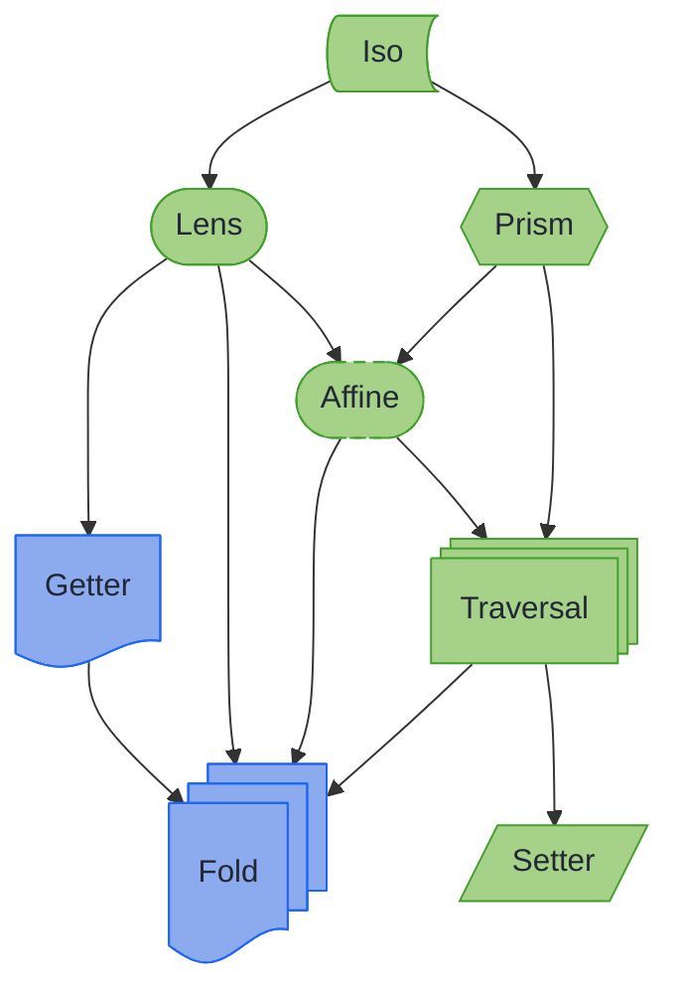

# Optic Composition Rules

_The optic type `andThen` returns for every pair of optics, and why._

> **You:** A lens always finds its field. So a lens followed by a prism always finds something?
>
> **`andThen`:** Only when the prism matches. `ConsignmentLenses.state()` finds the state, and `ConsignmentStatePrisms.returned()` finds nothing when that state is `Pending`.
>
> **You:** So the pair reaches zero or one value. Why is it not a prism?
>
> **`andThen`:** A prism can also build the whole from its part. Hand me a `Returned`: can you build the consignment it belongs to?
>
> **You:** No. The lens needs a consignment to put the state into.
>
> **`andThen`:** Then the pair cannot build, and something that reaches zero or one without building is an `Affine`.
>
> **You:** And two prisms in a row?
>
> **`andThen`:** Each can build, so the pair can too: a `Prism`.
>
> **You:** So I ask two things of each step: how many values it reaches, and whether it can build.
>
> **`andThen`:** The pair reaches the wider of the two, and builds only if both build.

The [Composition Rules Table](#composition-rules-table) works that rule out for every pair, and states it plainly beside the table.

---

## Ranking by Capability {#the-optic-hierarchy}

Optics order themselves by capability, from most specific (most operations available) to most general (fewest). An arrow points from an optic to one that can do less, and each is drawn in the [chapter's optic shapes](ch_intro.md#how-the-optic-types-relate):



In words: an `Iso` can do the most, and `Fold` and `Setter` the least: one can only read, the other only write.

~~~admonish note title="Capability, not Java subtyping"
These arrows rank what each optic can do; they are not `extends` edges. `Getter extends Fold` is the only inheritance between two optic types. Some steps are explicit conversions such as `asFold()` or `asTraversal()`; others, such as Lens to Affine, are reached only by composing. [Conversions](conversions.md) lists the ones that exist, and [Optic Capabilities](optic_capabilities.md) has the per-method table.
~~~

**What is Affine?** An Affine optic focuses on **zero or one** element within a structure. It combines the partial access of a Prism with the update capability of a Lens. Common use cases include:

- Accessing `Optional<T>` fields in records
- Working with nullable properties
- Navigating through optional intermediate structures

**Key insight**: composing two optics gives the most capable optic that both steps can support; the [composition rules table](#composition-rules-table) states the rule exactly.

---

## Composition Rules Table {#composition-rules-table}

Read each cell as what `first.andThen(second)` returns, with the row as `first`. The rest of this page writes that as `Lens.andThen(Prism) = Affine`, a lens's `andThen` given a prism returns an `Affine`, and `Any` stands for any of the five. A test in the examples module reads this table from the `andThen` overloads themselves, so it cannot promise a composition the library does not have:

| `first.andThen(second)` | Iso | Lens | Prism | Affine | Traversal |
|---|---|---|---|---|---|
| **Iso** | Iso | Lens | Prism | Affine | Traversal |
| **Lens** | Lens | Lens | Affine | Affine | Traversal |
| **Prism** | Prism | Affine | Prism | Affine | Traversal |
| **Affine** | Affine | Affine | Affine | Affine | Traversal |
| **Traversal** | Traversal | Traversal | Traversal | Traversal | Traversal |

Each optic is fixed by two answers: how many values it reaches, and whether it can build the whole from its part.

| Reaches | Can build the whole | Cannot |
|---|---|---|
| exactly one | `Iso` | `Lens` |
| zero or one | `Prism` | `Affine` |
| zero or more | | `Traversal` |

A composition reaches the wider of its two steps' reaches, and can build only if both steps can. So a `Lens` and a `Prism` reach zero or one value, and the lens cannot build: an `Affine`. Two prisms reach zero or one and both build: a `Prism`.

`Fold`, `Getter` and `Setter` compose with their own kind (`fold.andThen(otherFold)`), and with the others after a conversion such as `asFold()`; [Conversions](conversions.md) lists them.

---

## Why Lens.andThen(Prism) = Affine {#why-lens--prism--affine}

This is perhaps the most important composition rule to understand.

### The Intuition

A **Lens** guarantees exactly one focus. A **Prism** provides zero-or-one focuses (it may not match).

When you compose them:
- The Lens always gets you to `A`
- The Prism may or may not get you from `A` to `B`

Result: **zero-or-one** focuses, which is an **Affine** optic.

### Example

<!-- verify -->
```java
// Domain model
record Config(Optional<DatabaseSettings> database) {}
record DatabaseSettings(String host, int port) {}

// The Lens always gets the Optional<DatabaseSettings>
Lens<Config, Optional<DatabaseSettings>> databaseLens =
    Lens.of(Config::database, (c, db) -> new Config(db));

// The Prism may or may not extract the DatabaseSettings
Prism<Optional<DatabaseSettings>, DatabaseSettings> somePrism = Prisms.some();

// Composition: Lens.andThen(Prism) = Affine
Affine<Config, DatabaseSettings> databaseAffine =
    databaseLens.andThen(somePrism);

// Usage
Config config1 = new Config(Optional.of(new DatabaseSettings("localhost", 5432)));
Optional<DatabaseSettings> result1 = databaseAffine.getOptional(config1);
// result1 = Optional[DatabaseSettings[host=localhost, port=5432]]

Config config2 = new Config(Optional.empty());
Optional<DatabaseSettings> result2 = databaseAffine.getOptional(config2);
// result2 = Optional.empty() (the prism didn't match)

// Setting always succeeds
Config updated = databaseAffine.set(new DatabaseSettings("newhost", 3306), config2);
// updated = Config[database=Optional[DatabaseSettings[host=newhost, port=3306]]]
```

---

## Why Prism.andThen(Lens) = Affine {#why-prism--lens--affine}

Similarly, composing a Prism first and then a Lens also yields an Affine.

### The Intuition

A **Prism** may or may not match. If it matches, the **Lens** always gets you to the field.

Result: **zero-or-one** focuses, depending on whether the Prism matched.

### Example

<!-- verify -->
```java
// Domain model with sealed interface
sealed interface Shape permits Circle, Rectangle {}
record Circle(double radius, String colour) implements Shape {}
record Rectangle(double width, double height, String colour) implements Shape {}

// The Prism may or may not match Circle
Prism<Shape, Circle> circlePrism = Prism.of(
    shape -> shape instanceof Circle c ? Optional.of(c) : Optional.empty(),
    c -> c
);

// The Lens always gets the radius from a Circle
Lens<Circle, Double> radiusLens =
    Lens.of(Circle::radius, (c, r) -> new Circle(r, c.colour()));

// Composition: Prism.andThen(Lens) = Affine
Affine<Shape, Double> circleRadiusAffine = circlePrism.andThen(radiusLens);

// Usage
Shape circle = new Circle(5.0, "red");
Optional<Double> radius = circleRadiusAffine.getOptional(circle);
// radius = Optional[5.0]

Shape rectangle = new Rectangle(10.0, 20.0, "blue");
Optional<Double> empty = circleRadiusAffine.getOptional(rectangle);
// empty = Optional.empty() (prism didn't match)

// Modification only affects circles
Shape modified = circleRadiusAffine.modify(r -> r * 2, circle);
// modified = Circle[radius=10.0, colour=red]

Shape unchanged = circleRadiusAffine.modify(r -> r * 2, rectangle);
// unchanged = Rectangle[width=10.0, height=20.0, colour=blue] (unchanged)
```

---

## Available Composition Methods

### Direct Composition (Recommended)

higher-kinded-j provides direct `andThen` methods that automatically return the correct type:

```java
// Lens.andThen(Lens) = Lens
Lens<A, C> result = lensAB.andThen(lensBC);

// Lens.andThen(Prism) = Affine
Affine<A, C> result = lensAB.andThen(prismBC);

// Prism.andThen(Prism) = Prism
Prism<A, C> result = prismAB.andThen(prismBC);

// Prism.andThen(Lens) = Affine
Affine<A, C> result = prismAB.andThen(lensBC);

// Affine.andThen(Affine) = Affine
Affine<A, C> result = affineAB.andThen(affineBC);

// Affine.andThen(Lens) = Affine
Affine<A, C> result = affineAB.andThen(lensBC);

// Traversal.andThen(Traversal) = Traversal
Traversal<A, C> result = traversalAB.andThen(traversalBC);
```

### Via asTraversal (Universal Fallback)

Every pair of the five optics composes directly, so you rarely need this. Convert to `Traversal` when you want to hold optics of different kinds as one type, such as in a list of paths:

```java
// Any optic composition via Traversal
Traversal<A, D> result =
    optic1.asTraversal()
        .andThen(optic2.asTraversal())
        .andThen(optic3.asTraversal());
```

It loses type information: you get a `Traversal` even where a more specific optic was possible. `Fold` and `Getter` do not convert to a `Traversal` at all.

---

## Practical Guidelines

### 1. Use Direct Composition When Possible

<!-- verify -->
```java
// Preferred: direct andThen keeps the precise type, here zero or one host
Affine<Config, String> host =
    databaseLens.andThen(somePrism).andThen(hostLens);
```

### 2. Chain Multiple Compositions

<!-- verify -->
```java
// Multiple compositions
Affine<Order, String> customerEmail =
    orderCustomerLens                    // Lens<Order, Customer>
        .andThen(customerContactPrism)   // Prism<Customer, ContactInfo>
        .andThen(contactEmailLens);      // Lens<ContactInfo, String>
```

### 3. Store Complex Compositions as Constants

<!-- verify -->
```java
public final class OrderOptics {
    // Reusable compositions
    public static final Affine<Order, String> CUSTOMER_EMAIL =
        OrderLenses.customer()
            .andThen(CustomerPrisms.activeCustomer())
            .andThen(ActiveCustomerLenses.email());

    public static final Traversal<Order, Money> LINE_ITEM_PRICES =
        OrderTraversals.lineItems()
            .andThen(LineItemLenses.price());
}
```

---

## Parallel Composition with `Fold.plus()`

The [composition rules](#composition-rules-table) describe **sequential** composition (`andThen`): navigating deeper into a structure. Higher-Kinded-J also supports **parallel** composition via `Fold.plus()`, which combines results from multiple paths at the same level.

| Operation | Type | Purpose |
|-----------|------|---------|
| `andThen` | Sequential | Navigate deeper: `A -> B -> C` |
| `plus` | Parallel | Combine results: `A -> B` and `A -> C` into `A -> (B + C)` |

<!-- verify -->
```java
// Sequential: navigate deeper into the structure
Fold<Customer, Item> items = ordersFold.andThen(itemsFold);

// Parallel: combine results from different paths
Fold<Person, String> allNames = firstNameFold.plus(lastNameFold);

// Both together: compose then combine
Fold<Team, String> allEmails = Fold.sum(
    leadLens.asFold().andThen(emailLens.asFold()),
    membersFold.andThen(emailLens.asFold())
);
```

`plus` produces a `Fold` regardless of the input optic types, since the combined result is always read-only. Convert other optics via `asFold()` before combining.

---

## Common Patterns

### Pattern 1: Optional Field Access

Navigate to an optional field that may not exist:

<!-- verify -->
```java
@GenerateLenses record User(String name, Optional<Address> address) {}
@GenerateLenses record Address(String street, String city) {}

// Lens to Optional, Prism to extract, Lens to field
Affine<User, String> userCity =
    UserLenses.address()           // Lens<User, Optional<Address>>
        .andThen(Prisms.some())    // Prism<Optional<Address>, Address>
        .andThen(AddressLenses.city()); // Lens<Address, String>
```

### Pattern 2: Sum Type Field Access

Navigate into a specific case of a sealed interface:

<!-- verify -->
```java
@GeneratePrisms sealed interface Payment permits CreditCard, BankTransfer {}
@GenerateLenses record CreditCard(String number, String expiry) implements Payment {}
record BankTransfer(String iban, String bic) implements Payment {}

// Prism to case, Lens to field
Affine<Payment, String> creditCardNumber =
    PaymentPrisms.creditCard()     // Prism<Payment, CreditCard>
        .andThen(CreditCardLenses.number()); // Lens<CreditCard, String>
```

### Pattern 3: Conditional Collection Access

Navigate into items that match a condition:

<!-- verify -->
```java
// Traversal over list, filter by predicate
Traversal<List<Order>, Order> activeOrders =
    Traversals.<Order>forList()
        .andThen(Traversals.filtered(Order::isActive));
```

---

## Which composition fits which data {#summary}

| Composition | Result | Use Case |
|-------------|--------|----------|
| Lens.andThen(Lens) | Lens | Nested product types (records) |
| Lens.andThen(Prism) | Affine | Product containing sum type |
| Prism.andThen(Lens) | Affine | Sum type containing product |
| Prism.andThen(Prism) | Prism | Nested sum types |
| Affine.andThen(Affine) | Affine | Chained optional access |
| Affine.andThen(Lens) | Affine | Optional then field access |
| Affine.andThen(Prism) | Affine | Optional then variant match |
| Any.andThen(Traversal) | Traversal | Collection access |
| Iso.andThen(Any) | Same as second | Type conversion first |

~~~admonish tip title="Why this matters"
The result type of a composition is not a convenience, it is a promise. When `Lens.andThen(Prism)` hands you an `Affine`, the type is telling you the focus can be absent, and the compiler will not let you forget it; when a chain stays a `Lens`, totality survived every step and no absence handling is needed. That is the same discipline the mapping chapter later formalises as [truthful tiers](../mapping/tiers.md): the API only ever offers what the composition can lawfully support, so a whole class of "worked in the demo, failed in production" bugs becomes unrepresentable.
~~~

~~~admonish tip title="See Also"
- [Affines](affine.md): the zero-or-one optic most compositions land on
- [Cheat Sheet](../cheatsheet.md): the whole optics API on one page
~~~

~~~admonish info title="Hands-On Learning"
Practise lens composition in [Tutorial 02: Lens Composition](https://github.com/higher-kinded-j/higher-kinded-j/blob/main/hkj-examples/src/test/java/org/higherkindedj/tutorial/optics/Tutorial02_LensComposition.java) (7 exercises).
~~~

---

**Previous:** [Conversions](conversions.md)
**Next:** [Coming from Lombok, Streams and Switch](from_java.md)
