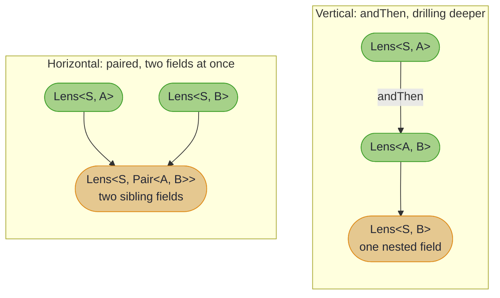
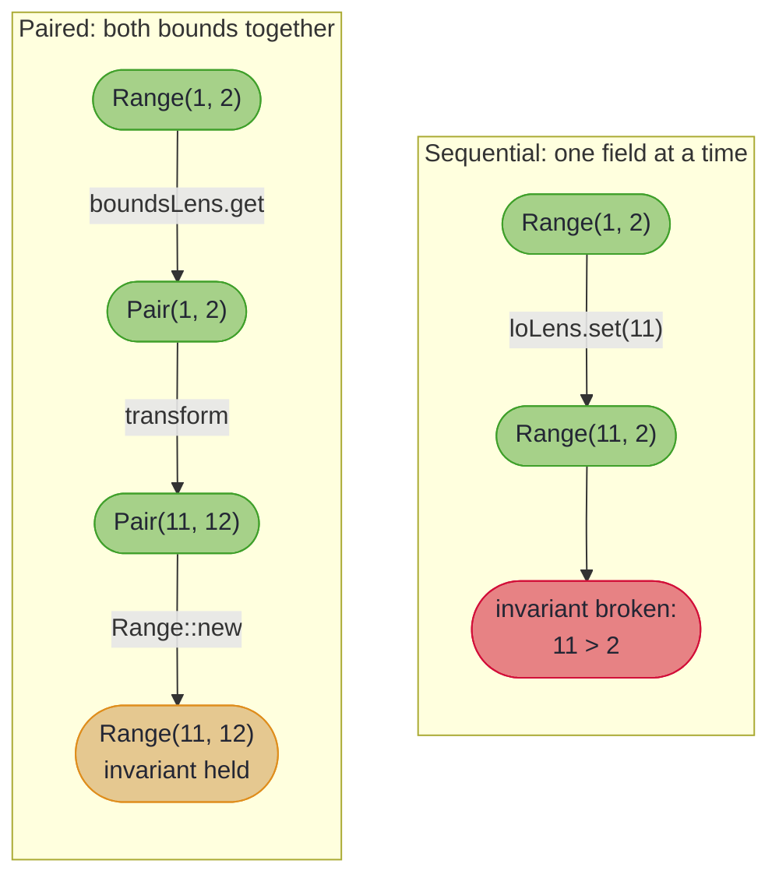

# When Lenses Assume Too Much

## _Atomic Updates for Fields with Shared Invariants_

> *"A bug is never just a mistake. It represents something bigger. An error of thinking that makes you who you are."*
>
> – Elliot Alderson, *Mr. Robot*

When a lens update throws an exception, it is not the lens that is broken; it is our assumption about field independence. What looks like a bug often reveals a deeper truth about the relationship between fields in our data structures.

Consider a familiar scenario: you have a record with validation in its constructor. You have written (or generated) lenses for each field. Everything works perfectly, until you need to update two fields together. Suddenly, valid transformations become impossible.

The hidden culprit? Standard lens composition assumes fields are independent, that you can update `lo` without caring about `hi`. But some fields are *coupled* by invariants. They do not just coexist; they constrain each other. Lenses, in their elegant simplicity, do not know this.

~~~admonish info title="What You'll Learn"
- Why standard lens updates can fail with invariant-protected records
- The hidden assumption of field independence in lens composition
- How to use `Lens.paired` for atomic multi-field updates
- How `CoupledLenses.coupled3` ... `coupled9` extend the same shape to N fields
- When to define paired lenses vs individual field lenses
- Limitations and alternative approaches
~~~

~~~admonish example title="See Example Code"
[PairedLensExample.java](https://github.com/higher-kinded-j/higher-kinded-j/blob/main/hkj-examples/src/main/java/org/higherkindedj/example/optics/PairedLensExample.java)
~~~

---

## The Independence Assumption

When we compose lenses with `andThen`, we are drilling *vertically* through nested structures:



Vertical composition (`andThen`) assumes that once you have focused on a field, you can update it independently. This works beautifully for nested structures like `Employee → Company → Address → Street`.

But what about sibling fields at the same level that share an invariant?

---

## The Problem: Invariant Violation

Consider a simple bounded range:

<!-- verify -->
```java
record Range(int lo, int hi) {
    Range {
        if (lo > hi) {
            throw new IllegalArgumentException(
                "lo (" + lo + ") must be <= hi (" + hi + ")");
        }
    }
}
```

We can create lenses for each field:

<!-- verify -->
```java
Lens<Range, Integer> loLens =
    Lens.of(Range::lo, (r, lo) -> new Range(lo, r.hi()));

Lens<Range, Integer> hiLens =
    Lens.of(Range::hi, (r, hi) -> new Range(r.lo(), hi));
```

Now let us try to shift the range up by 10:

<!-- verify -->
```java
Range range = new Range(1, 2);

// Goal: Range(1, 2) → Range(11, 12)

// Attempt 1: Update lo first
Range step1 = loLens.set(11, range);  // Range(11, 2)
// THROWS: "lo (11) must be <= hi (2)"
```

The update failed because the intermediate state `Range(11, 2)` violates the invariant.

What if we update `hi` first?

<!-- verify -->
```java
Range step1 = hiLens.set(12, range);  // Range(1, 12) - OK!
Range step2 = loLens.set(11, step1);  // Range(11, 12) - OK!
```

That works! But now try shifting *down* by 10 from `Range(10, 11)`:

<!-- verify -->
```java
Range narrow = new Range(10, 11);

// If we update hi first: Range(10, 1) - THROWS!
// If we update lo first: Range(0, 11) → Range(0, 1) - OK
```

The "correct" order depends on the direction of change!

---

## Why This Happens



The goal is to shift both bounds by ten, from `Range(1, 2)` to `Range(11, 12)`, under the invariant `lo <= hi`.

Sequential lens updates create intermediate states. When fields are coupled by an invariant, these intermediate states can be invalid, even when both the starting and ending states are perfectly valid.

---

## The Solution: Paired Lenses

> *"They're all tied in together."*
>
> – Sergeant Pinback, *Dark Star*

This boils down to: if fields are coupled, update them together. `Lens.paired` combines two lenses into one that focuses on both values as a `Pair`:

<!-- verify -->
```java
Lens<Range, Pair<Integer, Integer>> boundsLens =
    Lens.paired(loLens, hiLens, Range::new);
```

Now we can shift safely:

<!-- verify -->
```java
Range range = new Range(1, 2);

// Shift up by 10 - both values updated atomically
Range shifted = boundsLens.modify(
    p -> Pair.of(p.first() + 10, p.second() + 10),
    range
);
// Result: Range(11, 12)
```

The transformation happens in a single step:
1. Extract both values: `Pair(1, 2)`
2. Transform: `Pair(11, 12)`
3. Reconstruct via `Range::new`: `Range(11, 12)`

No intermediate state. No invariant violation. Order independence.

---

## API Reference

### `Lens.paired` with BiFunction

When your record has only the coupled fields:

```java
static <S, A, B> Lens<S, Pair<A, B>> paired(
    Lens<S, A> first,
    Lens<S, B> second,
    BiFunction<A, B, S> constructor
)
```

**Example:**
<!-- verify -->
```java
Lens<Range, Pair<Integer, Integer>> boundsLens =
    Lens.paired(loLens, hiLens, Range::new);
```

### `Lens.paired` with Function3

When your record has additional fields that must be preserved:

```java
static <S, A, B> Lens<S, Pair<A, B>> paired(
    Lens<S, A> first,
    Lens<S, B> second,
    Function3<S, A, B, S> reconstructor
)
```

**Example:**
<!-- verify -->
```java
record Transaction(String id, int min, int max, String note) {
    Transaction {
        if (min > max) throw new IllegalArgumentException("min > max");
    }
}

Lens<Transaction, Pair<Integer, Integer>> limitsLens = Lens.paired(
    minLens,
    maxLens,
    (txn, newMin, newMax) -> new Transaction(txn.id(), newMin, newMax, txn.note())
);
```

---

## Choosing the Right Approach

| Scenario | Recommended Approach |
|----------|---------------------|
| Independent fields | Use individual lenses, or fold several into one operation with [`Edits`](multi_edit.md) |
| Fields with shared invariant | Use `Lens.paired` |
| Sparse or validated edits to fields a constructor checks together | Use [`Edits.accumulate(focus, …)`](multi_edit.md#fields-a-constructor-checks-together), with a `Lens.paired` as the focus if you have one |
| Computed/derived fields | Don't expose a lens for the computed field |
| Cross-structure invariants | Use domain methods, not lenses |

### When NOT to Use Paired Lenses

**Computed fields:** If field B is always computed from field A, do not create a lens for B at all:

<!-- verify -->
```java
// Data is the source of truth; checksum is derived
Lens<Packet, byte[]> dataLens = Lens.of(
    Packet::data,
    (p, newData) -> new Packet(newData, computeChecksum(newData))
);
// No checksumLens - it's always recomputed
```

**Cross-structure invariants:** When invariants span parent and child objects, use domain methods:

<!-- verify -->
```java
// Don't use lenses - use domain operations
Order updated = order.withLine(lineId, line -> line.withPrice(newPrice));
// The withLine method recalculates totalPrice internally
```

---

## Practical Examples

### Bounded Ranges

<!-- verify -->
```java
record Range(int lo, int hi) {
    Range { if (lo > hi) throw new IllegalArgumentException(); }
}

Lens<Range, Pair<Integer, Integer>> boundsLens =
    Lens.paired(loLens, hiLens, Range::new);

// Shift
Range shifted = boundsLens.modify(
    p -> Pair.of(p.first() + 10, p.second() + 10),
    range
);

// Scale
Range scaled = boundsLens.modify(
    p -> Pair.of(p.first() * 2, p.second() * 2),
    range
);

// Widen symmetrically
Range widened = boundsLens.modify(
    p -> Pair.of(p.first() - 5, p.second() + 5),
    range
);
```

### Rectangles with Constraints

<!-- verify -->
```java
record Rectangle(Point topLeft, Point bottomRight) {
    Rectangle {
        if (topLeft.x() >= bottomRight.x() || topLeft.y() >= bottomRight.y()) {
            throw new IllegalArgumentException("Invalid rectangle bounds");
        }
    }
}

Lens<Rectangle, Pair<Point, Point>> cornersLens =
    Lens.paired(topLeftLens, bottomRightLens, Rectangle::new);

// Move the entire rectangle
Rectangle moved = cornersLens.modify(
    p -> Pair.of(
        p.first().translate(dx, dy),
        p.second().translate(dx, dy)
    ),
    rect
);
```

### Configuration with Port Ranges

<!-- verify -->
```java
record ServerConfig(String host, int minPort, int maxPort) {
    ServerConfig {
        if (minPort > maxPort || minPort < 1024 || maxPort > 65535) {
            throw new IllegalArgumentException("Invalid port range");
        }
    }
}

Lens<ServerConfig, Pair<Integer, Integer>> portsLens = Lens.paired(
    minPortLens,
    maxPortLens,
    (cfg, min, max) -> new ServerConfig(cfg.host(), min, max)
);

// Shift port range up by 1000
ServerConfig updated = portsLens.modify(
    p -> Pair.of(p.first() + 1000, p.second() + 1000),
    serverConfig
);
```

---

## Composition with Paired Lenses

A paired lens is just a normal `Lens<S, Pair<A, B>>`, so it composes naturally:

<!-- verify -->
```java
// Config contains ServerConfig which has coupled port range
Lens<Config, Pair<Integer, Integer>> configPorts =
    configServerLens.andThen(serverPortsLens);

// Shift both ports atomically through the nested structure
Config updated = configPorts.modify(
    p -> Pair.of(p.first() + 1000, p.second() + 1000),
    config
);
```

~~~admonish warning title="Anti-Pattern: Unpacking a Paired Lens"
Avoid composing a paired lens with a lens that extracts a single element:

<!-- verify -->
```java
// DON'T DO THIS - defeats the purpose of pairing
Lens<Pair<Integer, Integer>, Integer> firstLens =
    Lens.of(Pair::first, (p, a) -> Pair.of(a, p.second()));
Lens<Range, Integer> justLo = boundsLens.andThen(firstLens);
// You're back to the original problem!
```

If you need single-field access, use the original individual lens directly.
~~~

---

## Three or More Coupled Fields

`Lens.paired` is the binary case. For three to nine coupled fields, reach for the arity ladder in `CoupledLenses` (in `org.higherkindedj.optics.util`), generated by `hkj-processor`:

<!-- verify -->
```java
import org.higherkindedj.optics.util.CoupledLenses;

record Triple(int lo, int mid, int hi) {
    Triple {
        if (!(lo <= mid && mid <= hi)) {
            throw new IllegalArgumentException("lo <= mid <= hi");
        }
    }
}

Lens<Triple, Integer> loLens  = Lens.of(Triple::lo,  (t, lo)  -> new Triple(lo, t.mid(), t.hi()));
Lens<Triple, Integer> midLens = Lens.of(Triple::mid, (t, mid) -> new Triple(t.lo(), mid, t.hi()));
Lens<Triple, Integer> hiLens  = Lens.of(Triple::hi,  (t, hi)  -> new Triple(t.lo(), t.mid(), hi));

// Same shape as Lens.paired, just one more lens and a Function3 constructor reference.
Lens<Triple, Tuple3<Integer, Integer, Integer>> bounds =
    CoupledLenses.coupled3(loLens, midLens, hiLens, Triple::new);

Triple shifted = bounds.modify(
    t -> new Tuple3<>(t._1() + 10, t._2() + 10, t._3() + 10),
    new Triple(1, 5, 10));
// Triple(11, 15, 20) - constructor only ever sees the new, valid value.
```

The ladder runs `coupled3` through `coupled9` and each method has two overloads, mirroring `Lens.paired` exactly:

| Form | Reconstructor signature | Use when |
|---|---|---|
| Preserving | `(S, A, B, C, ...) -> S` | the source has other fields the rebuild needs to keep |
| Simple | `(A, B, C, ...) -> S` (constructor reference) | the focused fields fully determine the source |

```java
// Preserving form: receives the original source so other fields can be carried over.
Lens<Trade, Tuple3<String, BigDecimal, Integer>> money =
    CoupledLenses.coupled3(
        currencyLens, amountLens, precisionLens,
        (trade, ccy, amt, prec) -> trade.withMoney(ccy, amt, prec));

// Simple form: constructor reference when nothing else needs preserving.
Lens<Triple, Tuple3<Integer, Integer, Integer>> bounds =
    CoupledLenses.coupled3(loLens, midLens, hiLens, Triple::new);
```

~~~admonish note title="Why CoupledLenses, not Lens.coupled3?"
`Lens.paired` lives on the `Lens` interface in `hkj-api`. Generated code cannot add static methods to an existing API interface, so the arity ladder lives in `hkj-core`'s `org.higherkindedj.optics.util` package as a separate utility class. One discoverability cost: you import `CoupledLenses` to use the ladder. Everything else is identical to `Lens.paired`, including the two-overload pattern, the atomic-reconstruction semantics, and the lens laws.
~~~

~~~admonish info title="Past nine fields?"
The ladder caps at `coupled9` because cross-field invariants past five fields are already rare and past nine vanishing. If you genuinely need a higher arity (rather than splitting the record), open a GitHub feature request and the generator cap can be raised.
~~~


## Lens Laws

Paired lenses satisfy the standard lens laws when the two lenses focus on different components and the constructor accepts the values you set:

- **GetPut:** `set(get(s), s) == s`
- **PutGet:** `get(set(a, s)) == a`
- **PutPut:** `set(a2, set(a1, s)) == set(a2, s)`

These are verified by property-based tests in `LensPairedLawsPropertyTest.java`.

---

~~~admonish info title="Key Takeaways"
* **Standard lenses assume field independence**: updating one field should not affect another
* **Coupled fields violate that assumption**: an invariant makes two fields constrain each other
* **Sequential updates pass through invalid intermediate states**, even when the start and the end are both valid
* **`Lens.paired` updates the group atomically**: no intermediate state exists for the constructor to reject
* **`CoupledLenses.coupled3` to `coupled9` is the same shape for more fields**, generated into `org.higherkindedj.optics.util`
* **Order independence follows**: a paired lens does not care which direction you are transforming
~~~

~~~admonish info title="Hands-On Learning"
Practise both the binary form and the arity ladder in [Tutorial 23: N-ary Coupled Lenses](https://github.com/higher-kinded-j/higher-kinded-j/blob/main/hkj-examples/src/test/java/org/higherkindedj/tutorial/optics/Tutorial23_CoupledLenses.java) (3 exercises).
~~~

~~~admonish tip title="See Also"
- [Lenses](lenses.md): core lens concepts and operations
- [Composition Rules](composition_rules.md): how different optics compose
- [Isomorphisms](iso.md): transforming between constrained and unconstrained representations
~~~

~~~admonish tip title="Further Reading"
**Chris Penner**: [Virtual Record Fields Using Lenses](https://chrispenner.ca/posts/virtual-fields): introduces "virtual fields" as computed properties accessed through lenses. Penner demonstrates how hiding data constructors and exporting only lenses creates a stable public interface that absorbs internal refactoring. His treatment of data invariants is relevant here: where we use `Lens.paired` to *enforce* invariants during updates, Penner uses lenses to *hide* representation details and maintain invariants transparently. He also candidly notes that breaking lens laws is "usually perfectly fine" for pragmatism, echoing our observation that real-world records often have constraints that do not fit the idealised lens model.

**Gunnar Morling**: [Enforcing Java Record Invariants With Bean Validation](https://www.morling.dev/blog/enforcing-java-record-invariants-with-bean-validation/): tackles record invariants from a different angle, using Bean Validation annotations to enforce constraints automatically at construction time. The article explicitly discusses multi-field invariants like "end must be greater than begin", precisely the kind of coupled constraint that breaks sequential lens updates. Morling's approach guarantees the invariant holds but does not help you *transform* a valid object when both fields must change together. This is where `Lens.paired` complements Bean Validation: validation solves the construction problem; paired lenses solve the transformation problem. In a robust system, you would use both.
~~~

---

**Previous:** [Composition Rules](composition_rules.md)
**Next:** [Introduction to Collection Optics](ch2_intro.md)
