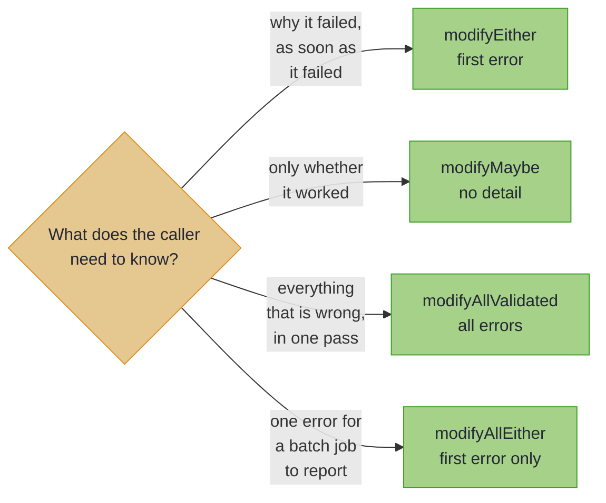

# Updates That Can Fail

_Check a value as you update it, and choose whether the caller hears the first error or every one._


~~~admonish info title="What You'll Learn"
- Update a field through a check that may reject the new value
- Check every element of a list, and report every failure at once
- Choose between the first error, every error, or no detail at all
- Reach for `modifyF` when the effect is something else, such as an asynchronous call
~~~

~~~admonish example title="See Example Code"
**The code on this page is [FluentBook.java](https://github.com/higher-kinded-j/higher-kinded-j/blob/main/hkj-examples/src/main/java/org/higherkindedj/example/book/optics/fluent/FluentBook.java) and its [FluentBookTest.java](https://github.com/higher-kinded-j/higher-kinded-j/blob/main/hkj-examples/src/test/java/org/higherkindedj/example/book/optics/fluent/FluentBookTest.java)**: the page includes them, so the build compiles and runs them.
~~~

A path's `modify` takes a function that always succeeds. A real update often has to check the new value first: an email must contain `@`, and a price must not be negative. `OpticOps`, the library's fluent API, runs the check through an optic and hands back the outcome as a value. That value is an `Either`, which holds the first error or the updated record; a `Validated`, which holds every error or the updated record; or a `Maybe`, the library's `Optional`. `OpticOps` takes the optic, which a path hands over with `toLens()` or `toTraversal()`, as [What a Path Is Made Of](optics_intro.md#each-path-type-wraps-an-optic) showed.

---

## Every element, every error {#every-element-every-error}

The records are the chapter's cast: an order of priced line items, placed by a customer.

~~~admonish example title="The cast these examples use" collapsible=true
``` java
@GenerateLenses
@GenerateFocus(generateNavigators = true)
@GenerateTraversals
public record Order(
    UUID id,
    Customer customer,
    List<LineItem> lines,
    Instant placedAt,
    Currency currency,
    OrderStatus status) {}
```

``` java
@GenerateLenses
@GenerateFocus
public record LineItem(String sku, Integer quantity, BigDecimal price) {}
```

``` java
@GenerateLenses
@GenerateFocus(generateNavigators = true)
public record Customer(String name, EmailAddress email) {}
```

``` java
@GenerateLenses
@GenerateFocus
public record EmailAddress(String value) {}
```
~~~

Checking every price on an order by hand is a loop that collects the errors:

``` java
    List<String> errors = new ArrayList<>();
    for (LineItem line : order.lines()) {
      if (line.price().signum() < 0) {
        errors.add("Price cannot be negative: " + line.price());
      } else if (line.price().compareTo(MAXIMUM) > 0) {
        errors.add("Price exceeds maximum: " + line.price());
      }
    }
```

That loop works. It knows the order's shape, though, and it ends in a list you still have to turn into an answer, by throwing or by returning the order. Written once as a method that returns its verdict, the check goes through the optic instead:

``` java
  static final BigDecimal MAXIMUM = new BigDecimal("10000");

  static Validated<String, BigDecimal> checkPrice(BigDecimal price) {
    if (price.signum() < 0) {
      return Validated.invalid("Price cannot be negative: " + price);
    }
    return price.compareTo(MAXIMUM) > 0
        ? Validated.invalid("Price exceeds maximum: " + price)
        : Validated.valid(price);
  }

```

``` java
    Traversal<Order, BigDecimal> prices =
        OrderFocus.lines().via(LineItemFocus.price()).toTraversal();

    Validated<List<String>, Order> checked =
        OpticOps.modifyAllValidated(order, prices, FluentBook::checkPrice);

    String report =
        checked.fold(
            errors -> errors.size() + " invalid prices: " + String.join("; ", errors),
            _ -> "all prices accepted");
```

For an order priced at -10.00, 25.00 and 15000.00, `checked` is `Invalid(["Price cannot be negative: -10.00", "Price exceeds maximum: 15000.00"])`, and `report` reads `"2 invalid prices: Price cannot be negative: -10.00; Price exceeds maximum: 15000.00"`. An order whose prices all pass comes back as `Valid`, holding the order. One call names both bad prices, and the answer is a value, which goes on to combine with other checks rather than end in a throw.

The check returns `Validated<String, BigDecimal>`, one error at most, and the result collects them as `Validated<List<String>, Order>`. The lifting into a list is done for you. `OpticOps` takes the source first, as a static utility method does.

---

## Four ways to fail {#part-2-validation-aware-modification}

Four methods differ only in what they tell the caller when a check fails:

| Method | Result | Behaviour | Best for |
|--------|--------|-----------|----------|
| `modifyEither` | `Either<E, S>` | First error wins | Sequential validation, fail fast |
| `modifyMaybe` | `Maybe<S>` | Success or nothing, no detail | Optional enrichment |
| `modifyAllValidated` | `Validated<List<E>, S>` | Accumulates every error | Forms, imports, user feedback |
| `modifyAllEither` | `Either<E, S>` | First error wins (every element is still evaluated) | A batch job that reports one error |



The rest of this section uses three more checks, each as short as `checkPrice`:

~~~admonish example title="The other checks" collapsible=true
``` java
  static Either<String, BigDecimal> checkPriceEither(BigDecimal price) {
    return checkPrice(price).toEither();
  }

  static Either<String, String> checkEmail(String email) {
    return email.contains("@") ? Either.right(email) : Either.left("Invalid email: " + email);
  }

  static Maybe<String> normaliseName(String name) {
    String trimmed = name.strip();
    return trimmed.length() >= 2 && trimmed.length() <= 40 ? Maybe.just(trimmed) : Maybe.nothing();
  }

```
~~~

### One field, fail fast {#one-field-fail-fast}

``` java
    Lens<Customer, String> email = CustomerFocus.email().value().toLens();

    Either<String, Customer> result =
        OpticOps.modifyEither(customer, email, FluentBook::checkEmail);

    String message =
        result.fold(error -> "rejected: " + error, c -> "accepted: " + c.email().value());
```

For `ada@example.com`, `message` is `"accepted: ada@example.com"`; for `bob.example.com`, `result` is `Left("Invalid email: bob.example.com")`.

### One field, no detail {#one-field-silent-failure}

``` java
    Maybe<Customer> normalised =
        OpticOps.modifyMaybe(customer, CustomerFocus.name().toLens(), FluentBook::normaliseName);

    Customer safe = normalised.orElse(customer);
```

A name of `"  Ada  "` comes back trimmed in a `Just`; a one-letter name gives `Nothing`, and `safe` falls back to the customer as they were. `modifyMaybe` has the shape of `modifyEither`, minus the explanation, so use it when the caller's next move is a fallback rather than a message.

### Every element, first error only {#every-element-first-error-only}

``` java
    Either<String, Order> firstFailure =
        OpticOps.modifyAllEither(order, prices, FluentBook::checkPriceEither);
```

For the order with two bad prices, `firstFailure` is `Left("Price cannot be negative: -10.00")`.

~~~admonish tip title="Why this matters"
The difference between `modifyAllValidated` and `modifyAllEither` is a product decision, not a technical one. A user filling in a form wants every problem at once; a batch job wants one error and no report. Both are one method call, and the type you get back tells the next reader which decision was made. `Either` keeps only the first error in its *result*, but the traversal still applies your check to every element before the results are combined, so it does not save the work.
~~~

### Sequential validation {#sequential-validation}

`Either` chains, so a fail-fast registration is a `flatMap` per field:

``` java
    Either<String, Customer> registered =
        OpticOps.modifyEither(
                customer, CustomerFocus.email().value().toLens(), FluentBook::checkEmail)
            .flatMap(
                checked ->
                    OpticOps.modifyEither(
                        checked,
                        CustomerFocus.name().toLens(),
                        name ->
                            name.length() >= 2
                                ? Either.right(name)
                                : Either.left("Name must be at least 2 characters")));
```

A bad email stops the chain with `Left("Invalid email: ...")` before the name is looked at; a good email and a one-letter name give `Left("Name must be at least 2 characters")`.

~~~admonish tip title="You can ship now"
You can now check a field or every element of a list as you update it, and choose whether the caller hears the first error or every one. The rest of this page is for an effect other than these three, and for code that holds an optic rather than a path.
~~~

~~~admonish question title="Checkpoint: every error or the first" id="check-fluent-every-first"
An order's lines are priced -1.00, 5.00 and -2.00. What do `modifyAllValidated` and `modifyAllEither` return, with the price check from this page?
~~~

~~~admonish success title="Answer and why" collapsible=true id="check-fluent-every-first-answer"
**`modifyAllValidated` returns `Invalid(["Price cannot be negative: -1.00", "Price cannot be negative: -2.00"])`; `modifyAllEither` returns `Left("Price cannot be negative: -1.00")`.** Both check every price; one keeps every failure, the other only the first.

Where this lives: [Four ways to fail](#part-2-validation-aware-modification).
~~~

~~~admonish question title="Checkpoint: a chain of `modifyEither`" id="check-fluent-chain"
Suppose the registration chain checked the name first, then the email. What would a customer named `B` with the email `b.example.com` get?
~~~

~~~admonish success title="Answer and why" collapsible=true id="check-fluent-chain-answer"
**`Left("Name must be at least 2 characters")`.** A `Left` stops a `flatMap` chain at the first failure, so the email is never checked: the first check in the chain decides which error you hear.

Where this lives: [Sequential validation](#sequential-validation).
~~~

---

## Any other effect: `modifyF` {#part-3-arbitrary-effects-with-modifyf}

The four methods cover `Either`, `Maybe` and `Validated`. For any other effect, such as fetching current prices asynchronously, every optic that writes and every path has `modifyF`. It takes an `Applicative`, the object that knows how to combine results inside that effect, and it speaks `Kind`, the library's encoding of a generic container such as `CompletableFuture<A>`. That makes it the mechanism behind `modifyAllValidated` and `modifyAllEither`, at the price of some ceremony at the call site:

~~~admonish example title="Current prices fetched asynchronously, with `modifyF`" collapsible=true
``` java
  static CompletableFuture<BigDecimal> currentPrice(BigDecimal listed) {
    return CompletableFuture.completedFuture(listed.add(BigDecimal.ONE));
  }

```

``` java
    Applicative<CompletableFutureKind.Witness> futures = Instances.applicative(completableFuture());

    TraversalPath<Order, BigDecimal> prices = OrderFocus.lines().via(LineItemFocus.price());

    Kind<CompletableFutureKind.Witness, Order> pending =
        prices.modifyF(price -> FUTURE.widen(currentPrice(price)), order, futures);

    CompletableFuture<Order> repriced = FUTURE.narrow(pending);
```

`currentPrice` is a stub standing in for a price service. For prices of 40.00 and 2.50, the future completes with prices of 41.00 and 3.50. `FUTURE.widen` and `FUTURE.narrow` convert between `CompletableFuture` and its `Kind`. `modifyAllValidated` is the same call with a `Validated` applicative over a list of errors, each check's error wrapped in a list, and it does that conversion out of sight.
~~~

Reach for `modifyF` for an effect beyond the three, such as `IO`, `CompletableFuture`, `VTask` or your own. Reach for it too for a check that is itself an effect, such as a lookup over the network, and anywhere you already hold an `Applicative`. `OpticOps.modifyF` and `OpticOps.modifyAllF` take the same arguments, source first, for a raw optic. [Type Class and Effect Integration](focus_effects.md) has more.

---

## Field notes {#field-notes}

The rest of this page is for code that holds an optic rather than a path, and for the idioms that recur around `OpticOps`.

### Reads, writes and queries {#part-1-reading-writing-querying}

`OpticOps` restates every read and write, source first, and is overloaded on the optic type, so the same names work whatever you hand them. If you know optics from Haskell or Scala, `get` is `view`, `modify` is `over`, and `preview` keeps its name. These examples use the cast's generated `Lenses` and `Traversals` classes:

``` java
    Traversal<Order, Integer> quantities =
        OrderTraversals.lines().andThen(LineItemLenses.quantity());

    // Read
    String name = OpticOps.get(customer, CustomerLenses.name());
    List<Integer> allQuantities = OpticOps.getAll(order, quantities);
    Optional<Integer> firstQuantity = OpticOps.preview(order, quantities);

    // Write
    Order paid = OpticOps.set(order, OrderLenses.status(), OrderStatus.PAID);
    Order doubled = OpticOps.modifyAll(order, quantities, quantity -> quantity * 2);

    // Query, without modifying anything
    boolean anyBulk = OpticOps.exists(order, quantities, quantity -> quantity >= 4);
    boolean allOrdered = OpticOps.all(order, quantities, quantity -> quantity >= 1);
    int lineCount = OpticOps.count(order, OrderTraversals.lines());
    boolean noLines = OpticOps.isEmpty(order, OrderTraversals.lines());
    Optional<LineItem> overTen =
        OpticOps.find(
            order, OrderTraversals.lines(), line -> line.price().compareTo(BigDecimal.TEN) > 0);
```

### Static methods or builders {#the-two-styles}

Nearly every operation exists as a concise static method and as a fluent builder. They compile to the same thing; pick per call site:

``` java
    // Static style
    int quantity = OpticOps.get(lamp, LineItemLenses.quantity());
    LineItem more = OpticOps.modify(lamp, LineItemLenses.quantity(), q -> q + 1);

    // Builder style
    int sameQuantity = OpticOps.getting(lamp).through(LineItemLenses.quantity());
    LineItem alsoMore = OpticOps.modifying(lamp).through(LineItemLenses.quantity(), q -> q + 1);
```

The static form is shorter, for a one-off operation where naming it twice would be noise. The builder reads better when the optic expression is long, and the IDE's completion list after `OpticOps.modifying(order).` is a decent map of what is possible. Four builders cover reading, setting, modifying and querying:

``` java
    List<Integer> all = OpticOps.getting(order).allThrough(quantities);
    Order reset = OpticOps.setting(order).allThrough(quantities, 1);
    Order bumped = OpticOps.modifying(order).allThrough(quantities, quantity -> quantity + 1);
    boolean any = OpticOps.querying(order).anyMatch(quantities, quantity -> quantity >= 4);
```

The validation methods have a builder too:

``` java
    Either<String, Customer> checkedEmail =
        OpticOps.modifyingWithValidation(customer).throughEither(email, FluentBook::checkEmail);

    Validated<List<String>, Order> checkedPrices =
        OpticOps.modifyingWithValidation(order).allThroughValidated(prices, FluentBook::checkPrice);
```

| Builder | Verbs |
|---------|-------|
| `getting(source)` | `through`, `maybeThrough`, `allThrough` |
| `setting(source)` | `through`, `allThrough` |
| `modifying(source)` | `through`, `allThrough`, `throughF`, `allThroughF` |
| `querying(source)` | `anyMatch`, `allMatch`, `findFirst`, `count`, `isEmpty` |
| `modifyingWithValidation(source)` | `throughEither`, `throughMaybe`, `allThroughValidated`, `allThroughEither` |

`getting(...)` reads values out, so it is the builder that returns a `List` you can stream. `querying(...)` answers questions, and never hands you the whole collection: `findFirst` is the only verb that returns a focused element, and at most one.

### Idioms {#idioms}

**A conditional update.** When the decision depends on one field and the write targets another, read once, decide, then write. `modify` is not the tool here:

``` java
    Order stamped =
        OpticOps.get(order, OrderLenses.status()) == OrderStatus.NEW
            ? OpticOps.set(order, OrderLenses.placedAt(), now)
            : order;
```

**An update narrowed by a predicate.** `filtered` narrows the traversal itself, so the update reaches only the elements that qualify, and no membership test leaks into the function:

``` java
    Traversal<Order, LineItem> bulk =
        OrderTraversals.lines().filtered(line -> line.quantity() >= 4);

    Order discounted =
        OpticOps.modifyAll(
            order,
            bulk.andThen(LineItemLenses.price()),
            price -> price.multiply(new BigDecimal("0.9")));

    List<LineItem> bulkLines = OpticOps.getAll(discounted, bulk);
```

For one lamp and four bulbs, only the bulbs are discounted, and reading `bulk` back from `discounted` finds that line alone.

**An aggregate.** A `Fold` collapses every focused value through a `Monoid`, and a `Traversal` reads as a `Fold` through `asFold()`. For a one-off, `getAll(...).stream()` reads as well; a fold earns its place when the aggregate is itself a value you pass around:

``` java
    int total =
        OrderTraversals.lines()
            .andThen(LineItemLenses.quantity())
            .asFold()
            .foldMap(Monoids.integerAddition(), quantity -> quantity, order);
```

**A stream.** Optics get the values out, and the Stream API does the rest:

``` java
    List<String> dearSkus =
        OpticOps.getting(order).allThrough(OrderTraversals.lines()).stream()
            .filter(line -> line.price().compareTo(BigDecimal.TEN) > 0)
            .map(LineItem::sku)
            .toList();
```

A multi-step transformation is a sequence of named locals, each stage taking the previous result, rather than one long expression.

### Performance {#performance}

A builder adds one short-lived object to what the operation allocates anyway, which is almost never the reason code is slow. Each `andThen` allocates a small wrapper optic, so compose once, before the loop, and the optic is built once:

``` java
    // Compose once, before the loop
    Traversal<Order, Integer> quantities =
        OrderTraversals.lines().andThen(LineItemLenses.quantity());

    List<List<Integer>> allQuantities = new ArrayList<>();
    for (Order order : orders) {
      allQuantities.add(OpticOps.getAll(order, quantities));
    }
```

### Pitfalls {#pitfalls}

- **Reading, then setting, when you mean `modify`.** `OpticOps.modify(lamp, LineItemLenses.quantity(), q -> q + 1)` names the path once, and keeps the read and the write in one expression.
- **Recomposing an optic in a loop.** Hoist the composition, as [Performance](#performance) shows.
- **Asking `querying` for the elements.** It answers questions; `getting(...).allThrough(...)` returns the values.
- **Expecting `modify` on a bare `Traversal`.** Its reads and writes go through the `Traversals` utility or `OpticOps`, as [Using an optic directly](optics_intro.md#using-an-optic-directly) shows. A `TraversalPath` carries `getAll` and `modifyAll` itself.

---

~~~admonish info title="Key Takeaways"
* **A check returns its verdict, and `OpticOps` threads it through the optic.** The answer is a value, so it goes on to combine with other checks instead of ending in a throw.
* **Four methods, chosen by what the caller needs to hear.** Every error for a person filling in a form, the first for a batch job, no detail when the next move is a fallback; none of them skips evaluating an element.
* **The validation methods need no extra plumbing.** Your check returns `Either`, `Maybe` or `Validated`, and that is all the call site sees.
* **`modifyF` is the general case.** It handles any other effect, such as a `CompletableFuture`, at the price of converting the effect at the edges.
* **`OpticOps` takes the source first, and works on raw optics.** Static methods for short call sites, builders when the optic expression is long.
~~~

~~~admonish info title="Hands-On Learning"
Practise the fluent API in [Tutorial 09: Fluent Optics API](https://github.com/higher-kinded-j/higher-kinded-j/blob/main/hkj-examples/src/test/java/org/higherkindedj/tutorial/optics/Tutorial09_FluentOpticsAPI.java) (7 exercises).
~~~

~~~admonish tip title="See Also"
- [Many Edits at Once](multi_edit.md): several edits, validated together, as one REST `PATCH`
- [Validated](../monads/validated_monad.md): the accumulating type behind `modifyAllValidated`
- [Deep Validation with `modifyF`](composing_optics.md): validating a nested structure in one pass
- [Free Monad DSL](free_monad_dsl.md): when the plan itself is the artefact
~~~

~~~admonish tip title="Further Reading"
- **Martin Fowler**: [Fluent Interface](https://martinfowler.com/bliki/FluentInterface.html): the original description of the pattern
~~~

---

**Previous:** [What a Path Is Made Of](optics_intro.md)
**Next:** [Many Edits at Once](multi_edit.md)
