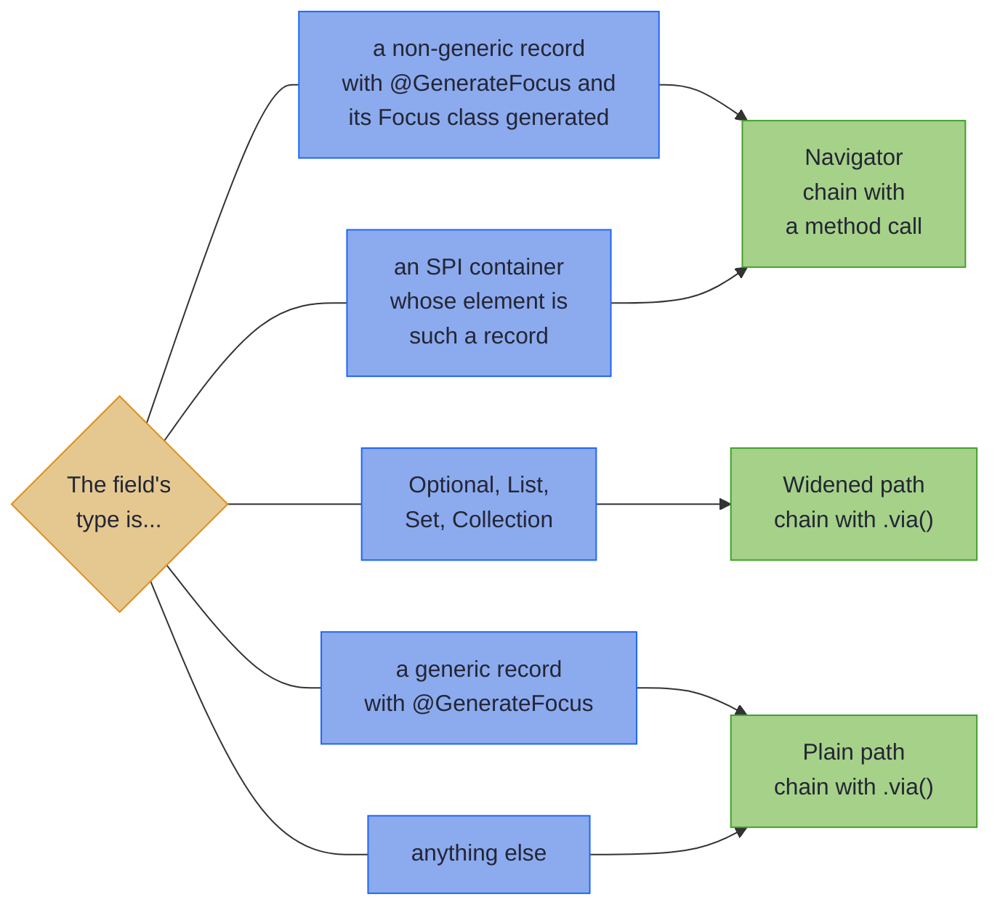

# Collections, Optionals and Sealed Types

_Step into lists, maps, optionals and sealed variants from a generated path, and join a path to any optic._

~~~admonish info title="What You'll Learn"
- Step into a collection's elements, or pick one element by index or key
- Read an optional or nullable value as present or absent
- Focus one variant of a sealed type
- Tell which fields get a generated navigator, and spell the hop where none does
~~~

~~~admonish example title="See Example Code"
**The code on this page is [NavigationBook.java](https://github.com/higher-kinded-j/higher-kinded-j/blob/main/hkj-examples/src/main/java/org/higherkindedj/example/book/optics/navigation/NavigationBook.java) and its [NavigationBookTest.java](https://github.com/higher-kinded-j/higher-kinded-j/blob/main/hkj-examples/src/test/java/org/higherkindedj/example/book/optics/navigation/NavigationBookTest.java)**: the page includes them, so the build compiles and runs them.

[NavigatorExample](https://github.com/higher-kinded-j/higher-kinded-j/blob/main/hkj-examples/src/main/java/org/higherkindedj/example/optics/focus/NavigatorExample.java) and [ContainerNavigationExample](https://github.com/higher-kinded-j/higher-kinded-j/blob/main/hkj-examples/src/main/java/org/higherkindedj/example/optics/focus/ContainerNavigationExample.java) run this page's navigators and container hops as longer programs.
~~~

The previous page gave you one method per record component. This page is about the hops you spell yourself. They step into a collection's elements or one of them, through an optional or nullable value, onto one variant of a sealed type, and onto an optic from somewhere else. How a field's container decides its path type, which the processor calls widening, is in [The fine print](#the-fine-print) at the end.

---

## Collections {#collection-navigation}

### `.each()`: traverse all elements {#each-traverse-all-elements}

`.each()` steps from a collection into its elements. For a `List`, `Set` or `Collection` field the generated method has already applied the right one, which is why `OrderFocus.lines()` focuses each `LineItem`:

``` java
    // Generated: FocusPath.of(lens).each()
    TraversalPath<Order, LineItem> allLines = OrderFocus.lines();
    List<LineItem> lines = allLines.getAll(order);

    // Applying .each() yourself, starting from the lens to the whole list
    TraversalPath<Order, LineItem> sameThing = FocusPath.of(OrderLenses.lines()).each();
```

### `.each(Each)`: traverse with a custom `Each` instance {#eacheach-traverse-with-a-custom-each-instance}

The no-argument `.each()` carries a `List` traversal and nothing else. Every other container (a `Set`, a `Collection`, a `Map`, an array, a third-party collection) takes an explicit `Each` instead. An `Each` is a small strategy object, as a `Comparator` is for sorting, that says how to visit a container's elements. The generated method already does this for you: `EachInstances.setEach()` for a `Set` field, `EachInstances.collectionEach()` for a `Collection`. Hand-built paths have to say it themselves, and this works on `FocusPath`, `AffinePath` and `TraversalPath` alike. A catalogue keeps its prices in a `Map` keyed by SKU:

``` java
@GenerateLenses
@GenerateFocus
record Catalogue(String name, Map<String, BigDecimal> prices) {}

```

``` java
    // A Map field: traverse the values
    TraversalPath<Catalogue, BigDecimal> allPrices =
        CatalogueFocus.prices().each(EachInstances.mapValuesEach());

    // An HKJ container held behind a hand-written lens
    Lens<SavedForLater, Maybe<LineItem>> itemLens =
        Lens.of(SavedForLater::item, (_, item) -> new SavedForLater(item));
    TraversalPath<SavedForLater, LineItem> savedItem =
        FocusPath.of(itemLens).each(EachExtensions.maybeEach());
```

`SavedForLater` holds a line a customer put aside, as an HKJ `Maybe`, and carries no annotation, so a hand-written lens reaches the `Maybe` and the hop names its `Each`.

For available `Each` instances and how to create your own, see [Each](each_typeclass.md).

### Access by index {#access-by-index}

`.at(index)` focuses a single element of a list, and `.atKey(key)` a single value of a map. On a `FocusPath` or an `AffinePath` both return an `AffinePath`, because the position may not be occupied; on a `TraversalPath` the result stays a `TraversalPath`.

The generated Focus class has exactly one method per record component, so there is no generated `order.line(0)` accessor. Index from the path that still focuses the list. When the result feeds straight into another composition, spell the element type out (`FocusPath.of(OrderLenses.lines()).<LineItem>at(0)`): nothing in the argument list mentions `LineItem`, so inference has nothing to work from.

``` java
    // A List field: start from the lens, because the generated path is element-level
    AffinePath<Order, LineItem> firstLine = FocusPath.of(OrderLenses.lines()).at(0);
    Optional<LineItem> first = firstLine.getOptional(order); // empty if out of bounds

    // Or narrow the generated traversal to its first element. Mind the asymmetry:
    // headOption reads the first element but writes to all of them
    AffinePath<Order, LineItem> alsoFirst = OrderFocus.lines().headOption();

    // A Map field: the generated path still focuses the whole map, so .atKey() applies
    AffinePath<Catalogue, BigDecimal> lamp = CatalogueFocus.prices().atKey("LAMP");
    Optional<BigDecimal> lampPrice = lamp.getOptional(catalogue);
```

~~~admonish warning title="Element-level versus container-level"
`OrderFocus.lines()` focuses each `LineItem`; `FocusPath.of(OrderLenses.lines())` focuses the `List<LineItem>`. Anything that operates on the container as a whole (indexing, `ListPrisms`, a custom list-level optic) has to start from the second. Reach for the generated path when you want to act on every element, and for the lens when you want to act on the collection.
~~~

---

## Optional and nullable values {#optional-and-nullable-values}

### `.some()`: unwrap an `Optional` {#some-unwrap-optional}

An `Optional<T>` field is unwrapped for you: the generated method applies `.some()` and returns an `AffinePath`. Call `.some()` yourself when the `Optional` sits behind a hand-written lens.

### `.nullable()`: read a null as absent {#nullable-handle-null-values}

For a field that may be null, `.nullable()` turns null into absence. A contact imported from an older system has a nickname that may be null, and nothing says so:

``` java
// From an older system: its nickname may be null, and nothing says so
@GenerateLenses
@GenerateFocus
record LegacyContact(String name, String nickname) {}

```

``` java
    FocusPath<LegacyContact, String> rawPath = LegacyContactFocus.nickname();
    AffinePath<LegacyContact, String> safePath = rawPath.nullable();

    Optional<String> missing = safePath.getOptional(new LegacyContact("Charles", null));
    Optional<String> present = safePath.getOptional(new LegacyContact("Grace", "Amazing Grace"));
```

`missing` is empty, because Charles's nickname is null, and `present` holds `"Amazing Grace"`.

~~~admonish tip title="A recognised `@Nullable` saves you the chain"
Annotate the component and the generated method hands you the `AffinePath` already. The processor recognises six annotations named `@Nullable`, from `org.jspecify.annotations`, `javax.annotation` (JSR-305), `jakarta.annotation`, `org.jetbrains.annotations`, `androidx.annotation` and `edu.umd.cs.findbugs.annotations` (SpotBugs). It does not read Spring's `org.springframework.lang.Nullable`, so a field carrying that one gives a `FocusPath`, and you chain `.nullable()` as for a field nobody annotated, such as `LegacyContact`'s nickname. [Where a `@Nullable` counts](#where-a-nullable-counts) has the placement rules.
~~~

---

## One variant of a sealed type {#working-with-sum-types-using-instanceof}

A sealed field's path focuses the whole value, and `.via(...)` with a prism narrows it to one variant. For a sealed interface you own, `@GeneratePrisms` names each variant; for a hierarchy you do not own, `AffinePath.instanceOf(Class)` matches by runtime type:

``` java
@GeneratePrisms
public sealed interface Payment permits Card, Bank {}
```

``` java
@GenerateFocus
public record Card(String pan) implements Payment {}
```

``` java
@GenerateFocus
public record Bank(String iban) implements Payment {}
```

A customer's payment history holds every payment they have made, of either kind:

``` java
@GenerateFocus
record PaymentHistory(UUID customerId, List<Payment> payments) {}

```

``` java
    // A sealed type you own: @GeneratePrisms names each variant
    TraversalPath<PaymentHistory, String> cardPans =
        PaymentHistoryFocus.payments().via(PaymentPrisms.card()).via(CardFocus.pan());

    List<String> pans = cardPans.getAll(history); // the bank payments are skipped
    PaymentHistory masked =
        cardPans.modifyAll(pan -> "**** " + pan.substring(pan.length() - 4), history);

    // A sealed type you do not own: AffinePath.instanceOf matches by runtime type
    TraversalPath<PaymentHistory, String> samePans =
        PaymentHistoryFocus.payments().via(AffinePath.instanceOf(Card.class)).via(CardFocus.pan());
```

For a history of a card numbered 4242424242424242 and a bank payment, `pans` holds that one number, and `masked` holds the card as `**** 4242` beside the bank payment as it was. Either route reads and modifies only when the variant fits. On a single sealed field, `set` still writes the variant whatever was there, as [AffinePath](focus_dsl.md#affinepath-zero-or-one-element) warns.

---

## Composition with existing optics {#composition-with-existing-optics}

`.via()` composes a path with any optic, and the result has the wider of the two path types:

``` java
    // Path + Lens = Path
    FocusPath<Consignment, String> street =
        FocusPath.of(ConsignmentLenses.to()).via(AddressLenses.street());

    // Path + Prism or Affine = AffinePath
    AffinePath<Order, LineItem> firstLine =
        FocusPath.of(OrderLenses.lines()).via(ListPrisms.head());

    // Path + Traversal = TraversalPath
    TraversalPath<Order, LineItem> allLines =
        FocusPath.of(OrderLenses.lines()).via(Traversals.forList());
```

`.via()` also accepts another Focus path, which is how you cross a type boundary the navigator did not cover. `.via(LineItemFocus.sku())` is `.via(LineItemFocus.sku().toLens())` with the ceremony removed, and it keeps the field names the path carries, which locate a failure in an [edit that validates](multi_edit.md#validated-patch-editsaccumulate). The raw-optic overload drops them.

---

## Fluent navigation with generated navigators {#fluent-navigation-with-generated-navigators}

Set `generateNavigators = true` and the processor emits a small wrapper class per navigable field, so the next hop is a method call rather than a `.via()`:

``` java
@GenerateLenses
@GenerateFocus(generateNavigators = true)
public record Consignment(UUID orderId, Address to, ConsignmentState state) {}
```

``` java
@GenerateLenses
@GenerateFocus
public record Address(String street, String city, String postcode) {}
```

``` java
    // With navigators
    String city = ConsignmentFocus.to().city().get(consignment);

    // Without them, the same path, spelled out
    String same = FocusPath.of(ConsignmentLenses.to()).via(AddressFocus.city()).get(consignment);
```

### Which fields get a navigator {#which-fields-get-a-navigator}

Not every field does, and knowing which is the difference between a chain that compiles and one that does not. Some container types, such as `Map`, `Either` and third-party collections, reach the processor through a service-provider interface (SPI) for container generators; the chart calls them SPI containers.



The middle branch is the one that surprises people. `Optional`, `List`, `Set` and `Collection` are widened by the processor before navigators are considered, so a `List<LineItem> lines` field gives you a `TraversalPath<Order, LineItem>` and never a `LinesNavigator`. SPI containers (a `Map`, an Eclipse Collections `ImmutableList`, an `Either`) *are* eligible, and get a navigator when their element type is itself annotated. A record with type parameters of its own never gets one, as [A target with type parameters](#a-target-with-type-parameters) explains.

``` java
    // customer is a plain navigable field: navigator, so .email() chains
    String email = OrderFocus.customer().email().value().get(order);

    // lines is a List: a TraversalPath, so the next hop is .via()
    List<String> skus = OrderFocus.lines().via(LineItemFocus.sku()).getAll(order);
```

### What a navigator provides {#what-a-navigator-provides}

A navigator is a thin wrapper around one path, so it exposes that path's core operations plus one method per field of the target type:

| Wrapped path | Operations on the navigator |
|--------------|-----------------------------|
| `FocusPath` | `get`, `set`, `modify`, `toLens`, `toPath` |
| `AffinePath` | `getOptional`, `set`, `modify`, `matches`, `toPath` |
| `TraversalPath` | `getAll`, `setAll`, `modifyAll`, `count`, `isEmpty`, `toPath` |

Everything else (`filter`, `modifyF`, `traced`, `via`, `foldMap`) lives on the path, so call `toPath()` first. Here `traced` records each postcode it passes before the path normalises it, so a consignment to `n1 1aa` comes back addressed to `N1 1AA`:

``` java
    List<String> seen = new ArrayList<>();
    Consignment normalised =
        ConsignmentFocus.to()
            .toPath()
            .traced((_, address) -> seen.add(address.postcode()))
            .modify(
                address -> AddressLenses.postcode().modify(String::toUpperCase, address),
                consignment);
```

### When to use navigators {#when-to-use-navigators}

**Enable them when** you navigate across record types often, deep navigation is common, or you want the IDE to autocomplete the whole path.

**Leave them off when** the fields reference types you cannot annotate, generated-code size matters, or the structures are shallow enough that `.via()` costs nothing.

~~~admonish tip title="You can ship now"
You can now step into a collection, read an optional or nullable value, pick one variant of a sealed type, and chain into another record with a navigator or `.via()`. The rest of this page is for a field that surprises you.
~~~

~~~admonish question title="Checkpoint: replace the first line only" id="check-navigation-headoption"
You want to replace only the first line of an order with a sofa. Which of `OrderFocus.lines().headOption().set(sofa, order)` and `FocusPath.of(OrderLenses.lines()).<LineItem>at(0).set(sofa, order)` does that, and what does the other do?
~~~

~~~admonish success title="Answer and why" collapsible=true id="check-navigation-headoption-answer"
**The second.** `at(0)` indexes the list itself, so it writes only the first line. `headOption()` narrows the reads to the first element, but its writes go to every element the traversal reaches, so it replaces every line with the sofa.

Where this lives: [Access by index](#access-by-index).
~~~

~~~admonish question title="Checkpoint: a hop from a list" id="check-navigation-list-hop"
`Order` has `generateNavigators = true`, and `LineItem` carries `@GenerateFocus`. Does this compile?

<!-- verify:rejects "cannot find symbol" -->
```java
var skus = OrderFocus.lines().sku();
```
~~~

~~~admonish success title="Answer and why" collapsible=true id="check-navigation-list-hop-answer"
**No: the compiler reports `cannot find symbol`.** A `List` field is widened to a `TraversalPath` before navigators are considered, so it never gets one. Spell the hop `.via(LineItemFocus.sku())`.

Where this lives: [Which fields get a navigator](#which-fields-get-a-navigator).
~~~

---

## The fine print {#the-fine-print}

The rest of this page is detail for an unusual field or build: an SPI container, a list you take apart, a record in another module, the annotation's navigator options, a target with type parameters, where a `@Nullable` counts, and the rules by which a path widens.

### `.some(Affine)`: navigate SPI container types {#someaffine-navigate-spi-container-types}

Container types registered through the `TraversableGenerator` service-provider interface (SPI) that hold zero or one element take an `Affine` describing which side to focus. A stockroom, the one an order is picked from, keeps its stock by SKU and a name verified by a check, as an `Either`:

``` java
// The stockroom an order is picked from: stock by SKU, and a name verified by a check
@GenerateLenses
@GenerateFocus(generateNavigators = true)
record Stockroom(String name, Map<String, Integer> stock, Either<String, String> verifiedName) {}

```

``` java
    // Either<String, String> field: the generated method already applies
    // .some(Affines.eitherRight()), focusing the Right value
    AffinePath<Stockroom, String> verified = StockroomFocus.verifiedName();

    Optional<String> name = verified.getOptional(stockroom); // empty for a Left
    Stockroom renamed =
        verified.set("Northern", stockroom); // replaces a Left with Right("Northern")
    Stockroom untouched = verified.modify(String::toUpperCase, stockroom); // a no-op on a Left
```

The following `Affine` instances cover the built-in SPI types:

| Container type | Affine instance | Focuses on |
|----------------|-----------------|------------|
| `Either<L, R>` | `Affines.eitherRight()` | The `Right` value |
| `Try<A>` | `Affines.trySuccess()` | The `Success` value |
| `Validated<E, A>` | `Affines.validatedValid()` | The `Valid` value |
| `Maybe<A>` | `Affines.just()` | The `Just` value |

For a runnable example covering all container types, see [ContainerNavigationExample.java](https://github.com/higher-kinded-j/higher-kinded-j/blob/main/hkj-examples/src/main/java/org/higherkindedj/example/optics/focus/ContainerNavigationExample.java).

### List decomposition with `ListPrisms` {#list-decomposition-with-listprisms}

`ListPrisms` optics work on the list itself, so compose them onto a path that focuses the whole list:

``` java
    FocusPath<Order, List<LineItem>> lines = FocusPath.of(OrderLenses.lines());

    AffinePath<Order, LineItem> firstLine = lines.via(ListPrisms.head());
    Optional<LineItem> first = firstLine.getOptional(order);

    AffinePath<Order, LineItem> lastLine = lines.via(ListPrisms.last());

    // Pattern match with cons (head, tail)
    AffinePath<Order, Pair<LineItem, List<LineItem>>> consPath = lines.via(ListPrisms.cons());
    Optional<List<LineItem>> tail = consPath.getOptional(order).map(Pair::second);
```

| ListPrisms Method | Type | Description |
|-------------------|------|-------------|
| `ListPrisms.head()` | `Affine<List<A>, A>` | Focus on first element |
| `ListPrisms.last()` | `Affine<List<A>, A>` | Focus on last element |
| `ListPrisms.tail()` | `Affine<List<A>, List<A>>` | Focus on all but first |
| `ListPrisms.init()` | `Affine<List<A>, List<A>>` | Focus on all but last |
| `ListPrisms.cons()` | `Prism<List<A>, Pair<A, List<A>>>` | Decompose as (head, tail) |
| `ListPrisms.snoc()` | `Prism<List<A>, Pair<List<A>, A>>` | Decompose as (init, last) |

The same decompositions are available directly on a path focusing a list, as `.head()`, `.last()`, `.tail()`, `.init()`, `.cons()` and `.snoc()`.

For the full treatment, including stack-safe operations on large lists, see [List Decomposition](list_decomposition.md).

### Navigators into a dependency {#navigators-into-a-dependency}

**A target in a dependency is navigable too.** The processor asks the field's type whether it carries `@GenerateFocus`, which is kept in the class file, so a record read from a jar is recognised as a sibling source file is. Navigating into it composes the `Focus` class that record's own module generated, reading each field's path type from the method that module published rather than working it out again, so a navigator never composes a method or path type the dependency did not publish, whichever processor version or generator plugins built it. An API module can therefore own the records, and each consuming module's `Focus` classes chain straight into them.

Three things can keep such a navigator from being generated in full, and the processor says which in a note against the field:

- **The dependency did not run the processor.** Its records carry the annotation but it generated no `Focus` classes, so there is nothing to compose, and the field keeps its plain path.
- **A field names a type this module cannot see.** A dependency's record may use a type from one of *its* dependencies that is not on this module's compile classpath. That field is left out of the navigator, and the rest are generated as usual.
- **The dependency's `Focus` class does not match its record.** A companion generated from an older version of the record, or a class of the same name the processor did not write, has no method a navigator can compose for some field. That field is left out, and rebuilding the dependency with the processor restores it.

[Multi-module builds](../tooling/manual_setup.md#multi-module-builds) has the build-side detail.

### Controlling navigator generation {#controlling-navigator-generation}

**Depth limiting**: only a `maxNavigatorDepth` of 1 or less changes the generated code. It makes a navigator's own navigation methods return plain paths, so only the first hop chains fluently. A larger value, the default 3 included, does not stop a chain, though a hop that widens the path, from a navigator over an `Optional` or a collection into a record, still does. Each hop into another navigable record returns the navigator that the `Focus` class of the record it leaves declares for that field. Under the default, `OrderFocus.customer().email()` returns `CustomerFocus.EmailNavigator`.

<!-- verify -->
```java
@GenerateFocus(generateNavigators = true, maxNavigatorDepth = 1)
record Order(
    UUID id,
    Customer customer,
    List<LineItem> lines,
    Instant placedAt,
    Currency currency,
    OrderStatus status) {}

// customer() returns a navigator
// customer().email() returns a plain path; compose further hops with .via()
```

**Field filtering** picks which fields are worth a navigator:

<!-- verify -->
```java
// Only these fields get one
@GenerateFocus(generateNavigators = true, includeFields = {"delivery"})
record Contacts(Address billing, Address delivery, Address returns) {}

// All but these do
@GenerateFocus(generateNavigators = true, excludeFields = {"referrer"})
record CustomerReferral(Customer referrer, Customer referred) {}
```

### A target with type parameters {#a-target-with-type-parameters}

A navigator is an inner class parameterised by the source type alone, so it has no way to name a target's own type parameters. `Inner<String> inner` keeps the plain path, chained with `.via()`. `Map<String, Inner<String>> inners` keeps the plain path too, but focused on the *map*: an SPI container of this shape is only stepped into when `widenCollections = true` says so, and the `.via()` chain reaches the element only after that. The processor says so as a note against the field, naming the chain to write in each case.

### Where a `@Nullable` counts {#where-a-nullable-counts}

The processor reads each recognised annotation wherever its own `@Target` puts it: JSpecify's `TYPE_USE` on the component's type, JetBrains', AndroidX's and SpotBugs' on the accessor, JSR-305's and Jakarta's on the component itself. A container decides its own widening, so `@Nullable List<T>` is still `.each()`. Position counts as Java defines it, so `String @Nullable []` is a nullable array, while `@Nullable String[]` and `List<@Nullable String>` annotate the elements.

Under a JSpecify checker such as NullAway, every optic and Focus path type takes a nullable focus. So a path typed `FocusPath<LegacyContact, @Nullable String>` checks, and its `.nullable()` is the non-null `AffinePath<LegacyContact, String>`. A read that hands the focus back in an `Optional` or a `Maybe`, such as `getOptional`, `preview` or `toMaybePath`, reads a null focus as absent, since neither can hold one.

### Path widening {#path-widening}

Widening is what turns a lens to a field into the path type the field's shape deserves: a container that may hold nothing widens to an `AffinePath`, one that may hold many widens to a `TraversalPath`. It happens for every path, navigators or not, and it is settled at compile time from the declared type. The gap is the bare nullable reference nobody annotated: its declared type says `String`, so you get a `FocusPath` and chain `.nullable()` yourself.

#### SPI containers {#spi-containers}

Each SPI generator declares a `Cardinality`, the number of values its container can hold, and that decides the path type:

| Cardinality | Path | Types |
|-------------|------|-------|
| `ZERO_OR_ONE` | `AffinePath` | `Either<L,R>`, `Try<A>`, `Validated<E,A>`, `Optional<A>`, `Maybe<A>` |
| `ZERO_OR_MORE` | `TraversalPath`, under `widenCollections` or when the element is itself navigable | `Map<K,V>`, arrays, Eclipse Collections, Guava, Vavr, Apache Commons |

``` java
    // Either is ZERO_OR_ONE via the SPI: AffinePath
    AffinePath<Stockroom, String> verified = StockroomFocus.verifiedName();

    // Map is ZERO_OR_MORE via the SPI, but a static Focus method widens it only
    // under widenCollections; otherwise the path still focuses the whole map
    FocusPath<Stockroom, Map<String, Integer>> stock = StockroomFocus.stock();
    TraversalPath<Stockroom, Integer> quantities = stock.each(EachInstances.mapValuesEach());
```

`ZERO_OR_MORE` SPI types are the one asymmetry: a Focus method leaves them un-widened by default, for backwards compatibility. Add `widenCollections = true` to the annotation and `StockroomFocus.stock()` returns the `TraversalPath` directly. A navigator method reports the same path type as the static method for the same component. Without the flag, the path still steps into a container whose element is a navigable record, because the navigator has to reach it; with the flag, it steps into every such container. [Custom Containers and Code Generation](focus_containers.md#the-zero_or_more-asymmetry-and-widencollections) states the rule in full, alongside the table of every supported container.

#### Compound widening {#compound-widening}

Composing paths keeps the wider path type:

| Current | + Field | = Result |
|---------|---------|----------|
| FOCUS | AFFINE | AFFINE |
| FOCUS | TRAVERSAL | TRAVERSAL |
| AFFINE | AFFINE | AFFINE |
| AFFINE | TRAVERSAL | TRAVERSAL |
| TRAVERSAL | anything | TRAVERSAL |

~~~admonish note title="Custom Generators"
If you write a `TraversableGenerator` for your own container type, override `getCardinality()` to return `ZERO_OR_ONE` for optional-like types. The default is `ZERO_OR_MORE`, which is correct for collection-like types. See [Traversal Generator Plugins](../tooling/generator_plugins.md).
~~~

#### Nested container widening {#nested-container-widening}

A field whose type nests containers gets a composed chain, up to three levels deep:

| Field Type | Generated Chain | Return Type |
|-----------|----------------|-------------|
| `Optional<List<String>>` | `.some().each()` | `TraversalPath` |
| `List<Optional<String>>` | `.each().some()` | `TraversalPath` |
| `Optional<Optional<String>>` | `.some().some()` | `AffinePath` |
| `List<List<String>>` | `.each().each()` | `TraversalPath` |
| `Optional<Either<E, String>>` | `.some().some(Affines.eitherRight())` | `AffinePath` |
| `Either<E, List<Integer>>` | `.some(Affines.eitherRight()).each()` | `TraversalPath` |
| `Either<E, Map<K, V>>` | `.some(Affines.eitherRight())` | `AffinePath` to the `Map` |
| `Either<E, Map<K, V>>` with `widenCollections = true` | `.some(Affines.eitherRight()).each(EachInstances.mapValuesEach())` | `TraversalPath` |

The last two rows are the rule in miniature. `Optional`, `List`, `Set` and `Collection` nest unconditionally, but an inner container that arrives through the SPI is stepped into only when it is `ZERO_OR_ONE`, or `ZERO_OR_MORE` with `widenCollections` on. Otherwise the path stops at the container.

``` java
    TraversalPath<NestedConfig, String> allTags = NestedConfigFocus.tags();
    List<String> tagValues = allTags.getAll(nestedConfig);

    AffinePath<NestedConfig, String> nestedOpt = NestedConfigFocus.nested();
    Optional<String> innerValue = nestedOpt.getOptional(nestedConfig);

    // Either<String, List<Integer>>: a nested List is stepped into unconditionally
    TraversalPath<NestedConfig, Integer> data = NestedConfigFocus.data();

    // Either<String, Map<String, Integer>>: an SPI ZERO_OR_MORE stops at the Map...
    AffinePath<NestedConfig, Map<String, Integer>> meta = NestedConfigFocus.meta();

    // ...unless widenCollections is on
    TraversalPath<WidenedConfig, Integer> hits = WidenedConfigFocus.meta();
```

Beyond three levels, compose the rest with `.via()`.

---

~~~admonish info title="Key Takeaways"
* **A generated collection method is element-level; a generated `Map` method is not.** `.at(i)` and `ListPrisms` start from `FocusPath.of(theLens())`, because there is no generated `order.line(0)`. `.atKey(k)` applies straight to the generated path, because that path still focuses the whole map.
* **An `Optional`, or a recognised `@Nullable`, is already an `AffinePath`.** Chain `.nullable()` yourself for a field nobody annotated, or one carrying Spring's `@Nullable`.
* **One variant of a sealed type is a prism away.** `@GeneratePrisms` names each variant of a type you own; `AffinePath.instanceOf` matches by runtime type in one you do not.
* **Navigators cover a field whose type is another annotated record.** A `Map` or `Either` of one gets a navigator too, but `Optional`, `List`, `Set` and `Collection` are widened first and never produce one, so those hops use `.via()`.
* **`toPath()` is the escape hatch.** A navigator carries only the core operations; `filter`, `modifyF`, `traced` and `via` are one `toPath()` away.
~~~

~~~admonish info title="Hands-On Learning"
- [Tutorial12_FocusDSL.java](https://github.com/higher-kinded-j/higher-kinded-j/blob/main/hkj-examples/src/test/java/org/higherkindedj/tutorial/optics/Tutorial12_FocusDSL.java)
- [Tutorial19_NavigatorGeneration.java](https://github.com/higher-kinded-j/higher-kinded-j/blob/main/hkj-examples/src/test/java/org/higherkindedj/tutorial/optics/Tutorial19_NavigatorGeneration.java)
~~~

~~~admonish tip title="See Also"
- [Custom Containers and Code Generation](focus_containers.md): what the processor emits per field type, and the SPI
- [Each](each_typeclass.md): the `Each` instances `.each(Each)` takes
- [List Decomposition](list_decomposition.md): `ListPrisms` in full
~~~

---

**Previous:** [Focus DSL](focus_dsl.md)
**Next:** [What a Path Is Made Of](optics_intro.md)
