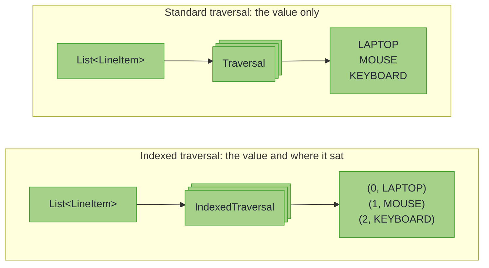

# Indexed Optics: Position-Aware Operations

_Update each element knowing its position, map key or field name, without counting by hand._

> *"Give me a place to stand, and I shall move the earth."*
>
> – Archimedes


~~~admonish info title="What You'll Learn"
- Pair each list element with its position, or each map value with its key, with `IndexedTraversals.forList()` and `forMap()`
- Update elements by position or key with `IndexedTraversals.imodify`, such as numbering a packing slip
- Narrow by position or value with `filterIndex` and `filteredWithIndex`, and predict that indices are never renumbered
- Record which field a write touched with an `IndexedLens` and its `imodify`
- Drop the index with `asTraversal()` when the update stops using it
~~~

~~~admonish example title="See Example Code"
[IndexedOpticsExample](https://github.com/higher-kinded-j/higher-kinded-j/blob/main/hkj-examples/src/main/java/org/higherkindedj/example/optics/IndexedOpticsExample.java)
~~~

In our journey through optics, we've mastered how to focus on parts of immutable data structures, whether it's a single field with **Lens**, one variant with **Prism**, an optional value with **Affine**, or multiple elements with **Traversal**. But sometimes, knowing *where* you are is just as important as knowing *what* you're looking at.

Consider these scenarios:
- **Numbering items** in a packing list: "Item 1: LAPTOP, Item 2: MOUSE..."
- **Tracking field names** for audit logs: "User modified field 'email' from..."
- **Processing map entries** where both key and value matter: "For metadata key 'priority', set value to..."
- **Debugging nested updates** by seeing the complete path: "Changed scores[2] from 100 to 150"

Standard optics give you the *value*. **Indexed optics** give you both the *index* and the *value*.



A standard traversal hands back each `LineItem` and forgets where it was; an indexed one hands back a `Pair<Index, A>`, so the position travels with the value:

| Index | Value |
|---|---|
| `0` | `LAPTOP` |
| `1` | `MOUSE` |
| `2` | `KEYBOARD` |

Archimedes understood that position is power. With the right fulcrum point, a lever can move the world. Similarly, with the right index, an optic can transform data in ways that value-only access cannot. Position-based discounts, numbered lists, audit trails showing *which* field changed: all require knowing *where* you are, not just *what* you have.

---

## The Scenario: E-Commerce Order Processing

Imagine building an order fulfilment system where position information drives business logic.

**The Data Model:** the chapter's cast, an `Order` of `LineItem`s placed by a `Customer`.

~~~admonish example title="The cast these examples use" collapsible=true
``` java
@GenerateLenses
@GenerateFocus(generateNavigators = true)
@GenerateTraversals
public record Order(
    UUID id,
    Customer customer,
    List<LineItem> lines,
    Instant placedAt,
    Currency currency,
    OrderStatus status) {}
```

``` java
@GenerateLenses
@GenerateFocus
public record LineItem(String sku, Integer quantity, BigDecimal price) {}
```

``` java
@GenerateLenses
@GenerateFocus(generateNavigators = true)
public record Customer(String name, EmailAddress email) {}
```

``` java
@GenerateLenses
@GenerateFocus
public record EmailAddress(String value) {}
```
~~~

Each order's metadata is kept beside it, as a map from key to value:

<!-- verify -->
```java
Map<String, String> metadata =
    Map.of("priority", "express", "gift-wrap", "true", "delivery-note", "Leave at door");
```

**Business Requirements:**

1. **Generate packing slips** with numbered items: "Item 1: LAPTOP (£999.99)"
2. **Process metadata** with key awareness: "Set shipping method based on 'priority' key"
3. **Audit trail** showing which fields were modified: "Updated Customer.email at 2025-01-15 10:30"
4. **Position-based pricing** for bulk orders: "Items at even positions get 10% discount"

**The Traditional Approach:**

<!-- verify -->
```java
// Verbose: Manual index tracking
List<String> packingSlip = new ArrayList<>();
for (int i = 0; i < order.lines().size(); i++) {
    LineItem item = order.lines().get(i);
    packingSlip.add("Item " + (i + 1) + ": " + item.sku());
}

// Or with streams, losing type-safety
AtomicInteger counter = new AtomicInteger(1);
order.lines().stream()
    .map(item -> "Item " + counter.getAndIncrement() + ": " + item.sku())
    .collect(toList());

// Map processing requires breaking into entries
metadata.entrySet().stream()
    .map(entry -> processWithKey(entry.getKey(), entry.getValue()))
    .collect(toMap(Entry::getKey, Entry::getValue));
```

This approach forces manual index management, mixing the *what* (transformation logic) with the *how* (index tracking). **Indexed optics** provide a declarative, type-safe solution.

An indexed optic plays the part of a loop over `map.entrySet()`, or over a list with a counter: each value arrives with its key or position. Unlike the loop, it hands back the rebuilt list or map, and composes into a longer path like any other optic.

---

## The Three Indexed Optics

Higher-Kinded-J provides three indexed optics that mirror their standard counterparts:

| Standard Optic | Indexed Variant | Index Type | Use Case |
|----------------|-----------------|------------|----------|
| **Traversal\<S, A>** | **IndexedTraversal\<I, S, A>** | `I` (any type) | Position-aware bulk updates (List indices, Map keys) |
| **Fold\<S, A>** | **IndexedFold\<I, S, A>** | `I` (any type) | Position-aware read-only queries |
| **Lens\<S, A>** | **IndexedLens\<I, S, A>** | `I` (any type) | Field name tracking for single-field access |

The additional type parameter `I` represents the **index type**:
- For `List<A>`: `I` is `Integer` (position 0, 1, 2...)
- For `Map<K, V>`: `I` is `K` (the key type)
- For record fields: `I` is `String` (field name)
- Custom: Any type that makes sense for your domain

---

## A Step-by-Step Walkthrough

### Step 1: Creating Indexed Traversals

The `IndexedTraversals` utility class provides factory methods for common cases.

#### For Lists: Integer Indices

<!-- verify -->
```java
import org.higherkindedj.optics.indexed.IndexedTraversal;
import org.higherkindedj.optics.util.IndexedTraversals;

// Create an indexed traversal for List elements
IndexedTraversal<Integer, List<LineItem>, LineItem> itemsWithIndex =
    IndexedTraversals.forList();
```

The `forList()` factory creates a reusable traversal where each element is paired with its zero-based index. You supply the actual data when you *use* the traversal, as [Step 2](#step-2-accessing-index-value-pairs) does.

#### For Maps: Key-Based Indices

<!-- verify -->
```java
// Create an indexed traversal for Map values
IndexedTraversal<String, Map<String, String>, String> metadataWithKeys =
    IndexedTraversals.forMap();
```

The `forMap()` factory creates a traversal where each value is paired with its key.

~~~admonish tip title="Alternative: EachIndexed.indexedTraversal()"
You can also obtain indexed traversals through the [Each type class](each_typeclass.md). If a container's `Each` instance supports indexed access it is an `EachIndexed`, whose `indexedTraversal()` returns the `IndexedTraversal` directly; the index type is fixed at compile time, with no `Optional` to unwrap:

<!-- verify -->
```java
EachIndexed<Integer, List<String>, String> listEach = EachInstances.listEach();
IndexedTraversal<Integer, List<String>, String> indexed = listEach.indexedTraversal();
// Use the indexed traversal
```

This is useful when working with custom containers that implement `EachIndexed` or when integrating with the Focus DSL.

(`Each.eachWithIndex()` is the deprecated predecessor; [Each](each_typeclass.md) covers the migration.)
~~~

---

### Step 2: Accessing Index-Value Pairs

Indexed optics provide specialised methods that give you access to both the index and the value. Each index and its value arrive together as a `Pair`, which lives in `org.higherkindedj.optics.indexed` beside `IndexedFold` and `IndexedLens`.

#### Extracting All Index-Value Pairs

``` java
    List<LineItem> items =
        List.of(
            new LineItem("LAPTOP", 1, new BigDecimal("999.99")),
            new LineItem("MOUSE", 2, new BigDecimal("24.99")),
            new LineItem("KEYBOARD", 1, new BigDecimal("79.99")));

    // Get list of (index, item) pairs - optic meets data
    List<Pair<Integer, LineItem>> indexedItems =
        IndexedTraversals.toIndexedList(itemsWithIndex, items);

    for (Pair<Integer, LineItem> pair : indexedItems) {
      int position = pair.first();
      LineItem item = pair.second();
      System.out.println("Position " + position + ": " + item.sku());
    }
    // Output:
    // Position 0: LAPTOP
    // Position 1: MOUSE
    // Position 2: KEYBOARD
```

#### Using IndexedFold for Queries

``` java
    // Convert to read-only indexed fold
    IndexedFold<Integer, List<LineItem>, LineItem> itemsFold = itemsWithIndex.asIndexedFold();

    // Find item at a specific position
    Pair<Integer, LineItem> found =
        itemsFold.findWithIndex((index, item) -> index == 1, items).orElseThrow();

    System.out.println("Item at index 1: " + found.second().sku());
    // Output: Item at index 1: MOUSE

    // Check if any even-positioned item is expensive
    boolean hasExpensiveEven =
        itemsFold.existsWithIndex(
            (index, item) -> index % 2 == 0 && item.price().compareTo(new BigDecimal("500")) > 0,
            items);
```

---

### Step 3: Position-Aware Modifications

The real power emerges when you modify elements based on their position.

#### Numbering Items in a Packing Slip

``` java
    // Number each line of a packing slip by its position
    IndexedTraversal<Integer, List<String>, String> slipLines = IndexedTraversals.forList();
    List<String> skus = items.stream().map(LineItem::sku).toList();

    List<String> numbered =
        IndexedTraversals.imodify(
            slipLines, (index, sku) -> "Item " + (index + 1) + ": " + sku, skus);

    for (String line : numbered) {
      System.out.println(line);
    }
    // Output:
    // Item 1: LAPTOP
    // Item 2: MOUSE
    // Item 3: KEYBOARD
```

#### Position-Based Discount Logic

<!-- verify -->
```java
// Apply 10% discount to items at even positions (0, 2, 4...)
List<LineItem> discounted = IndexedTraversals.imodify(
    itemsWithIndex,
    (index, item) -> {
        if (index % 2 == 0) {
            BigDecimal discountedPrice =
                item.price().multiply(new BigDecimal("0.9")).setScale(2, RoundingMode.HALF_EVEN);
            return new LineItem(item.sku(), item.quantity(), discountedPrice);
        }
        return item;
    },
    items
);

// Positions 0 (LAPTOP) and 2 (KEYBOARD) are discounted by 10%
// Position 1 (MOUSE) is unchanged
```

#### Map Processing with Key Awareness

``` java
    IndexedTraversal<String, Map<String, String>, String> metadataTraversal =
        IndexedTraversals.forMap();

    Map<String, String> metadata =
        Map.of(
            "priority", "express",
            "gift-wrap", "true",
            "delivery-note", "Leave at door");

    Map<String, String> processed =
        IndexedTraversals.imodify(
            metadataTraversal,
            (key, value) -> {
              // Add key prefix to all values for debugging
              return "[" + key + "] " + value;
            },
            metadata);

    // Each key now maps to its value with the key as a prefix:
    // "priority" → "[priority] express"
    // "gift-wrap" → "[gift-wrap] true"
    // "delivery-note" → "[delivery-note] Leave at door"
```

---

### Step 4: Filtering with Index Awareness

Indexed traversals support filtering, allowing you to focus on specific positions or keys.

#### Filter by Index

``` java
    // Focus only on even-positioned items
    IndexedTraversal<Integer, List<LineItem>, LineItem> evenPositions =
        itemsWithIndex.filterIndex(index -> index % 2 == 0);

    List<Pair<Integer, LineItem>> evenItems = IndexedTraversals.toIndexedList(evenPositions, items);
    // LAPTOP at index 0 and KEYBOARD at index 2

    // Modify only even-positioned items
    List<LineItem> result =
        IndexedTraversals.imodify(
            evenPositions,
            (index, item) ->
                new LineItem(item.sku(), item.quantity(), item.price().subtract(BigDecimal.TEN)),
            items);
    // LAPTOP and KEYBOARD are £10 off, MOUSE unchanged
```

#### Filter by Value with Index Available

``` java
    // Focus on expensive items, but still track their original positions
    IndexedTraversal<Integer, List<LineItem>, LineItem> expensiveItems =
        itemsWithIndex.filteredWithIndex(
            (index, item) -> item.price().compareTo(new BigDecimal("50")) > 0);

    List<Pair<Integer, LineItem>> expensive =
        IndexedTraversals.toIndexedList(expensiveItems, items);
    // LAPTOP at index 0 and KEYBOARD at index 2
    // Notice: indices are preserved (0 and 2), not renumbered
```

#### Filter Map by Key Pattern

``` java
    // Focus on metadata keys starting with "delivery"
    IndexedTraversal<String, Map<String, String>, String> deliveryMetadata =
        metadataTraversal.filterIndex(key -> key.startsWith("delivery"));

    List<Pair<String, String>> deliveryEntries =
        IndexedTraversals.toIndexedList(deliveryMetadata, metadata);
    // [Pair[first=delivery-note, second=Leave at door]]
```

---

### Step 5: IndexedLens for Field Tracking

An `IndexedLens` focuses on exactly one field whilst providing its name or identifier.

``` java
    // Create an indexed lens for the customer email field
    IndexedLens<String, Customer, EmailAddress> emailLens =
        IndexedLens.of(
            "email", // The index: field name
            Customer::email, // Getter
            (customer, newEmail) -> new Customer(customer.name(), newEmail)); // Setter

    Customer customer = new Customer("Ada", new EmailAddress("ada@example.com"));

    // Get both field name and value
    Pair<String, EmailAddress> fieldInfo = emailLens.iget(customer);
    System.out.println("Field: " + fieldInfo.first());
    System.out.println("Value: " + fieldInfo.second().value());
    // Output:
    // Field: email
    // Value: ada@example.com

    // Modify with field name awareness
    Customer updated =
        emailLens.imodify(
            (fieldName, oldValue) -> {
              System.out.println("Updating field '" + fieldName + "' from " + oldValue.value());
              return new EmailAddress("ada.lovelace@example.com");
            },
            customer);
    // Output: Updating field 'email' from ada@example.com
```

**Use case**: Audit logging that records *which* field changed, not just the new value.

---

### Step 6: Converting Between Indexed and Non-Indexed

Every indexed optic can be converted to its standard (non-indexed) counterpart.

<!-- verify -->
```java
import org.higherkindedj.optics.Traversal;

// Start with indexed traversal
IndexedTraversal<Integer, List<LineItem>, LineItem> indexed =
    IndexedTraversals.forList();

// Drop the index to get a standard traversal
Traversal<List<LineItem>, LineItem> standard = indexed.asTraversal();

// Now you can use standard traversal methods
List<LineItem> lowercased = Traversals.modify(
    standard.andThen(LineItemLenses.sku().asTraversal()),
    String::toLowerCase,
    items
);
```

**When to convert**: When you need the index for *some* operations but not others, start indexed and convert as needed.

---

## When to Use Indexed Optics vs Standard Optics

Understanding when indexed optics add value is crucial for writing clear, maintainable code.

#### Use Indexed Optics When

* **Position-based logic**: Different behaviour for even/odd indices, first/last elements
* **Numbering or labelling**: Adding sequence numbers, prefixes, or position markers
* **Map operations**: Both key and value are needed during transformation
* **Audit trails**: Recording which field or position was modified
* **Debugging complex updates**: Tracking the path to each change
* **Index-based filtering**: Operating on specific positions or key patterns

<!-- verify -->
```java
// Perfect: Position drives the logic
IndexedTraversal<Integer, List<Product>, Product> productsIndexed =
    IndexedTraversals.forList();

List<Product> prioritised = IndexedTraversals.imodify(
    productsIndexed,
    (index, product) -> {
        // First 3 products get express shipping
        String shipping = index < 3 ? "express" : "standard";
        return product.withShipping(shipping);
    },
    products
);
```

#### Use Standard Optics When

* **Position irrelevant**: Pure value transformations
* **Simpler code**: Index tracking adds unnecessary complexity
* **No positional logic**: All elements treated identically

<!-- verify -->
```java
// Better with standard optics: Index not needed
Traversal<List<Product>, BigDecimal> prices =
    Traversals.<Product>forList()
        .andThen(ProductLenses.price().asTraversal());

List<Product> inflated = Traversals.modify(
    prices,
    price -> price.multiply(new BigDecimal("1.1")).setScale(2, RoundingMode.HALF_EVEN),
    products);
// All prices increased by 10%, position doesn't matter
```

---

## Common Patterns: Position-Based Operations

#### Pattern 1: Adding Sequence Numbers

``` java
    // Generate a numbered list for display
    IndexedTraversal<Integer, List<String>, String> indexed = IndexedTraversals.forList();

    List<String> tasks = List.of("Review PR", "Update docs", "Run tests");

    List<String> numbered =
        IndexedTraversals.imodify(indexed, (i, task) -> (i + 1) + ". " + task, tasks);
    // [1. Review PR, 2. Update docs, 3. Run tests]
```

#### Pattern 2: First/Last Element Special Handling

<!-- verify -->
```java
IndexedTraversal<Integer, List<String>, String> slipIndexed =
    IndexedTraversals.forList();

List<String> slip = List.of(/* ... */);
int lastIndex = slip.size() - 1;

List<String> marked = IndexedTraversals.imodify(
    slipIndexed,
    (index, line) -> {
        String marker = "";
        if (index == 0) marker = "[FIRST] ";
        if (index == lastIndex) marker = "[LAST] ";
        return marker + line;
    },
    slip
);
```

#### Pattern 3: Map Key-Value Transformations

``` java
    IndexedTraversal<String, Map<String, Integer>, Integer> mapIndexed = IndexedTraversals.forMap();

    // A TreeMap, so the entries come back in key order
    Map<String, Integer> scores = new TreeMap<>(Map.of("alice", 100, "bob", 85, "charlie", 92));

    // Create display strings incorporating both key and value
    List<String> results =
        IndexedTraversals.toIndexedList(mapIndexed, scores).stream()
            .map(pair -> pair.first() + " scored " + pair.second())
            .toList();
    // [alice scored 100, bob scored 85, charlie scored 92]
```

#### Pattern 4: Position-Based Filtering

``` java
    IndexedTraversal<Integer, List<String>, String> indexed = IndexedTraversals.forList();

    List<String> values = List.of("a", "b", "c", "d", "e", "f");

    // Take only odd positions (1, 3, 5)
    IndexedTraversal<Integer, List<String>, String> oddPositions =
        indexed.filterIndex(i -> i % 2 == 1);

    List<String> odd = IndexedTraversals.getAll(oddPositions, values);
    // [b, d, f]
```

---

## Common Pitfalls

#### Don't Do This

<!-- verify -->
```java
// Inefficient: Recreating indexed traversals in loops
for (Order order : orders) {
    var indexed = IndexedTraversals.<LineItem>forList();
    IndexedTraversals.imodify(indexed, (i, item) -> numberItem(i, item), order.lines());
}

// Over-engineering: Using indexed optics when index isn't needed
IndexedTraversal<Integer, List<String>, String> indexed = IndexedTraversals.forList();
List<String> upper = IndexedTraversals.imodify(indexed, (i, s) -> s.toUpperCase(), list);
// Index parameter 'i' is never used! Use standard Traversals.modify()

// Confusing: Manual index tracking alongside indexed optics
AtomicInteger counter = new AtomicInteger(0);
IndexedTraversals.imodify(itemsWithIndex, (i, item) -> {
    int myIndex = counter.getAndIncrement(); // Redundant!
    return process(myIndex, item);
}, items);

// Wrong: Expecting indices to be renumbered after filtering
IndexedTraversal<Integer, List<String>, String> evenOnly =
    indexed.filterIndex(i -> i % 2 == 0);
List<Pair<Integer, String>> pairs = IndexedTraversals.toIndexedList(evenOnly, list);
// The pairs keep their positions, 0, 2, 4, ..., rather than being renumbered 0, 1, 2, ...
```

#### Do This Instead

<!-- verify -->
```java
// Efficient: Create indexed traversal once, reuse many times
IndexedTraversal<Integer, List<LineItem>, LineItem> itemsIndexed =
    IndexedTraversals.forList();

for (Order order : orders) {
    IndexedTraversals.imodify(itemsIndexed, (i, item) -> numberItem(i, item), order.lines());
}

// Simple: Use standard traversals when index isn't needed
Traversal<List<String>, String> standard = Traversals.forList();
List<String> upper = Traversals.modify(standard, String::toUpperCase, list);

// Clear: Trust the indexed optic to provide correct indices
IndexedTraversals.imodify(itemsWithIndex, (providedIndex, item) -> {
    // Use providedIndex directly, it's correct
    return process(providedIndex, item);
}, items);

// Understand: Filtered indexed traversals preserve original indices
IndexedTraversal<Integer, List<String>, String> evenOnly =
    indexed.filterIndex(i -> i % 2 == 0);
List<Pair<Integer, String>> pairs = IndexedTraversals.toIndexedList(evenOnly, list);
// If you need renumbered indices, transform after extraction:
List<Pair<Integer, String>> renumbered = IntStream.range(0, pairs.size())
    .mapToObj(newIndex -> new Pair<>(newIndex, pairs.get(newIndex).second()))
    .toList();
```

---

~~~admonish info title="Key Takeaways"
* **Indexed optics pair every value with where it lives**: list positions, map keys, or field names become part of the focus
* **`imodify` is the workhorse**: one call replaces manual counter threading, `AtomicInteger` hacks, and entry-set rebuilding
* **`filterIndex` and `filteredWithIndex` narrow by position, value, or both**: original indices are preserved, never renumbered
* **`IndexedLens` names the field it touches**: audit trails can record *which* field changed without reflection
* **Drop the index when it stops earning its keep**: `asTraversal()` converts back, and a lambda that ignores its index parameter is a sign to do so
~~~

~~~admonish tip title="See Also"
- [Indexed Optics: Advanced Patterns](indexed_optics_advanced.md): composition with paired indices, the Haskell heritage, and a before-and-after table of manual index tracking
- [Indexed Access](indexed_access.md): the At and Ixed type classes for single-key operations
- [Each Type Class](each_typeclass.md): `EachIndexed.indexedTraversal()` as an alternative source of indexed traversals
- [Production Readiness](production_readiness.md#collection-optics): what an indexed traversal builds, and when to cache a composed optic
~~~

---

**Previous:** [Filtered Optics](filtered_optics.md)
**Next:** [Indexed Optics: Advanced Patterns](indexed_optics_advanced.md)
