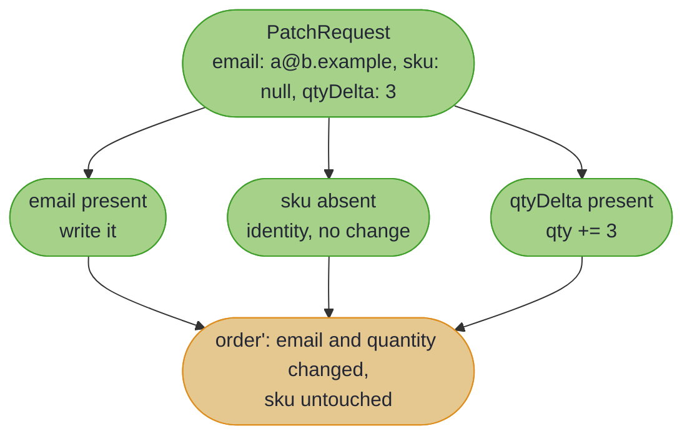
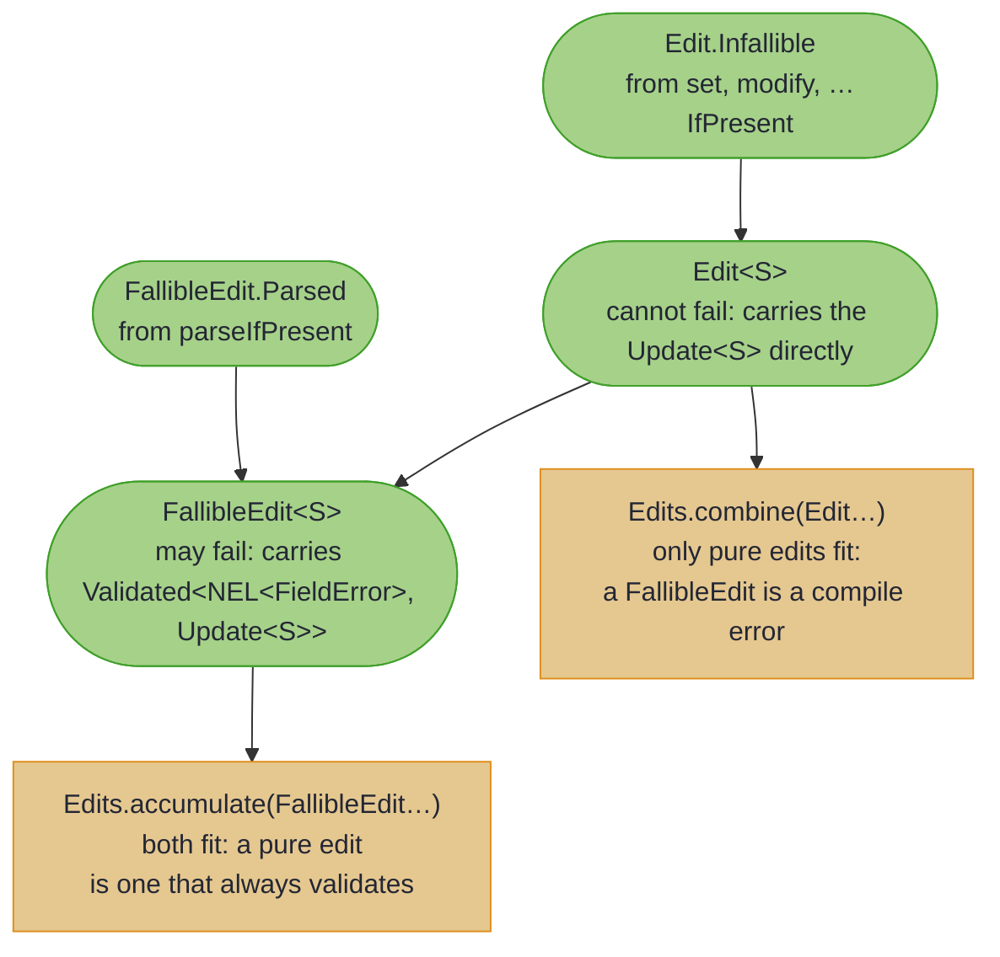
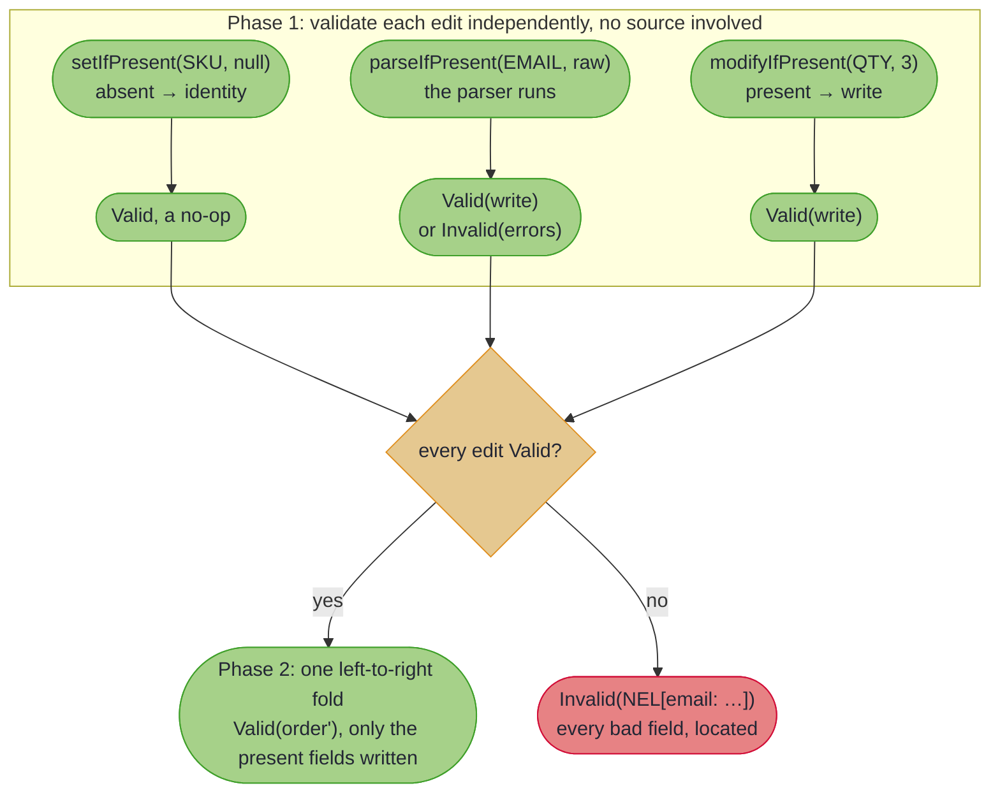
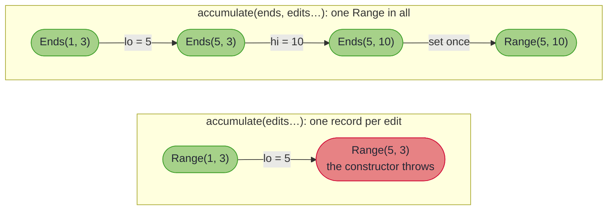

# Multi-Edit and Sparse Updates

## _N Edits in One Operation, and the REST PATCH Shape_

~~~admonish example title="See Example Code"
**The code on this page is [MultiEditBook.java](https://github.com/higher-kinded-j/higher-kinded-j/blob/main/hkj-examples/src/main/java/org/higherkindedj/example/book/optics/MultiEditBook.java)** - the page includes it directly, so it is compiled and run by the build.
~~~


_Apply N independent edits at different paths in one reusable operation, including the sparse, all-errors-at-once REST `PATCH` shape._

~~~admonish info title="What You'll Learn"
- Combining several edits at different paths into one reusable operation with `Edits.combine`
- Writing sparse updates where a `null` field means "leave it alone", with no `if` per field
- Building a REST `PATCH` with `Edits.accumulate` that validates every field and reports all the bad ones at once, not just the first
- The two-phase model: validate everything first, then apply the writes only if all of them passed
- Editing fields a record's constructor checks together, so it sees only the values the edits end on
- How the pure and validating edits are kept apart at compile time, and when overlapping paths need one atomic edit instead
~~~

## The problem

An optic edits one path at a time (`FocusPath.set`, `Setter.modify`). But the everyday case is applying **several** edits at once, the classic example being a REST `PATCH` that tidies the email, trims the SKU, and bumps the quantity. By hand that means threading the value through every step, guarding each optional field with an `if`, and (if you validate at all) throwing on the first bad field:

``` java
    Order updated = order;
    if (req.email() != null) {
      updated = updated.withEmail(req.email().toLowerCase()); // thread the result...
    }
    if (req.sku() != null) {
      updated = updated.withSku(req.sku().trim()); // ...through every step
    }
    if (req.qtyDelta() != null) {
      updated = updated.withQuantity(updated.quantity() + req.qtyDelta());
    }
    // And if the email was malformed? You throw on the first bad field and never see the rest.
```

Three pains recur: one `if` per optional field, the value re-threaded by hand at every step, and validation that stops at the first error instead of collecting them all.

## The solution: two entry points

The `org.higherkindedj.optics.edit` package folds all of that into two operations. Which one you reach for depends only on whether any edit can *fail*:

| Entry point | Reach for it when | Returns |
|---|---|---|
| `Edits.combine(...)` | every edit is always safe (no validation) | one reusable `Update<S>` |
| `Edits.accumulate(...)` | some edits validate their input (a REST `PATCH`) | a patch you apply to get `Validated<NonEmptyList<FieldError>, S>` |

Those are the whole API, with one more form of `accumulate` for [fields a constructor checks together](#fields-a-constructor-checks-together). The rest of this page is how each one behaves, and how the compiler keeps a validating edit from slipping into `combine` by accident.

---

## Pure multi-edit: `Edits.combine`

Each `Edit` factory pairs an optic (a `FocusPath` or a `Setter`) with a value or function. `combine` folds them (via the [`Update` monoid](../functional/semigroup_and_monoid.md)) into one named, reusable transformation:

``` java
import static org.higherkindedj.optics.edit.Edit.*;

    Update<Order> normalise =
        Edits.combine(modify(EMAIL, String::toLowerCase), modify(SKU, String::trim));

    Order orderA = new Order("ORD-1", "A@B.COM", " sku ", 1);
    Order orderB = new Order("ORD-2", "C@D.COM", " sku2 ", 2);

    Order a = normalise.apply(orderA);
    Order b = normalise.andThen(APPLY_DISCOUNT).apply(orderB); // Update composes further
```

Only pure `Edit`s fit `combine`'s signature; a fallible edit is rejected **at compile time**, so validation failures can never be silently dropped.

---

## Sparse updates: absent means "leave it alone"

The `…IfPresent` factories treat `null` as *absent*: the edit contributes the identity update, so a sparse request DTO lands one-to-one with no `if` ceremony:

``` java
    Edit<Order> number = setIfPresent(ORDER_NUMBER, req.orderNumber()); // null -> no-op
    Edit<Order> quantity = modifyIfPresent(QUANTITY, req.qtyDelta(), (delta, qty) -> qty + delta);
```

Each request field maps to exactly one slot; an absent field simply contributes nothing to the fold:



~~~admonish warning title="Absent and null are deliberately the same"
A sparse edit cannot *clear* a field: `setIfPresent(path, null)` means "no change requested", not "set to null". This suits non-null domain models; if a field must be clearable, model the cleared state explicitly (e.g. `Maybe`) and `set` it. The functions given to `modifyIfPresent`/`parseIfPresent` are never invoked with `null`.
~~~

---

## Validated PATCH: `Edits.accumulate`

`parseIfPresent` parses the incoming value first, and a generated path locates any failure **automatically** from its own label (`.at(label)` prepends further context, exactly as `FieldError.at` composes paths). The parser you hand it has exactly the shape of a [`ValidatedPrism`](validated_prism.md)'s `parse`: define the boundary once as a prism (gaining the total render-back and the round-trip laws) and pass `Email::parse` here. `accumulate` validates **every** edit independently and reports **all** bad fields at once:

``` java
    Validated<NonEmptyList<FieldError>, Order> patched =
        Edits.accumulate(
                setIfPresent(ORDER_NUMBER, req.orderNumber()),
                parseIfPresent(EMAIL, req.email(), Email::parse),
                modifyIfPresent(QUANTITY, req.qtyDelta(), (delta, qty) -> qty + delta))
            .apply(order);
    // Invalid(NonEmptyList[email: not an address])
    //   <- or Valid(order) with only the present fields changed
```

Errors accumulate in edit order on the `NonEmptyList` channel, exactly like the [accumulating assembly](../monads/validated_assembly.md), but as a homogeneous fold, so there is **no arity ceiling**.

~~~admonish tip title="Generated paths label themselves"
A path from a `@GenerateFocus` companion carries its record-component name as a **segment** (`OrderFocus.email()` → `"email"`); composing paths concatenates segments (`customer.via(address).via(zip)` → `"customer.address.zip"`, surfaced by `segments()`/`pathString()`), and `parseIfPresent` locates failures with them **automatically**: no `.at(...)` needed for generated paths. An explicit `.at(label)` still prepends outward, for hand-written optics or extra context.
~~~

For the railway, `applyPath(order)` is the `ValidationPath` twin of `apply(order)`, and `toValidated()` exposes the folded `Update` itself for reuse.

~~~admonish tip title="Generate this when the shape is regular"
When the request DTO's fields line up one-to-one with a domain record (the common REST PATCH case), you need not hand-write the fold at all: `@GenerateMapping` on an [`UpdateSpec<Domain, Wire>`](../mapping/beans_patch.md#sparse-patch-write-back-updatespec) generates this `Edits.accumulate` over the present fields, in its [construct-once form](#fields-a-constructor-checks-together), as `updateFrom(wire) : Edits.Accumulated<Domain>` (the same `apply`/`applyPath`/`toValidated` surface). Reach for the hand-written `Edits` here when the edits are irregular (a `qtyDelta` that *modifies*, coupled fields, a computed target); reach for `UpdateSpec` when each present field maps to one slot.
~~~

---

## How the split stays compile-time safe

`combine` accepts only pure edits; `accumulate` accepts both. That is not a rule you have to remember: it is carried by the type of each edit. `set`, `modify`, and the `…IfPresent` forms produce an `Edit` (cannot fail); `parseIfPresent` produces a `FallibleEdit` (may fail). Passing a `FallibleEdit` to `combine` does not compile, so a validation failure can never be silently dropped.



---

## Semantics: validate everything, then write once

An accumulated patch works in two phases:

1. **Validate**: each edit's incoming value is checked independently. Validation never sees a source, which is what makes accumulation sound *and* lets one patch apply to many sources.
2. **Apply**: only if every edit validated, the writes run as a single left-to-right fold.



Application order is observable only when paths overlap: disjoint paths commute; an edit at an overlapping path sees the previous edit's result (a `modify` reads the *current* value at application time). Genuinely coupled fields belong in one atomic edit (see [Coupled Fields](coupled_fields.md) and `Lens.paired`), or, when a record's constructor checks them against each other, [onto a focus](#fields-a-constructor-checks-together).

---

## Fields a constructor checks together {#fields-a-constructor-checks-together}

Each write through a record's path builds a new record, so the constructor sees every value the fold passes through. A range whose constructor refuses `lo > hi` cannot move from `Range(1, 3)` to `Range(5, 10)` one end at a time: writing `lo` first builds `Range(5, 3)`, and the constructor throws before `hi` is written, although the final range is valid.

`Edits.accumulate(focus, edits...)` takes a `Lens` to a value carrying the fields the edits set, with no check of its own. The edits write onto that value, and the lens sets it back once, so the constructor sees only the final values:

``` java
record Range(int lo, int hi) {
  Range {
    if (lo > hi) {
      throw new IllegalArgumentException("lo > hi");
    }
  }
}

@GenerateFocus
record Ends(int lo, int hi) {} // the fields the edits set, with no check of their own

```

``` java
    Lens<Range, Ends> ends =
        Lens.of(r -> new Ends(r.lo(), r.hi()), (r, e) -> new Range(e.lo(), e.hi()));

    Validated<NonEmptyList<FieldError>, Range> moved =
        Edits.accumulate(
                ends,
                setIfPresent(EndsFocus.lo(), move.lo()),
                setIfPresent(EndsFocus.hi(), move.hi()))
            .apply(new Range(1, 3));
    // Valid(Range[lo=5, hi=10])
    //   <- both ends move together. Moving lo alone would make Range(5, 3), which the
    //      record's own constructor refuses, and the refusal arrives as a located error.
```



The edits validate exactly as they do in `accumulate`, and their errors are reported alone: the record is constructed only once every edit validated. A `RuntimeException` that setting the focus back throws is the constructor refusing the final values, and `apply` reports it as an unlabelled `FieldError` carrying the exception's message; an exception without a message, or with a blank one, reads `not a valid Range`. Only that call is guarded: an exception from an edit's own function, or from reading the focus, still propagates. When every edit is absent, the source comes back as it is and the focus is never set. `toValidated()` hands back an `Update` that writes onto the focus and sets it back once, and since an `Update` has no error channel, a refusal throws from it.

The edits' errors are located relative to the focus. Where the focus is a nested component rather than the source's own fields, add the component's name to each edit with `.at("range")`, so their errors and the source agree on where they are.

`@GenerateMapping` on an [`UpdateSpec`](../mapping/beans_patch.md#fields-a-constructor-checks-together) generates exactly this: its `updateFrom` writes onto the components a PATCH can set and constructs the domain record once.

---

~~~admonish info title="Key Takeaways"
* **`Edits.combine`** folds pure edits into one reusable `Update<S>`; compile-time purity
* **`…IfPresent` + null-as-absent** gives sparse updates with no `if` ceremony: absent contributes the monoid identity
* **`Edits.accumulate`** validates every edit independently and reports all located failures at once, in edit order, with no arity ceiling
* **Two phases**: validation is source-independent; writes run left-to-right only when everything validated
* **Overlapping paths see earlier writes**; coupled fields should be one atomic edit (`Lens.paired`)
* **`Edits.accumulate(focus, …)`** writes onto one focus and sets it back once, so a constructor checking fields against each other sees only the final values, and its refusal is an `Invalid`
~~~

~~~admonish info title="Hands-On Learning"
Practise the whole model in [Tutorial 24: Multi-Edit and Sparse Updates](https://github.com/higher-kinded-j/higher-kinded-j/blob/main/hkj-examples/src/test/java/org/higherkindedj/tutorial/optics/Tutorial24_MultiEdit.java) (5 exercises): pure folds, sparse patches, and the all-errors-at-once validated PATCH.
~~~

~~~admonish tip title="See Also"
- [Semigroup and Monoid](../functional/semigroup_and_monoid.md): the `Update` monoid that powers `combine`
- [Accumulating Assembly](../monads/validated_assembly.md): the same all-errors-at-once model for *constructing* values
- [Coupled Fields](coupled_fields.md): atomic updates of interdependent fields
- [Sparse PATCH (`UpdateSpec`)](../mapping/beans_patch.md#sparse-patch-write-back-updatespec): generate this `Edits.accumulate` fold when the DTO maps one-to-one
~~~

---

**Previous:** [Core Type Integration](core_type_integration.md)
**Next:** [Optics Extensions](optics_extensions.md)
