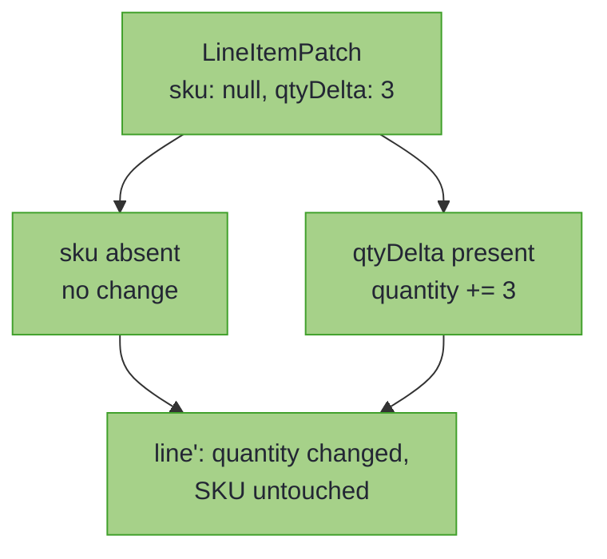
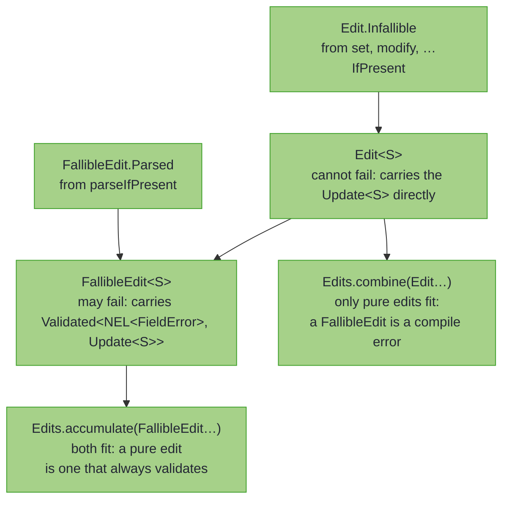
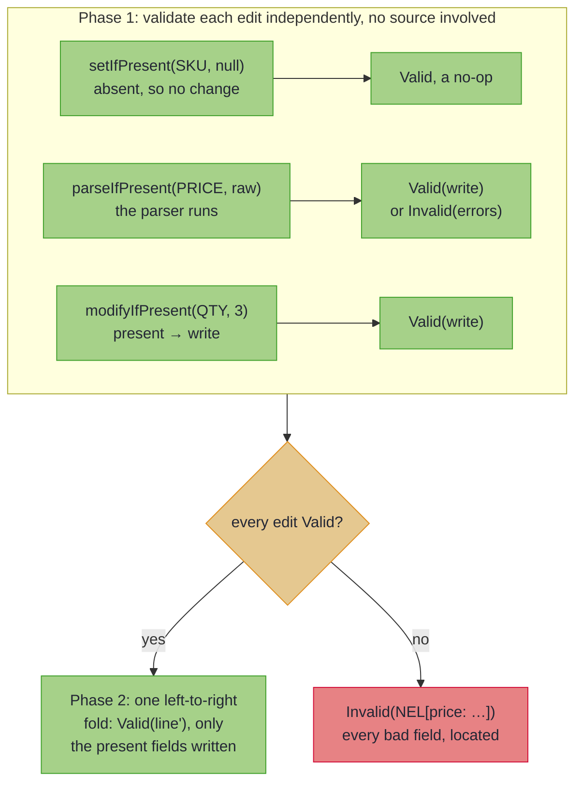
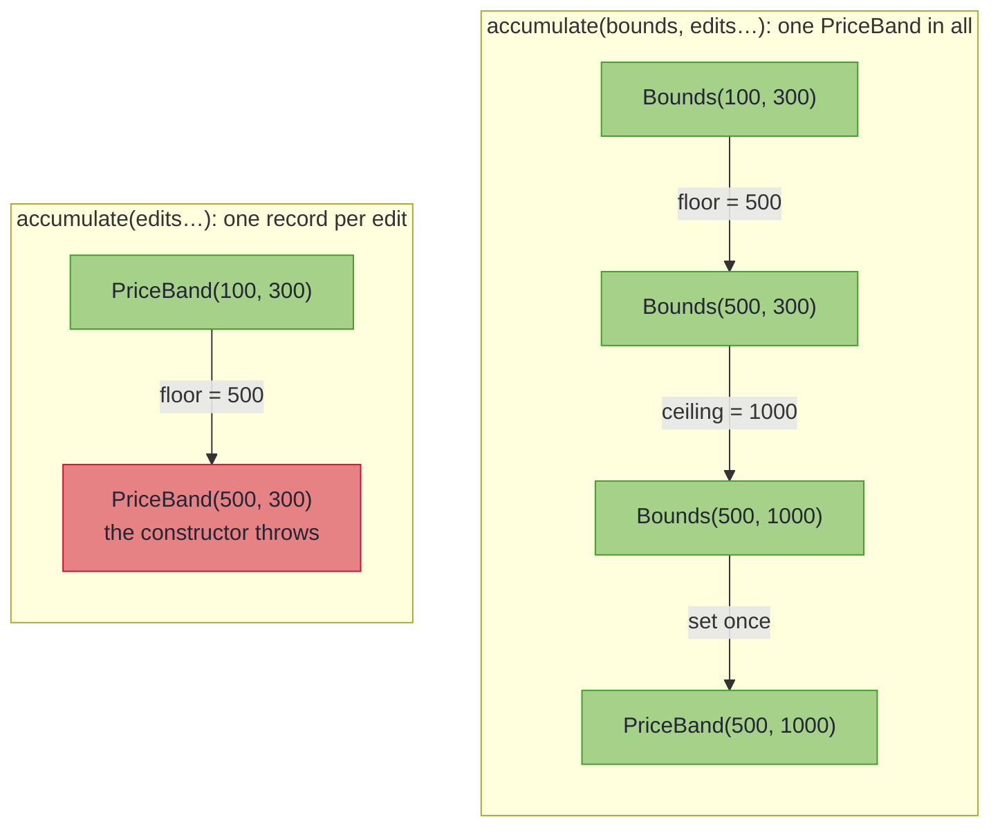

# Many Edits at Once

_Apply several edits as one update, or check a REST `PATCH` and report every bad field at once._

~~~admonish info title="What You'll Learn"
- Combine edits at different paths into one reusable update with `Edits.combine`
- Write a sparse update, where a `null` field means "leave it alone", with no `if` per field
- Check every field of a REST `PATCH` with `Edits.accumulate`, and report all the bad ones together
- Edit fields a record's constructor checks together, so it sees only the final values
~~~

~~~admonish example title="See Example Code"
**The code on this page is [MultiEditBook.java](https://github.com/higher-kinded-j/higher-kinded-j/blob/main/hkj-examples/src/main/java/org/higherkindedj/example/book/optics/MultiEditBook.java)**: the page includes it directly, so the build compiles and runs it.
~~~

---

## The problem

A path makes one edit at a time. The everyday case is several edits at once, and the classic one is a REST `PATCH` of an order line that trims the SKU, bumps the quantity and sets a new price. The request body is a `LineItemPatch(sku, qtyDelta, price)`, each component `null` when the client did not send it. By hand that means threading the value through every step, guarding each optional field with an `if`, and, if you validate at all, throwing on the first bad field:

``` java
    LineItem updated = line;
    if (patch.sku() != null) {
      updated = updated.withSku(patch.sku().strip()); // thread the result...
    }
    if (patch.qtyDelta() != null) {
      updated =
          updated.withQuantity(updated.quantity() + patch.qtyDelta()); // ...through every step
    }
    if (patch.price() != null) {
      updated = updated.withPrice(new BigDecimal(patch.price())); // throws on a malformed price
    }
    // The SKU goes unchecked, and a malformed price throws, so the first bad field hides the rest.
```

Three pains recur: one `if` per optional field, the value re-threaded by hand at every step, and validation that stops at the first error instead of collecting them all. If you use MapStruct for this, its answer is `@MappingTarget` with `NullValuePropertyMappingStrategy.IGNORE`, and [Coming from MapStruct](../mapping/from_mapstruct.md#from-mapstruct) sets the two side by side.

---

## The solution: two entry points

The `org.higherkindedj.optics.edit` package folds all of that into two operations. Which one you reach for depends only on whether any edit can *fail*:

| Entry point | Reach for it when | Returns |
|---|---|---|
| `Edits.combine(...)` | every edit is always safe (no validation) | one reusable `Update<S>` |
| `Edits.accumulate(...)` | some edits validate their input (a REST `PATCH`) | a patch you apply to get `Validated<NonEmptyList<FieldError>, S>` |

Those are the whole API, with one more form of `accumulate` for [fields a constructor checks together](#fields-a-constructor-checks-together). The rest of this page is how each one behaves, and how the compiler keeps a validating edit from slipping into `combine` by accident.

---

## Edits that cannot fail: `Edits.combine` {#pure-multi-edit-editscombine}

Each `Edit` factory pairs an optic (a `FocusPath` or a `Setter`) with a value or function. `combine` joins them, in order, into one `Update<LineItem>`: a function from line to line that you can name and reuse.

``` java
import static org.higherkindedj.optics.edit.Edit.*;

    Update<LineItem> tidy =
        Edits.combine(
            modify(SKU, sku -> sku.strip().toUpperCase()),
            modify(PRICE, price -> price.setScale(2, RoundingMode.HALF_EVEN)));

    Update<LineItem> doubled = Edits.combine(modify(QUANTITY, quantity -> quantity * 2));

    LineItem lamp = tidy.apply(new LineItem(" lamp ", 1, new BigDecimal("40")));
    // LineItem[sku=LAMP, quantity=1, price=40.00]

    // an Update composes further: the bulbs are tidied, then their quantity doubled
    LineItem bulbs = tidy.andThen(doubled).apply(new LineItem("bulb", 4, new BigDecimal("2.5")));
    // LineItem[sku=BULB, quantity=8, price=2.50]
```

Only pure `Edit`s fit `combine`'s signature; a fallible edit is rejected **at compile time**, so validation failures can never be silently dropped.

---

## Sparse updates: absent means "leave it alone"

The `…IfPresent` factories treat `null` as *absent*: the edit changes nothing, so a sparse request DTO lands one-to-one with no `if` ceremony:

``` java
    Edit<LineItem> sku = setIfPresent(SKU, sparsePatch.sku()); // null -> no-op
    Edit<LineItem> quantity =
        modifyIfPresent(QUANTITY, sparsePatch.qtyDelta(), (delta, qty) -> qty + delta);

    LineItem restocked = Edits.combine(sku, quantity).apply(lampLine);
    // LineItem[sku=LAMP, quantity=4, price=40.00]
```

Each request field maps to exactly one slot; an absent field simply contributes nothing to the fold:



~~~admonish warning title="Absent and null are deliberately the same"
A sparse edit cannot *clear* a field: `setIfPresent(path, null)` means "no change requested", not "set to null". This suits non-null domain models; if a field must be clearable, model the cleared state explicitly (e.g. `Maybe`) and `set` it. The functions given to `modifyIfPresent`/`parseIfPresent` are never invoked with `null`.
~~~

---

## Validated PATCH: `Edits.accumulate`

`parseIfPresent` parses the incoming value first, and a generated path locates any failure **automatically** from its own label. The parser you hand it has exactly the shape of a [`ValidatedPrism`](validated_prism.md)'s `parse`, so a boundary defined once as a prism passes its `parse` here. This request's SKU and price are both bad:

~~~admonish example title="The two parsers" collapsible=true
``` java
/** The boundary parsers the page hands to {@code parseIfPresent}. */
final class Sku {
  static Validated<NonEmptyList<FieldError>, String> parse(String raw) {
    String sku = raw.strip();
    return sku.matches("[A-Z0-9-]+")
        ? Validated.validNel(sku)
        : Validated.invalidNel(FieldError.of("not a SKU"));
  }

  private Sku() {}
}

final class Price {
  static Validated<NonEmptyList<FieldError>, BigDecimal> parse(String raw) {
    try {
      BigDecimal price = new BigDecimal(raw.strip());
      return price.signum() >= 0
          ? Validated.validNel(price)
          : Validated.invalidNel(FieldError.of("not a price"));
    } catch (NumberFormatException e) {
      return Validated.invalidNel(FieldError.of("not a price"));
    }
  }

  private Price() {}
}
```
~~~

``` java
    Validated<NonEmptyList<FieldError>, LineItem> patched =
        Edits.accumulate(
                parseIfPresent(SKU, badPatch.sku(), Sku::parse),
                modifyIfPresent(QUANTITY, badPatch.qtyDelta(), (delta, qty) -> qty + delta),
                parseIfPresent(PRICE, badPatch.price(), Price::parse))
            .apply(line);
    // Invalid(NonEmptyList[sku: not a SKU, price: not a price])
    //   <- or Valid(line) with only the present fields changed
```

`accumulate` checks **every** edit independently and reports **all** the bad fields at once, each named by its path. The errors arrive in edit order on the `NonEmptyList`, as in the [accumulating assembly](../monads/validated_assembly.md), and one patch can hold any number of edits.

~~~admonish tip title="Generated paths label themselves"
A path from a `@GenerateFocus` companion carries its record-component name as a **segment**: `LineItemFocus.sku()` is labelled `"sku"`. Composing paths joins the segments, so `OrderFocus.customer().email().value()` is `"customer.email.value"`, which `segments()` and `pathString()` return. `parseIfPresent` locates failures with them **automatically**, so a generated path needs no `.at(...)`. An explicit `.at(label)` still prepends outward, for a hand-written optic or extra context, as `FieldError.at` does.
~~~

To carry on in an Effect Path, `applyPath(line)` is the `ValidationPath` twin of `apply(line)`, and `toValidated()` exposes the folded `Update` itself for reuse.

~~~admonish tip title="Generate this when the shape is regular"
When the request DTO's fields line up one-to-one with a domain record, the common REST PATCH case, you need not hand-write the fold at all. `@GenerateMapping` on an [`UpdateSpec<Domain, Wire>`](../mapping/beans_patch.md#sparse-patch-write-back-updatespec) generates this `Edits.accumulate` over the present fields, in its [construct-once form](#fields-a-constructor-checks-together). It returns `updateFrom(wire) : Edits.Accumulated<Domain>`, with the same `apply`, `applyPath` and `toValidated`. Reach for the hand-written `Edits` here when the edits are irregular (a `qtyDelta` that *modifies*, coupled fields, a computed target); reach for `UpdateSpec` when each present field maps to one slot.
~~~

---

## How the split stays compile-time safe

`combine` accepts only pure edits; `accumulate` accepts both. That is not a rule you have to remember: it is carried by the type of each edit. `set`, `modify`, and the `…IfPresent` forms produce an `Edit` (cannot fail); `parseIfPresent` produces a `FallibleEdit` (may fail). Passing a `FallibleEdit` to `combine` does not compile, so a validation failure can never be silently dropped.



---

## Semantics: validate everything, then write once

An accumulated patch works in two phases:

1. **Validate**: each edit's incoming value is checked independently. Validation never sees a source, so every check runs, and one patch applies to many sources.
2. **Apply**: only if every edit validated, the writes run as a single left-to-right fold.



Application order is observable only when paths overlap: disjoint paths commute; an edit at an overlapping path sees the previous edit's result (a `modify` reads the *current* value at application time). Genuinely coupled fields belong in one atomic edit (see [Coupled Fields](coupled_fields.md) and `Lens.paired`), or, when a record's constructor checks them against each other, [onto a focus](#fields-a-constructor-checks-together).

---

## Fields a constructor checks together {#fields-a-constructor-checks-together}

Each write through a record's path builds a new record, so the constructor sees every value the fold passes through. Take a `PriceBand`, a catalogue price band in pence, whose constructor refuses `floor > ceiling`. It cannot move from `PriceBand(100, 300)` to `PriceBand(500, 1000)` one end at a time: writing the floor first builds `PriceBand(500, 300)`, and the constructor throws before the ceiling is written, although the final band is valid.

`Edits.accumulate(focus, edits...)` takes a `Lens` to a value carrying the fields the edits set, with no check of its own, here `Bounds`. The request `move` asks for a floor of 500 and a ceiling of 1000. The edits write onto that value, and the lens sets it back once, so the constructor sees only the final values:

``` java
record PriceBand(int floor, int ceiling) {
  PriceBand {
    if (floor > ceiling) {
      throw new IllegalArgumentException("floor above ceiling");
    }
  }
}

@GenerateFocus
record Bounds(int floor, int ceiling) {} // the fields the edits set, with no check of their own

```

``` java
    Lens<PriceBand, Bounds> bounds =
        Lens.of(
            band -> new Bounds(band.floor(), band.ceiling()),
            (_, b) -> new PriceBand(b.floor(), b.ceiling()));

    Validated<NonEmptyList<FieldError>, PriceBand> moved =
        Edits.accumulate(
                bounds,
                setIfPresent(BoundsFocus.floor(), move.floor()),
                setIfPresent(BoundsFocus.ceiling(), move.ceiling()))
            .apply(new PriceBand(100, 300));
    // Valid(PriceBand[floor=500, ceiling=1000])
    //   <- both ends move together. Moving the floor alone would make PriceBand(500, 300), which
    //      the record's own constructor refuses, and the refusal would arrive as an error.
```



`@GenerateMapping` on an [`UpdateSpec`](../mapping/beans_patch.md#fields-a-constructor-checks-together) generates exactly this: its `updateFrom` writes onto the components a PATCH can set and constructs the domain record once.

~~~admonish tip title="You can ship now"
You can now update nested records, check what you write, and apply a PATCH that reports every bad field. The [Capstone](capstone.md) that follows puts these pieces together, and [When the constructor refuses](#when-the-constructor-refuses) is the fine print of this page.
~~~

~~~admonish question title="Checkpoint: two edits on one path" id="check-edits-overlap"
What quantity does `Edits.combine(modify(QUANTITY, q -> q + 1), modify(QUANTITY, q -> q * 2))` leave on a line of quantity 3?
~~~

~~~admonish success title="Answer and why" collapsible=true id="check-edits-overlap-answer"
**8.** The writes run left to right, and an edit at an overlapping path sees the previous edit's result: 3 becomes 4, then 8.

Where this lives: [Semantics: validate everything, then write once](#semantics-validate-everything-then-write-once).
~~~

~~~admonish question title="Checkpoint: one bad field" id="check-edits-write-once"
A PATCH sends a blank SKU, a `qtyDelta` of 2 and the price `forty`. With this page's parsers and `Edits.accumulate`, is the line's quantity changed?
~~~

~~~admonish success title="Answer and why" collapsible=true id="check-edits-write-once-answer"
**No.** The result is `Invalid(NonEmptyList[sku: not a SKU, price: not a price])`, and an `Invalid` carries no line. The writes run only when every edit validated, so the good `qtyDelta` is not applied either.

Where this lives: [Semantics: validate everything, then write once](#semantics-validate-everything-then-write-once).
~~~

---

## The fine print {#the-fine-print}

### When the constructor refuses {#when-the-constructor-refuses}

The edits validate exactly as they do in `accumulate`, and their errors are reported alone: the record is constructed only once every edit validated. After that, `apply` treats each kind of exception its own way:

| What happens | What `apply` returns |
|---|---|
| Setting the focus back throws a `RuntimeException`: the constructor refusing the final values | An unlabelled `FieldError` carrying the exception's message, or `not a valid PriceBand` when the message is missing or blank |
| An edit's own function, or reading the focus, throws | Nothing: the exception propagates, since only setting the focus back is guarded |
| Every edit is absent | The source as it is, without setting the focus |

`toValidated()` hands back an `Update` that writes onto the focus and sets it back once. An `Update` has no error channel, so a refusal throws from it.

The edits' errors are located relative to the focus. Where the focus is a nested component rather than the source's own fields, add the component's name to each edit with `.at("band")`, so their errors and the source agree on where they are.

---

~~~admonish info title="Key Takeaways"
* **`Edits.combine` joins edits that cannot fail into one reusable `Update<S>`.** A fallible edit does not compile there.
* **An absent value changes nothing.** The `…IfPresent` forms take a sparse request field by field, with no `if`.
* **`Edits.accumulate` checks every edit and reports every bad field.** The errors arrive located and in edit order, and a patch holds any number of edits.
* **A patch validates first, then writes once.** Validation never sees the source, and the writes run left to right only when every edit passed.
* **Overlapping paths see earlier writes.** Fields that must change together belong in one atomic edit, such as `Lens.paired`.
* **`Edits.accumulate(focus, …)` builds the record once.** A constructor that checks fields against each other sees only the final values, and its refusal is an `Invalid`.
~~~

~~~admonish info title="Hands-On Learning"
Practise the whole model in [Tutorial 24: Multi-Edit and Sparse Updates](https://github.com/higher-kinded-j/higher-kinded-j/blob/main/hkj-examples/src/test/java/org/higherkindedj/tutorial/optics/Tutorial24_MultiEdit.java) (5 exercises): pure folds, sparse patches, and the all-errors-at-once validated PATCH.
~~~

~~~admonish tip title="See Also"
- [Updates That Can Fail](fluent_api.md): one field or one list at a time, through `OpticOps`
- [Semigroup and Monoid](../functional/semigroup_and_monoid.md): the `Update` monoid that powers `combine`
- [Accumulating Assembly](../monads/validated_assembly.md): the same all-errors-at-once model for *constructing* values
- [Coupled Fields](coupled_fields.md): atomic updates of interdependent fields
- [Sparse PATCH (`UpdateSpec`)](../mapping/beans_patch.md#sparse-patch-write-back-updatespec): generate this `Edits.accumulate` fold when the DTO maps one-to-one
~~~

---

**Previous:** [Updates That Can Fail](fluent_api.md)
**Next:** [Capstone: An Order Desk](capstone.md)
