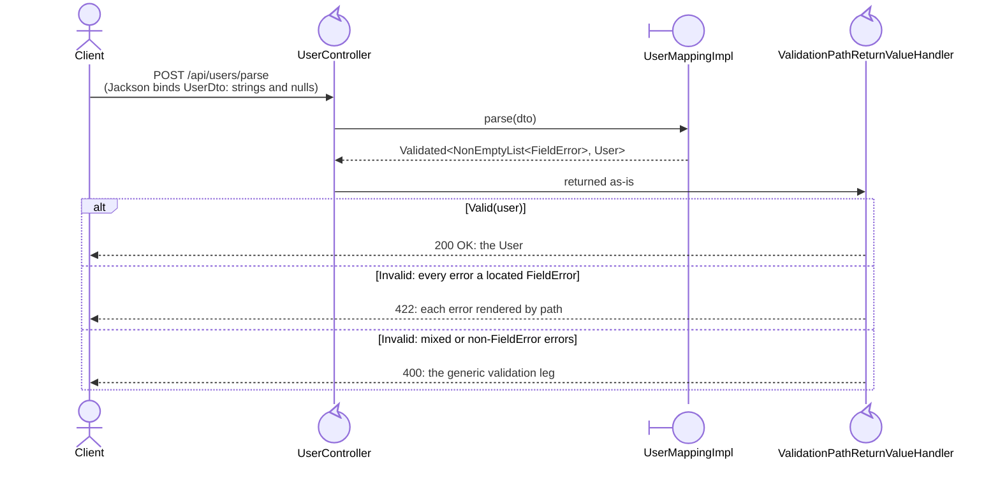

# Spring Boot Integration: Functional Patterns for Enterprise Applications
## _Bringing Type-Safe Error Handling to Your REST APIs_

~~~admonish info title="What You'll Learn"
- How to use Either, Validated, Maybe, Try, IO, CompletableFuture, VTask, VStream, EitherOrBoth, and Free as Spring controller return types (via their Path wrappers)
- Zero-configuration setup with the hkj-spring-boot-starter
- Virtual thread integration with VTaskPath (async) and VStreamPath (SSE streaming)
- Automatic JSON serialisation with customisable formats
- Success HTTP status control via `@ResponseStatus` on handler methods
- Monitoring functional operations with Spring Boot Actuator
- Securing endpoints with functional error handling patterns
- Building production-ready applications with explicit, typed errors
- Testing functional controllers with MockMvc, both full context and `@WebMvcTest` slices
~~~

~~~admonish example title="Example Application"
A complete working example is available in the [hkj-spring example module](https://github.com/higher-kinded-j/higher-kinded-j/tree/main/hkj-spring/example). Run it with:
```bash
./gradlew :hkj-spring:example:bootRun
```
~~~

## Overview

Building REST APIs with Spring Boot is straightforward, but error handling often becomes a source of complexity and inconsistency. Traditional exception-based approaches scatter error handling logic across `@ExceptionHandler` methods, lose type safety, and make it difficult to reason about what errors a given endpoint can produce.

The **hkj-spring-boot-starter** solves these problems by bringing functional programming patterns seamlessly into Spring applications. Return `Either<Error, Data>`, `Validated<Errors, Data>`, or `CompletableFuturePath` from your controllers, and the framework automatically handles the rest: converting functional types to appropriate HTTP responses whilst preserving type safety and composability.

**The key insight:** Errors become explicit in your method signatures, not hidden in implementation details or exception hierarchies.

---

## Quickstart {#quickstart}

### Step 1: Add the Dependency

Add the starter to your Spring Boot project:

```gradle
// build.gradle.kts
dependencies {
    implementation("io.github.higher-kinded-j:hkj-spring-boot-starter:LATEST_VERSION")
}
```

Or with Maven:

```xml
<dependency>
    <groupId>io.github.higher-kinded-j</groupId>
    <artifactId>hkj-spring-boot-starter</artifactId>
    <version>LATEST_VERSION</version>
</dependency>
```

#### Recommended: align versions with the BOM

A Spring project usually pulls in more than the starter alone, typically
`hkj-core` for the Path types your services return, and `hkj-test` for the
AssertJ helpers in your slice tests. Importing the `hkj-bom` platform pins
all HKJ modules to one consistent version, so you declare the version once
and leave it off every individual dependency.

```gradle
// build.gradle.kts
dependencies {
    implementation(platform("io.github.higher-kinded-j:hkj-bom:LATEST_VERSION"))

    implementation("io.github.higher-kinded-j:hkj-spring-boot-starter")
    implementation("io.github.higher-kinded-j:hkj-core")
    testImplementation("io.github.higher-kinded-j:hkj-test")
}
```

Or with Maven:

```xml
<dependencyManagement>
    <dependencies>
        <dependency>
            <groupId>io.github.higher-kinded-j</groupId>
            <artifactId>hkj-bom</artifactId>
            <version>LATEST_VERSION</version>
            <type>pom</type>
            <scope>import</scope>
        </dependency>
    </dependencies>
</dependencyManagement>

<dependencies>
    <dependency>
        <groupId>io.github.higher-kinded-j</groupId>
        <artifactId>hkj-spring-boot-starter</artifactId>
    </dependency>
    <dependency>
        <groupId>io.github.higher-kinded-j</groupId>
        <artifactId>hkj-core</artifactId>
    </dependency>
    <dependency>
        <groupId>io.github.higher-kinded-j</groupId>
        <artifactId>hkj-test</artifactId>
        <scope>test</scope>
    </dependency>
</dependencies>
```

~~~admonish tip title="Already using the HKJ build plugin?"
The [HKJ Gradle and Maven plugins](../tooling/gradle_plugin.md) add
`hkj-core`, and with Spring integration enabled the starter and the
`@HkjHttpClient` processor, all at the plugin's version. They do not add
`hkj-test`: give it a version, or import the BOM for it. This BOM snippet is for Spring
projects that wire HKJ in by hand.
~~~

### Step 2: Return Functional Types from Controllers

<!-- verify -->
```java
@RestController
@RequestMapping("/api/users")
public class UserController {

    @Autowired
    private UserService userService;

    @GetMapping("/{id}")
    public Either<DomainError, User> getUser(@PathVariable String id) {
        return userService.findById(id);
        // Right(user) → HTTP 200 with JSON body
        // Left(UserNotFoundError) → HTTP 404 with error details
    }

    @PostMapping
    public Validated<List<ValidationError>, User> createUser(@RequestBody UserRequest request) {
        return userService.validateAndCreate(request);
        // Valid(user) → HTTP 200 with user JSON
        // Invalid(errors) → HTTP 400 with all validation errors accumulated
    }
}
```

### Step 3: Run Your Application

That's it! The starter auto-configures everything:
- EitherPath to HTTP response conversion with automatic status code mapping
- ValidationPath to HTTP response with error accumulation (located `FieldError` payloads render as one 422 listing every bad field by path)
- MaybePath, TryPath, and IOPath handlers for optional, exception-capturing, and deferred computations
- CompletableFuturePath support for async operations
- VTaskPath support for virtual thread async via DeferredResult
- VStreamPath support for SSE streaming on virtual threads
- EitherOrBothPath support for success-with-warnings responses (warnings in the `X-Hkj-Warnings` header)
- FreePath support for Free-monad programs interpreted through `EffectBoundary`
- `@ResponseStatus` honoured on handler methods to override the default success status
- JSON serialisation for functional types
- Customisable error type to HTTP status code mapping

---

## Why Use Functional Error Handling?

### The Problem with Exceptions

Traditional Spring Boot error handling relies on exceptions and `@ExceptionHandler` methods:

<!-- verify -->
```java
@GetMapping("/{id}")
public User getUser(@PathVariable String id) {
    return throwingUserService.findById(id);  // What errors can this throw?
}

@ExceptionHandler(UserNotFoundException.class)
public ResponseEntity<ErrorResponse> handleNotFound(UserNotFoundException ex) {
    return ResponseEntity.status(404).body(new ErrorResponse(ex.getMessage()));
}

@ExceptionHandler(ValidationException.class)
public ResponseEntity<ErrorResponse> handleValidation(ValidationException ex) {
    return ResponseEntity.status(400).body(new ErrorResponse(ex.getMessage()));
}
```

**Problems:**
- Errors are invisible in the method signature
- No compile-time guarantee that all errors are handled
- Exception handlers become a catch-all for unrelated errors
- Difficult to compose operations whilst maintaining error information
- Testing requires catching exceptions or using `@ExceptionHandler` integration

### The Functional Solution

With functional error handling, errors become explicit and composable:

<!-- verify -->
```java
@GetMapping("/{id}")
public Either<DomainError, User> getUser(@PathVariable String id) {
    return userService.findById(id);  // Clear: returns User or DomainError
}

@GetMapping("/{id}/orders")
public Either<DomainError, List<Order>> getUserOrders(@PathVariable String id) {
    return userService.findById(id)
        .flatMap(orderService::getOrdersForUser);  // Compose operations naturally
}
```

**Benefits:**
- Errors are explicit in the type signature
- Compiler ensures error handling at call sites
- Functional composition with `map`, `flatMap`, `fold`
- Automatic HTTP response conversion
- Easy to test, no exception catching required

---

## Core Features

### 1. Either: Success or Typed Error

`Either<L, R>` represents a computation that can succeed with a `Right(value)` or fail with a `Left(error)`.

#### Basic Usage

<!-- verify -->
```java
@RestController
@RequestMapping("/api/users")
public class UserController {

    private final UserService userService;

    UserController(UserService userService) {
        this.userService = userService;
    }

    @GetMapping("/{id}")
    public Either<DomainError, User> getUser(@PathVariable String id) {
        return userService.findById(id);
    }
}
```

**Response Mapping:**
- `Right(user)` → HTTP 200 with the value unwrapped as JSON: `{"id": "1", "email": "alice@example.com", ...}`
- `Left(UserNotFoundError)` → HTTP 404 with the error wrapped in an envelope: `{"success": false, "error": {"userId": "999", ...}}`

The error object inside the envelope is the error record serialised as-is; there is no automatic `type` discriminator. If your clients need one, add it to the error type with Jackson's `@JsonTypeInfo(use = Id.NAME, ...)` on the sealed interface.

#### Error Type to HTTP Status Mapping {#error-type-http-status-mapping}

The framework resolves the status for a `Left` error in this order:

1. Explicit mapping by simple (or fully-qualified) class name from `hkj.web.error-status-mappings`.
2. Token heuristic on the simple class name (CamelCase split, lower-cased, whole-token match).
3. Configured default (`hkj.web.either.default-error-status`, alias `hkj.web.default-error-status`).

Heuristic table:

| Token(s) present in the simple class name | HTTP status |
|-------------------------------------------|-------------|
| `not` adjacent to `found`                 | 404 |
| `validation` or `invalid`                 | 400 |
| `authorization` or `forbidden`            | 403 |
| `authentication` or `unauthorized`        | 401 |
| (no match)                                | configured default |

<!-- verify -->
```java
public sealed interface DomainError permits
    UserNotFoundError,      // -> 404 via heuristic
    ValidationError,        // -> 400 via heuristic
    AuthorizationError,     // -> 403 via heuristic
    AuthenticationError,    // -> 401 via heuristic
    PatchValidationError,   // -> 400: `Validation` is a token the heuristic reads
    MfaThrottledError {}    // -> 429 or 503, from the custom strategy below
```

For status codes outside the heuristic table (409 Conflict, 422 Unprocessable Content, 429 Too Many Requests, 503 Service Unavailable), add explicit entries to `hkj.web.error-status-mappings`:

```yaml
hkj:
  web:
    error-status-mappings:
      MfaAlreadyEnrolledError: 409
      PaymentDeclinedError: 422
      MfaThrottledError: 429
      ScheduledMaintenanceError: 503
```

When the status depends on the error's field values (for example, `MfaThrottledError.retryAfter() > 60` should produce `503` rather than `429`), register an `ErrorStatusCodeStrategy` bean. See the [HTTP Status Codes](#http-status-codes) section below for details and the canonical end-to-end fixture.

#### Composing Operations

<!-- verify -->
```java
@GetMapping("/{userId}/orders/{orderId}")
public Either<DomainError, Order> getUserOrder(
        @PathVariable String userId,
        @PathVariable String orderId) {

    return userService.findById(userId)
        .flatMap(user -> orderService.findById(orderId))
        .flatMap(order -> orderService.verifyOwnership(order, userId));

    // Short-circuits on first Left
}
```

See the [Either Monad documentation](../monads/either_monad.md) for comprehensive usage patterns.

---

### 2. Validated: Accumulating Multiple Errors {#validated-accumulating-multiple-errors}

`Validated<E, A>` is designed for validation scenarios where you want to accumulate **all** errors, not just the first one.

#### Basic Usage

<!-- verify -->
```java
@PostMapping
public Validated<List<ValidationError>, User> createUser(@RequestBody UserRequest request) {
    return userService.validateAndCreate(request);
}
```

**Response Mapping:**
- `Valid(user)` → HTTP 200 with the value unwrapped as JSON: `{"id": "1", "email": "alice@example.com", ...}`
- `Invalid(errors)` → HTTP 400 with JSON: `{"valid": false, "errors": [{"field": "email", "message": "Invalid format"}, ...], "errorCount": 2}`
- `Invalid(errors)` where every error is a located `FieldError` → HTTP 422 with each error rendered by path ([the 422 leg](#the-422-leg) below)

#### Validation Example

Individual field checks each return a `Validated`; the applicative for `Validated` (with a list semigroup for the error channel) combines them so that **every** failing check is reported:

<!-- verify -->
```java
@Service
public class UserService {

    public Validated<List<ValidationError>, User> validateAndCreate(UserRequest request) {
        Applicative<ValidatedKind.Witness<List<ValidationError>>> applicative =
            ValidatedMonad.instance(Semigroups.list());

        var result = applicative.map3(
            VALIDATED.widen(validateEmail(request.email())),
            VALIDATED.widen(validateName("firstName", request.firstName())),
            VALIDATED.widen(validateName("lastName", request.lastName())),
            (email, firstName, lastName) ->
                new User(UUID.randomUUID().toString(), email, firstName, lastName));

        return VALIDATED.narrow(result);
    }

    private Validated<List<ValidationError>, String> validateEmail(String email) {
        if (email == null || !email.contains("@")) {
            return Validated.invalid(List.of(new ValidationError("email", "Invalid email format")));
        }
        return Validated.valid(email);
    }

    private Validated<List<ValidationError>, String> validateName(String field, String name) {
        if (name == null || name.trim().isEmpty()) {
            return Validated.invalid(List.of(new ValidationError(field, "Name cannot be empty")));
        }
        return Validated.valid(name);
    }
}
```

This mirrors `UserService.validateAndCreate` in the example module. (`VALIDATED` is the `ValidatedKindHelper.VALIDATED` widening/narrowing helper.)

~~~admonish tip title="Prefer the Path builders for new code"
The `ValidationPath` accumulating builders avoid the widen/narrow ceremony entirely: controllers can return `ValidationPath` directly and the same handler applies. Each field validator returns `ValidationPath<NonEmptyList<ValidationError>, String>` (built with `Path.validNel` / `Path.invalidNel`):

<!-- verify -->
```java
public ValidationPath<NonEmptyList<ValidationError>, User> validateAndCreate(UserRequest request) {
    return Path.accumulate()
        .and(validateEmail(request.email()))
        .and(validateName("firstName", request.firstName()))
        .and(validateName("lastName", request.lastName()))
        .apply((email, firstName, lastName) ->
            new User(UUID.randomUUID().toString(), email, firstName, lastName));
}
```

See the [Effect Path API](../effect/path_types.md) for `Path.accumulate()` and its labelled sibling `Path.fields()`. Note that `Path.fields()` fixes the error channel to `NonEmptyList<FieldError>`, so its invalid responses take [the 422 leg](#the-422-leg) below.
~~~

#### The 422 leg: located field errors, one response {#the-422-leg}

A *leg* is one of the routes a value returned from a controller can travel to become an HTTP response: a segment of the [railway](../glossary/effect-paths.md#railway-oriented-programming) journey, as in a leg of a relay. A `Left(DomainError)` travels the **Either leg** to its mapped error status; a generic `Invalid` travels the standard **validation leg** to 400. This section describes a third: the leg an all-`FieldError` payload takes to a 422, chosen (like a railway switch) by the shape of the value itself.

A [`@GenerateMapping`](../mapping/ch_intro.md) spec's `parse` returns `Validated<NonEmptyList<FieldError>, Domain>`: every bad field reported at once, each located by a structured path. (`FieldError` here is HKJ's `org.higherkindedj.hkt.validated.FieldError`, not Spring's `org.springframework.validation.FieldError`.) A controller returns it directly, with no service call and no error wrapping. The mapping is injected once as `userCodec`, a `ValidatedParse<UserDto, User>`, since the controller only parses. `UserMappingImpl`'s `ValidatedPrism` surface, [registered as a bean](../mapping/testing.md#injecting-and-testing-generated-mappings), satisfies it, and is reused on every request:

<!-- verify -->
```java
@PostMapping("/parse")
public Validated<NonEmptyList<FieldError>, User> parseUser(@RequestBody UserDto dto) {
    return userCodec.parse(dto);
}
```

When an `Invalid` payload consists **entirely** of located `FieldError`s, the handler switches to `hkj.web.validation-field-error-status` (default **422 Unprocessable Content**, formerly named "Unprocessable Entity") and renders each error by path:

```json
{
  "valid": false,
  "errors": [
    { "path": "email",       "segments": ["email"],          "message": "not a valid email address" },
    { "path": "address.zip", "segments": ["address", "zip"], "message": "must be 5 digits" }
  ],
  "errorCount": 2
}
```

The whole leg, end to end. The switching happens in `ValidationPathReturnValueHandler` (registered by `HkjWebMvcAutoConfiguration`), and the controller never sees it:



To substitute a fake for `userCodec` in a `@WebMvcTest` slice, see [Injecting and testing generated mappings](../mapping/testing.md#injecting-and-testing-generated-mappings); the example app's `MappingConfiguration`, `UserController` and `UserParseFakeCodecSliceTest` demonstrate the pattern end to end. Returning `UserMappingImpl.INSTANCE.parse(dto)` instead works just as well: injection buys substitution in tests, not a different result.

`path` is the dot-joined display key (`FieldError.pathString()`); `segments` is the exact structured location. Paths use **domain** component names: under a `@MapField(to = "fullName")` rename the client that sent `fullName` receives its error at `name`, so a client mapping errors onto its own payload keys must apply the rename in reverse. The distinction matters: a map key containing a dot is indistinguishable from nesting in the rendered `path` (`attributes."a.b".email` vs deeper nesting), so structured consumers should read `segments`, which stays exact. An unlabelled error renders `"path": ""` and `"segments": []`; treat it as object-level.

The leg is selected purely by payload shape, so **any** all-`FieldError` payload takes it: `Path.fields()` assemblies, `@GenerateAssembly` results and hand-built `NonEmptyList<FieldError>`s included, not just a mapper `parse`. A pre-existing `Path.fields()` endpoint therefore moves from 400 to 422 on upgrade; set `hkj.web.validation-field-error-status: 400` to restore the old status.

Mixed, empty or non-`FieldError` payloads keep the generic rendering and `hkj.web.validation-invalid-status` (default 400): nothing to enable, nothing else affected.

The example module's `POST /api/users/parse` endpoint shows the full leg; its PATCH sibling deliberately travels a different one, [below](#sparse-patch).

**Key Difference from Either:**
- `Either` short-circuits on first error (fail-fast)
- `Validated` accumulates all errors (fail-slow)

See the [Validated Monad documentation](../monads/validated_monad.md) for detailed usage.

#### Sparse PATCH: absent means "leave unchanged" {#sparse-patch}

A PATCH body is the parse boundary's mirror image. The client sends only the fields it wants to change; every property it omits arrives `null` from the binder, or `undefined()` in a `JsonNullable` (as long as the bean gives it no default: no field initialiser, no constructor assignment, no getter that creates a value), meaning *not provided, leave unchanged* (`UpdateSpec` rejects primitive properties at compile time, precisely so that every property can carry that signal), and a present-but-invalid field must still fail with located errors. A spec extending [`UpdateSpec`](../mapping/beans_patch.md#sparse-patch-write-back-updatespec) opts into exactly that contract: the generated `updateFrom(wire)` folds the present fields (validated through their leaves) into an `Edits.Accumulated<Domain>`, leaving absent fields and unmapped domain components untouched.

A PATCH endpoint has two failure kinds, though, not one: the resource may not exist, *and* a present field may be invalid. The example app folds both into one `Either<DomainError, User>` channel (this mirrors `UserController.patchUser` and `UserService.patch` in the example module, which calls `UserPatchMappingImpl.INSTANCE` directly rather than injecting it; either works):

<!-- verify -->
```java
@PatchMapping("/{id}")
public Either<DomainError, User> patchUser(
        @PathVariable String id, @RequestBody UserPatchRequest request) {
    // updateFrom validates and folds the present fields once; the service then
    // applies the accumulated update to the current user atomically.
    return userService.patch(id, UserPatchMappingImpl.INSTANCE.updateFrom(request));
}
```

<!-- verify -->
```java
// In the service: apply the pre-validated patch to the stored value
patch.apply(current)                 // Validated<NonEmptyList<FieldError>, User>
    .toEither()
    .mapLeft(PatchValidationError::new);
```

The three outcomes travel the Either leg:

| Outcome | Result | Status |
|---|---|---|
| unknown id | `Left(UserNotFoundError)` | 404 |
| any present field invalid | `Left(PatchValidationError)` carrying **every** located `FieldError`; nothing is written | 400 |
| all present fields valid | `Right(patched)` | 200 |

Staying on the Either leg is deliberate: [the 422 leg](#the-422-leg) is selected by an all-`FieldError` `Validated` payload, and a PATCH that mixes not-found with validation needs one error channel for both. Wrapping the accumulated errors in a domain error (here a record whose name carries `Validation` as a CamelCase token, so the status heuristic maps it to 400) keeps the status decision with the error type; map it elsewhere with `hkj.web.error-status-mappings` or an `ErrorStatusCodeStrategy` if your API prefers 422 for PATCH validation failures.

A PATCH boundary *without* a not-found case (the current value is already in hand) can instead return `patch.applyPath(current)`: the `ValidationPath` flavour of the same fold, whose all-`FieldError` invalid takes the 422 leg like any other, under `hkj.web.validation-field-error-status`.

The example app demonstrates the whole shape end to end: `PATCH /api/users/{id}` (`UserController`, `UserPatchMapping`, `UserPatchRequest`), with `UserPatchWebMvcSliceTest` asserting all three outcomes. The sparse tier's rules (wrapper-typed properties, `Optional` bridging, container element leaves, wholesale replacement) are in [the rules in brief](../mapping/beans_patch.md#patch-rules-in-brief) on the Sparse PATCH page.

---

### 3. CompletableFuturePath: Async Operations with Typed Errors {#completablefuturepath-async-operations-with-typed-errors}

`CompletableFuturePath<A>` wraps asynchronous computation in the Effect Path API, allowing you to compose async operations with `map`, `via`, and `recover`.

#### Basic Usage

<!-- verify -->
```java
@GetMapping("/{id}/async")
public CompletableFuturePath<User> getUserAsync(@PathVariable String id) {
    return asyncUserService.findByIdAsync(id);
    // Automatically handles async to sync HTTP response conversion
}
```

#### Async Composition

<!-- verify -->
```java
@Service
public class AsyncOrderService {

    private final AsyncUserService asyncUserService;
    private final AsyncInventoryService asyncInventoryService;
    private final AsyncPaymentService asyncPaymentService;

    AsyncOrderService(
            AsyncUserService asyncUserService,
            AsyncInventoryService asyncInventoryService,
            AsyncPaymentService asyncPaymentService) {
        this.asyncUserService = asyncUserService;
        this.asyncInventoryService = asyncInventoryService;
        this.asyncPaymentService = asyncPaymentService;
    }

    public CompletableFuturePath<OrderSummary> processOrderAsync(
            String userId, OrderRequest request) {

        return asyncUserService.findByIdAsync(userId)
            .via(user -> asyncInventoryService.checkAvailability(request.items()))
            .via(availability -> asyncPaymentService.processPayment(request.payment()))
            .map(payment -> new OrderSummary(userId, request, payment));

        // Each step runs asynchronously
        // Composes naturally with other Path types
    }
}
```

**Response Handling:**
The framework uses Spring's async request processing:
1. Controller returns `CompletableFuturePath`
2. Framework extracts the underlying `CompletableFuture`
3. Spring's async mechanism handles the future
4. When complete, result is converted to HTTP response

See the [Effect Path API documentation](../effect/path_types.md) for comprehensive examples.

---

### 4. VTaskPath: Virtual Thread Async Operations {#vtaskpath-virtual-thread-async}

`VTaskPath<A>` runs deferred computations on virtual threads, providing async responses without thread pool configuration.

#### Basic Usage

<!-- verify -->
```java
@GetMapping("/users/{id}")
public VTaskPath<User> getUser(@PathVariable String id) {
    return vtUserService.findById(id);
    // Executes on a virtual thread via DeferredResult
    // No thread pool configuration needed
}
```

**Response Handling:**
The framework uses Spring's `DeferredResult`:
1. Controller returns `VTaskPath`
2. Framework calls `VTask.runAsync()` on a virtual thread
3. Result is wrapped in `DeferredResult` with configurable timeout
4. When complete, result is converted to HTTP 200 with JSON body
5. On failure, returns configured error status (default: 500)

#### Structured Concurrency

Use `Scope` for parallel fan-out with automatic cancellation:

<!-- verify -->
```java
@GetMapping("/users/{id}/enriched")
public VTaskPath<EnrichedUser> getEnrichedUser(@PathVariable String id) {
    VTask<User> userTask = VTask.of(() -> findUser(id));
    VTask<Profile> profileTask = VTask.of(() -> fetchProfile(id));
    VTask<OrderSummary> ordersTask = VTask.of(() -> fetchOrders(id));

    return Path.vtaskPath(
        Scope.<Object>allSucceed()
            .fork(userTask)
            .fork(profileTask)
            .fork(ordersTask)
            .join())
        .map(results -> new EnrichedUser(
            (User) results.get(0),
            (Profile) results.get(1),
            (OrderSummary) results.get(2)
        ));
}
```

**Key advantages over CompletableFuturePath:**
- No thread pool sizing or tuning: virtual threads scale automatically with the JVM
- Structured concurrency via `Scope` replaces `CompletableFuture.allOf()` with cancellation awareness
- Simpler imperative code style: blocking is free on virtual threads

---

### 5. VStreamPath: SSE Streaming on Virtual Threads {#vstreampath-sse-streaming}

`VStreamPath<A>` enables Server-Sent Events (SSE) streaming backed by virtual threads. No WebFlux or Reactor dependency required.

#### Basic Usage

<!-- verify -->
```java
@GetMapping(value = "/users/stream", produces = MediaType.TEXT_EVENT_STREAM_VALUE)
public VStreamPath<User> streamUsers() {
    return vtUserService.streamAllUsers();
    // Each element emitted as an SSE data: event with JSON payload
}
```

**Response Handling:**
1. Controller returns `VStreamPath`
2. Framework starts a virtual thread to consume the stream
3. Each element is written as an SSE `data:` event with JSON payload
4. A completion event is sent when the stream ends
5. On error, an SSE error event is sent
6. If the client disconnects, the request times out or an element fails to serialise, the stream is closed, so its finalisers run

#### Parameterised Streams

<!-- verify -->
```java
@GetMapping(value = "/ticks", produces = MediaType.TEXT_EVENT_STREAM_VALUE)
public VStreamPath<TickEvent> streamTicks(@RequestParam(defaultValue = "10") int count) {
    return vtUserService.streamTicks(count);
    // Infinite stream limited by take(count)
}
```

**Key advantages:**
- No WebFlux, no Reactor, no Flux: just imperative code that streams
- Pull-based with natural backpressure via virtual thread blocking
- Configurable stream timeout via `hkj.virtual-threads.stream-timeout-ms`

---

### 6. EitherOrBoth: Success with Warnings {#eitherorboth-success-with-warnings}

`EitherOrBoth<W, A>` is the inclusive-or: a computation that fails with warnings (`Left`), succeeds cleanly (`Right`), or **succeeds while also carrying non-fatal warnings** (`Both`). Controllers can return either the raw `EitherOrBoth` or its Path wrapper `EitherOrBothPath`; both are handled by `EitherOrBothPathReturnValueHandler`.

#### Basic Usage

<!-- verify -->
```java
@PostMapping("/imports")
public EitherOrBothPath<NonEmptyList<ImportWarning>, ImportSummary> importBatch(
        @RequestBody ImportRequest request) {
    return importService.importBatch(request);
}
```

**Response Mapping (three branches, not two):**

| Result | Status | Body | Extra |
|--------|--------|------|-------|
| `Right(value)` | success status (200, or `@ResponseStatus` on the handler) | the value, unwrapped | (none) |
| `Both(warnings, value)` | the **same** success status | the value, unwrapped | warnings JSON-encoded into the `X-Hkj-Warnings` response header |
| `Left(warnings)` | resolved by `ErrorStatusCodeStrategy` (same as `EitherPath`) | `{"success": false, "error": <warnings>}` | `HttpHeaderCarrier` headers applied if implemented |

The `Both` branch is the point: warnings are never silently dropped, but the success body stays the bare value, so clients that ignore the header see exactly the same response as a clean success. Clients that care read `X-Hkj-Warnings` and parse the JSON array.

```http
HTTP/1.1 200 OK
Content-Type: application/json
X-Hkj-Warnings: [{"row":17,"message":"duplicate SKU skipped"}]

{"imported": 240, "skipped": 1}
```

Disable the handler with `hkj.web.either-or-both-path-enabled: false` (default: `true`).

See [EitherOrBoth](../monads/either_or_both_monad.md) for the type itself, including `zipWithAccum` for combining independent checks whilst accumulating warnings.

---

## HTTP Status Codes {#http-status-codes}

Every Effect Path return-value handler resolves the success and error status codes independently, so the same controller method can map typed successes and typed failures to different HTTP responses.

### Success Status with `@ResponseStatus`

Handlers delegate to `SuccessStatusResolver` to pick the success status, in this order:

1. `@ResponseStatus` on the handler method
2. `@ResponseStatus` on the controller class
3. Meta-annotations (e.g. custom `@Created`, `@NoContent`)
4. The handler's default (typically `200`)

<!-- verify -->
```java
@RestController
@RequestMapping("/api/orders")
public class OrderController {

    private final OrderService orderService;

    OrderController(OrderService orderService) {
        this.orderService = orderService;
    }

    @PostMapping
    @ResponseStatus(HttpStatus.CREATED)
    public EitherPath<DomainError, Order> create(@RequestBody OrderRequest req) {
        return orderService.create(req);
        // Right(order)           → HTTP 201 Created
        // Left(ValidationError)  → HTTP 400 (via ErrorStatusCodeMapper)
    }

    @DeleteMapping("/{id}")
    @ResponseStatus(HttpStatus.NO_CONTENT)
    public MaybePath<Void> cancel(@PathVariable String id) {
        return orderService.cancel(id);
        // Just(_)   → HTTP 204 No Content (body suppressed)
        // Nothing() → HTTP 404
    }
}
```

All ten Effect Path handlers honour `@ResponseStatus` consistently.

### Error Status Mapping

Every `Left` value emitted by an `EitherPath` (or raw `Either`) handler is run through an `ErrorStatusCodeStrategy` bean. The auto-configuration registers a default strategy that combines the property-table mappings with the built-in token heuristics; adopters can replace it with their own bean for field-aware decisions.

~~~admonish tip title="The other side of this mapping"
This encodes a typed error into a status code. A service that calls this endpoint can decode it straight back into a typed error with [`@HkjHttpClient`](declarative_http_clients.md), which mirrors this mapping (including a client-side `hkj.client.status-error-mappings` analogue of the table below).
~~~

#### Property-driven mappings

Add entries to `hkj.web.error-status-mappings` keyed by simple class name (or fully-qualified class name when two error types share a simple name across packages). These mappings take precedence over the heuristics:

```yaml
hkj:
  web:
    either:
      default-error-status: 500          # Fallback for unmapped Left values
    error-status-mappings:
      MfaAlreadyEnrolledError: 409       # Conflict
      PaymentDeclinedError: 422          # Unprocessable Content
      MfaThrottledError: 429             # Too Many Requests
      ScheduledMaintenanceError: 503     # Service Unavailable
```

#### Custom strategy bean

When the status depends on the error's field values, register an `ErrorStatusCodeStrategy` bean. The default is annotated `@ConditionalOnMissingBean`, so a user-defined bean replaces it without further wiring:

<!-- verify -->
```java
@Bean
ErrorStatusCodeStrategy errorStatusCodeStrategy() {
    return (error, defaultStatus) -> switch (error) {
        case MfaThrottledError t when t.retryAfterSeconds() > 60 -> 503;
        case MfaThrottledError ignored                   -> 429;
        // Fall through to property mappings + heuristics for everything else
        default -> ErrorStatusCodeMapper.determineStatusCode(error, defaultStatus);
    };
}
```

The strategy runs once per error response on the request thread (or the async completion thread for `CompletableFuturePath` and `VTaskPath`), so implementations should be thread-safe and side-effect-free.

#### Response header injection

Error payloads can surface response headers (`Retry-After`, `WWW-Authenticate`, and similar) by implementing `HttpHeaderCarrier`:

<!-- verify -->
```java
public record MfaThrottledError(int retryAfterSeconds)
        implements DomainError, HttpHeaderCarrier {

    @Override
    public Map<String, String> headers() {
        return Map.of("Retry-After", Integer.toString(retryAfterSeconds));
    }
}
```

The headers are applied by the `EitherPath`, `EitherOrBothPath`, `TryPath`, `ValidationPath`, `IOPath`, `CompletableFuturePath`, `VTaskPath`, and `FreePath` return-value handlers before the JSON body is written. Internally the headers are added (not set), so multi-valued headers such as `WWW-Authenticate`, `Set-Cookie`, and `Link` accumulate as separate header lines, matching the HTTP grammar; upstream headers set by filters or interceptors are also preserved. For collection-typed payloads (such as `ValidationPath` `Invalid` values), every element that implements `HttpHeaderCarrier` contributes; values accumulate. For single-valued headers like `Retry-After`, the carrier should ensure the value appears at most once across all payload elements.

`VStreamPath` does not honour `HttpHeaderCarrier`, because the response status and headers are committed before the first SSE event. Set required headers via a servlet filter or controller advice before the stream begins.

~~~admonish example title="Canonical fixture"
The example module contains a [`ErrorStatusFixtureController`](https://github.com/higher-kinded-j/higher-kinded-j/blob/main/hkj-spring/example/src/main/java/org/higherkindedj/spring/example/controller/ErrorStatusFixtureController.java) and matching [`ErrorStatusFixtureSliceTest`](https://github.com/higher-kinded-j/higher-kinded-j/blob/main/hkj-spring/example/src/test/java/org/higherkindedj/spring/example/ErrorStatusFixtureSliceTest.java) that exercise every heuristic, every override, and the `Retry-After` header end-to-end. Copy them as a starting point when adding new error variants.
~~~

~~~admonish note title="Known limits"
- The strategy bean is process-wide. For per-request behaviour, inspect the request context inside the implementation.
- `MaybePath` `Nothing` carries no payload, so it cannot implement `HttpHeaderCarrier`. Wrap the result in `EitherPath<DomainError, T>` if you need headers or per-class status.
- `@ResponseStatus` on the handler method governs success values only; error status always comes from the strategy.
~~~

---

## JSON Serialisation {#json-serialisation}

Two different mechanisms produce JSON for functional types, and it matters which one applies:

### Top-level return values (the handlers)

When a controller returns a functional type directly, the return-value handler shapes the response:

- **Success values are unwrapped.** `Right(user)`, `Valid(user)`, a completed `CompletableFuturePath<User>`, etc. all produce the bare value as the body: `{"id": "1", "email": "alice@example.com"}`, with no envelope.
- **Either errors** produce `{"success": false, "error": <error record serialised as-is>}`.
- **Validated errors** produce `{"valid": false, "errors": [...], "errorCount": n}`.
- **EitherOrBoth `Both`** produces the unwrapped value plus the `X-Hkj-Warnings` header (see [above](#eitherorboth-success-with-warnings)).

### Nested values (the Jackson module)

When an `Either`, `Validated`, `EitherOrBoth`, or `NonEmptyList` appears **inside** a DTO (for example a batch result containing `List<Either<DomainError, User>>`), the `HkjJacksonModule` serialises it with a tagged shape:

```json
// Nested Either.right(user)
{"isRight": true, "right": {"id": "1", "email": "alice@example.com"}}

// Nested Either.left(error)
{"isRight": false, "left": {"userId": "999"}}

// Nested Validated
{"valid": true, "value": ...}
{"valid": false, "errors": [...]}

// Nested EitherOrBoth
{"kind": "right", "right": ...}
{"kind": "both", "left": [...warnings...], "right": ...}
```

These shapes are fixed: there is no format-toggle property. The only Jackson-related switch is:

```yaml
hkj:
  json:
    custom-serializers-enabled: true  # Register HkjJacksonModule (default: true)
```

~~~admonish warning title="No Maybe or Try Jackson support"
The Jackson module covers `Either`, `Validated`, `EitherOrBoth`, and `NonEmptyList`. `Maybe` and `Try` have **no** nested-serialisation support; return them at the top level (where the handlers apply) or convert them to a supported type before embedding them in a DTO.
~~~

For complete serialisation details, see [hkj-spring/JACKSON_SERIALIZATION.md](https://github.com/higher-kinded-j/higher-kinded-j/blob/main/hkj-spring/JACKSON_SERIALIZATION.md).

---

## Configuration

### Web Configuration

```yaml
hkj:
  web:
    either-path-enabled: true               # Enable EitherPath handler (default: true)
    validation-path-enabled: true           # Enable ValidationPath handler (default: true)
    maybe-path-enabled: true                # Enable MaybePath handler (default: true)
    try-path-enabled: true                  # Enable TryPath handler (default: true)
    io-path-enabled: true                   # Enable IOPath handler (default: true)
    completable-future-path-enabled: true   # Enable CompletableFuturePath handler (default: true)
    vtask-path-enabled: true                # Enable VTaskPath handler (default: true)
    vstream-path-enabled: true              # Enable VStreamPath handler (default: true)
    either-or-both-path-enabled: true       # Enable EitherOrBothPath handler (default: true)
    free-path-enabled: true                 # Enable FreePath handler (default: true)
    validation-invalid-status: 400          # Status for generic validation errors (default: 400)
    validation-field-error-status: 422      # Status for FieldError-shaped validation errors (default: 422)
    either:
      default-error-status: 400             # Default HTTP status for unmapped Left errors
```

The canonical key for the EitherPath default error status is `hkj.web.either.default-error-status`. The legacy flat path `hkj.web.default-error-status` is preserved as a backward-compatible alias and binds to the same value.

### Async Executor Configuration

The starter does **not** create or configure a thread pool for `CompletableFuturePath` operations; your application defines its own executor bean and passes it to `CompletableFuture.supplyAsync(...)` in the service layer. The example module's `AsyncConfig` shows the pattern:

<!-- verify -->
```java
@Configuration
@EnableAsync
public class AsyncConfig {

    @Bean(name = "hkjAsyncExecutor")
    public Executor hkjAsyncExecutor() {
        ThreadPoolTaskExecutor executor = new ThreadPoolTaskExecutor();
        executor.setCorePoolSize(10);
        executor.setMaxPoolSize(20);
        executor.setQueueCapacity(100);
        executor.setThreadNamePrefix("hkj-async-");
        executor.initialize();
        return executor;
    }
}
```

Naming the bean `hkjAsyncExecutor` also lights up the optional async-executor health indicator (see [Monitoring](#monitoring-with-spring-boot-actuator)). The one async property the starter does read is `hkj.async.default-timeout-ms` (default: 30000), the response timeout for `CompletableFuturePath` requests.

### Virtual Thread Configuration

For VTaskPath and VStreamPath operations (no pool sizing needed):

```yaml
hkj:
  virtual-threads:
    default-timeout-ms: 30000          # VTask timeout (default: 30s)
    stream-timeout-ms: 60000           # VStream timeout (default: 60s, 0 = no timeout)
```

For complete configuration options, see [hkj-spring/CONFIGURATION.md](https://github.com/higher-kinded-j/higher-kinded-j/blob/main/hkj-spring/CONFIGURATION.md).

---

## Real-World Examples

### Example 1: User Management API

A typical CRUD API with validation and error handling:

<!-- verify -->
```java
@RestController
@RequestMapping("/api/users")
public class UserController {

    @Autowired
    private UserService userService;

    // Get all users (always succeeds)
    @GetMapping
    public List<User> getAllUsers() {
        return userService.findAll();
    }

    // Get single user (may not exist)
    @GetMapping("/{id}")
    public Either<DomainError, User> getUser(@PathVariable String id) {
        return userService.findById(id);
        // Right(user) → 200 OK
        // Left(UserNotFoundError) → 404 Not Found
    }

    // Create user (validate all fields)
    @PostMapping
    public Validated<List<ValidationError>, User> createUser(@RequestBody UserRequest request) {
        return userService.validateAndCreate(request);
        // Valid(user) → 200 OK
        // Invalid([errors...]) → 400 Bad Request with all validation errors
    }

    // Update user (may not exist + validation)
    @PutMapping("/{id}")
    public Either<DomainError, User> updateUser(
            @PathVariable String id,
            @RequestBody UserRequest request) {

        return userService.findById(id)
            .flatMap(existingUser ->
                userService.validateUpdate(request)
                    .toEither()  // Convert Validated to Either
                    .map(validRequest -> userService.update(id, validRequest)));

        // Combines existence check + validation
    }

    // Delete user (may not exist)
    @DeleteMapping("/{id}")
    public Either<DomainError, Void> deleteUser(@PathVariable String id) {
        return userService.delete(id);
        // Right(null) → 200 OK
        // Left(UserNotFoundError) → 404 Not Found
    }

    // Get user's email (composition example)
    @GetMapping("/{id}/email")
    public Either<DomainError, String> getUserEmail(@PathVariable String id) {
        return userService.findById(id)
            .map(User::email);

        // Automatic error propagation
    }
}
```

### Example 2: Async Order Processing

Processing orders asynchronously with multiple external services:

<!-- verify -->
```java
@RestController
@RequestMapping("/api/orders")
public class OrderController {

    @Autowired
    private AsyncOrderService orderService;

    @PostMapping
    public CompletableFuturePath<Order> createOrder(@RequestBody OrderRequest request) {
        return orderService.processOrder(request);
        // Each step runs asynchronously:
        // 1. Validate user
        // 2. Check inventory
        // 3. Process payment
        // 4. Create order record

        // Composes naturally with other Path types
        // Returns 200 on success, appropriate error code on failure
    }

    @GetMapping("/{id}")
    public CompletableFuturePath<Order> getOrder(@PathVariable String id) {
        return orderService.findByIdAsync(id);
    }
}

@Service
public class AsyncOrderService {

    @Autowired
    private AsyncUserService userService;
    @Autowired
    private AsyncInventoryService inventoryService;
    @Autowired
    private AsyncPaymentService paymentService;
    @Autowired
    private OrderRepository orderRepository;

    public CompletableFuturePath<Order> findByIdAsync(String id) {
        return Path.futureCompleted(new Order(id, "C001"));
    }

    private Order createOrderRecord(OrderRequest request, Payment payment) {
        return orderRepository.save(new Order(payment.id(), request.userId()));
    }

    public CompletableFuturePath<Order> processOrder(OrderRequest request) {
        return userService.findByIdAsync(request.userId())
            .via(user -> inventoryService.checkAvailabilityAsync(request.items()))
            .via(availability -> {
                if (!availability.allAvailable()) {
                    return Path.futureFailed(
                        new OutOfStockException(availability.unavailableItems())
                    );
                }
                return Path.futureCompleted(availability);
            })
            .via(availability -> paymentService.processPaymentAsync(request.payment()))
            .map(payment -> createOrderRecord(request, payment));
    }
}
```

For complete working examples, see the [hkj-spring example module](https://github.com/higher-kinded-j/higher-kinded-j/tree/main/hkj-spring/example).

---

## Spring Security Integration {#spring-security-integration}

The hkj-spring-boot-starter provides optional Spring Security integration with functional error handling patterns.

### Enabling Security Integration

```yaml
hkj:
  security:
    enabled: true                       # Enable functional security (default: false)
    either-authentication: true         # Use Either for authentication
    either-authorization: true          # Use Either for authorisation
    # Opt-in (default: false). Only enable when you will register accounts: once it is the sole
    # UserDetailsService bean, Spring Security adopts it as the application-wide user store, and it
    # starts EMPTY, so enabling it without adding users fails every form/basic login.
    # validated-user-details: true
```

### Functional User Details Service

`ValidatedUserDetailsService` validates the username with `Validated`, accumulating **all** format errors (too short *and* illegal characters, not just the first) before looking the user up. It starts **empty**; register accounts explicitly:

<!-- verify -->
```java
@Bean
public UserDetailsService userDetailsService(PasswordEncoder encoder) {
    var service = new ValidatedUserDetailsService();
    // Spring Security's own User, qualified because this chapter's User is the domain record.
    service.addUser(org.springframework.security.core.userdetails.User.builder()
        .username("alice")
        .password(encoder.encode(secret))
        .roles("USER")
        .build());
    return service;
}
```

~~~admonish warning title="Sample users are opt-in, demos only"
`ValidatedUserDetailsService.withSampleUsers()` returns an instance pre-populated with well-known accounts (`admin`/`admin123`, `user`/`user123`, `disabled`/`disabled123`) using plaintext `{noop}` passwords. It exists for demos and tests; never use it in production. The no-argument constructor registers **no** users.
~~~

### Functional Authentication

`EitherAuthenticationConverter` converts JWTs to `Authentication` using `Either` internally. A **malformed** authorities claim (wrong type, or a collection with a non-string element) always folds the `Left` into a thrown `BadCredentialsException`, so such a token is **rejected** (HTTP 401); it never produces an authenticated token. A **missing** claim is rejected the same way only while `hkj.security.reject-missing-authorities-claim` stays `true` (the default); set it to `false` to allow legitimately role-less tokens (e.g. client-credentials) to authenticate with empty authorities:

<!-- verify -->
```java
@Bean
public SecurityFilterChain filterChain(HttpSecurity http) throws Exception {
    http.oauth2ResourceServer(oauth2 -> oauth2
        .jwt(jwt -> jwt
            .jwtAuthenticationConverter(new EitherAuthenticationConverter())));
    return http.build();
}
```

For complete security integration details, see [hkj-spring/SECURITY.md](https://github.com/higher-kinded-j/higher-kinded-j/blob/main/hkj-spring/SECURITY.md).

---

## Monitoring with Spring Boot Actuator {#monitoring-with-spring-boot-actuator}

Track functional programming patterns in production with built-in Actuator integration.

### Enabling Actuator Integration

```yaml
hkj:
  actuator:
    metrics-enabled: true               # Enable metrics tracking (default: true)

management:
  health:
    hkj-async:
      enabled: true                     # Async executor health indicator (default: true)
  endpoints:
    web:
      exposure:
        include: health,info,metrics,hkj
```

The `hkj-async` health indicator only registers when your application defines an `Executor` bean named `hkjAsyncExecutor` (see [Async Executor Configuration](#async-executor-configuration)); without that bean there is nothing to monitor. Any `Executor` is accepted: a `ThreadPoolTaskExecutor` reports full pool statistics, while other types (e.g. a virtual-thread executor) report `UP` with a `type` detail (or `DOWN` if shut down).

### Available Metrics

The starter automatically tracks:

- **EitherPath metrics:** Success/error counts and rates
- **ValidationPath metrics:** Valid/invalid counts and error distributions
- **VTaskPath metrics:** Virtual thread execution durations and success rates
- **VStreamPath metrics:** Stream completion counts and element distribution
- **EffectBoundary metrics:** Free-program execution counts and durations (via `ObservableEffectBoundary`)
- **Thread pool health:** Active threads, queue size, saturation (requires a `hkjAsyncExecutor` bean)

### Custom HKJ Endpoint

Access functional programming metrics via the custom actuator endpoint:

```bash
curl http://localhost:8080/actuator/hkj
```

Response (metric keys are `either`, `validated`, `eitherT`, `vtask`, and `vstream`):
```json
{
  "configuration": {
    "web": {
      "eitherPathEnabled": true,
      "maybePathEnabled": true,
      "tryPathEnabled": true,
      "validationPathEnabled": true,
      "ioPathEnabled": true,
      "completableFuturePathEnabled": true,
      "vtaskPathEnabled": true,
      "vstreamPathEnabled": true,
      "eitherOrBothPathEnabled": true,
      "freePathEnabled": true,
      "defaultErrorStatus": 400
    },
    "jackson": {
      "customSerializersEnabled": true
    }
  },
  "metrics": {
    "either": {
      "successCount": 1547,
      "errorCount": 123,
      "totalCount": 1670,
      "successRate": 0.926
    },
    "validated": {
      "validCount": 892,
      "invalidCount": 45,
      "totalCount": 937,
      "validRate": 0.952
    },
    "eitherT": {
      "successCount": 234,
      "errorCount": 12,
      "totalCount": 246,
      "successRate": 0.951
    },
    "vtask": {
      "successCount": 340,
      "errorCount": 15,
      "totalCount": 355,
      "successRate": 0.958
    },
    "vstream": {
      "successCount": 120,
      "errorCount": 5,
      "totalCount": 125,
      "successRate": 0.960
    }
  }
}
```

(The `eitherT` key and its `hkj.either_t.*` Micrometer meters are a legacy async-metrics surface retained for dashboard compatibility; the actively recorded handler metrics are `either`, `validated`, `vtask`, and `vstream`.)

### Prometheus Integration

Export metrics to Prometheus for monitoring and alerting:

```yaml
management:
  prometheus:
    metrics:
      export:
        enabled: true
```

The Micrometer meter names are `hkj.either.invocations`, `hkj.validated.invocations`, `hkj.either_t.invocations`, `hkj.either_t.async.duration`, `hkj.vtask.invocations`, `hkj.vtask.duration`, and `hkj.vstream.invocations` (Prometheus renders the dots as underscores):

```promql
# EitherPath error rate
rate(hkj_either_invocations_total{result="error"}[5m])

# VTaskPath p95 latency
histogram_quantile(0.95,
  rate(hkj_vtask_duration_seconds_bucket[5m]))

# ValidationPath success rate
sum(rate(hkj_validated_invocations_total{result="valid"}[5m]))
  / sum(rate(hkj_validated_invocations_total[5m]))
```

For complete Actuator integration details, see [hkj-spring/ACTUATOR.md](https://github.com/higher-kinded-j/higher-kinded-j/blob/main/hkj-spring/ACTUATOR.md).

---

## Testing

Testing functional controllers is straightforward with MockMvc.

### Testing Either Responses

<!-- verify -->
```java
@SpringBootTest
@AutoConfigureMockMvc
class UserControllerTest {

    @Autowired
    private MockMvc mockMvc;

    @Test
    void shouldReturn200ForExistingUser() throws Exception {
        mockMvc.perform(get("/api/users/1"))
            .andExpect(status().isOk())
            // Success bodies are unwrapped: no envelope fields
            .andExpect(jsonPath("$.id").value("1"))
            .andExpect(jsonPath("$.email").value("alice@example.com"));
    }

    @Test
    void shouldReturn404ForMissingUser() throws Exception {
        mockMvc.perform(get("/api/users/999"))
            .andExpect(status().isNotFound())
            .andExpect(jsonPath("$.success").value(false))
            // The error record is embedded as-is; assert on its own fields
            .andExpect(jsonPath("$.error.userId").value("999"));
    }
}
```

### Testing Validated Responses

<!-- verify -->
```java
@Test
void shouldAccumulateValidationErrors() throws Exception {
    String invalidRequest = """
        {
          "email": "invalid",
          "firstName": "",
          "lastName": "x"
        }
        """;

    mockMvc.perform(post("/api/users")
            .contentType(MediaType.APPLICATION_JSON)
            .content(invalidRequest))
        .andExpect(status().isBadRequest())
        .andExpect(jsonPath("$.valid").value(false))
        .andExpect(jsonPath("$.errors").isArray())
        .andExpect(jsonPath("$.errorCount").value(3));  // All errors returned
}
```

### Testing CompletableFuturePath Async Responses

<!-- verify -->
```java
@Test
void shouldHandleAsyncCompletableFuturePathResponse() throws Exception {
    MvcResult result = mockMvc.perform(get("/api/users/1/async"))
        .andExpect(request().asyncStarted())  // Verify async started
        .andReturn();

    mockMvc.perform(asyncDispatch(result))   // Dispatch async result
        .andExpect(status().isOk())
        .andExpect(jsonPath("$.id").value("1"));
}
```

### Slice Testing with `@WebMvcTest`

For fast controller-only tests without the full application context, use Spring's `@WebMvcTest` slice. The slice excludes auto-configurations by default, so the HKJ auto-configurations must be imported explicitly:

<!-- verify -->
```java
@WebMvcTest(UserController.class)
@ImportAutoConfiguration({
    HkjAutoConfiguration.class,
    HkjJacksonAutoConfiguration.class,
    HkjWebMvcAutoConfiguration.class
})
class UserControllerWebMvcSliceTest {

    @Autowired private MockMvc mockMvc;
    @MockitoBean private UserService userService;

    @Test
    void shouldReturn200ForExistingUser() throws Exception {
        when(userService.findById("1"))
            .thenReturn(Either.right(new User("1", "alice@example.com", "Alice", "Smith")));

        mockMvc.perform(get("/api/users/1"))
            .andExpect(status().isOk())
            .andExpect(jsonPath("$.id").value("1"));
    }

    @Test
    void shouldReturn404ForTaggedError() throws Exception {
        when(userService.findById("999"))
            .thenReturn(Either.left(new UserNotFoundError("999")));

        mockMvc.perform(get("/api/users/999"))
            .andExpect(status().isNotFound());
    }
}
```

The three imports activate EitherPath/ValidationPath/Maybe/Try/IO/CompletableFuture/VTask/VStream/EitherOrBoth/Free return-value handling, Jackson modules for functional types, and the error-status mapper; everything a controller slice needs. For integration-style tests covering the full stack, prefer `@SpringBootTest @AutoConfigureMockMvc` as shown above.

### Unit Testing Services

Services returning functional types are easy to test without mocking frameworks:

<!-- verify -->
```java
class UserServiceTest {

    private UserService service;

    @Test
    void shouldReturnRightWhenUserExists() {
        Either<DomainError, User> result = service.findById("1");

        assertThat(result.isRight()).isTrue();
        User user = result.getRight();
        assertThat(user.id()).isEqualTo("1");
    }

    @Test
    void shouldReturnLeftWhenUserNotFound() {
        Either<DomainError, User> result = service.findById("999");

        assertThat(result.isLeft()).isTrue();
        DomainError error = result.getLeft();
        assertThat(error).isInstanceOf(UserNotFoundError.class);
    }

    @Test
    void shouldAccumulateValidationErrors() {
        UserRequest invalid = new UserRequest("bad-email", "", "x");

        Validated<List<ValidationError>, User> result =
            service.validateAndCreate(invalid);

        assertThat(result.isInvalid()).isTrue();
        List<ValidationError> errors = result.getError();
        assertThat(errors).hasSize(3);
    }
}
```

For comprehensive testing examples, see [hkj-spring/example/TESTING.md](https://github.com/higher-kinded-j/higher-kinded-j/blob/main/hkj-spring/example/TESTING.md).

---

## Migration Guide

Migrating from exception-based error handling to functional patterns is straightforward and can be done incrementally.

See the [Migration Guide](./migrating_to_functional_errors.md) for a complete step-by-step walkthrough of:
- Converting exception-throwing methods to Either
- Replacing `@ExceptionHandler` methods with functional patterns
- Migrating validation logic to Validated
- Converting async operations to CompletableFuturePath
- Maintaining backwards compatibility during migration

---

## Architecture and Design

### Auto-Configuration

The starter uses Spring Boot 4.x auto-configuration:

```java
@AutoConfiguration
@ConditionalOnClass({DispatcherServlet.class, Kind.class})
@ConditionalOnWebApplication(type = SERVLET)
public class HkjWebMvcAutoConfiguration implements WebMvcConfigurer {

    @Override
    public void addReturnValueHandlers(List<HandlerMethodReturnValueHandler> handlers) {
        handlers.add(new EitherPathReturnValueHandler(properties));
        handlers.add(new ValidationPathReturnValueHandler(properties));
        handlers.add(new CompletableFuturePathReturnValueHandler(properties));
    }
}
```

Auto-configuration activates when:
- `hkj-core` is on the classpath
- Spring Web MVC is present
- Application is a servlet web app

### Return Value Handlers

Each functional type has a dedicated handler:

1. **EitherPathReturnValueHandler:** Converts `EitherPath<L, R>` (and raw `Either`) to HTTP responses
2. **ValidationPathReturnValueHandler:** Converts `ValidationPath<E, A>` (and raw `Validated`) to HTTP responses
3. **MaybePathReturnValueHandler:** Converts `MaybePath<A>`, mapping `Just` to `200` and `Nothing` to `404`
4. **TryPathReturnValueHandler:** Converts `TryPath<A>`, mapping `Success` to `200` and `Failure` to an error response
5. **IOPathReturnValueHandler:** Executes `IOPath<A>` and writes the captured result
6. **CompletableFuturePathReturnValueHandler:** Unwraps `CompletableFuturePath<A>` for async processing
7. **VTaskPathReturnValueHandler:** Executes `VTaskPath<A>` on virtual threads via `DeferredResult`
8. **VStreamPathReturnValueHandler:** Streams `VStreamPath<A>` as SSE events on virtual threads
9. **EitherOrBothPathReturnValueHandler:** Converts `EitherOrBothPath<W, A>` (and raw `EitherOrBoth`), surfacing `Both` warnings in the `X-Hkj-Warnings` header
10. **FreePathReturnValueHandler:** Interprets `FreePath<F, A>` via the registered `EffectBoundary` bean

Supporting collaborators:

- **`SuccessStatusResolver`:** Reads `@ResponseStatus` on the handler method (with controller-class fallback and meta-annotation support) so each handler can override its default success status.
- **`ErrorStatusCodeStrategy`:** Functional interface invoked once per error response. The default `DefaultErrorStatusCodeStrategy` consults `hkj.web.error-status-mappings` first, then falls back to `ErrorStatusCodeMapper`'s tokenised heuristics, then to `hkj.web.either.default-error-status`. Replace the bean to inject custom logic (for example, status that depends on an error's field values).
- **`ErrorStatusCodeMapper`:** Token-aware heuristic resolver used by the default strategy. Exposed as a static helper so custom strategies can delegate to the same logic.
- **`HttpHeaderCarrier`:** Mix-in interface that lets `Left`-side error payloads add response headers (`Retry-After`, `WWW-Authenticate`, and similar) to the outgoing response. Honoured by every error-bearing handler except `VStreamPath` and `MaybePath` (which has no error payload).

Handlers are registered automatically and integrated seamlessly with Spring's request processing lifecycle.

### Non-Invasive Design

The integration doesn't modify existing Spring Boot behaviour:
- Standard Spring MVC types work unchanged
- Exception handling still functions normally
- Can be disabled via configuration
- Coexists with traditional `ResponseEntity` endpoints

---

## Frequently Asked Questions

### Can I mix functional and traditional exception handling?

Yes! The integration is non-invasive. You can use `EitherPath`, `ValidationPath`, and `CompletableFuturePath` alongside traditional `ResponseEntity` and exception-based endpoints in the same application.

### Does this work with Spring WebFlux?

Currently, the starter supports Spring Web MVC (servlet-based). For reactive-style streaming, use `VStreamPath` which provides SSE streaming on virtual threads without requiring WebFlux or Reactor dependencies.

### Can I customise the error to HTTP status mapping?

Yes, three layers of customisation are available, each more powerful than the last:

1. **Property-table mappings** in `application.yml` for static, class-keyed overrides (`hkj.web.error-status-mappings.MfaThrottledError: 429`). This covers the majority of cases including the status codes the heuristic table does not produce (409, 422, 429, 503).
2. **Custom `ErrorStatusCodeStrategy` bean** when the status depends on the error's field values, the request, or any runtime signal. Declare the bean in any `@Configuration` class; the default is annotated `@ConditionalOnMissingBean` and steps aside automatically.
3. **`HttpHeaderCarrier` mix-in** on the error type itself for surfacing response headers like `Retry-After` alongside the status code.

See [CONFIGURATION.md](https://github.com/higher-kinded-j/higher-kinded-j/blob/main/hkj-spring/CONFIGURATION.md) for the full reference and known limitations.

### How does performance compare to exceptions?

Functional error handling is generally faster than exception-throwing for expected error cases, as it avoids stack trace generation and exception propagation overhead. For success cases, performance is equivalent.

### Can I use this with Spring Data repositories?

Yes. Wrap repository calls in your service layer:

<!-- verify -->
```java
@Service
public class UserService {

    @Autowired
    private UserRepository repository;

    public Either<DomainError, User> findById(String id) {
        return repository.findById(id)
            .map(Either::<DomainError, User>right)
            .orElseGet(() -> Either.left(new UserNotFoundError(id)));
    }
}
```

### Does this work with validation annotations (`@Valid`)?

The integration focuses on functional validation patterns. For Spring's `@Valid` integration, you can convert `BindingResult` to `Validated` in your controllers.

---

## Related Documentation

- [Either Monad](../monads/either_monad.md) - Comprehensive Either usage
- [Validated Monad](../monads/validated_monad.md) - Validation patterns
- [Effect Path API](../effect/path_types.md) - Path types and async composition
- [Migration Guide](./migrating_to_functional_errors.md) - Step-by-step migration
- [Configuration Guide](https://github.com/higher-kinded-j/higher-kinded-j/blob/main/hkj-spring/CONFIGURATION.md) - Complete configuration options
- [Jackson Serialisation](https://github.com/higher-kinded-j/higher-kinded-j/blob/main/hkj-spring/JACKSON_SERIALIZATION.md) - JSON format details
- [Security Integration](https://github.com/higher-kinded-j/higher-kinded-j/blob/main/hkj-spring/SECURITY.md) - Spring Security patterns
- [Actuator Monitoring](https://github.com/higher-kinded-j/higher-kinded-j/blob/main/hkj-spring/ACTUATOR.md) - Metrics and health checks
- [Testing Guide](https://github.com/higher-kinded-j/higher-kinded-j/blob/main/hkj-spring/example/TESTING.md) - Testing patterns

---

## Summary

The hkj-spring-boot-starter brings functional programming patterns seamlessly into Spring Boot applications:

- **Return functional types from controllers:** EitherPath, ValidationPath, CompletableFuturePath, VTaskPath, VStreamPath
- **Virtual thread integration:** VTaskPath for async, VStreamPath for SSE streaming (no thread pools or WebFlux needed)
- **Automatic HTTP response conversion:** No boilerplate required
- **Explicit, type-safe error handling:** Errors in method signatures
- **Composable operations:** Functional composition with map/via/flatMap
- **Zero configuration:** Auto-configuration handles everything
- **Production-ready:** Actuator metrics, security integration
- **Easy to test:** No exception mocking required

Get started today by adding the dependency and returning functional types from your controllers. The framework handles the rest!

---

**Previous:** [Introduction](ch_intro.md)
**Next:** [Declarative HTTP Clients](declarative_http_clients.md)
